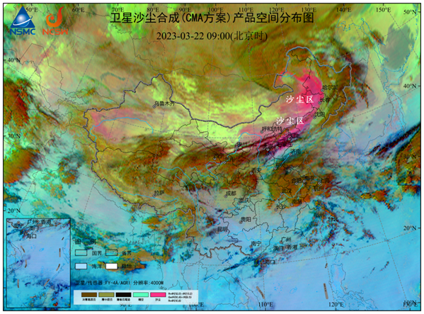
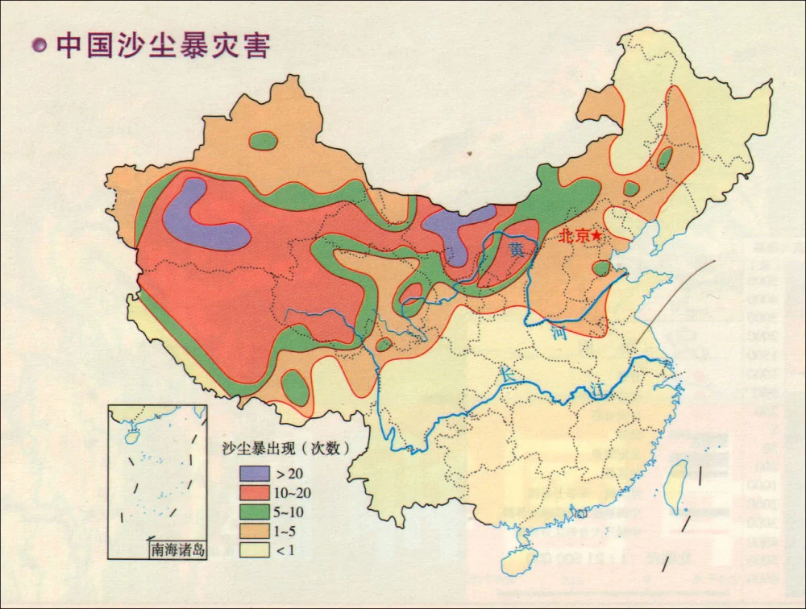
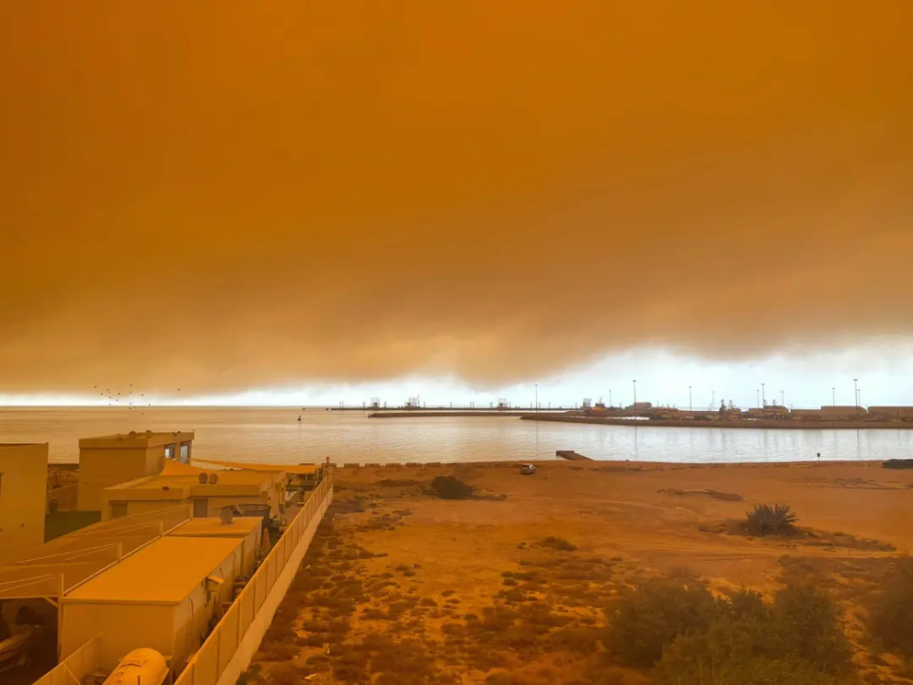
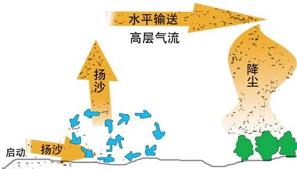
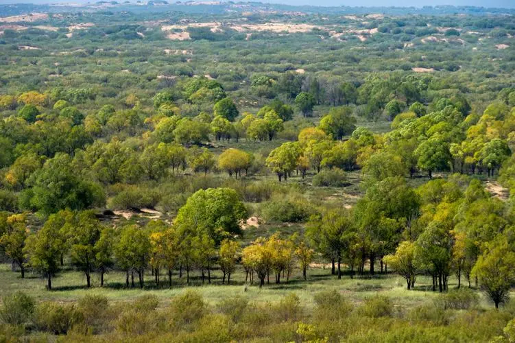
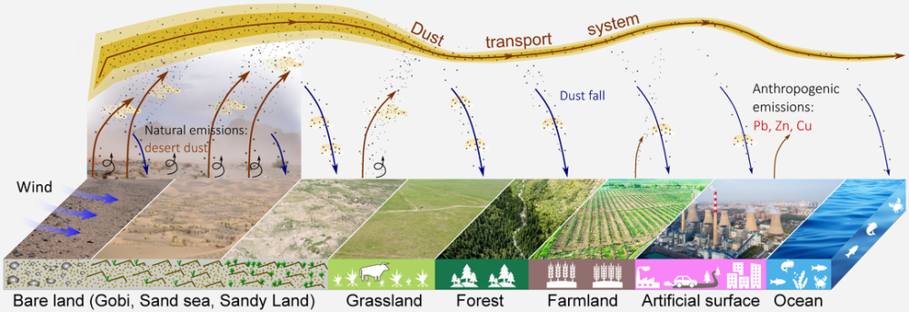

# 防治多年还有大规模沙尘暴，我们和蒙古国的跨国治沙情况究竟如何？

3月21日6时，中央气象台发布沙尘暴黄色预警，今年以来最大规模沙尘暴来袭。

受冷空气带来的大风影响，从3月21日8时开始我国西北、华北、东北等13省市自治区先后出现扬沙或浮尘天气，沙尘影响面积达到220万平方公里，能见度普遍低于1公里。中国环境监测总站数据显示，河北张家口、北京市PM10峰值浓度分别达到9993、1667微克/立方米。这是今年以来我国遭遇的程度最重、范围最广的沙尘天气过程。

3月23日06时中央气象台继续发布沙尘暴蓝色预警，预计大范围沙尘气团将继续向东向南传输，但有所减弱，预计3月23日08时至24日08时，新疆西南部、内蒙古东南部和中西部、青海东北部、甘肃中部、宁夏北部、陕西北部、山西中南部、河北南部、山东、河南、安徽中北部、江苏北部、湖北北部、黑龙江东部、吉林、辽宁中东部等地的部分地区有扬沙或浮尘天气，其中，内蒙古中部等地局部有沙尘暴。

什么是沙尘暴？

沙尘暴是指强风将地面尘沙吹起使空气很混浊，水平能见度小于1km的灾害性天气现象，具有突发性和持续时间较短的特点。沙尘暴是沙暴和尘暴的总称，沙尘暴是风蚀荒漠化的标志，其中沙暴是指大风把大量沙粒吹入近地层所形成的挟沙风暴；尘暴则是大风把大量尘埃及其他细颗粒物卷入高空所形成的风暴。

我国的沙尘暴主要发生在北方地区，其中南疆盆地、青海西南部、西藏西部及内蒙古中西部和甘肃中北部是沙尘暴的多发区。

沙尘暴天气主要发生在冬春季节这是由于冬春季半干旱和干旱区降水甚少，地表极其干燥松散，抗风蚀能力很弱，当有大风刮过时，就会有大量沙尘被卷入空中，形成沙尘暴天气。

沙尘暴从何而来？

沙尘主体位于蒙古国中东部-我国内蒙古中部。沙尘的产生有三个因素，沙尘源、强风力和不稳定的大气环流。

沙尘暴的形成是以东亚特殊的大气环流为背景，并与冬季风紧密联系在一起，它的发生主要与冬半年西伯利亚—蒙古高压驱动下的冷锋过境有关。

2022年蒙古国南部植被生长状况不如2021年，并与近20年平均状况相比也要偏差；而今年2月下旬到3月上旬我国沙尘源区气温偏高，积雪融化时间提前，沙土提前裸露；3月中旬开始降水偏少，特别是华北北部、内蒙古东部、新疆东部降水量偏少明显，植被生长状况偏差，加之目前植被尚未返青，地表条件不利于抑制沙尘天气发生。在地表沙土暴露的情况下，冷空气南下带来的大风就容易起沙。

而在蒙古国东部形成的蒙古气旋是一个低压系统，起到“抽风机”的作用，提供了不稳定的低层大气的热力条件，会把地表的沙尘卷得更高，并保持稳定的气流通过偏北大风吹到我国北方13省市。

为何防治多年还有大规模沙尘暴？沙尘暴能根治吗？

沙尘暴的形成受自然因素和人类活动因素的共同影响。自然因素包括大风、降水减少及其沙源。人类活动因素是指人类在发展经济过程中对植被的破坏以后，导致沙尘暴爆发频数增加。而人类对水土资源的不合理利用，会使生态恶化、沙漠化土地面积增加，导致沙尘暴的出现。

近年来，我国荒漠化、沙化土地面积持续缩减，防沙治沙工作取得了较好成效。但我国仍有257.37万平方公里荒漠化土地和168.78万平方公里沙化土地，特别是大面积沙漠和戈壁始终是巨大且永久性的沙尘源，防沙治沙将是一项长期而艰巨的重要任务。

“十三五”期间，全国累计完成防沙治沙任务1.64亿亩以上。10年来，我国天然林保护建设近6200万亩，退耕还林还草近1亿亩，京津风沙源治理6000多万亩，石漠化综合治理近3000万亩。通过植被根系固沙、蓄水功能，可以降低地表沙尘裸露面积，抑制、改善起沙条件，植被也可以减小局地的扬沙，但对整个风场的改善有限。

在极端不利气象条件下，扬沙仍能被大风从未改造的沙漠中带起，在高空环流的带领下席卷我国北方。需要认识到，沙尘暴不能被根治，植树造林也不是解决一切问题的终极方案，不能百分之百解决我国的沙尘问题。防护林的建设和生态环境的科学治理仍然需要持续推进。毫无疑问，如果没有防护林，这次影响京津与东北地区等地的浮尘扬沙，会更加迅猛。

我们和蒙古国的跨国治沙情况如何？

蒙古国30年来人类活动导致的严重土地退化和荒漠化，为其提供了丰足的沙源。这对波及包括中国在内的治沙国来说，又是一记警钟：在气候变化的大背景下，更加警觉而迅速地修复好沙漠化土地，显得尤为紧迫和重要。

就前期的研究来看，蒙古国的沙漠化过程，主要就是土地利用不当，造成了过度的超载，过度的开垦等问题。蒙古全国70%的土地面临不同程度的荒漠化和沙漠化，这也形成了进入我国沙尘的源头。

通常来说，沙尘暴一路于蒙古国的东南部起沙，影响我国华北大部分地区；另一路于蒙古国西部和南部戈壁荒漠起沙，影响我国西北华北地区，这两股沙尘汇合甚至会输送到韩国、日本以及北美地区。

治理沙尘需要全球合作。早在2002年，中日韩三国就与蒙古国合作，建立了“中日韩+蒙”东北亚沙尘暴防联控合作模式。2011年和2013年，联合国和中国还联合主办了“蒙古国防沙治沙技术研修班”和“蒙古国荒漠化防治培训班”。这些措施当然有助于提高国际治沙效果，但是，从根本上来说，恢复蒙古国的生态平衡，防止荒漠化，才是减少沙尘暴更重要的路径。对此，尤其需要进行国际合作，以人类命运共同体意识，科学和建设性地看待相关问题，对荒漠化与沙尘暴防控进行系统性科学研究。

南方是否会受影响？

3月22日09时，沙尘前锋已经到达我国东北地区中部-华北中南部-汾渭平原一线，之后随着冷空气扩散逐步影响山东、黄淮和长三角北部。

由于上海22日受江淮低涡切变线影响，一方面切变线北侧的东风气流阻挡了沙尘气团向本市的传输通道；另一方面近几天上海及长三角中北部有明显降雨，对上游沙尘将产生清除作用。所以上海市受北方沙尘气团直接传输影响的概率较低，但长三角北部地区（江苏北部、安徽北部）这几天还会出现明显的浮尘天气过程。

