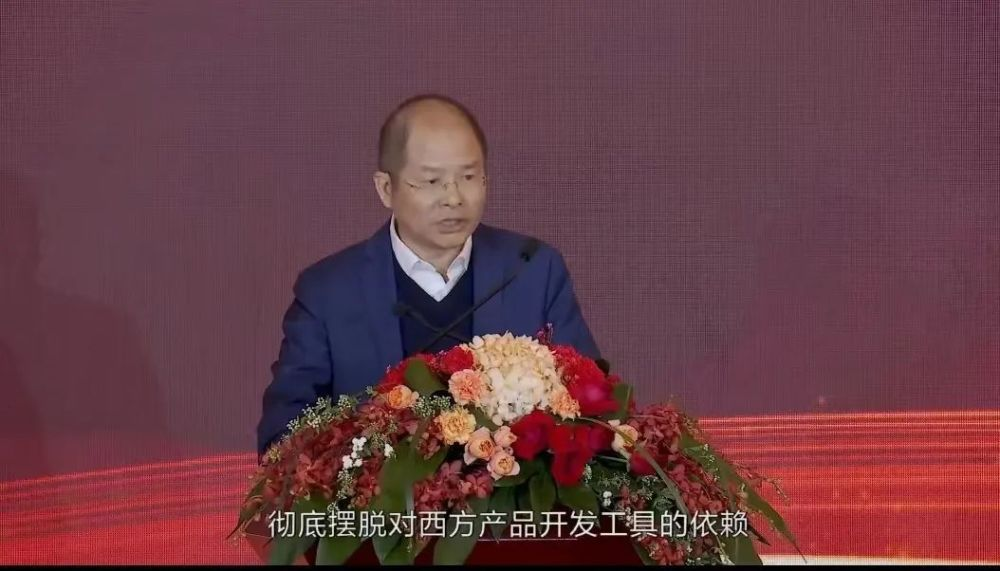

# 14nm芯片设计工具新进展！华为：已攻克部分自主替代关键环节

_华为轮值董事长徐直军在讲话中_

**文 | 谢丽容**

2月28日，华为在深圳总部举行总结与表彰会，轮值董事长徐直军在会上首次披露了华为软件设计工具的最新进展。

徐直军说，华为已在芯片领域完成14nm以上EDA工具国产化，今年将完成全面验证；华为硬软芯（硬件开发、软件开发和芯片开发）三条研发生产线目前完成了软件/硬件开发78款软件工具的替代，它们基本可以保障研发作业的连续性。

徐直军在这次讲话中强调，三年来华为虽然在产品开发工具突破上取得了不少成绩，但仍面临艰巨挑战，没有彻底突破的产品开发工具很多，需要华为马不停蹄加倍努力，吸引更多全球优秀人才，才能实现战略性突围。

软件开发工具是所有硬件和软件产品开发、设计和运维基础中的基础，没有软件开发工具，从底层芯片，到中间层操作系统、数据库、中间件，再到上层软件应用和服务都无从谈起。

以徐直军此次披露的14nm以上工艺所需EDA工具为例，EDA是芯片IC设计中不可或缺的重要部分，涵盖集成电路设计、布线、验证和仿真等所有流程，贯穿芯片全产业链，各个工具环环相扣，被称为“芯片之母”。

在美国政府针对中国芯片出口禁令口子越来越大的前提下，徐直军提到的14nm以上工艺所需的EDA设计工具全流程自主化有重要意义。

全球的EDA软件主要由Cadence、Synopsys、西门子EDA三家美国企业垄断，他们能够提供完整的EDA工具，覆盖集成电路设计与制造全流程或大部分流程。中国公司布局EDA领域多年，但国产EDA以点工具为主，工具链不完整，且主要满足中低端制程要求。

由于EDA处在最上游位置，因此EDA必须比芯片的工艺更先进。14nm是中端芯片制程。EDA本身极其复杂，实现了EDA工具自主化，就能够基本达成半导体自主化的先决条件。

**徐直军提到的硬件、软件和芯片开发的三条研发生产线上，已经完成了78款软件工具替代。**
在硬件、软件和芯片开发三条研发生产线上同时开发全套软件设计工具，华为应是中国第一家。这和它的状态有关，对于华为来说，它面前没有任何退路，所有难走的路都得走一遍。

从徐直军透露的信息来看，目前华为应在软件开发工具领域的进展最大，在软硬一体化的今天，缺失软件开发工具，就无法保证华为所有服务产品解决方案保证连续性和迭代开发。截至2021年12月，华为有19.5万员工，其中研发人员10.7万。软件业务的连续性对华为的生死存亡至关重要。

此外，这三年来华为在基础工具软件领域的突破，是和国内产业链上的大大小小公司一起完成的，一套动作下来，华为完成了工具软件自主替代的关键一步，国内相关产业链得到了新一轮的进阶和整合。

据徐直军讲话内容，华为最新的计划是将部分软件设计工具通过华为云开放给外界使用。 **这暗含一个信息：华为不排除将扩展其在基础软件领域的市场能力。**

从发展角度看，这为一部分软件企业提供了一个新的选项。中国大量企业目前在软件设计工具方面一般直接购买美国软件开发商用工具，或选择国产软件工具，但国产软件工具链大量依靠开源技术包装而成，未来一旦受到制裁，开源技术平台被禁用，将会直接导致业务停摆。对于企业来说，是否选择完全基于华为自主技术的设计软件则需要综合考量更多现实因素。

**以下为徐直军讲话全文：**

今天既是表彰会，又是誓师大会，祝贺在突破“乌江天险”之一——产品开发工具软件中的获奖团队和个人，特别感谢在工具软件攻关过程中的所有合作伙伴和做出过贡献的所有英雄们。

2019年5月16日，美国把华为放入实体清单，所有美国的产品、芯片、器件在没有许可下不能提供给华为，也不能给华为提供服务。

一时间，所有给华为提供产品开发工具软件的美国公司及产品中有美国成分的其他公司都停止了升级和服务，我们从芯片设计、单板设计、结构设计和仿真验证、软件开发都只能依赖不能升级及有限许可期的工具软件进行，或很快进入无产品开发工具可用的境地。这如同当年横在红军前进路上的乌江天险，我们只有突破“乌江天险”，实现战略突围，才有可能持续开发出产品——即打造出从矿石和沙子到产品的领先的产品开发工具软件，彻底摆脱开发工具软件的依赖。

**第一，三年来，我们围绕硬件开发、软件开发和芯片开发三条研发生产线，努力打造我们的工具，完成了软件/硬件开发78款软件工具的替代，保障了研发作业的连续。**

软件开发工具开发团队自2018年就开始布局，努力打造软件从编码、编译、测试、安全、构建、发布到部署等全套工具链，采用自研加联合合作伙伴一起研发的策略，解决工具连续性问题。这样不仅有力支持了公司十多万软件工程师的软件开发，而且还基于华为云对外提供服务，实现内外一致。

硬件开发工具开发团队，在合作伙伴的支持和帮助下，突破根技术，引进新架构，发布了云原生的原理图工具，打造了高速高密PCB版图工具，打磨了结构设计二维/三维CAD工具，布局了硬件多学科仿真工具。

芯片设计EDA工具团队联合国内EDA企业，共同打造了14nm以上工艺所需EDA工具，基本实现了14nm以上EDA工具国产化，2023年将完成对其全面验证。

截止今天，我们联合合作伙伴已经对外发布了11款产品开发工具，且所有产品线都已经切换到我们自己发布的工具，合作伙伴和客户也可在华为云上使用。目前每月有大约20多万软件开发人员、19.7万硬件开发人员在使用我们开发或我们与合作伙伴共同开发的工具，同时还有203家企业愿意付费使用我们的软件工具，这是对开发工具团队的一种认可。

**第二，尽管我们这些年在产品开发工具突破上取得了不少成绩，但面临的挑战还很多，没有彻底突破的产品开发工具也很多，需要我们马不停蹄、加倍努力，不断吸引全球优秀人才，彻底实现战略突围。**

1、已投入使用和对外发布的产品开发工具软件要以使用者为中心，努力提升用户体验，基于使用者需求和技术的进步持续优化，一定要确保工具的持续领先性，才能有效支撑产品开发工程师的高效和高质量。

2、对没有突破的产品开发工具软件，如光学仿真软件、多物理场仿真软件，要在全球范围内找到专业人才，并持续支持合作伙伴，采用云、AI等新技术、新架构突破关键难题。

3、华为云要开发一些工具软件所需的共性难点技术，以服务的方式让工具开发厂商调用，以帮助工具开发厂商能快速推出产品并有竞争力。要建立工具软件的工程数据标准，打通工具软件的数据。同时要支持工具软件云化，与合作伙伴一起，把工具软件基于华为云服务所有客户。

4、我们自己开发的工具软件，先服务好华为内部，然后再基于华为云对外提供服务，且内外一致；与工具软件厂商联合开发的工具软件，华为云与工具软件开发商合作，用工具开发厂商的品牌对外提供服务，在利益分成上，我们要少分一点，工具厂商要多分一点。

5、要推动高校加速工具软件课程和人才培养体系建设，培养工具软件人才。同时要把所有已发布的工具软件在高校中率先使用，让学生从接触工具开始就使用上这些工具软件，形成星星之火。

“雄关漫道真如铁，而今迈步从头越”，突破“乌江天险”，实现战略突围的号角已经吹响，战旗已授予，期待开发产品开发工具软件的将士们在2024年12月31日胜利会师，把所有软件、硬件、芯片……的开发工具向社会发布。让我们不辱使命、不负韶华，奋勇前进！谢谢大家！

