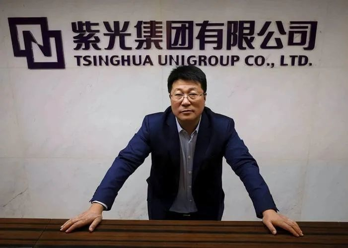
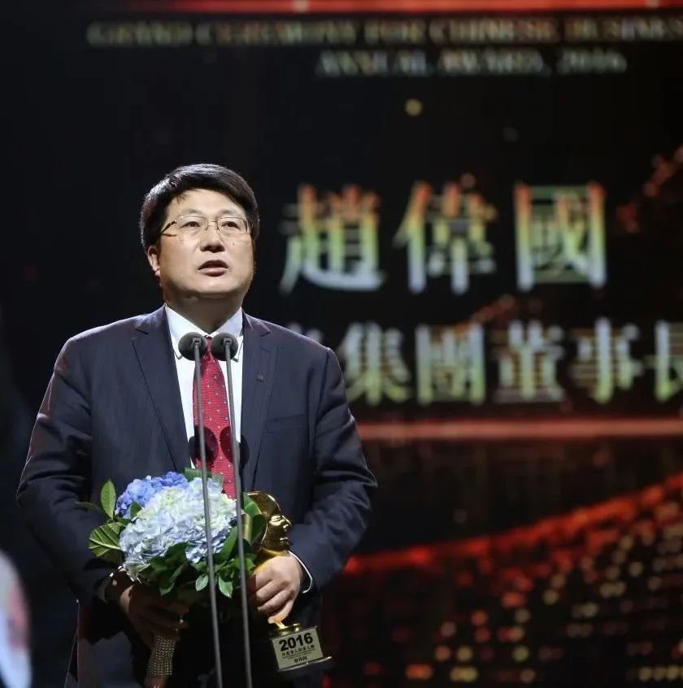
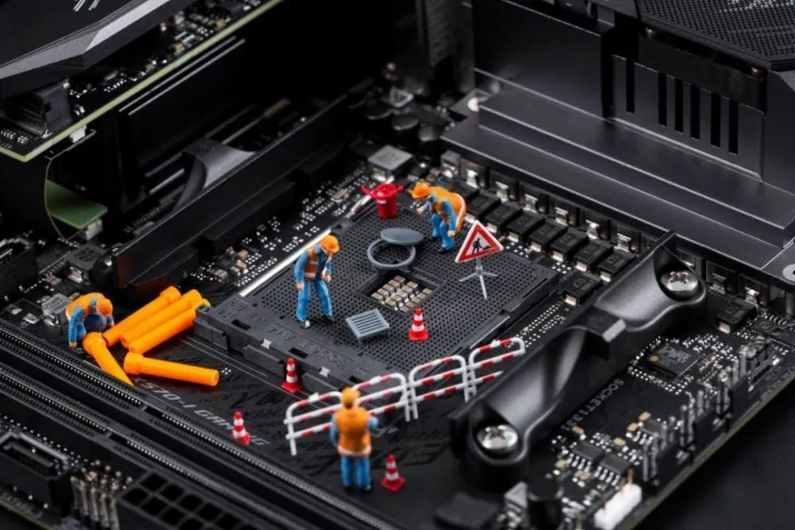

# “饿虎”与“恶虎”，“芯片狂人”赵伟国的两副面孔

**他让紫光集团吞下“哑巴亏”，如今被调查，留下一地鸡毛。**

作者：杨学义

“我一旦看中了，出手就是饿虎扑食。”

在业界有“芯片狂人”之称的赵伟国，常常语不惊人死不休。在最风光的那几年，他的语言风格大致如此。

但正所谓“天狂有雨，人狂有祸”。从去年7月开始，就有媒体披露称赵伟国被带走调查。如今靴子落地，中央纪委国家监委网站3月20日发布消息称，国家监委对紫光集团有限公司原董事长赵伟国涉嫌职务犯罪问题进行了立案调查。

曾执掌紫光集团13年的赵伟国，狠狠地摔了下来。

不断标榜清华标签

“时间的力量是很大的，就拿数学中的积分来说，人一生的成就就是积分的面积的累加，大部分人的问题在于不断换方向积分，相当于是不连续的。我这些年就只做了一件事情，就是围绕清华大学做积分。”在一次访谈中，赵伟国如是说。

紫光集团由清华控股有限公司持股51%，北京健坤投资集团有限公司持股49%。赵伟国就以少数股东实控人身份担任紫光集团董事长。

当初，他成立健坤集团时，“健坤”二字就取自清华校训“天行健，君子以自强不息；地势坤，君子以厚德载物”。

1985年，赵伟国考入清华大学无线电系（后改为电子工程系）。“以前大家都认为自己是天才，但现在才明白，原来天才是别人。”刚进校园，他就感受到前所未有的压力。

无线电系85级校友自称EE85，曾占踞半导体上市企业的半壁江山。除了赵伟国，EE85还有韦尔股份创始人虞仁荣、兆易创新创始人舒清明、卓胜微联合创始人冯晨晖、格科微创始人赵立新……

为了不断强化清华标签，赵伟国也掏出了真金白银。有人统计过，财富鼎盛时期的赵伟国曾给大江南北的高校捐款达7亿元，其中对清华大学的捐助尤为突出，仅在清华校史馆的建设上就豪掷2500万元。

2015年4月，赵伟国参加清华校庆时甚至承诺将捐赠个人全部财产，其中70%给清华大学，30%给其他大学。

曾轰动一时的“清华简”，也与赵伟国掏腰包有关。

2006年，香港中文大学教授张光裕在文物市场发现一批战国简。经过论证，清华大学教授李学勤告诉校领导：“如果是真的，那就是司马迁也没有看过的典籍。”

清华立刻启动调研和收购。赵伟国拍下竹简，并说：“竹简是真的，就捐给母校；竹简是假的，就由我自己承担。”

看得出来，赵伟国出手非常阔绰。但如今看来，这种阔绰背后早已暗藏隐患。

_赵伟国曾自掏腰包，捐赠“清华简”。_

“饿虎”备受质疑

据统计，从2013年开始，赵伟国掌舵紫光集团后，共投资、并购了近20家企业，斥资近千亿元。

2009年，他接手紫光集团总经理时，集团财务规划仅13亿元，到2020年6月，这一数字飙升至2966亿元。

疯狂“买买买”背后，赵伟国有一套独特逻辑：“我们的企业，思路上可以大胆，但是操作上保守。我曾经开玩笑说我做投资并购有三个原则：第一个像女人逛街一样不厌其烦地看东西，第二个是像古董商人一样做决策，第三个是一旦出手要饿虎扑食。”

_疯狂并购的那几年，赵伟国曾收获过鲜花和掌声。_

不过，他这种狂飙突进式的作风令外界哗然，也招来质疑。

首先被质疑的是其投资决策及管理方式。

媒体曾这样描述刚开始拓展商业版图的他：赵伟国一开始并没有思路，“像女人逛街一样”，浏览国内外财经网站，试图在刷过的海量信息中抓住一丝机会。当2012年看到展讯通信的信息时，“那一瞬间，我知道展讯是可以收购的”。

不难看出，他的这一收购行为有点像“拍脑门”式的横冲直撞。而开疆拓土之后，他也没有踏踏实实研究业务。

一位熟识他的人说，赵伟国对自己的定位很清晰，就是资本运作、产业运作，“他不会亲自去整合收购回来的公司，也不管具体的业务，而是在每个业务板块确定核心公司，找到合适的领军人，由着下面去冲锋陷阵。”就像赵伟国自己说的那样：“我们管战略，管审计，不管业务。”

_赵伟国在紫光集团。_

其次被质疑的是他的扩张方式。

一位业内人士告诉《环球人物》记者，在赵伟国掌舵紫光集团期间，其无序扩张，导致布局的业务过于分散。他甚至还收购诚泰保险、曲靖市商业银行、学大教育等和主业没什么关系的产业。“摊大饼”的方式虽然赢得了扩大商业版图的面子，却丢掉了精耕细作芯片领域的里子。

芯片行业需要良好的现金流做支撑，短期内并不能看到回报。赵伟国的行事方式，看似将紫光做大做强，实际上造成了投资性现金流大幅流出。

有专家分析，赵伟国在掌舵紫光集团期间，没有沉下心来攻克尖端技术难关，而是越来越多地进入一些低效率领域。为了多元化，他又不断举债，资产负担越来越重。后来，人们发现他更多是在赚快钱，即便是一些半导体企业的半导体研发，也是面子大于里子。

2020年，紫光集团终于撑不住了，现金流出现断裂，后来不得不进入破产重组程序。

此外，赵伟国的行事风格也令业界反感。

业内人士告诉《环球人物》记者，赵伟国是业内比较有名的“大嘴巴”，这种个性最容易吃“哑巴亏”。比如，在并购展讯时，他曾提及与联发科的竞争，霸气表态：“展讯可以不赚钱，联发科能不赚钱吗？因为我的资本比它强大，我每年可以赔钱，我可以一直赔……联发科会赔掉更多钱，它慢慢就受不了了。”

“一个合格的芯片企业掌舵者并不应该如此激进。半导体行业和军工、造船、生物医药等都是高端制造业，产业链很长，而且全球分工。真正优秀的掌舵者应该对全球化有非常深刻的理解，应当是踏踏实实做事的务实派，寻求合作，过激言论只会起到相反的作用。”然而，赵伟国却总是大放厥词，给紫光集团带来了不少不必要的麻烦。

“恶虎”面目暴露

知情人士对《环球人物》记者说，赵伟国的业内名声并不好，原因之一是过于势利。“很多人都看到过他对利益相关方点头哈腰，对下属却是一副‘暴君’面孔。”

随着中央纪委国家监委发布通报，赵伟国的“恶虎”面目暴露无遗。

经查，赵伟国身为国有企业管理人员，利欲熏心，肆意妄为，背弃职责使命，公器私用、化公为私，将所管理的国有企业视为私人领地，处心积虑巧取豪夺国有资产，违规将本单位的盈利业务交由亲友进行经营，以明显高于市场的价格向亲友经营管理的单位采购商品，指使上市公司董事实施损害上市公司利益行为，致使国家利益遭受特别重大损失。

在2021年12月，有记者曾在紫光集团见到过赵伟国，“当时他神情略显憔悴，身材不复之前的偏胖状态，自称暴瘦了数十斤”。如今看来，那时的赵伟国也许已感觉到自己的摇摇欲坠。

据媒体报道，在去年7月与赵伟国一同被调查的，还有紫光集团前总裁刁石京、北京紫光科技服务集团有限公司董事长李禄媛。

讽刺的是，赵伟国在多年前对清华学子还有过这样的寄语：“进了清华，你这辈子已经中彩了。原因很简单，第一，你的父母给了你很好的天赋，第二，你很好地利用了你的天赋加上你的努力进了清华。所以，这辈子就不要再想中彩的事情了，剩下的就是踏踏实实地干活，这样才能中更大的彩。”

回过头来看，他才是那个最大的投机者，最应该自我反思的，恰恰是他自己。

_赵伟国被调查后，这张合照被广泛传播。左起依次为：紫光集团原联席总裁刁京石、华芯投资原总裁路军、紫光集团原董事长赵伟国、国家集成电路产业投资基金原总裁丁文武、紫光集团原总裁张亚东、紫光集团原联席总裁齐联。如今六人全部被调查，让人不胜唏嘘。_

总监制： 吕 鸿

监 制： 张建魁

主 编： 许陈静

编 审： 苏 睿

（文章未经授权不得转载，转载请加微信“HQRW2H”了解细则。欢迎大家提供新闻线索，可发至邮箱tougao@hqrw.com.cn。）

