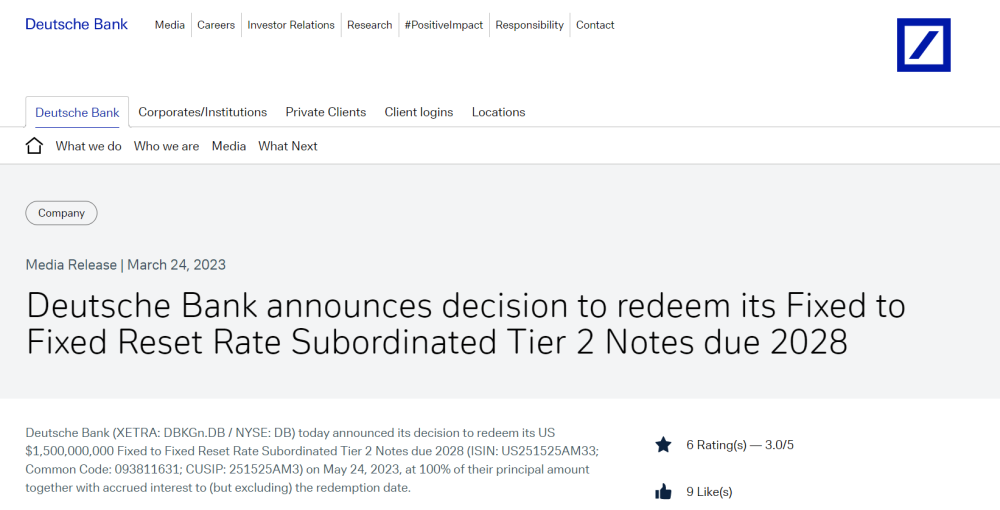

# 又见黑色星期五？德意志银行大跌10％，瑞信、硅谷银行也是周五爆雷

财联社3月24日讯（编辑
史正丞）随着周五全球金融市场进入欧美交易时段，银行股的剧烈波动又一次抢占市场的关注，这一回是德国银行业的一哥德意志银行（Deutsche Bank）。

截至发稿，德意志银行在德国本土交易所的跌幅达到11.17%，受此影响美股盘前的跌幅也超过10%。令市场皱紧眉头的是，德银的股价已经连续三日下跌，照这个趋势今天将创下去年10月以来的新低。

_（德银欧股日线图，来源：TradingView）_

再加上今天是周五，考虑到上周末的瑞信，以及上上周五的硅谷银行，在这个时间点大跌可不是一个好兆头。根据标普市场情报的数据，本周四德银的CDS（信贷违约互换）继续上冲至173基点，而周三时的价格为142个基点。路孚特对此补充称，这个波动也是德意志银行银行CDS有史以来的最大单日涨幅。

债券市场也同样风声鹤唳。Tradeweb的数据显示，德银票面利率为7.5%的AT1债券交易价格已经跌至74美分（票面为1美元），背后隐含的收益率已经在过去两周内翻番。不过这类债券下跌的主要原因，还是瑞士全额减计瑞信AT1债券的影响更大一些。

为了稳定市场情绪，德意志银行也在周五宣布，提前赎回一笔2028年到期的T2债券，总额为15亿美元。

_（来源：德意志银行）_

德意志银行的大跌也是欧洲银行股继续陷入恐慌的写照，截止发稿，德商银行、瑞银、法国兴业银行的跌幅也达到5%。

明面上没有重大利空的德银领头重挫，也反映出市场情绪的脆弱。

穆迪在周三发布的报告中提到，全球多国的金融监管和政府都在采取行动，控制个别银行的问题“传染”到更广泛市场的风险，大体上应能取得成功。然而在经济环境不确定性犹存、投资者信心依然脆弱的背景下，如果不采取可能对银行业产生更持久、更深远影响的举动，政策制定者存在无法遏制当前动荡的风险。

穆迪强调，即便在本轮银行业压力显现前，该机构已经预测到2023年全球信贷条件持续走弱的情况，这也是政策利率显著飙升、经济增速放缓，以及个别国家陷入衰退的结果。金融环境持续紧张的时间越久，风险从银行业外溢造成更严重经济损害的风险就越大。

美联储在本周三（北京时间周四凌晨）继续加息25个基点，使得过去一年的累计加息幅度达到475个基点。美联储主席鲍威尔也在发布会上继续强调今年不会降息。

在欧股大跌的背景下，各类资产一同走弱。截至发稿，美股三大期指跌近1%，国际原油期货的跌幅也达到4%。

（财联社 史正丞）

