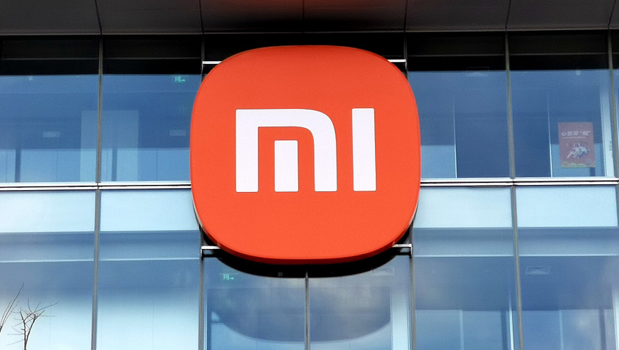
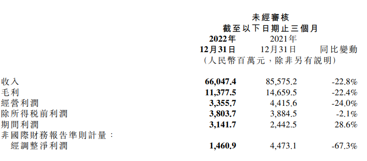
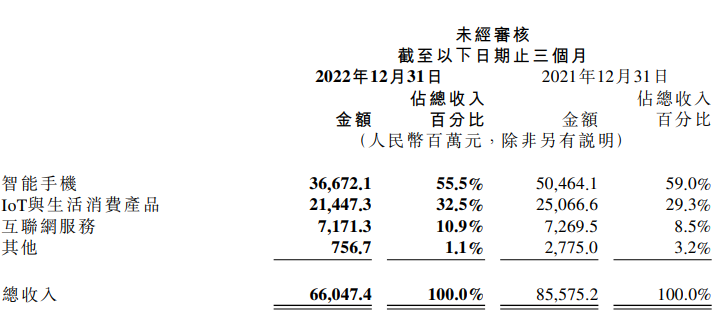
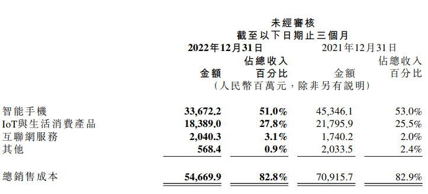
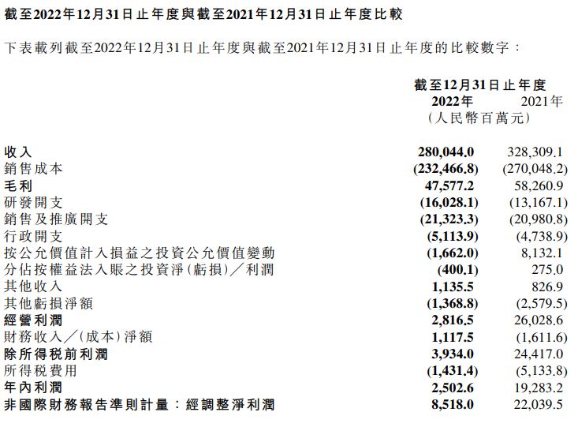

# 小米第四季度营收660.5亿元 高于市场预期

**划重点：**

  * _1_ 小米集团第四季度营收为660.47亿元，较上年同期的855.75亿元下滑22.8%。
  * _2_ 小米集团第四季度经营利润为33.56亿元，较上年同期的41.16亿元下滑24.0%。
  * _3_ 小米集团第四季度净利润为31.42亿元，较上年同期的24.43亿元增长28.6%。
  * _4_ 不按照国际财务报告准则计量，小米集团第四季度调整后的净利润为14.61亿元，较上年同期的44.73亿元下滑67.3%。

腾讯科技讯
3月24日消息，小米集团周五发布了该公司截至2022年12月31日的第四季度及全年财报。财报显示，小米集团第四季度营收为660.47亿元，同比下滑22.8%；净利润为31.42亿元，同比增长28.6%；不按照国际财务报告准则计量，小米集团第四季度调整后的净利润为14.61亿元，同比下滑67.3%。（直击业绩会
| 小米汽车顺利完成冬测，明年上半年能否顺利量产？）

**一、营收利润双超市场预期**

**1、营收超市场预期**

小米集团第四季度营收为660.47亿元，较上年同期的855.75亿元下滑22.8%。虽然小米集团第四季度营收同比出现下滑，但仍好于市场预期。Factset提供的数据显示，市场分析师之前平均预计，小米集团第四季度营收为655.48亿元。

**2、利润超市场预期**

小米集团第四季度净利润为31.42亿元，较上年同期的24.43亿元增长28.6%。第四季度，小米集团按公允价值计入损益之投资公允价值变动由2021年第四季度的39亿元减少2.9%，将至38亿元。不按照国际财务报告准则计量，小米集团第四季度调整后的净利润为14.61亿元，较上年同期的44.73亿元下滑67.3%。

小米集团第四季度净利润超出市场预期。Factset提供的数据显示，市场分析师之前平均预计，不按照国际财务报告准则计量，小米集团第四季度净利润为14.308亿元。

**3、整体点评**

2022年，小米集团总收入达到2800亿元，经调整净利润达到85亿元。本年度智能电动汽车等创新业务费用为31亿元。2022年第四季度，小米集团总收入达到660亿元，经调整净利润为15亿元，其中包含智能电动汽车等创新业务费用12亿元，以及为完善消费者售后服务体验，于2022年11月更新部分系列智能手机的售后服务政策所带来的一次性成本影响约7亿元。

根据Canalys数据，2022年全球智能手机出货量同比下跌11.7%，为9年以来的最低值。小米集团全年全球智能手机出货量达到1.505亿部。根据Canalys数据，小米集团在全球智能手机出货量排名中稳居第三，市占率达到12.8%。2022年12月，全球MIUI月活跃用户数达到5.821亿人，同比增长14.4%。截至2022年12月31日，小米集团AIoT平台已连接的物联网设备（不包括智能手机、平板及笔记本电脑）数达到5.894亿台，同比增长35.8%。

2022年，小米集团的境外市场收入为1378亿元，占总营收的49.2%。根据Canalys数据，2022年，小米集团在全球54个国家和地区智能手机出货量排名前三，在全球69个国家和地区出货量排名前五。

2022年，该公司研发支出达到160亿元，2017年至2022年复合增长率达到38.4%；预计五年（2022年至2026年）总研发投入将超过1000亿元。截至2022年12月31日，研发人员在员工总数中占比约50%。

**二、财务总结**

**1、各业务营收下滑**

2022年第四季度，小米集团各业务营收同比全线出现下滑。其中，智能手机业务营收为366.72亿元，较上年同期的504.64亿元下滑27.3%，主要是由于智能手机出货量及平均销售价格均下降所致。小米集团的智能手机出货量由2021年第四季度的4410万万部减少25.9%至2022年第四季度的3270万部，主要是由于受中国大陆新冠肺炎疫情反复及全球宏观经济环境的影响，智能手机整体市场需求疲软，以及增强清理境外市场存货的力度。智能手机的平均销售价格由2021年第四季度的每部1143.6元减少2.0%，至2022年第四季度的每部1121.0元。智能手机平均销售价格的同比下滑，主要是由于增强了清理境外市场存货的力度，部分被2022年第四季度中国大陆高端智能手机产品发布时间表变化所抵销。

物联网与生活消费产品营收为214.47亿元，较上年同期的250.67亿元下滑14.4%，主要是由于智能电视及部分生活消费产品的需求减少，但部分被平板及智能大家电品类收入增加所抵销。智能电视及笔记本电脑的收入由2021年第四季度的87亿元减少24.9%至2022年第四季度的65亿元，主要是由于智能电视的出货量及平均销售价格均有所减少，但部分被笔记本电脑出货量增加所抵销。小米集团的智能大家电品类（包括智能空调、冰箱及洗衣机）收入保持强劲发展势头，收入同比增长39.9%。平板维持强劲增长势头，收入同比增长39.1%，主要是由于中国大陆的出货量增加，创下季度新高。

互联网服务营收为71.71亿元，较上年同期的72.70亿元下滑1.4%，主要是由于广告业务及金融科技业务收入减少，但部分被电视增值服务及游戏业务收入增加所抵销。小米集团的MIUI月活跃用户数由2021年12月的5.089亿增加14.4%至2022年12月的5.821亿。

其他营收为7.57亿元，较上年同期的27.75亿元下滑72.7%，主要是由于出售建筑物的收入减少所致。

**2、净利润同比增长**

小米集团第四季度毛利润为114亿元，较上年同期的147亿元减少22.4%；毛利润为17.2%，略高于上年同期的17.1%。其中，小米集团第四季度智能手机业务的毛利率为8.2%，不及上年同期的10.1%；物联网与生活消费产品业务的毛利率为14.3%，高于上年同期的13.0%，互联网服务的毛利率为71.5%，低于上年同期的76.1%。

小米集团第四季度按公允价值计入损益之投资公允价值变动由2021年第四季度收益39亿元减少2.9%至2022年第四季度收益38亿元。

分占按权益法入账之投资净利润由2021年第四季度的净利润2.471亿元变为2022年第四季度的净利润360万元，主要是由于2021年第四季度若干被投资公司的摊薄收益（例如金山云的摊薄收益）所致。

小米集团第四季度净利润为31.42亿元，较上年同期的24.43亿元增长28.6%。不按照国际财务报告准则计量，小米集团第四季度调整后的净利润为14.61亿元，较上年同期的44.73亿元下滑67.3%。

**3、运营支出同比略增**

小米集团第四季度研发开支由2021年第四季度的39亿元增加22.0%至2022年第四季度的47亿元，主要是由于智能电动汽车等创新业务费用增加。

销售及推广开支由2021年第四季度的63亿元减少6.4%至2022年第四季度的59亿元，主要是由于物流开支减少。

与2021年第四季度相比，2022年第四季度的行政开支保持稳定在13亿元，主要是由于行政人员薪酬减少，但部分被应收款项信贷亏损拨备增加所抵销。

小米集团第四季度的销售成本为547亿元，较上年同期的709亿元下滑22.9%。其中，智能手机业务的销售成本为337亿元，较上年同期的453亿元减少25.7%；物联网与生活消费产品的销售成本为184亿元，较上年同期的218亿元减少15.6%；互联网服务的销售成本为20亿元，较上年同期的17亿元增长17.2%。

**4、账面现金减少**

2020年12月4日，小米集团以每股配售股份23.70港 元的价格向不少于六名承配人（本身及其最终实益拥有人为独立第三方）完成配售Smart Mobile
Holdings Limited拥有的合共1,000,000,000股配售股份，并根据一般授权以每股认购股份23.70港元的价格向Smart Mobile
Holdings配发及发行1,000,000,000股认购股份。

除通过2018年7月全球发售筹集的资金、2020年配售及认购及发行债券外，小米集团过往主要以经营所得现金及银行借款满足现金需求。截至2022年12月31日及2022年9月30日，现金及现金等价物分别为276亿元及281亿元。

**三、2022年业绩分析**

小米集团2022年总营收为2800亿元，较上年同期的3283亿元减少14.7%。其中，智能手机业务营收为1672亿元，较上年同期的2089亿元减少19.9%；物联网与生活消费品营收为798亿元，较上年同期的850亿元减少6.1%；互联网服务营收为283亿元，较上年同期的282亿元增长0.4%；其他营收为47亿元，较上年同期的62亿元减少24.6%。

小米集团2022年销售成本为2325亿元，较上年同期的2700亿元减少13.9%。其中，智能手机业务销售成本为1522亿元，较上年同期的1840亿元减少17.3%；物联网与生活消费品销售成本为683亿元，较上年同期的739亿元减少7.6%；互联网服务销售成本为80亿元，较上年同期的73亿元增长9.0%；其他业务销售成本为39亿元，较上年同期的48亿元减少18.4%。

小米集团2022年毛利润为476亿元，较上年同期的583亿元减少18.3%；毛利润为17.0%，低于上年同期的17.7%。其中，智能手机业务的毛利率为9.0%，不及上年同期的11.9%；物联网与生活消费产品业务的毛利率为14.4%，高于上年同期的13.1%，互联网服务的毛利率为71.8%，低于上年同期的74.1%。

小米集团2022年研发开支由截至2021年12月31日止年度的132亿元增加21.7%至报告期的160亿元，主要是由于智能电动汽车等创新业务费用增加。

销售及推广开支由截至2021年12月31日止年度的210亿元增加1.6%至报告期的213亿元，主要是由于销售及推广人员薪酬增加，但部分被物流开支减少所抵销。宣传与广告开支于报告期及截至2021年12月31日止年度均保持稳定为72亿元。

小米集团2022年行政开支由截至2021年12月31日止年度的47亿元增加7.9%至报告期的51亿元，主要是由于行政人员薪酬及应收款项信贷亏损拨备增加。

按公允价值计入损益之投资公允价值变动由截至2021年12月31日止年度的收益81亿元变动至报告期的亏损17亿元，主要是由于上市股权投资之公允价值亏损。

分占按权益法入账之投资净（亏损）╱利润由截至2021年12月31日止年度的净利润2.75亿元变为报告期的净亏损4.0亿元，主要是由于2021年若干被投资公司的摊薄收益（例如金山云的摊薄收益）所致。

其他收入由截至2021年12月31日止年度的8亿元增加37.3%至报告期的11亿元，主要是由于政府补助增加。

小米集团2022年净利润为25亿元，相比之下2021年为193亿元。不按照国际财务报告准则计量，小米集团2022年净利润为85亿元，相比之下2021年为220亿元。

**四、股价表现**

小米集团股价周五在港交所常规交易中上涨0.22港元，涨幅为18.0%，报收于12.44港元。过去52周，小米集团最低股价为8.31港元，最高股价为14.94港元。按照周五的收盘价计算，小米集团市值约为3108亿港元。（无忌）

