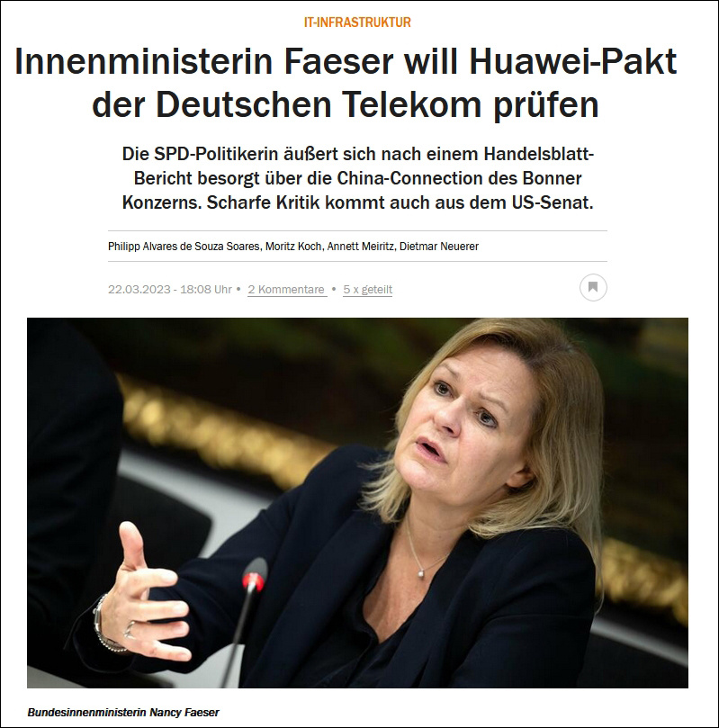

# 德国内政部长：将审查德国电信与华为的“秘密囤货协议”

（观察者网讯）德国《商报》当地时间22日称，德国内政和国土部长南希·费泽日前在美国访问时表示，她将审查德国电信与华为的一项“秘密囤货协议”。该协议据称是为了“规避美国的制裁”，德国电信发言人则回应称，这类影射毫无事实依据。

德国《商报》当天早些时候刊发独家报道，称这家欧洲最大电信公司与华为在2019年签署了一份协议。根据该报看到的协议内容，德国电信将部分重要备件“放在华为欧洲仓库中存储和管理”，以“防止包含来自美国组件的华为产品的潜在供应风险”。

报道称，这代表德国电信与华为之间的关系“可能比已知的更密切”。费泽日前在美国华盛顿访问时对此“表示担忧”，还称将审查这份协议。报道同时引述美国共和党参议员马尔科·卢比奥的话炒作称该协议“令人担忧”，他扬言德国电信应为其行为“承担后果”。

_德国《商报》报道截图_

《商报》称，美国将华为视作“国家安全威胁”，这对德国电信来说尤为危险，后者有60%以上的收入都依赖美国业务。不过，报道也援引德国企业界人士的消息指出，在德国电信监事会中，与华为的密切关系几乎不是问题，该小组“基本同意与中国人一起建设未来网络”。执政党社民党此前也明确承认，他们不介意德国电信向华为进行大规模采购。

据《法兰克福汇报》22日报道，德国电信态度强烈地驳斥了前述指控。“德国电信坚决反对规避制裁的假设。我们有责任确保我们的网络安全、平稳地运行。”德国电信发言人强调，该公司始终努力与所有主要供应商签订合同，以确保交付能力。报道称，德国电信当前正在研究有关法律措施。

报道指出，在德国和大多数其他欧洲国家，华为仍然是5G网络的最重要供应商之一，但德国政府正准备对华为进行更仔细的审查。德国《时代》周报、《明镜》周刊、《商报》等媒体本月初报道称，根据德国内政部的要求，德国电信公司必须在4周内上报目前在5G网络中所使用的华为制造“关键部件”，并接受安全评估。

有关禁令一旦生效，运营商将被迫更换中国厂商的部件。不过，德媒承认，更换组件将构成技术挑战，因为不同制造商的组件之间不能相互兼容。此外，德国联邦政府内部也对限制措施有所保留。德国副总理兼经济和气候保护部长罗伯特·哈贝克对《法兰克福汇报》表示，不可能简单扩大限制措施，德国5G网络“必须继续运作”。

关于是否限制华为产品使用这一问题，德国内部有着不同的声音。《商报》本月早些时候的一篇评论文章总结了两方立场，指出德国政界人士之所以对各项指控支支吾吾，是因为他们拿不出华为技术危害网络安全的确凿证据。“即便是德国情报部门也表示，他们不认为中国技术存在安全顾虑。而对于网络运营商来说，华为一直都颇受欢迎，因为无论是它的产品质量，还是售后服务都堪称一流。也正因为如此，在时任美国总统的特朗普对华为发出禁令之后，德国的网络运营商仍对这些深圳出产的产品乐此不疲。”

值得注意的是，欧洲电信咨询公司斯特兰德咨询（Strand
Consult）去年12月公布的一项调查显示，华为去年在德国5G移动网络设备的市场份额高达59%。德国电信、沃达丰和Telefonica三大运营商的5G网络设备中，都大量使用华为的部件。《商报》2020年曾引用一份德国电信内部文件报道称，从德国现有的通讯网络中排除中企部件会带来巨大成本：这将需要花费5年时间，总金额高达30亿欧元。

3月7日，中国驻德国使馆发言人曾发布答记者问，指出中方已注意到德政府拟禁止中国科技企业参与德关键基础设施建设的有关报道。发言人表示，长期以来，华为依法合规经营，其技术符合安全标准。欧方数据显示，华为在德5G网络设备占比近六成，为德通讯基础设施建设作出了积极贡献。近年来不断有国家和反华势力企图以莫须有罪名抹黑，但始终没有任何证据表明华为设备和组件存在安全风险。如果报道属实，中方对德有关政府部门在毫无事实依据的情况下草率作出上述决定表示十分不解和强烈不满。

驻德使馆发言人指出，中方坚决反对德在对华合作中泛化国家安全概念、滥用国家力量干预市场，这不仅违背经济规律和公平竞争原则，而且损人不利己。中方注意到，有关德欧企业已表示，德政府做法将延误德5G网络建设推广并造成额外成本。德政府应认真倾听其国内的理性声音。中方坚决反对任何将企业投资经营政治化、泛安全化的做法。希望德方为中国企业营造公平、公正、开放、非歧视的营商环境，多做促进双向互利的事，而不是相反。

**本文系观察者网独家稿件，未经授权，不得转载。**

