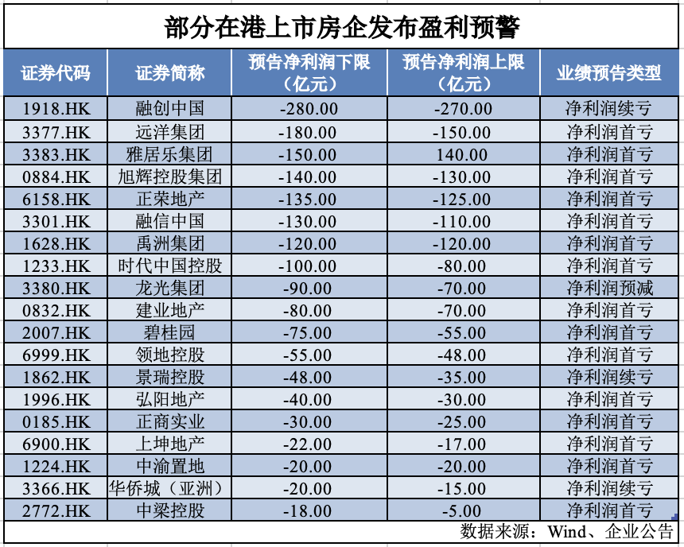

# 房企业绩塌方：超50家在港上市开发商盈利下滑，融创最高亏280亿

房企业绩塌方的范围还在持续扩大，近来数家在港上市开发商陆续披露了业绩变动的信息。

据Wind金融终端，截至目前有57家在港上市发展商发布了盈利预告，其中有52家是业绩下滑或陷入亏损，占比超9成；其中有27家为首度亏损。以预告的净利润下限计，亏损额在100亿元以上的有8家，包括融创、远洋集团、旭辉、雅居乐、正荣、融信、禹洲、时代中国等。

在上述房企中，融创亏损额度最高，其公司拥有人应占亏损介于270亿元-280亿元，但这相较于上年同期超380亿元的亏损已有较大幅度的收窄。远洋集团紧随融创，以公司拥有人应占亏损约150亿元-180亿元位列第二，这是远洋首度出现业绩亏损，上年同期则盈利约27亿元。同样是首亏的雅居乐集团位居第三，预计2022年股东应占亏损140亿元-150亿元。

身处行业下行大势中，各大房企业绩大幅下滑的诱因大致相同。据中信证券统计，主要原因包括结算收入及毛利率显著下降，计提存货资产减值准备，联合营公司投资收益下降及各项费用增加等。

融创披露的业绩下滑原因中，除工程进度减缓、物业交付面积减少，结转收入大幅下降等外，还提及了物业项目销售价格不及预期，结转物业项目毛利率下降，以及资产计提减值拨备等因素。

另据克而瑞统计，A股上市房企披露的业绩亏损或盈利减少的原因中，亦有超8成归因为疫情影响或者企业房地产业务结算结构变化导致的销售项目结转利润减少，有56%的是因为行业的低迷而对其资产计提了减值准备。

“房地产企业在长期经营过程中积累了较多的存量资源，我们判断计提减值有望边际改善公司资产质量，释放公司盈利能力下滑压力。”中信证券认为。

中信证券也指出，2022年房企业绩普遍表现不佳，是2020年以来拿地昂贵、去化不佳的集中表现，但站在新的起点，已经在2022年优化库存结构的企业，利润表预计也会在2023年及以后有所改善。

而对于更多已爆雷的开发商来说，重新提振的业绩难度着实不小。某早期出险房企内部人士向记者表示，近来的市场回暖对其公司影响不明显，因为购房者很少会选择暴雷房企的项目，或许要在债务重组等完成，公司重新走上正轨后，销售才能有所起色。

现阶段的销售数据也印证着这一情况。2021年销售额还在4400亿元以上的恒大，在2022年则已跌至317亿元；曾经的百强房企上坤地产、大发地产，今年前两个月的累计销售额不足10亿元。

值得一提的是，包括祥生控股、大发地产等在内的部分开发商则在今年加入了无法按时发布年报的行列中。

对此，祥生控股解释称，多个部门（包括财务部及运营管理部）的关键团队人员近期辞任，人力不足，导致公司及其核数师难以对2022年度的财报进行审计，同时公司董事会及管理层一直且目前正投入大量时间及精力处理针对公司的清盘呈请，并与国内外债权人就债务重组方案进行磋商，预计相关业绩报告无法按时刊发。

