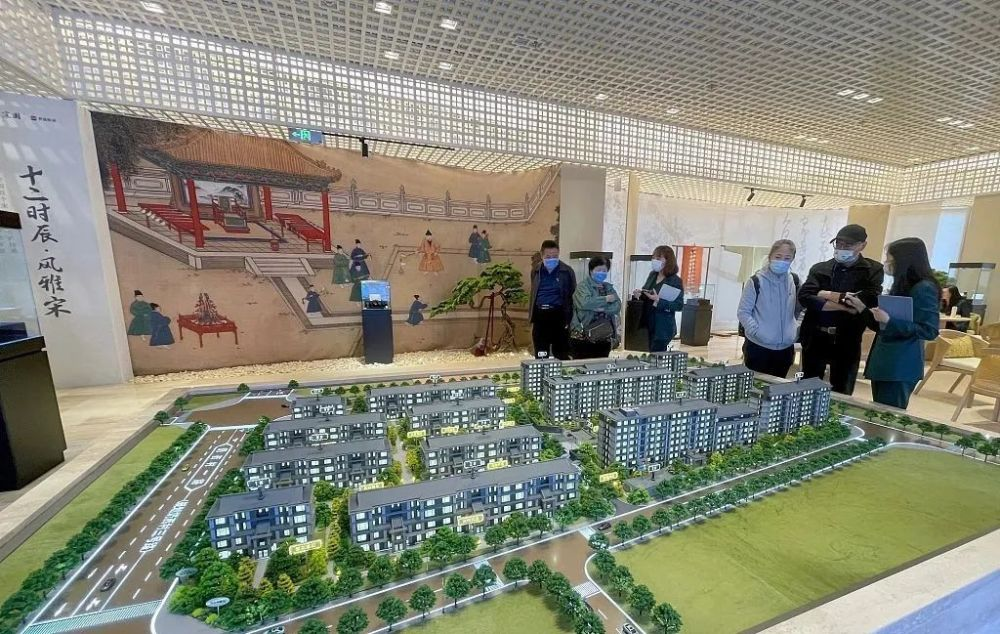

# 楼市小阳春将结束？北京三环二手房挂10天无人问津，二三线进入倒春寒

_来源：视觉中国_

作者 | 郭一非

编辑 | 杨布丁

出品 | 棱镜·腾讯小满工作室

趁着北京这波小阳春行情，宋林（化名）原本以为终于能解套离场了，但现实却给他泼了一盆冷水。

宋林有一套老破小位于北京南三环，位置不错，紧邻地铁口。不过，苦于超过25年的老房龄，没电梯没学区，在2018年底花了近340万买入后，这套房子四年多几乎没涨价。

“我心理底价是350万，起码把这些年的房贷利息弥补掉。”宋林告诉作者，中介却直言，最近行情有点转凉，客户开始观望，最多只能卖到340万。中介还“补刀”说，同小区库存也很高，大家都想赶紧出手，挂牌房源有50多套，这套房子挂出来10来天，一个意向客户都没来看过。

人潮涌动的售楼处、开发商热销破亿的醒目海报、多人争抢一套房源……冰封的市场行情在2023年开年头两月戛然而止，房地产回暖行情在各地轮番上演，苦了近两年的房地产从业者，终于迎来了量价齐升的小阳春行情。

国家统计局的数据也在佐证这一点。2022年1-2月，开发投资、新开工、销售额、到位资金等核心指标，同比降幅均出现收窄，竣工面积则同比转正。

但这波小阳春行情的持续时间却比宋林想象的来得更短。

由于统计城市样本的差异，3月至今的新房、二手房的销售额成色几何，各家统计口径莫衷一是，多数认为仍在环比上升。不过，由于网签数据的延后性，可能难以实时反映市场的动态变化。从实际情况来看，眼下部分楼市已开始出现凉意，小阳春行情能否持续存在诸多疑问，倒春寒的论调开始冒头。

“多数城市确实在降温，但是从数据上不会太明显。”一家券商地产行业首席分析师对作者表示，自己一直持弱复苏观点，预计全年销售额有5%到10%的增长，上半年由负转正就不错了，只不过2月份给大家预期拉得太高了，现在回归到了正常趋势而已。

“当前市场热度提升，主要源自于2022年末疫情感染高峰下被延后的需求，决定需求回暖的房价预期、收入预期并没有根本性的扭转。”3月22日，信达证券一份研报指出，这一波积压的需求逐步释放后，市场可能出现自动回落的波动，类似于往年小阳春后的环比回落幅度。

**小阳春是“最后的狂欢”？**

相较于宋林手中那套难以解套的老破小，海淀万柳片区的小阳春行情明显，这里可谓北京的明星板块，单价超过30万的万柳书院即在此处。

“年前买房的都是嗅觉灵敏的聪明人。”一位深耕片区超10年的头部中介品牌经纪人告诉作者，比如蜂鸟家园这样学区占坑的一居室，年前830万元，现在涨到850万元到860万元，片区的两居室则跳涨了100万元左右，三居四居室则直接涨了300万元左右。

价格上涨的同时，成交量也在节节攀升。据其统计，2022年11月至2023年2月，万柳片区分别成交18套、26套、30套、47套。截止到3月20日，当月已成交40套，“这个月估计会突破50套，达到阶段性高点”。

不过，上述经纪人也承认，现在感觉是“最后的狂欢”，如果没有更多利好刺激政策，成交量持续上升的可能性很小。“最近开始严查经营贷违规入市，现在新增客户量也很一般，2月份，我们周末两天能带看五六十组客户，现在最多也就到40组，客户的观望情绪比较浓，很难去下定。”

新房市场降温得更为明显。一家头部房企北京区域营销操盘手告诉作者，两会没有明确的利好政策，这在市场极高的预期之下等于是个利空。相比于2月份，其刚需项目3月至今的来访量掉了四成，改善项目也降低了20%-30%，成交量数据的下滑可能还需要一两周才会显现。“现在明显感觉客户质量下降，大多是房子还没挂出去，也在犹豫不决，远没到决策阶段。”

他甚至判断称，现在市场已经趋冷，形势严峻，也并不存在所谓小阳春行情。2月数据猛增，这更多是此前需求压制的集中释放，以及同去年2月农历新年的下滑数据对比所致。

二手房成交量堪称北京楼市晴雨表，在整体成交结构中，存量房占比高达八成。

北京住建委数据显示，2023年2月，北京二手房成交1.53万套，环比增长84%，且高于2022年月均水平三成。

地产自媒体《天朗观房势》统计历史成交数据称，2020年至2022年，春节次月成交量环比涨幅分别为116%、72%和91%，2023年2月环比涨幅84%属于常态。从量来看，今年2月成交1.53万套，也明显低于2021年3月的2.22万套，与2022年3月的1.57万套持平。

“今年2月看似猛增，但涨幅和成交总量并不突出。”上述分析指出，北京春节后二手房的修复，一方面有春节后自然增长的因素，另一方面也有前期置业需求被长期压抑后的反弹因素。

除需求延后释放因素之外，信达证券也认为，受到春节假期影响，往年1-2
月是传统淡季，3-4月小阳春传统旺季，在今年春节后市场热度回升时，房企抓住窗口期提前加大推盘力度，进一步促进了小阳春行情到来。

**二三线开始“倒春寒”了**

相比于北京这类购买力十足的一线城市，更多二三线城市楼市行情偏弱。

“难以持续，都是短期的繁荣。”一位TOP
10房企郑州区域客研人士告诉作者，当地烂尾楼项目逐渐恢复正常施工，叠加低利率利好刺激，原本预计市场热度能持续到3月底，但到了中旬就结束了。内部监测数据显示，2月下旬的成交量一度达到去年峰值水平，到了3月，公司多个项目的来访、成交、转换量都下降了五成，已经回落到去年九月份市场淡季水平，“感觉这一波红利已经过去了”。

另一位中部省会城市头部中介品牌新房负责人也表示，2月市场特别好，最热的项目能卖接近400套，超过20个项目销量100多套，3月份开始市场掉头向下，客户到访量下滑四五成，成交量下降三四成左右，“如果没有新的政策刺激，客户的来访成交转化周期将会拉长”。

市场普遍感知是，除北上广一线城市外，杭州、成都、苏州、南京等少数强二线的行情也相对较好。但除此之外的更多城市，依然感受不到太多的回暖行情。即便在城市内部，分化也较为明显。

一位TOP20房企苏州区域人士对作者称，当地工业园区和高新区狮山板块的项目一直都是一房难求，其他非核心板块项目大多靠打折、上分销以价换量，公司的近郊项目以刚需外来人口为主打客户，对价格波动很敏感，一旦收回折扣，就导致分销带客数量减少。去年底一个月还能卖20-30套房，现在下滑到一周两三套。

“相比于二月初，这周市场整体到访量跌了40%-50%。”上述苏州房企人士感慨称，小阳春行情基本没有，现在反倒开始倒春寒了，至于倒多久，还需要继续观察。“短期内也没什么希望，只能躺平，继续等风口。”

量价齐涨，楼市回暖，在某种意义上，这契合了许多人的想象与期许。

“好卖的房子还都局限于市区的现房、准现房项目，以央国企为主，工程进度能正常推进。”上述中介新房负责人告诉作者，这些好卖的项目成交量上来之后，大多开始涨价，收窄折扣优惠，比如优惠6个点降到2个点，新房分销渠道费用也下降了10%-20%，客户对新的定价也需要时间去消化。

涨价容易降价难，市场仍处艰难修复的爬坡期，利润与销量始终存在矛盾。

上述北京房企营销操盘手也无奈地表示，集团一看你卖得好，就要求涨价收回折扣，继续砍营销费用，裁减员工规模。去年导向是规模，今年转成要利润，“我们身处一线，对市场冷热感知更快，所以一直劝领导们别那么乐观，要谨慎些”。

一位熟悉北京市场的规模房企人士告诉作者，公司近期与相关部门沟通过，现在调子很明确，就要求稳定，如果市场沉下去，就会给利好政策，如果冒了头，不但不给甚至反向降温。

**库存去化周期已超警戒线**

3月10日，前贝壳研究院院长杨现领发了一条朋友圈。这位资深市场观察者表示，天津、合肥、苏州等主要城市的交易量已经急刹车，明显降温，“没想到这一轮的回暖持续性竟然这么差”。

他的结论有“三个信号”做支撑——交易量下降，新房下降更快，大部分城市环比降幅30%-40%，重庆降幅50%；新增挂牌量速度远远大于销售速度，新增客户不多，过去销售透支的是存量客户；经纪人信心已经明显不如2月份，成交难度加大。

成交量修复回暖的同时，多地二手房挂牌量也在显著增加，都是类似宋林这样急于出手离场或改善置换的客户。

作者查询贝壳找房平台数据获悉，截至3月23日，北京、广州等10座城市二手房挂牌量已超过10万套。这其中，成都、重庆、苏州、天津四城更是突破15万套。

与此同时，各地的新房库存量也处于高位。易居地产研究院统计称，截止到2月底，尽管全国百城新建商品住宅库存规模51个月来首次同比下降，但库存去化周期依然达到18.9个月，这已超过18个月的警戒线。其中，一、二、三四线去化周期分别为13.2、17.9
和 21.5 个月。

按照西政资本的判断，从楼市复苏的路径来说，“量升价稳是第一步，随后价格向好、购房者预期上升，然后传导到房企拿地，金融类机构加大资金投放，此后进入良性循环”。

显然，这样的路径还未跑通。从土拍市场来看，房企大规模入场拿地的景象并未发生，即便碧桂园、龙湖等优质民营房企依然在隐身。

国盛证券统计称，2023年前两月，全国土地成交总额3104.18亿元，同比下降16.10%，2月单月同比增长8.88%。这其中，地方城投平台拿地占比依旧高达37%。

拿地TOP10房企中，除厦门坤霖辰、滨江集团、浙江中豪三家为民营房企外，其余均为国央企背景开发商，华润更是以103亿元的权益投资额遥遥领先。

**腾讯新闻出品内容，未经授权，不得复制和转载，否则将追究法律责任。**

