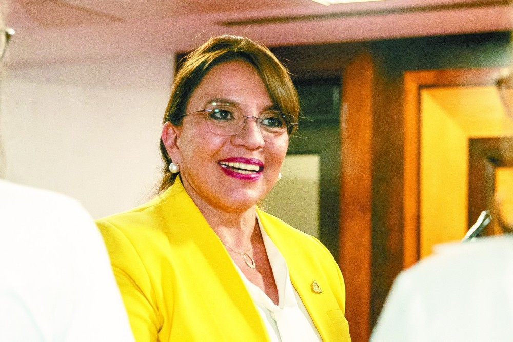

# 洪都拉斯外长访华商讨建交？台当局气急败坏，洪对台“已读不回”

【环球时报特约记者 陈立非 唐亚 环球时报记者 崔凡荻
陈青青】“洪都拉斯外长雷纳已于22日率特使团前往北京，与大陆商讨建交事宜。”23日早间，这条由台湾“中时电子报”披露的独家消息在岛内广泛流传。当天下午，路透社引述洪都拉斯总统新闻秘书阿尔瓦拉多的话对此予以证实。台外事部门立即宣称，将召回所谓台当局驻洪都拉斯代表，以表达“强烈不满”。不少台网民留言讽刺道，“民进党当局恼羞成怒了”“民进党不承认‘九二共识’，再执政下去迟早把一切败光光”。自洪都拉斯总统卡斯特罗14日宣布寻求与中国建交后，民进党当局先是紧急约见洪都拉斯代表，此后寄望美国“出手”。眼见无法令对方“回心转意”，台当局又声称洪都拉斯曾向其索取25亿美元的金援。但这些举动均遭洪都拉斯“打脸”。有岛内知情人士22日直言，台当局与洪都拉斯的关系“已到最后阶段”。

**台当局气急败坏**

23日一大早，台湾“中时电子报”就独家披露称，洪都拉斯外交部长雷纳已率特使团从洪都拉斯出发前往大陆，准备建交的可能性很大。报道提到，特使团的成员包括洪都拉斯国会议员霍滕西亚·塞拉亚和卡洛斯·塞拉亚，并称这两人都是卡斯特罗家族最亲近的人员。据洪外交部有关人士透露，前者是总统卡斯特罗的女儿，后者是总统丈夫赛拉亚的弟弟。

当天下午，路透社引述洪都拉斯总统新闻秘书阿尔瓦拉多的话称，外交部长雷纳按照总统卡斯特罗的指示，于周三前往中国，以推动建立外交关系相关工作。洪总统府事务部长鲁道夫·帕斯托尔在接受洪都拉斯《先驱报》采访时表示：“外长为管理外交关系去了那里（中国），（他的行程）在卡斯特罗总统的指示下完全公开。”

据洪都拉斯国家广播电台报道，特使团此行从首都帕尔梅罗拉国际机场出发。总统也有前往中国的计划，但日期尚未确定。一名驻台北的高级外交消息人士告诉路透社，雷纳前往中国意味着，该国可能即将宣布与中国建立外交关系，“命运已定”。

对于洪外长的访华行程，台“外交部”23日下午气急败坏地声称，洪都拉斯政府罔顾双方“超过80年的传统邦谊，漠视台湾长年援助洪国的合作成果，坚持派遣外长到中国大陆洽商建交”，严重伤害台湾的感情，因此决定立即召回台北驻洪都拉斯“大使”，以表达强烈不满。民进党“立委”林宜瑾还酸溜溜地称，台湾拒绝“凯子外交”，“洪都拉斯政府接受大陆的利诱，他们就要承担风险，金钱买不到快乐，也交不到朋友”。

看到台当局召回所谓驻洪都拉斯代表，有岛内网友在相关新闻评论区留言讽刺道：“哈哈哈，还赖着不走，等人家赶哦。”“人家洪都拉斯也是顺应大势，责怪别人不如反思自己。”“民进党一味追随美日，却在祸害台湾。”

就洪外长访华有关事宜，中国外交部发言人汪文斌23日在例行记者会上表示，坚持一个中国原则是国际大义、人心所向、大势所趋，中方欢迎洪都拉斯政府关于发展对华关系的积极表态，愿在平等和相互尊重基础上同洪都拉斯建立和发展双边关系。

**洪都拉斯对台“已读不回”**

洪都拉斯总统卡斯特罗宣布寻求与中国建交后，民进党当局动作频频，试图“垂死挣扎”。台“外交部”政务官员田中光曾称，“不到最后关头，不轻言放弃。”台“外交部”21日称，洪方至今未向台递交任何有关中止“外交关系”的正式官方文书，目前台湾“还在努力阶段”。

不过，岛内知情人士22日透露，民进党当局数度向洪方表示，愿在能力范围内协助洪都拉斯推动建设发展，并一再提醒对方“注意大陆的不实承诺”，但洪都拉斯似乎“已读不回”。台“外交部长”吴钊燮23日承认，与洪都拉斯关系现在状况不是很好，进入辛苦阶段，将努力到最后一刻。有媒体报道称，当时现场有记者追问“即便美国介入也没办法？”结果吴钊燮不管不顾离开了现场，并未回应这一问题。

对此，有分析认为，吴钊燮有关表态很仓促，说明台当局根本没有办法挽留与洪都拉斯的“邦交”状态。至于他为什么不回答“美国介入”的问题，很可能是因为他清楚，就算美国介入也没有办法，所以干脆不回答以保持最后的颜面。

一些台媒则大肆炒作洪都拉斯曾向台当局索取25亿美元的金援，指责洪都拉斯见利忘义，利用台湾当筹码，非常没有诚意。

事实上，洪都拉斯外长雷纳已于22日对这一说法予以否认，称这个25亿美元数字不是金援，而是协商的再融资机制。他还透露，在卡斯特罗宣布寻求与中国大陆建交前，他已提早约一周通知台湾当局。

“有关说法十分荒谬，纯属无中生有。”在23日的例行记者会上被问及“洪方私下要求台湾提供25亿美元援助，台当局怀疑中方在幕后引导洪方要求这笔援助”时，汪文斌作出上述回应。他强调，近日，洪都拉斯外长雷纳在接受采访时表示，卡斯特罗总统发展对华关系的决定顺应世界大势，也是从洪都拉斯自身实际情况出发作出的决定。

中国人民大学国际关系学院教授崔守军23日接受《环球时报》记者采访时表示，洪都拉斯外长在来华路上，说明洪官方在建交问题上已经下定决心。台湾和美国可能会施加一些干扰行为，但不会动摇洪都拉斯政府与大陆建交决心。

岛内学者李正修22日撰文称，民进党当局把洪都拉斯拟外交转向的事件导向“对方需索过度”，却不检讨自己一边倒向美国的政策是否偏颇。他说，美国在台协会前理事主席卜睿哲近日提醒，“美中关系恶化，台湾绝不会受益”。若说大陆此时对洪都拉斯出手是针对台美互动提出警告，实不为过。如果民进党持续将两岸关系与台国际空间分开处理，自甘矮化成美国“抗中”的马前卒，到最后恐怕连过境美国的出访目的国都找不到了。

**难堪的烂摊子**

在“断交”几成定局的情况下，台湾舆论已把关注重点放在洪都拉斯会选在什么时间点正式“官宣”上。目前，岛内普遍猜测是在蔡英文窜访中南美洲期间。蔡英文日前宣布，将于3月29日出发开启所谓的“民主伙伴共荣之旅”，先过境美国，再依次前往危地马拉及伯利兹两个“邦交国”，返程时在美国洛杉矶过境。国民党“立委”吴斯怀透露，他在洪都拉斯有一个朋友，是前任部长级官员。对方表示这次“断交断定了”，而且很可能在蔡英文窜访时“会有临时断交状况发生”。

民进党“立委”张其禄称，民进党长期依靠美国，祭出“抗中保台”的策略，洪都拉斯看起来犹如“变了心的女友，一去不回”，说不定正式“断交”就在蔡英文窜访在飞机上的时候发生。

2016年蔡英文上任时，台当局有22个“邦交国”，目前仅剩14个。台湾大学政治学系教授左正东23日分析称，台当局能长期维持在中美洲的“邦交国”，依赖两个重要因素：一是美国对中美洲国家庞大的影响力；二是中美洲国家间的团结，对外倾向于采取一致行动。但这两个因素已经快速消退。首先，中美洲是美国的后院，而美前总统特朗普任内常因移民问题对中美洲威胁削减援助，双方关系屡陷危机。其次，过去7年台当局在中美洲（不含加勒比海）的“邦交国”少了3个，如果洪都拉斯也“断交”，剩下的两个国家将成为少数，所谓的中美洲团结反而会让伯利兹和危地马拉面临很大的压力。

上海大学特聘教授、拉美研究中心主任江时学23日对《环球时报》记者表示，上述情况说明台当局此前在世界舞台上进行他们所谓的“外交拓展”都是失败的。

在洪都拉斯之后，下一个会是谁？岛内普遍认为巴拉圭最有可能。虽然台“外交部”一再声称台巴关系稳定，但国民党“立委”江启臣22日警告称，一年前民进党主席赖清德担任特使去洪都拉斯时，他们也说台洪关系稳固。他说，美国同意介入、愿意介入不是第一次了，按照民进党当局目前的态势，若继续失去“邦交国”，到后来变成下任领导人连要去过境美国的理由都没有。

台湾《联合报》日前发表社论称，蔡英文上台7年，已丢失8个“邦交国”，若再加上洪都拉斯，将只剩下13个“友邦”。蔡英文热衷于国际参与，在“外交”上却无法保住既有成果；她卸任后，将留给继任者一个难堪的烂摊子。

