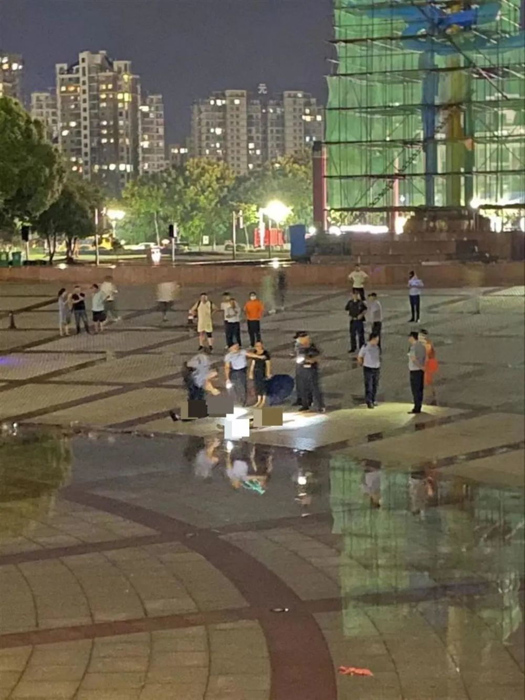

# 浙江温州两人遭雷击身亡：一人正在海上作业，一人正步行下班

今天，一则消息让网友痛心：3月22日，受对流云团影响， **浙江温州多地出现强对流天气，两人遭雷击不幸遇难。**

_图自视觉中国（图文无关）_

当天下午5时多，温州市急救中心指挥调度大厅接到电话称， **一名工作人员在海上作业时突然遭受雷击，不省人事。** 待患者所在的船只靠岸后，
**急救医生检查发现，患者面色发绀、心跳呼吸已停止，随即给予抢救并送医治疗，后抢救无效去世。**

无独有偶，当天下午6时多，120急救指挥中心再次接到市民报警称， **一名女子被雷击中，呼之无反应，面色苍白无血色。**
后得知该女子是在回家途中忽遇春雷，来不及躲避后被击中，急救医生到达现场后，
**发现患者全身淤青、心跳呼吸停止，当场进行心肺复苏并送至医院救治，后抢救无效去世。**

**近期阴雨连绵、春雷不断，温州市急救中心温馨提醒市民们：**
当在野外面对突发的恶劣天气，积雨云变厚变黑，雷暴随时来临的情况，一定要和树木、电线杆、积水保持距离，远离建筑物外露的水管、煤气管等金属物体，远离金属栏杆、铁轨及电力设备。高空、海上作业的人员应停止工作。如市民在行车途中，车子被雷击中，千万不要贸然下车检查车况，应等到雷暴完全过去后再下车。

这类悲剧并不是第一次发生。去年8月 **一对新人在玉龙雪山景区拍婚纱照，新郎遭雷击去世。**

同年同月，安徽芜湖南陵县南陵广场上， **数名市民遭遇雷击，其中2人不幸身亡。**

**如遇身边同伴被雷击怎么办？**

建议大家在第一时间采取以下急救措施，帮助患者争取最宝贵的时间：

**1.及时呼救，拨打120。** 请保持镇静，不要慌张，更不随意乱跑，立即呼叫120求助，并清楚告诉急救人员目前所在位置，提供受害者的相应信息。

**2.保证个人安全，预防二次雷击。**
如果雷暴没有结束，及时转移到安全地点（干燥处）。对于患者来说，除非是从高处坠落或身体遭受重击，否则不会出现严重的骨折，也就不会导致瘫痪或大出血。所以，这个时候挪动患者是相对安全的。

**3.立即检查患者呼吸和心跳。**
雷击引起的电灼伤只是表面现象，最危险的是对心脏和呼吸系统的伤害，雷击常常会导致受害者心脏骤停，如无法判断可以电话联系120寻求帮助，若无心跳、呼吸，可在调度员的指导下进行CPR（心肺复苏术）直到救护车到达。

**4.若伤者神志清醒，呼吸心跳均正常，应让伤者就地平卧** ，严密观察，检查伤口并处理，同时等待120人员到来。

来源：钱江晚报全媒体编辑中心综合

