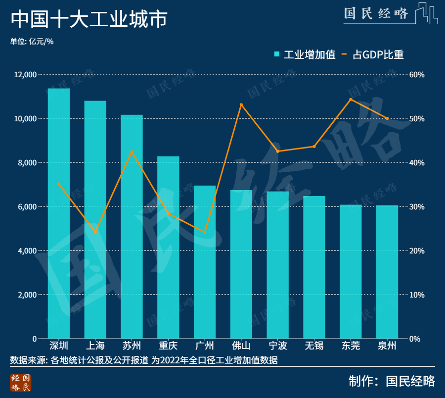
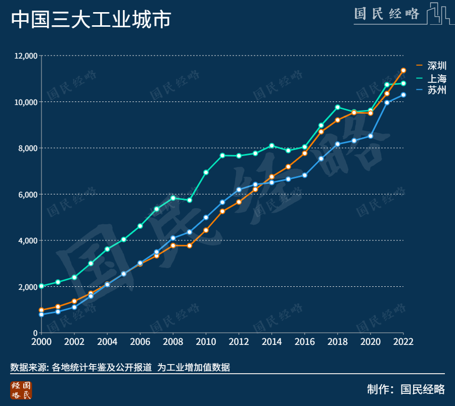
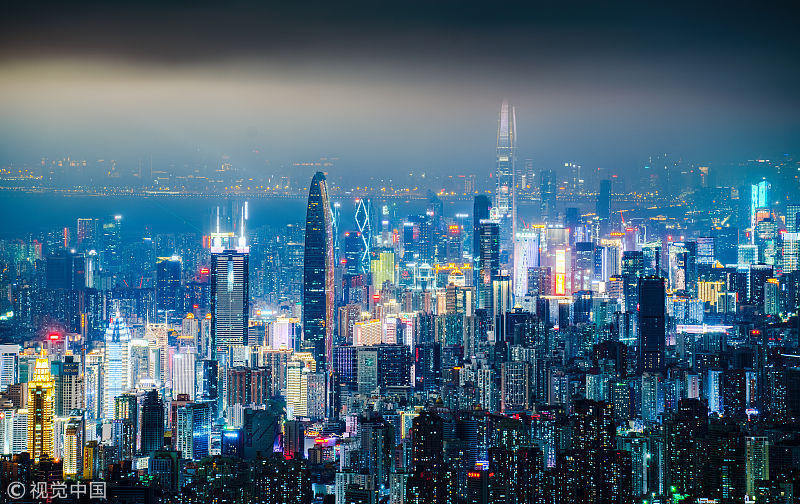
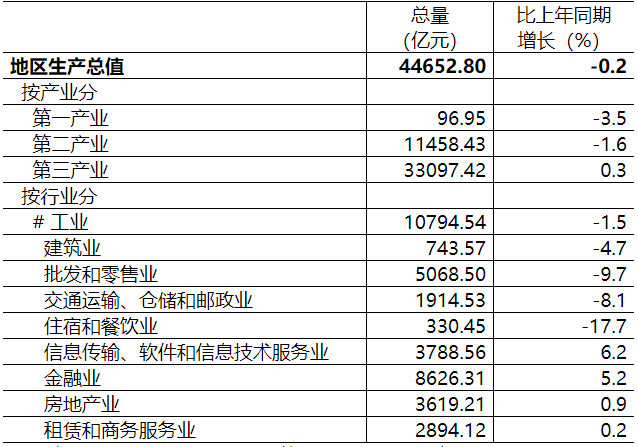
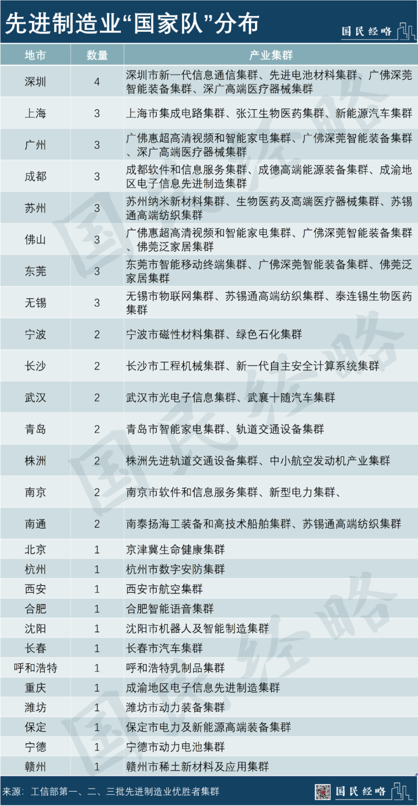
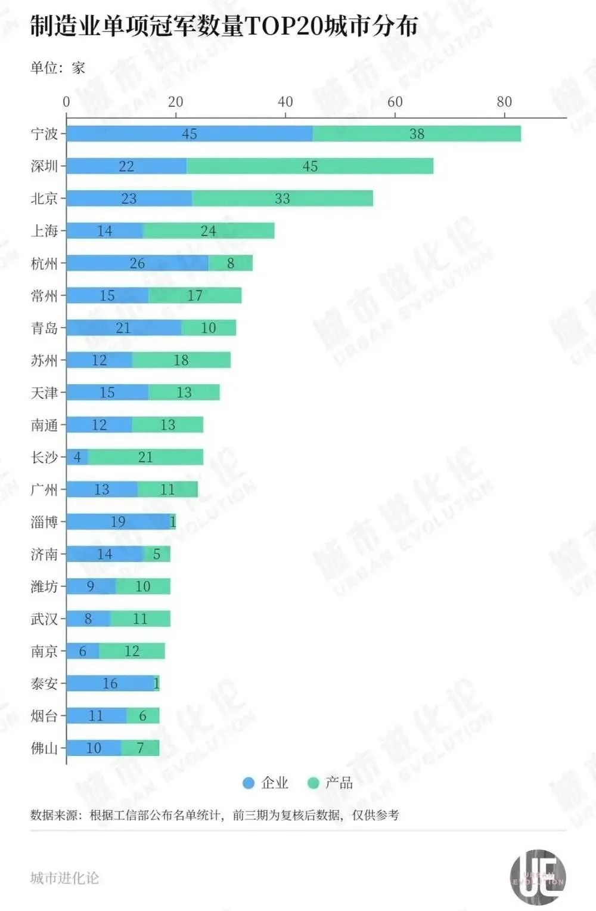

# 深圳首超上海，中国工业第一大市易主了

**划重点：**

  * _1_ 作为我国工业体量最大的三个城市，上海、深圳、苏州一直是你追我赶，上海长期作为领跑者，深圳苏州各有所长。2022年，深圳工业增加值达1.13万亿，首次超过上海的1.08万亿，跻身工业增加值第一大市。
  * _2_ 目前全国600多个城市中，仅有24个万亿GDP城市，沪深苏三市单就工业GDP体量，就超过了90%以上的地市。继三大工业城市之后，重庆、广州、佛山、宁波、无锡、东莞、泉州跻身十强之列。
  * _3_ 作为中国经济第一大市和工业第一大市，广东共有深圳、广州、佛山、东莞4市进入十强，足见制造业底蕴之厚、实力之强。

**文|凯风**

01、继万亿GDP城市之后，万亿级工业大市也来了

近日，各地陆续发布统计公报，透露各产业GDP信息， **中国工业10强城市** 最新出炉。

作为第一梯队的领跑者， **深圳、上海、苏州** 率先跻身 **万亿工业GDP** 俱乐部。

2022年，三大工业城市全口径工业增加值（工业GDP）全部突破万亿大关，且工业总产值集体迈入4万亿俱乐部。

要知道，目前全国600多个城市中，仅有24个万亿GDP城市，沪深苏三市单就工业GDP体量，就超过了90%以上的地市。

继三大工业城市之后， **重庆、广州、佛山、宁波、无锡、东莞、泉州** 跻身十强之列。

十大城市，除了重庆位居西部之外，其他全部来自沿海地区，且以广东、江苏为最。

作为中国经济第一大市和工业第一大市， **广东** 共有深圳、广州、佛山、东莞4市进入十强，足见制造业底蕴之厚、实力之强。

**江苏** 虽然GDP不及广东，但工业增加值与广东几乎不相上下，苏州、无锡两市进入十强俱乐部，而南京、南通、常州工业实力同样不弱，发展相对均衡。

在一众工业强市里， **苏州、佛山、无锡、东莞、泉州** ，在行政级别上都只是地级市。

苏州的电子，佛山的智能家电，无锡的机械，东莞的智能手机、泉州的纺织鞋服，在行业内外都有举足轻重的影响力。

正是因为没有省会或计划单列市、直辖市具有的强资源集聚能力，这些地市才得以专心发展制造业，从而脱颖而出。

02、谁是第一工业大市？

作为我国工业体量最大的三个城市， **上海、深圳、苏州** 一直是你追我赶，上海长期作为领跑者，深圳苏州各有所长。

这一局面已经维持多年，没想到，最终被疫情这一超预期因素所打破。

2022年，深圳工业增加值达1.13万亿，首次超过上海的1.08万亿，跻身工业增加值第一大市。

在此之前，深圳工业总产值已经连续4年位居全国之首，此番工业增加值的突破，意味着， **深圳第一次成了双料工业第一大市。**

与工业总产值相比，工业增加值的赶超意义更为重大。

原因不难理解，总产值是整体产出，而增加值需要扣除原材料、能源等中间投入，更具含金量，更能看出城市的真正工业实力。

**深圳为何能否跃居工业第一大市？**

**疫情** ，显然是不容低估的影响因子。但在疫情之外，深圳早期的产业布局，最终到了收获时刻。

长期以来，深圳以电子信息产业为第一大支柱产业，但近年来，在新能源的时代风口中，深圳勇立潮头之上。

一个比亚迪就足以说明一切。这家总部位于深圳的企业，堪称2022年汽车行业最大搅局者，一年卖了180多万新能源车，超过特斯拉勇夺全球第一。

受此刺激， **深圳规上汽车制造业增加值狂增104.5%** ，堪称稳工业的最大贡献者。

有意思的是，以高新产业著称的深圳，反而有着一项极为传统却贡献不菲的产业：石油和天然气开采业。

数据显示，2022年， **深圳石油和天然气开采业同比增长13.6%** ，远超4.8%的工业增速。

当然，深圳本土并没有石油资源，但中海油深圳分公司在我国第二大海上油田——南海东部油田开采的石油，部分最终计入了深圳的GDP，这一现象少为人知。

当然，石油产业占比极小，只是锦上添花，深圳工业仍旧以电子信息、装备制造、生物医药等主要支柱，这些高新制造业才是深圳的真正底牌所在。

03、哪些城市更“工业”？

衡量城市的工业属性，一个是看工业排名与GDP排名的差距，另一个看工业增加值占全部GDP的比重。

**以排名来看，哪些城市工业更胜一筹？**

在主要工业城市里， **深圳、苏州、佛山、宁波、无锡、东莞、泉州** 的工业排名，均高于其GDP排名，凸显了这些地方作为工业大市的经济底色。

与之对比，GDP十强城市里， **北京、成都、武汉、杭州、南京** 都未能晋级工业十强城市。（参阅《全国GDP十强城市，再次生变》）

北京“落榜”，并不令人意外。作为全国政治、文化、对外交往和国际创新中心，北京不以经济中心为追求，更不将制造业作为主导产业。

作为最早进入后工业化时代的城市之一，北京第三产业占比高达80%以上，为我国服务业最为发达的城市，以服务贸易为特色的中国服贸会最终落户北京，就是典型例证。

若 **以工业增加值占GDP比重来看，谁是真正意义上的工业城市？**

根据统计， **佛山、东莞、泉州** 工业比重超过50%，苏州、宁波、无锡超过40%，为不折不扣的工业大市。

作为“世界工厂”的一员，佛山、东莞遥遥领先并不令人意外，两地的工业实力足以与广州相提并论，一个是智能家电的王者，一个是智能手机的总部基地。

**上海、深圳占比为何相对较低？**

作为一线城市，城市竞争力必然是全方位的，主导产业不会集中于某一项，多条腿走路是常态。

**上海** 是国际经济、金融、航运、贸易和国际科技创新中心，在工业之外，金融业、信息产业、航运贸易产业实力同样强劲。

2022年上海各产业增加值

**深圳** 表面上看起来是相当纯粹的工业城市，但别忘了深圳还是内地第三大金融中心，还是与北京旗鼓相当的数字经济产业重镇。

2022年深圳各产业增加值

所以，无论上海还是深圳，并无“产业空心化”之忧。

04、衡量一个城市的工业实力，不只看工业规模，更要看高新产业竞争力

随着大国博弈日益白热化，经贸战、产业战、科技战日益深化，先进制造业成了摆脱“卡脖子”的重要着眼点所在。

**哪些城市的先进制造业实力更为强劲？**

过去几年，工信部先后发布三批 **先进制造业集群优胜者** 名单，共有45个国家级集群。

以城市来看，深圳以4个集群跻身榜首，上海、广州、苏州、成都、佛山、东莞、无锡以3大集群位居前列。

在先进制造业“国家队”名单上，也不乏三四线城市的身影，如 **株洲、潍坊、宁德**
等等，这些城市或许经济总量不高，但在关键产业上，却有影响全国乃至世界的力量。

与先进制造业集群“国家队”作为引领者的角色相比， **制造业单项冠军，则是制造业当家的中场力量。**

制造业单项冠军，指的是在某一细分市场，生产技术或工艺国际领先，单项产品市占率位居全国乃至全球前列，代表全球制造业发展的最高水平和市场活力。

正因为这一点，单项冠军又有“隐形冠军”的称号，犹如扫地僧一般，默默无闻，却又举足轻重。

目前，我国已先后培育遴选了7批 **1186家制造业单项冠军企业** ，宁波、深圳、北京、上海、苏州、青岛、广州、长沙、天津等位居前列。

值得一提的是，这些工业大市，几乎不约而同提出 **“制造强市”** 的目标，以此作为高质量发展的支撑，作为城市晋级的推动力。

至于服务业高度发达的北京，虽然完全不依赖制造业，但也将科技创新作为经济发展的主要引擎。

从中国目前的发展阶段来看，工业化仍旧方兴未艾，制造业依旧是经济重心，后工业化转型并不适合所有城市。

即使强如广深，都不会轻易抛弃工业，遑论其他城市？

