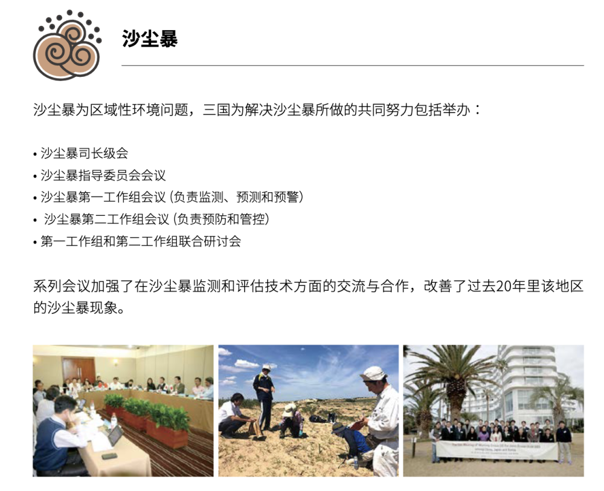

# 漫天沙尘跨国而来，要向蒙古“索赔”吗？经济学家：谁牺牲谁付费

**核心要点：**

  * _1_ 相比于“谁污染谁负责”，“牺牲者付费”也是治理环境污染的有效手段。即受害国给排污国支付费用，敦促其减少排污，从而减轻对受害国的危害。
  * _2_ 纵观历史，跨国问题上合作远好于对抗。中国其实可以考虑当年韩国和日本与中国的合作模式，与蒙古开展跨国治沙合作。

近日，我国北方遭遇今年以来最强的沙尘天气，能见度明显降低。据媒体报道，沙尘主要源自蒙古国。

境外沙尘屡屡侵袭，沙尘治理责任归属如何界定？

**专家简介：**

张中祥 天津大学马寅初经济学院创院院长、卓越教授

一、如何看待很多网友表示“蒙古国应该给予我们赔偿”？

**张中祥：** 这几天有网友评论“蒙古国应该给我们赔偿”，毕竟沙尘很大一部分都是来自蒙古国。我可以理解这个想法，这也符合环境治理中的“谁污染谁负责准则”。

但是，凡涉及到赔偿，就需要严格从法律程序上进行界定，是谁的责任？是否主观意愿造成？等等。对跨区域跨国界污染，除非像游轮泄露污染这种有明确责任范围的事故，其实很难界定范围和责任并赔偿。

若干年前中国经济发展速度较快时，东南沿海电厂排放污染在日韩甚至北美都有监测到，但我们并没有主观污染，更多的是自然因素、强气流等导致污染范围扩大。与此类似，蒙古国也并非主观希望沙尘暴进入中国。所以我们更多还是要通过国际合作治理来解决跨区域污染问题。

相比网友主张的由蒙古国付费，从源头控制污染更有效角度讲，我多年一直呼吁可考虑给蒙古国“付治沙费用”。

_蒙古国的沙漠（图源：视觉中国）_

二、您为什么主张我们应该给蒙古国“付费”？

**张中祥：**
我们在环境治理领域一直坚持“谁污染谁负责”的原则，毕竟生产活动给社会成员造成伤害就应该负责。但有时，污染者造成伤害也是为社会提供商品、服务和生产，总体为了促进经济发展。所以我们坚持“谁污染谁负责”的原则并不以惩罚污染者为目的，而是希望他们在为社会提供商品和服务时减少污染。因此有了环境经济学里的市场手段，比如环境税、排污交易、碳市场等，排污减少困难的企业向容易减少排污的企业购买排污权，这样可以降低全社会总的降排成本。

但在跨区域跨国界问题上，不同国家对排污程度有不同理解，可能排污国觉得没什么，可能并没有违反他们国家的法规，但受害国付出很大牺牲。因此，从源头控制污染更有效角度讲，受害国可能就会给排污国支付费用，敦促其减少排污，从而减轻对受害国的危害。

我是从北京2012年底大面积雾霾治理时，开始在国内重要会议和文章中强调这一观点的。因为当时北京雾霾一部分来自北京，其他来自天津、河北等地，即便北京这部分做得再好，其他地区问题没有解决，雾霾问题还是无解。所以此时若能给河北等地支付一些费用，河北就可统一调动资源、提前规划安排，敦促其一同解决雾霾问题，对北京是更好的。我们有中央到地方的纵向财政转移支付，但没有横向转移支付，但实施“牺牲者付费”原则涉及到地方与地方之间跨省的横向财政转移支付，这是实施这一原则的主要难点。

这一原则并非凭空出现，德国排废水到莱茵河，流至荷兰、法国，对德国来说他们达到排污标准即可，但下游国家需要莱茵河的水作为生活用水，德国标准显然就不适用了，下游国家提高水质费用会很高昂。污染在源头解决是最理想的，如果下游国家向德国支付费用敦促其更多降排，那么他们就不用再花大价钱净水，总体成本还是下降的。

类似的还有上世纪八九十年代北京的沙尘暴，沙尘吹到了下游韩国汉城、日本东京。于是，中日韩联合举办的三国环保部长会议，沟通三国应将哪些方面作为重点、如何合作来改善环境，也包括沙尘暴治理。后来日韩就在中国资助植树造林，阻挡沙尘大面积跨地区流动，从而减少对他们的危害，这也是牺牲者付费的一种形式。2021年3月之前十年，北京的沙尘的确不像以前那么严重了。

_中日韩沙尘暴治理（图源：中日韩环境合作20周年报告）_

纵观历史，跨国问题上合作远好于对抗，中国沙尘问题解决后汉城机场和东京机场就不会受那么多影响，中国沙尘治理也比按照当年经济水准可能达到的效果好。这就是对三国、对亚洲、对全球都好的成功案例。

说回蒙古国。他们的经济条件和沙尘治理水平没有中国好，面对沙尘他们也没有办法。中国其实可以考虑当年韩国和日本与中国的合作模式，与蒙古开展跨国治沙合作，中国支付蒙古一些费用用于植树造林等治沙费用，减少沙尘暴奇袭下游的中国北方。当然具体如何实施付费更有利于跨国治沙可以讨论。

如果我们能得到蒙古国配合，治沙效果会更好。中国是在200~400mm降水量上治沙效果较好，但蒙古国特别干旱，蒙古南部地区降水量不到50mm，所以对治沙树种和植被都有比较高的要求，若是单支付费用给蒙古国，也不一定能达到我们想要的效果，国内肯定也会有相应质疑。如果能签订合作协议，蒙古国政府配合中国企业去帮助植树治沙，让付费落实到治理沙漠上，可以成为一种手段。

三、如果污染国一直不转变理念，一直由牺牲国付费或采取行动，问题是否会无法解决？

**张中祥：**
随着经济发展，各国都越来越重视可持续发展，为人民服务，改善人民生活、提高生活质量，输血比不上造血，污染国还是会提高对环境的认识的，不会走入死循环。

蒙古国以放牧为主，历史上牧民过着逐水草而居的游牧生活，每隔一段时间换一片草原放牧，草场其实也得到了轮休。但后来学苏联的集体农庄经济，人口又大幅增加，草原被划分为一块又一块的牧场，但牧民不得更换住所和牧区，每一片牧场都有自己的生产单位，牧民在这上面进行集体劳动，盲目追求高产量，畜群规模无序扩张，而草场年复一年地过度放牧，但草场又不能像以前牧民逐水草而居的游牧生活时得到轮休。而且蒙古国还是矿业资源为主的国家，叠加畜牧业，境况非常不好。如果中国能提供帮助，在沙尘治理，其能源矿产资源为主的经济得到更可持续发展，那自然是好的，不过最终还是要靠他们自己的内力，本国转变观念、注重发展。如果缺乏造血功能，输再多的血也不够，也起不到作用，更何况，输血也是有度的。

四、人类生存要有生态，也要有生产，如何在生态与粮食之间平衡？

**张中祥：**
大工业机械可以24小时连轴转，但人需要工作休息交替进行。全球化浪潮下，追求低成本，注重效益和产量，对农业也有一定影响。本来农业有正常生息，非要弄个两茬三茬，土地过度疲劳使用，也未进行恢复，带来水土方面的问题。我们还是要认识到农业确实和工业不一样，不能过分连轴转。不同品种对水土要求不一样，改良品种可以减轻土地负担；改善饮食和消费习惯可以增加更多不同食品的选择和生产，也可以带来水土良性循环。

**专家简介：**

**版权声明：本文系腾讯新闻《一起来唠科》独家稿件，未经授权禁止媒体转载，但欢迎转发至个人朋友圈。**

