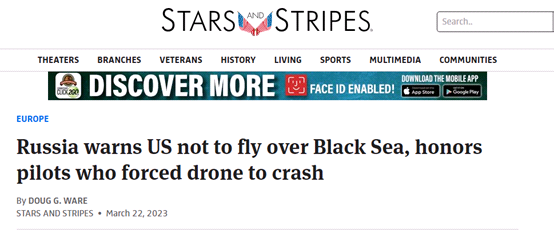
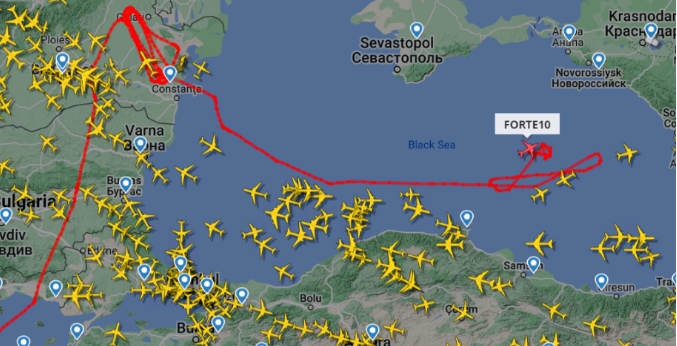

# 美俄“黑海撞机”后：美军频繁更换无人机航线，远离俄方限制区域

美俄“黑海撞机”事件的后续影响还在持续。美国《星条旗报》22日称，俄方明确警告美国“不要再派遣无人机在黑海进行类似的侦察活动”，而美军则直接拒绝。显然，双方的角力还在继续。

报道称，“俄罗斯军方明确警告美国不要在黑海上空派遣更多无人机。”此前一架美国MQ-9无人机在黑海遭到俄军苏-27战斗机的驱逐，美方宣称无人机受到俄军战机撞击后受损坠海，而俄方则坚称没有使用机载武器，也没有发生过撞击。

俄军声称，当时这架美国无人机飞进了俄军在俄乌冲突爆发后在黑海上空设置的限飞区域。俄罗斯副外长谢尔盖·里亚布科夫22日警告称：“美国人以示威、冷嘲热讽和公开的形式否认我们限制行动的合法性，并表示他们打算继续出动无人机。”。“我们警告他们不要试图制造紧张情绪，考验我们的耐心。我们将通过一切可用手段100%确保俄罗斯的安全。任何美国无人机……都无法动摇我们的决心。”

同一天，俄防长绍伊古还向在黑海上空执行拦截美国无人机任务的苏-27战斗机飞行员授予“勇气勋章”。

而五角大楼发言人、空军准将帕特·赖德则明确表示：“我们将继续在黑海上空开展行动，在国际法允许的情况下，在国际空域飞行。”五角大楼官员表示，当时MQ-9并没有进入俄罗斯领空，所以尽管美军无人机“在撞击中坠毁”，但美军仍将继续进行“例行飞行”。

美国有线电视新闻网称，在“黑海撞机”事件后，美国虽然仍在向黑海派遣无人机，但一度改变无人机飞行路线为远离克里米亚和黑海东部地区的空域——也就是远离了俄方划定的限制区域，以减少美俄正面冲突的可能性。不过这种做法能持续多久，别说俄罗斯了，估计美军自己也没底儿。据称五角大楼内部已经有建议将无人机的飞行路线改回到更接近俄军限制区，因为他们认为，如果美国在这个问题上有所退让，俄罗斯可能会借机宣布封锁更大范围的空区，试图迫使美国的无人机在更远的地方飞行。

_据称是美军“全球鹰”无人机在黑海上空的飞行路线_

另一方面，美军改变飞行路线，也与躲避俄军拦截有关。之前俄罗斯媒体曾披露，美军无人机以往总是大摇大摆地按照固定时间、固定路线飞临黑海上空，对俄军目标实施抵近侦察，这就给了俄军战斗机准确拦截的机会。如今美军频繁更换无人机的飞行路线，尽管无法完全躲避俄军的探测和定位，但至少可以给俄军战斗机的驱逐行动添点麻烦。同时，美军出动的无人机也改为
“全球鹰”无人机，它在执行侦察任务时的飞行高度可达1.5-2万米，对于大部分战斗机而言，在这样的高空中想要不动用机载武器对无人机进行干扰甚至是撞击，难度可就大得多了。

