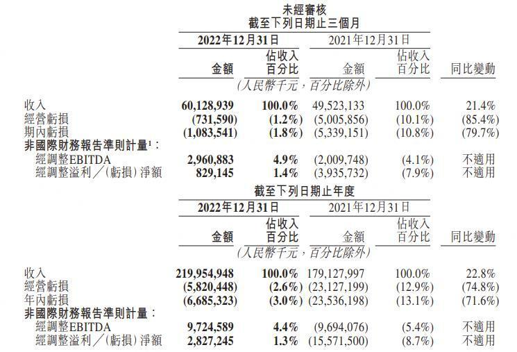
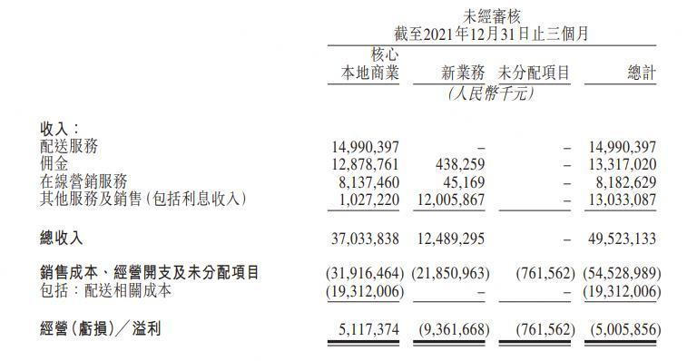
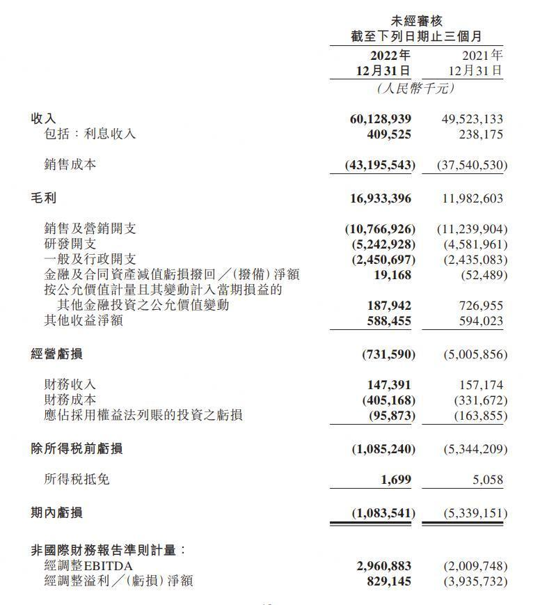
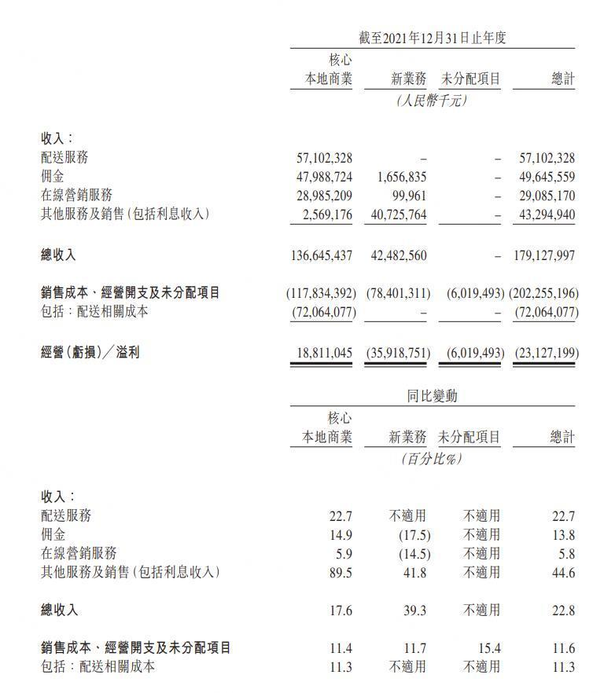
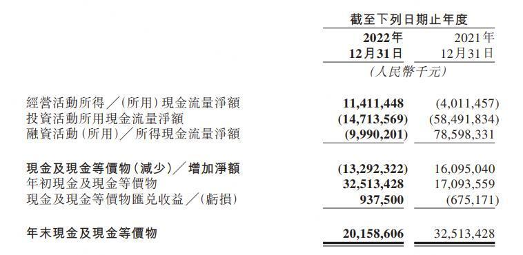

# 美团第四季度营收601亿元 同比增长21.4%

**划重点**

  * _1_ 2022年美团全年营收2200亿元，同比增长22.8%。调整后净利润28亿元，同比扭亏为盈。
  * _2_ 2022年第四季度美团营收601亿元，同比增长21.4%。当季调整后净利润8.3亿元，而上年同期为亏损39亿元。
  * _3_ 美团外卖业务2022年日订单量峰值超过6000万份。
  * _4_ 美团闪购业务2022年交易用户和年度活跃商户均同比增长近30%，12月份最高日订单量超过1100万份。
  * _5_ 截至2022年12月31日，美团持有现金及现金等价物为202亿元，短期国债投资为919亿元。

腾讯科技讯
3月24日消息，美团周五港股收盘后发布了截至2022年12月31日的2022年第四季度及全年财报。财报显示，美团2022年全年营收2200亿元，同比增长22.8%；经调整息税前利润为97亿元，调整后净利润为28亿元，同比扭亏为盈。其中，第四季度营收601亿元，同比增长21.4%；经调整息税前利润为30亿元，调整后净利润为8.3亿元，而上年同期为亏损39亿元。

**一、美团第四季度及全年业绩概要**

2022年全年，美团总营收从2021年的1791亿元增长到2200亿元，增幅达22.8%。其中，核心本地商业部门的营业利润为295亿元，较2021年的188亿元增长56.8%。新业务部门的经营亏损从2021年的359亿元收窄至284亿元。

2022年全年，美团经调整息税前利润（EBITDA）为97亿元，调整后净利润为28亿元，同比扭亏为盈。美团还在2022年全年实现了114亿元的经营性现金流入。截至2022年12月31日，美团持有现金及现金等价物为202亿元，短期国债投资919亿元。

**1、第四季度财报要点**

在2022年第四季度，美团营收达到601亿元，较2021年第四季度的495亿元增长21.4%。其中，

——核心本地商业部门的收入为435亿元，与2021年第四季度的370亿元相比增长17.4%。在核心本地商业部门中，配送服务收入实现同比增长，主要是因为交易笔数增加，以及在更有效的交易用户激励策略推动下餐饮外卖及美团闪购业务的收入扣减金额减少。佣金收入增长主要是由于餐饮外卖及美团闪购业务的交易笔数及客单价增加，部分被疫情导致到店、酒店及旅游业务交易金额减少所抵销。在线营销服务收入同比减少，主要由于季度在线营销活跃商家需求受疫情限制，导致到店、酒店及旅游业务的季度在线营销活跃商家的平均收入减少。

——新业务部门的收入为167亿元，较2021年第四季度的125亿元增长33.4%，增长主要原因是商品零售业务扩张。

在2022年第四季度，美团销售成本为432亿元，而2021年第四季度为375亿元，占收入百分比由75.8%降至71.8%。销售成本增加主要由于配送服务相关成本增加所致，这与餐饮外卖及美团闪购业务的交易笔数增加有关，还有商品零售业务扩张令销售成本增加。销售成本占收入百分比减少主要是由于餐饮外卖、美团闪购及商品零售业务的毛利率改善。其中，

在2022年第四季度，美团销售及营销开支为108亿元，而2021年第四季度为112亿元，销售及营销开支减少主要是由于有效的成本控制措施限制了推广及广告开支，占收入百分比由22.7%降至17.9%，这也主要得益于有效的成本控制措施。

在2022年第四季度，美团研发开支为52亿元，超过2021年第四季度的46亿元，
占收入百分比则由9.3%同比下降0.6个百分点至8.7%。研发开支增长主要是雇员福利开支增加所致，占收入百分比下降则主要受益于经营杠杆作用的提高。

在2022年第四季度，美团总务及行政开支为25亿元，与去年同期持平，占收入百分比由4.9%下降0.8个百分点至4.1%。总务及行政开支占收入百分比下降主要受益于经营杠杆作用的提高。

在2022年第四季度，美团其他业务净收益为5.885亿元，而2021年同期为5.94亿元。

由于上述原因，美团在2022年第四季度的经营亏损为7.316亿元，经营亏损率为1.2%，而2021年同期的经营亏损及经营亏损率分别为50亿元及10.1%。

在2022年第四季度，美团核心本地商业部门的经营溢利为72亿元，而2021年第四季度为51亿元，经营利润率由13.8%增至16.6%。经营溢利增加主要由于餐饮外卖及美团闪购业务的毛利增加所推动，部分被疫情导致到店、酒店及旅游业务的利润减少所抵销。经营利润率提高主要是由于餐饮外卖及美团闪购业务的毛利率均有所改善，以及美团努力降低所有业务的成本及开支并提高运营效率。

在2022年第四季度，美团新业务部门的经营亏损为64亿元，而2021年第四季度为94亿元，该业务的经营亏损率也获得改善，由75%同比收窄36.8个百分点至38.2%。经营亏损及经营亏损率均有所改善主要是美团努力降低成本及开支并提高运营效率，尤其是在商品零售业务方面。

由于上述原因，美团2022年第四季度录得亏损11亿元，而2021年同期为亏损53亿元。

**2、2022年全年财报要点**

2022年全年，美团营收达到2200亿元，较2021年的1791亿元增长22.8%。美团全年营收增长主要是由于两大业务部门均贡献了收入增长。其中，

——核心本地商业部门的收入达到1608亿元，较2021年的1366亿元增长17.6%。配送服务收入增长主要由于交易笔数增加，以及在更有效的交易用户激励策略推动下餐饮外卖及美团闪购业务的收入扣减金额减少。佣金收入增长，主要是由于餐饮外卖及美团闪购业务的交易笔数及客单价增加所推动，部分被疫情导致到店、酒店及旅游业务的交易金额减少所抵销。在线营销服务收入同比增加，主要由于在线营销活跃商家数目增加。

——新业务部门的收入达到592亿元，较2021年的425亿元增长39.3%，这主要得益于商品零售业务的扩张。

2022年全年，美团销售成本为1582亿元，而2021年为1367亿元，占收入百分比由76.3%同比减少4.4个百分点至71.9%。销售成本增加主要由于配送相关成本增加，这与餐饮外卖及美团闪购业务的交易笔数增加一致，还得益于商品零售业务的扩张。销售成本占收入百分比减少主要是由于餐饮外卖、美团闪购及商品零售业务的毛利率改善。

2022年全年，美团销售及营销开支为397亿元，而2021年为407亿元，占收入百分比由22.7%同比下降4.6个百分点至18.1%。销售及营销开支及占收入百分比均有所减少，主要是由于有效的成本控制措施限制了交易用户激励、推广及广告开支。

2022年全年，美团研发开支达到207亿元，而2021年为167亿元，占收入百分比为9.4%，与上年同比持平。研发开支增加主要是雇员福利开支增加所致。

2022年全年，美团总务及行政开支为98亿元，而2021年为86亿元，占收入百分比由4.8%同比下降0.4个百分点至4.4%。总务及行政开支增加主要是雇员福利开支增加所致，占收入百分比下降则主要受益于经营杠杆作用的提高。

2022年全年，美团其他业务净收益为42亿元，而2021年则为亏损1.857亿元。除2021年根据中国反垄断法被处以的罚款外，该变动主要是由于2022年所获得的补贴或税收优惠增加以及兑美元贬值导致的汇兑收益增加。

由于上述原因，美团于2022年的经营亏损为58亿元，经营亏损率为2.6%，而2021年的经营亏损及经营亏损率分别为231亿元及12.9%。

2022年全年，美团核心本地商业部门的经营溢利为295亿元，而2021年为188亿元，经营利润率由13.8%同比增长4.6个百分点至18.4%。经营溢利及经营利润率增加主要由于餐饮外卖、美团闪购业务的毛利及毛利率增加，以及美团努力降低所有业务的成本及开支并提高运营效率。

2022年全年，美团新业务部门的经营亏损由2021年的359亿元收窄至284亿元，经营亏损率由84.5%同比收窄36.6个百分点至47.9%。经营亏损及经营亏损率均有所改善，主要得益于美团努力降低成本及开支并提高运营效率，尤其是在商品零售业务方面。

由于上述原因，美团于2022年录得亏损67亿元，而2021年则为亏损235亿元。

**3、流动资金及资本资源**

美团以往主要通过股东出资以及通过发行和出售权益性证券及债券来满足现金需求。截至2022年12月31日，美团持有的现金及现金等价物和短期理财投资分别为202亿元和919亿元。

截至2022年12月31日，美团经营活动所得现金流量净额为114亿元，投资活动所用现金流量净额为147亿元，融资活动所用现金流量净额为100亿元。

**二、其他业务亮点**

**1、核心本地商业**

2022年全年，美团核心本地商业部门的营收实现了17.6%的增长，营业利润同比增长56.8%至295亿元，营业利润率由2021年的13.8%上升至18.4%。2022年第四季度，该部门收入同比增长17.4%至435亿元，营业利润同比增长41%至72亿元，营业利润率从2021年同期的13.8%提高至16.6%。

美团外卖业务2022年日订单量峰值超过6000万份。2022年，美团闪购业务年交易用户和年度活跃商户均同比增长近30%，12月份最高日订单量超过1100万份。

**2、新业务**

2022年全年，美团新业务部门收入同比增长39.3%至592亿元，主要受商品零售业务的增长所推动。经营亏损收窄至284亿元，经营亏损率改善至47.9%，主要由于商品零售业务的经营效率提高。在2022年第四季度，美团新业务部门收入同比增长33.4%至167亿元。该部门运营亏损同比收窄32.0%至64亿元，经营亏损率环比收窄至38.2%。

**三、2023年前景及战略**

美团在财报中对2023年的前景和战略进行了展望：

展望2023年，美团将继续实施”零售+科技“的公司战略，为消费者带来丰富的产品和服务选择，促进本地消费复苏，创造就业机会。在优化即时配送网络的同时，美团也继续将产品覆盖范围从餐饮品类扩展到非餐饮品类，包括生鲜、生活必需品及药品等，并将进一步加强便捷和万物到家的消费者心智。在商家端，美团将继续优化全面的服务和线上营销工具，以帮助商家在后疫情时代提高运营效率及创造更多收入。

此外，美团将创造广泛的就业机会，并尤其重视骑手的福利待遇。再者，随着美团发展商品零售业务及持续优化覆盖全国的次日达物流网络，公司将深入村镇，为农村地区的消费者提供更多元化、更具高性价比的商品，提高配送效率，支持农产品流通。另外，美团致力于创新和利用自动配送车和无人机等先进技术，提高运营效率，为生态系统中的所有参与者带来更多价值，并继续履行其”帮大家吃得更好，生活更好“的使命。（金鹿）

