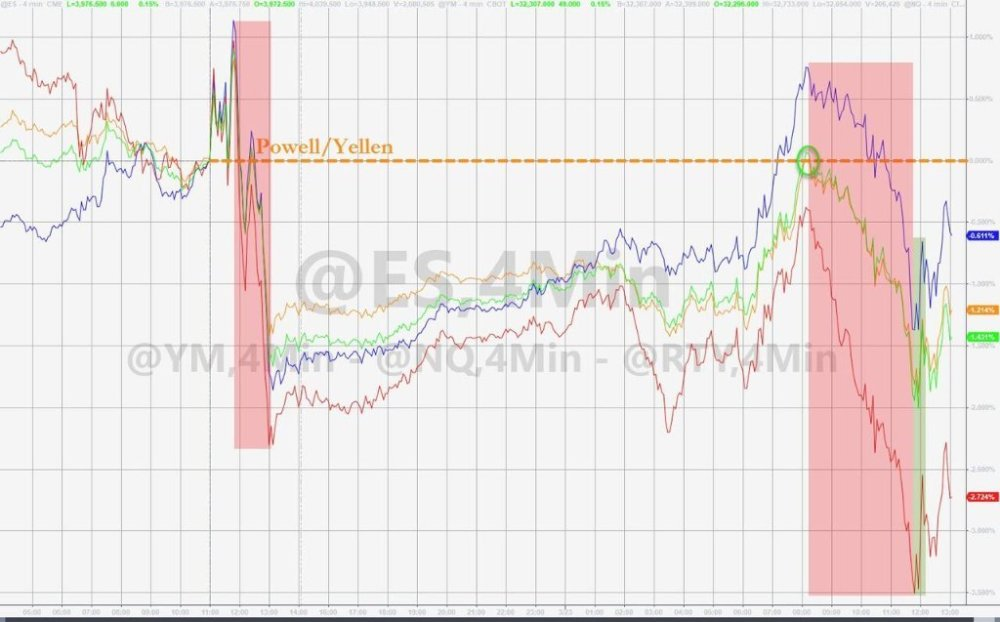
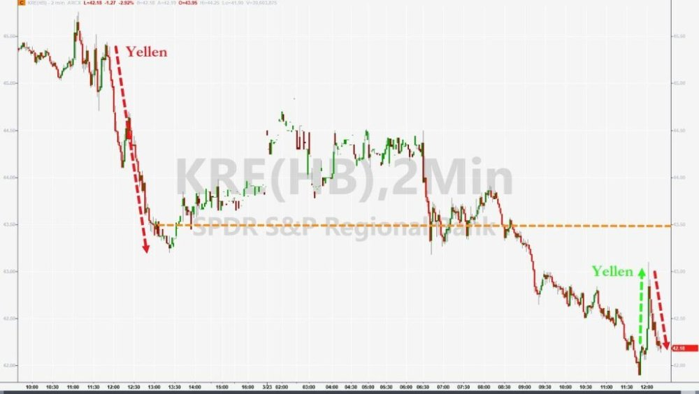
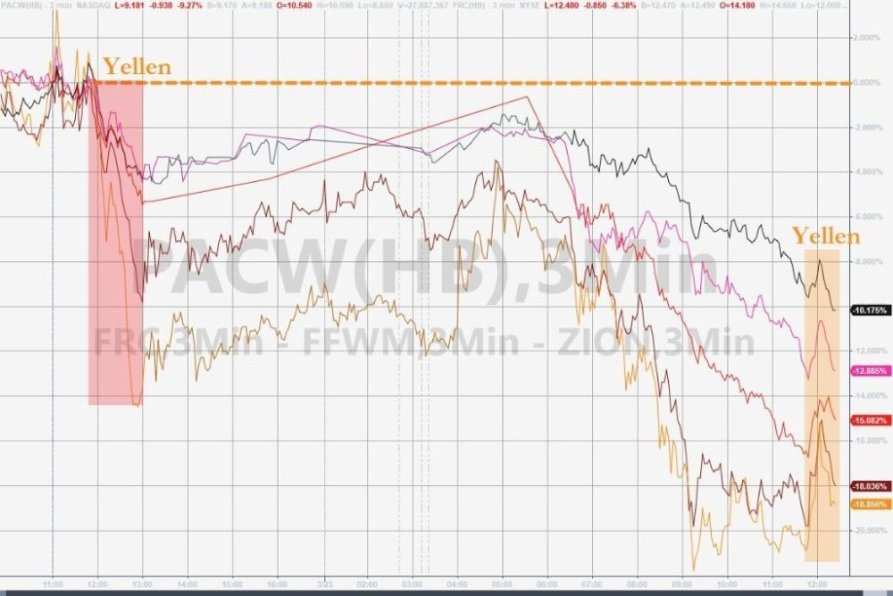
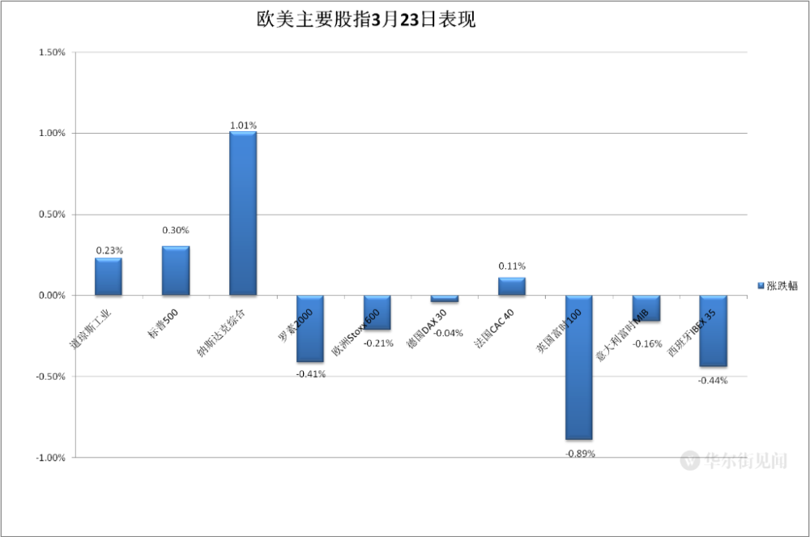
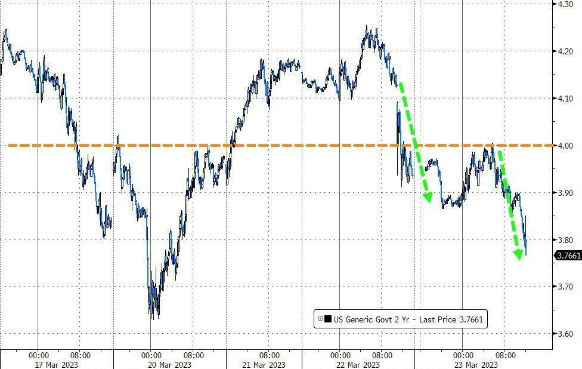
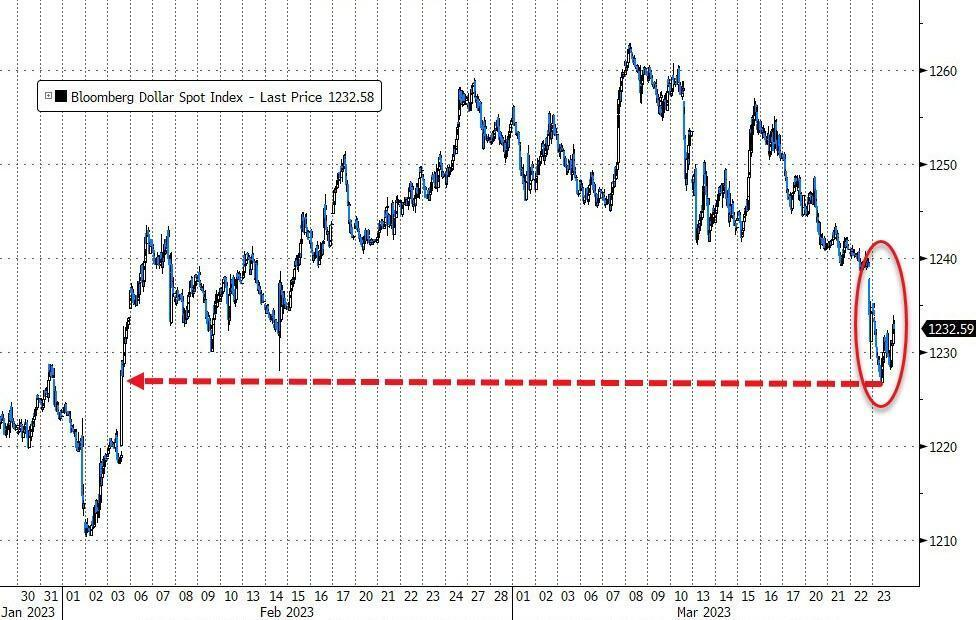
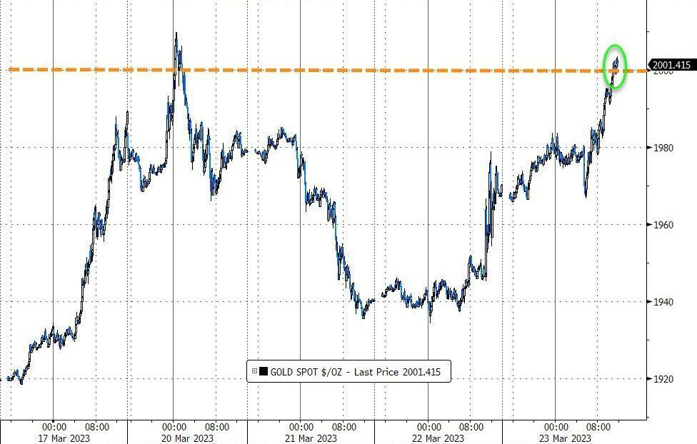

# 美股收盘：耶伦改口安抚后银行股仍跌，科技股独秀

周三因美国财长耶伦的一句话而盘中戏剧性跳水后，美股周四又因耶伦紧急改口而摆脱了盘中跌势。虽然能源为首的多数板块继续下挫，但科技股力挺大盘艰难收涨，中概股盘中始终保住反弹势头，表现胜过大盘一筹。

周四未再传不利银行业的坏消息，但早盘抛售暂歇的银行股午盘重回跌势，成为两大美股指标普和道指盘中转跌的一大推手。午盘美国财政部公布的耶伦周四国会作证证词显示。相比周三证词，耶伦增加了几句话，称已采取的强有力行动确保了美国国民的存款安全，当然，如有必要，我们准备采取进一步的行动。此后，标普和道指双双小幅转涨。但包括银行股在内的多数板块仍收跌。

评论称，周三耶伦的表态给扩大银行存款保险范围的消息泼冷水，当天美股尾盘的抛售由银行股领衔，这意味着银行股将再次受到关注。如果银行能企稳，美股应该也能普遍企稳。

周三美联储继续如期加息25个基点后暗示加息周期接近尾声，会后公布的点阵图显示，联储官员预计今年至少还有一次25个基点的加息。会后有媒体调查显示，投资者大多认为，今年联储还会再加息，货币宽松今年内不会转向。而互换合约的交易者目前预计，今年联储不会再加息的几率约为50%。

有评论指出，在面临压力和经济不确定性的时候，很多投资者将大型科技公司视为避风港，这可以解释为何蓝筹科技股周四成为美股反弹的领头羊。

继美联储之后，瑞士、挪威和英国央行也相继宣布加息。面对银行业风险传染的威胁，主要央行仍继续紧缩，欧股盘中美元进一步走软，美债收益率有所回升，英央行加息后刷新日高，后逐步回吐欧股盘中升幅，美股盘中重回降势，继续远离周三美联储加息前所创的一周高位。美元指数周四欧市盘初一度自2月初以来首次盘中跌穿102.00，美股午盘多数板块转跌后，美元转涨。

美元走软之际，欧元和英镑兑美元盘中均曾创2月初以来新高。得到美元下跌支持的离岸人民币汇率盘中曾创2月中以来新高。周三盘中跳水的加密货币反弹。比特币重上2.8万美元，靠近美联储加息前周三盘中所创的九个月来高位。美元和美债收益率下行的支持下，黄金加速上涨，继上周五之后本周二度一日涨超2%，并近一年来首次盘中突破2000美元关口。

耶伦改口后标普道指盘中转涨 地区银行指数跌近3% 奈飞领跑龙头科技股 芯片股跑赢大盘

三大美国股指早盘高开高走，早盘至少涨超1%。早盘尾声刷新日高时，纳斯达克综合指数涨2.5%，标普500指数涨近1.8%，道琼斯工业平均指数涨超480点、涨1.5%，午盘均持续回落。标普和道指转跌，刷新日低时，道指跌逾165点、跌超0.5%，标普跌近0.5%，纳指回吐多数涨幅，日内涨幅一度略超过0.1%。耶伦修改后的证词公布后，标普和道指均转涨，纳指涨幅扩大到1%以上。

最终，
三大指数本周第三日集体收涨，但未能抹平周三回落的所有跌幅。周三收跌1.6%的纳指收涨1.01%，报11787.40点，靠近周二所创的2月15日以来收盘高位。周三收跌1.65%、跌落周二重上4000点所创点3月6日以来高位后，标普收涨0.3%，报3948.72点。周三跌逾1.6%的道指收涨75.14点，涨幅0.23%，报32105.25点，还未接近周二所创的3月8日以来收盘高位。

价值股为主的小盘股指罗素2000收跌0.41%，连跌两日，刷新上周五所创的去年12月末以来低位。科技股为重的纳斯达克100指数收涨1.29%，跑赢大盘，逼近周二连涨两日所创的2月2日以来高位。

主要美股指周三和周四走势

标普500各大板块早盘全线上涨，午盘大多转跌。截至收盘，只有奈飞和Meta所在的通信服务和英伟达等芯片股IT所在的两个板块仍上涨，分别涨约1.8%和1.7%，能源跌近1.4%领跌，公用事业跌约1%，金融跌近0.7%。

周三回落的龙头科技股均止住跌势。早盘涨超4%的特斯拉午盘曾转跌，收涨近0.6%。FAANMG六大科技股中，午盘只有亚马逊转跌，亚马逊最终微涨、几乎收平；媒体称其在加拿大市场的增加订户总数有改善后，奈飞收涨9%，反弹至2月28日以来高位；Facebook母公司Meta收涨2.2%，逼近上周四所创的去年5月5日以来高位的；微软收涨近2%，逼近上周五所创去年8月19日以来高位；谷歌母公司Alphabet涨近2.2%，刷新周二所创的2月7日以来高位；苹果收涨0.7%，接近周二所创的去年9月12日以来高位。

午盘芯片股总体保住反弹势头，继续跑赢大盘，费城半导体指数和半导体行业ETF
SOXX早盘均涨超3%，收涨约2.7%。周三逆市收涨的英伟达收涨逾2.7%，创去年4月4日以来新高，收盘市值超过巴菲特领导的伯克希尔-
哈撒韦，成为市值排名第五位的美股。

周三美股转跌的元凶——银行股盘中曾反弹，但最终收跌。银行股指标费城证交所KBW银行指数（BKX）早盘曾涨超1%，午盘跌超2%，收跌1.7%。地区银行指数KBW
Nasdaq Regional Banking Index（KRX）盘初曾涨约1%，收跌近3%。周三收跌5.7%的地区银行股ETF
SPDR标普地区银行ETF（KRE）收跌近2.8%，刷新2020年11月以来低位。

地区银行股ETF周三周四持续下跌

地区银行中，周三收跌逾15%的第一共和银行（FRC）早盘曾涨约9%，早盘尾声时转跌，收跌6%。
其加州“同乡”西太平洋合众银行（PACW）在周三跌17%后又跌近8.6%。周三收跌4.6%的First
Foundation（FFWM）跌8.8%。周三收跌5.6%的KeyCorp（KEY）收跌6.4%。周三收跌6.7%的Zions
Bancorporation（ZION）跌近8.9%。

第一共和等多只美国地区银行股周四再跌

波动较大的个股中，被两个月前做空前印度首富的沽空机构兴登堡（Hindenburg）发布报告指其夸大用户数据、为欺诈等犯罪行为提供便利后，支付服务商Block（SQ）盘初曾跌超22%，收跌14.8%；美国证监会（SEC）通知其可能违反证券法的美国最大加密货币交易所Coinbase（COIN）收跌约14%；季度收入和利润高于预期但活跃用户同比小幅下降的宠物用品电商Chewy（CHWY）跌近7.6%；而第一财季盈利和收入高于预期的钢铁和金属加工制造商Worthington
Industries（WOR）以及房产开发商KB Home（KBH）分别收涨约15.1%和7.4%。

热门中概股全天总体保持强劲反弹的势头，轻松跑赢大盘。纳斯达克金龙中国指数（HXC）早盘曾涨超5%，收涨逾2.9%。中概ETF
KWEB和CQQQ分别收涨4.8%和4.2%。到收盘时，达达涨超16%，金山云涨近15%，人人涨超13%，微博涨超7%，腾讯粉单涨约6.9%，B站涨超6%，网易涨超5%，京东涨超4%，阿里巴巴涨超3%，拼多多涨超2%，小鹏汽车涨超2%，蔚来汽车涨近2%，百度涨1.5%，理想汽车涨超1%。

欧股方面，连涨三日的泛欧股指回落。欧洲斯托克600指数跌落连续两日所创的上周二以来收盘高位。主要欧洲国家股指周四多数收跌，只有法股小幅收涨，连涨四日，英央行宣布继续加息后，英股在欧股中领跌，和德股均结束三日连涨，意大利和西班牙股指连跌两日。

欧股各板块中，被花旗下调整个银行业评级至中性、警告央行迅速加息将进一步打击经济活动和银行盈利后，银行板块收跌逾2.5%领跌，而科技板块涨近2.2%领涨。个股中，腾讯大股东、荷兰上市的Prosus涨6.4%；周三跌近6%的瑞士上市瑞信欧股（CSGN）收跌3.6%，回吐周二反弹的所有涨幅，刷新周一所创的历史低位，周二大涨12%的瑞银欧股收跌4.3%，也连跌两日。

两年期美债收益率降逾10个基点 远离美联储加息前所创一周高位

连日下跌的欧洲国债价格反弹，收益率周四持续回落，远离周三美联储加息前所处的高位，对利率更敏感的两年期德债收益率盘中降幅曾超过20个基点。

英国10年期基准国债收益率收报3.35%，日内降9个基点，美股盘中曾靠近3.34%，远离周三盘中接近3.57%刷新的日高，和周一下破3.14%所创的2月6日以来低位仍有距离；基准10年期德国国债收益率收报2.19%，日内降13个基点，美股盘中曾靠近2.17%，较周三美联储加息前升破2.39%所创的3月15日以来高位回落逾20个基点；2年期德债收益率收报2.50%，日内降18个基点，美股盘中曾下破2.49%刷新日低，较周三逼近2.77%所创的3月15日以来高位回落约28个基点。

美国10年期基准国债收益率在亚市盘中曾下测3.44%，欧股开盘后持续回升，美股盘前、英央行宣布加息后曾升破3.51%刷新日高，日内升逾8个基点，后很快回到3.50%下方，美股午盘回吐所有升幅后进一步下行，午盘曾靠近3.37%刷新日低，日内降逾6个基点，到美股收盘时约为3.43%，日内微幅下降，较周三美联储公布加息决议前升破3.64%所创的3月15日以来高位回落逾20个基点。

对利率前景更敏感的2年期美债收益率在亚市盘中曾下测3.87%，日内降近7个基点，美股盘前曾重上4.0%刷新日高，日内升逾6个基点，后很快下破4.0%，美股早盘回吐所有升幅，午盘一度下破3.77%刷新日低，日内降近17个基点，到美股收盘时约为3.83%，日内降近11个基点，远离周三美联储决议前上测4.26%所创的3月15日以来一周高位，还未靠近周一下破3.63%所创的去年9月以来盘中低位。

两年期美债收益率上周五以来走势

美元指数又创逾六周新低后转涨 离岸人民币盘中创五周新高

追踪美元兑欧元等六种主要货币一篮子汇价的ICE美元指数（DXY）在亚市早盘曾处于102.40上方，小幅上涨，后很快转跌，欧市盘初曾跌破102.00，连续两日创2月3日以来盘中新低，自2月3日以来首次跌穿102.00，日内跌超0.4%，欧股盘中不止一次转涨，美股盘前曾涨破102.40刷新日高，日内涨0.1%，未到美股开盘已转跌，早盘曾逼近102.00，但午盘转涨。

到周四美股收盘时，美元指数处于102.50上方，日内涨近0.2%，终结五日连跌，险些连跌六日创2021年9月以来最长连跌日；追踪美元兑其他十种货币汇率的彭博美元现货指数跌逾0.1%，在周三创2月3日以来新低后，又创2月2日以来新低，连跌六日。

彭博美元指数跌至再创2月初以来新低

欧元兑美元在周三欧股盘前曾涨至1.0930，创2月3日以来盘中新高，日内涨约0.7%，欧股开盘后逐步回吐涨幅，美股午盘转跌，美股收盘时徘徊1.0840一线，日内跌逾0.1%，未能连涨六日。英镑兑美元在欧市盘初曾涨破1.2340，创2月2日以来盘中新高，日内涨超0.6%，后有所回落，美股盘前曾短线跌破1.2300，美股收盘时略低于1.2300，日内涨约0.2%。

离岸人民币（CNH）兑美元在亚市早盘刷洗日低至6.8634，日内小幅下跌27点，后迅速转涨斌持续走高，欧市盘初曾涨至6.8105，自2月14日以来首次盘中接近涨破6.81，日内涨502点，欧股盘中涨幅收窄，曾失守6.83。北京时间3月24日5点59分，离岸人民币兑美元报6.8296元，较周三纽约尾盘涨311点，连续两日、本周第三日上涨。

周三盘中跳水后，高风险的加密货币反弹。比特币（BTC）在亚市早盘曾跌破2.66万美元刷新日低，后持续回升，美股早盘重上2.8万美元，早盘尾声时一度上测2.88万美元，接近周三美联储加息前所创的去年6月以来高位，美股收盘时处于2.81万美元上方，最近24小时涨超5%。

原油止步三连阳跌离一周高位 美国天然气连创两年半新低

美联储暗示今年至少还有一次加息后，投资者权衡经济衰退的前景，国际原油期货盘中曾转涨，但最终随着美元盘中反弹，未能延续三日连涨的势头。原油曾在美股盘前转涨，美股早盘刷新日高时，美国WTI原油涨至71.67美元，日内涨近1.1%，布伦特原油涨至77.44美元，日内涨近1%，美股午盘都转跌，美股午盘原油收盘后，日内跌幅扩大到2%以上。

到收盘时，WTI
4月原油期货收跌0.94美元，跌幅1.32%，报69.96美元/桶。布伦特5月原油期货收跌0.78美元，跌幅1.02%，报75.91美元/桶，和美油均跌离周三所创的3月14日上周二以来收盘高位，还未靠近各自上周五所创的2021年12月以来低位。

美国WTI原油周四盘中转跌

美国汽油和天然气期货连日涨跌各异。NYMEX 4月汽油期货收涨0.5%，报2.6059美元/加仑，连涨四日，继续创3月10日以来新高；NYMEX
4月天然气期货收跌0.78%，报2.1540美元/百万英热单位，连跌两日，连续两日创2020年9月以来新低，跌幅较周三的7.54%明显缓和。

伦铜六连涨至三周高位 黄金涨超2%收创一年新高 盘中一度突破2000美元

伦敦基本金属期货周四全线上涨。伦锡涨超4%继续领涨，连涨五日，3月7日上上周二以来首次收盘站上2.4万美元。伦铜涨约1.6%，连涨六日，自3月1日以来首次收盘突破9000美元关口。伦铝和伦锌分别涨约1.8%和1.4%，均创上周二以来新高，和伦铅都连涨两日。伦铅创三周新高。连跌三日的伦镍反弹，止住了连续两日创去年10月末以来新低的势头。

纽约黄金期货在美联储暗示今年只会再加息一次后加速上涨，彻底抹平周二大大跌逾2%的跌幅，冲上一年左右高位。COMEX
4月黄金期货收涨2.37%，继上周五之后再度一日涨超2%，接近上周五涨超2.6%所创的去年12月1日以来最大日涨幅，收报1995.90美元/盎司，创去年3月10日以来收盘新高，连续第二日、本周第三日收涨。

期金收盘后涨幅继续扩大，一度涨至2006.10美元，自去年4月以来首次盘中突破2000美元关口，日内涨近2.9%。

现货黄金和期金一样盘中曾涨破2000美元

