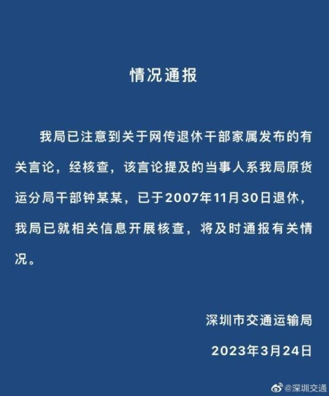

# 退休官员回应孙女称家里存款9位数：说法不实 自己“老老实实干到退休”

近日，女子晒长辈合照炫富贪腐言论引争议，网友“北极鲶鱼”因发布“家里有9位数”、家人“感觉贪了”等言论引发舆论关注，该网友晒出家中长辈多年前与领导的合影，被质疑炫富、家中涉贪腐等问题。

3月24日，据中国新闻周刊报道，该网友爷爷钟先生回应中国新闻周刊，称家中有9位数的说法不实，他表示自己2007年退休，曾任深圳区级交通局局长，“老老实实就这样干到退休”，目前相关单位正介入调查。钟先生表示，网上部分言论为网友造谣，孙女因其争议言论正哭得一塌糊涂，“我也写了材料给领导，一定要调查清楚，怕影响我们单位声誉和孙女读书。”

【来源：中国新闻周刊】

**延伸阅读**

深圳市交通局：已注意到网传退休干部家属言论，展开调查

