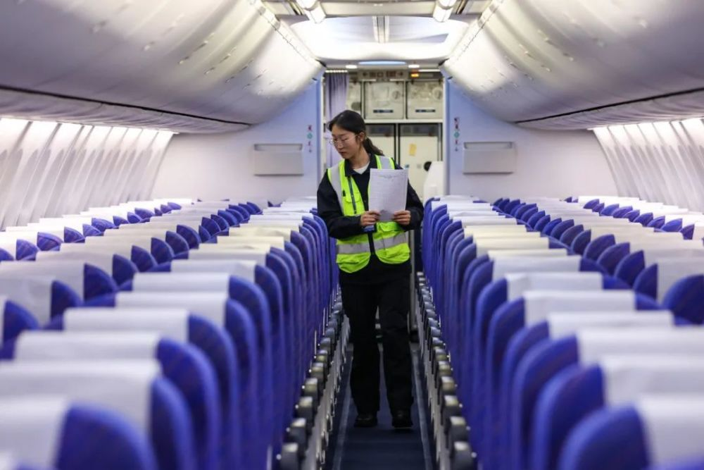

# “随心飞”又被抢，但薅羊毛更难了

过去三年欠下的旅行，是时候兑现了。

截至目前，国内已有三家航空公司发布了2023年“随心飞”产品。

3月24日上午10点，春秋航空“想飞就飞5.0版”开始发售，最低售价1999元。机票再现“打骨折”价，点燃了市场消费热情，春秋航空系统很快因“过于繁忙”而崩溃。

上一个被“挤爆”的还是南航服务器，就在三天前，南航2023版随心飞“畅游中国”上线，截至目前，该产品中的热门系列“成都天府版”、4日款（周一到周四兑换出行）已经显示售罄。早在今年2月，中联航率先推出了踏春“尊享飞”季卡。当时中联航曾在媒体上表示，此举是为了“进一步刺激航空出行需求”。

“现在是民航的传统淡季，随心飞产品能在一定程度上提升人流和现金流。”民航新型智库平台专家李瀚明告诉《中国新闻周刊》，随心飞能增加多高利润不好说，但至少能让航司少亏一点。

_疫情以来，民航业累计亏损预计近4000亿元。随着疫情结束，民航逐渐复苏。中新社记者
瞿宏伦 摄_

**“薅羊毛”没那么容易**

所谓“随心飞”，其实是在一定限制条件下“低价”飞行。

这场大规模机票促销始于2020年的“618年中大促”。当天，东方航空首创的“周末随心飞”产品发布，售价3322元，可在当年12月31日前的任意周末，不限次数乘坐东航航班，畅飞国内除港澳台地区外的各航点。

上线不到半个月，东航“随心飞”卖出了超过10万套。二手交易平台上，甚至出现黄牛高价倒卖的情况。

随后，包括华夏航空、海南航空、春秋航空在内多的多家航空公司纷纷跟进，推出了类似的低价预售的优惠套票。

各家“随心飞”产品定价稳定在3000元左右，但在时间、航线、使用规则上略有差异。例如东航1.0版“随心飞”只能在周末兑换，需提前5天预定、未使用航段不多于3段，no
show（临时不登机）不多于3次等。同期春秋航空的产品不限制兑换时间，但要求提前7天订票。山航要求未使用航段不多于4段、no show 不超过4次。

就在各家航司在规则上大做文章时，飞猪推出了“任性飞”产品，售价仅66元，可兑换一个月内包含港澳台在内的成人单程国内机票，票面价在500元以上时，需补差价。2020年7月15日早10点第一次发售，上线秒空。据飞猪后台统计，当时有近200万人同时涌入。

2020年最后一天，首批“随心飞”兑换使用结束，很多人在微博分享了自己的飞行经历。有人“飞行39次、打卡城市26个、省下机票钱41090元”，也有人直飞一次就“赚回本”了。

“虽然票价优惠，但不一定能兑换到想坐的航班。”有消费者吐槽，“随心飞”实际体验不佳，出行计划常被打乱。而“随心飞”航班延误或取消后基本享受不到常规服务，无法签转到其他航空公司航班，也很难改签到同一家航空公司的相近航班，没有延误取消补偿，更没有酒店住宿补偿。

央视财经曾报道，“随心飞”兑换机票数量不透明的情况在多家航空公司普遍存在；一旦航班取消或延误，也算作消费者no
show，甚至被直接取消“随心飞”资格；售后服务也常被诟病，人工客服难拨通，用户投诉无门。

2021年、2022年，不少航空公司继续推出升级版“随心飞”套餐，但消费端的热度明显下降。

“随心飞”实际上是一种“设计巧妙”的预售套票。民航专家林智杰曾撰文，“随心飞”的底层逻辑是“充分利用边际成本极低的空余座位，激发出旅客潜在的出行需求，实现旅客便宜多飞、航班填满空座、地方刺激消费的三方共赢。”而支撑这套逻辑的基础是，“航班每位旅客的边际成本只要100元。”

不管承载多少旅客，只要航班起飞，如起降、航路、维修、油耗、机组等固定飞行成本就会产生，而旅客直接相关的成本，如机场服务费、销售代理费等，均摊到每个人身上，边际成本并不高。

但是，仅靠“随心飞”的收入，航司显然无法实现盈利。林智杰曾解释，“随心飞”的低成本需要足够多的常旅客共担才能实现的，而“随心飞”的大量预定又造成“座位挤占”，让习惯临近购票的商务旅客买不到机票。为此，各家航司随后更新了相关产品设计，如每个航班只承诺保障20个座位，或航空公司每天只承诺保障20000个座位，但这又影响了产品使用感受。

与前两年相比，2023年“随心飞”产品的条件继续升级，旅客“薅羊毛”变得更难了。

例如南航今年发布的随心飞“畅游中国”，兑换日期为3月29日至6月27日，和2020年发售的产品相比，时间缩短了一半。此外，旅客每次兑换机票除了自行支付燃油机建费等税费，还要额外支付票面价20元，这在各航司“随心飞”产品中都未出现过。

高峰时段出行，部分热门航线的兑换难度或将提升。南航新版产品规则中表示，可兑换航班及可兑换座位数以实际查询结果为准，数量有限、兑完即止。

**三年亏损4000亿，民航“回血”还要多久？**

刚刚过去的2022年，全民航业的亏损额超过了过去两年的总和，达到2160亿元。2023年全国民航工作会议披露，疫情以来，民航累计亏损预计近4000亿元。“相当于把民航在疫情前十年的积蓄亏完了。”一位民航从业者告诉《中国新闻周刊》。

作为典型的重资产、高负债、长回报周期的行业，稳定的现金流对民航至关重要。疫情爆发后，航班大面积取消时有发生，亏损在所难免。

事实上，2021年底已有多家航司公告资不抵债。山东航空因资不抵债戴上ST的帽子，海航旗下的乌鲁木齐航空在2021年底的负债率达到了137.5%，东航旗下的上海航空、南航旗下的重庆航空、福州航空的负债率也一度超过100%。

“三年的新冠疫情对民航发展造成前所未有的冲击。”民航局局长宋志勇公开透露，去年有8家航空公司资不抵债，而对于已经到来的2023年，民航局则定下了力争实现盈亏平衡的目标。

今年1月，国内航司盈利31.6亿元。客运全面复苏脚步加快，航班管家数据显示，2月全民航旅客运输量约为4272万人次，同比2022年上升36.5%，民航国内运力也在2月达到了2019年同期水平。不过，另据统计局数据，2月机票价格环比又下降了12.0%，说明出行需求再次回落。

“今年前两个月的民航运力和客流双提升，是由积压了三年的春运需求所推动的。”李瀚明说，目前市场总体供大于求，叠加传统淡季，如何刺激需求成为航司的当务之急。

疫情期间推出的创新产品“随心飞”再次成为香饽饽。据财经媒体统计，2020年国内共有数十家航空公司推出“随心飞”产品，销售总量达60万-80万份，合计销售额超过20亿元。

“随心飞在民航营销史上是里程碑式的创新。”林智杰撰文表示，“随心飞”产品的推出，把民航营销重点从单一航班、单次出行拓展到半年，将“价格从舱位中解放出来”，并把营销对象“由高端旅客拓展到低频旅客、潜在旅客”。

然而，“以价换量”的随心飞并不那么赚钱。“随心飞”产品出行航段占行业整体比重不高，据去哪儿大数据研究院统计，2020年，全行业随心飞类产品共出行350余万航段，仅占2020年全部出行量的0.9%左右。

“对航空公司来说，用户飞得越多，公司亏得越多。一些OTA平台的超低价机票，不排除赔本赚吆喝的可能，通过低价机票引流，在酒店住宿上赚钱。”上诉民航从业者说。

相对于开发新增旅客群体，随心飞更大的意义在于提升原有老客户的出行频率。去哪儿网数据显示，2020年，购买随心飞类产品并有成功出行记录的旅客人数共43万人，仅占全部旅客数量的0.3%。在这些旅客当中，新增旅客约7万人，占全部随心飞旅客的六分之一，低于行业新增旅客占比。

随着疫情结束，民航业逐渐复苏，应对低上座率、低客流量的特殊产品曾被认为将“淡出市场”。今年二月起，接连几个新版“随心飞”产品问世，打破了这一预判。

资深民航从业者周博撰文评价，“南航‘畅游中国’对于当下的民航业而言，说小了是在航班淡季补充客源收益的小产品，说大了也许是后疫情时期机票产品化的又一次尝试。”

事实上，海外也一直存在与“随心飞”类似的优惠套票产品。2008年，星空联盟推出环球优惠套票，鼓励用户自主定制行程，并以较优惠价打包购买全程分段机票。随后，另外两大航空联盟天合联盟和寰宇一家也相继推出了环球套票产品。

“现在国际航线还没有完全恢复，业内普遍相信，到今年暑期，民航有望恢复到2019年同期水平。”李瀚明说。

作者：李明子

