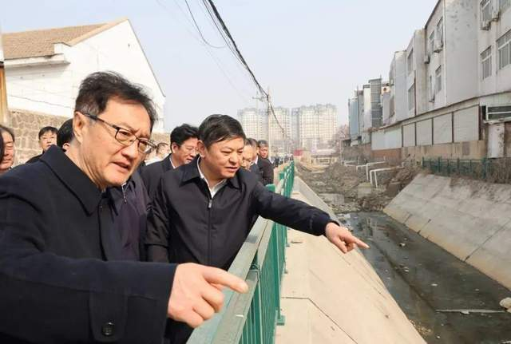
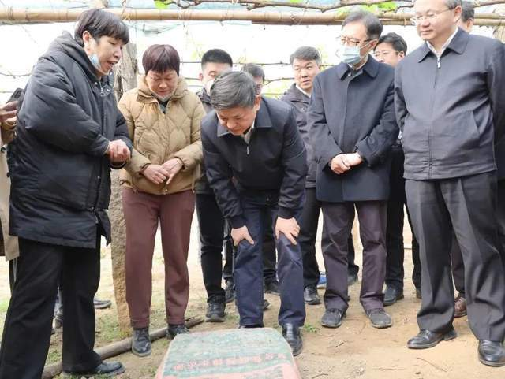
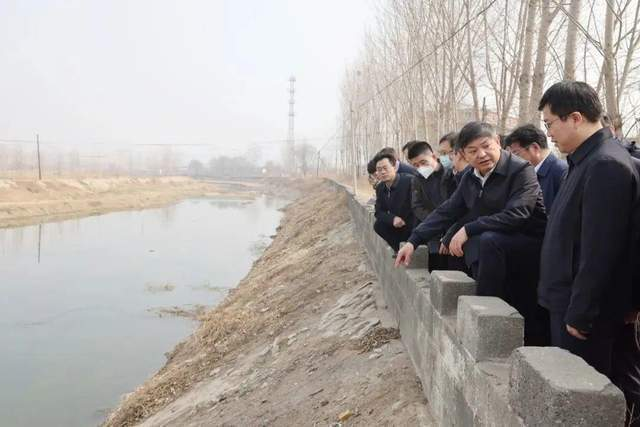
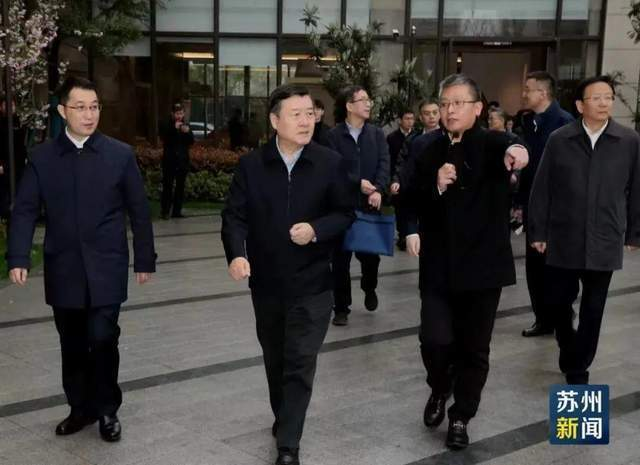
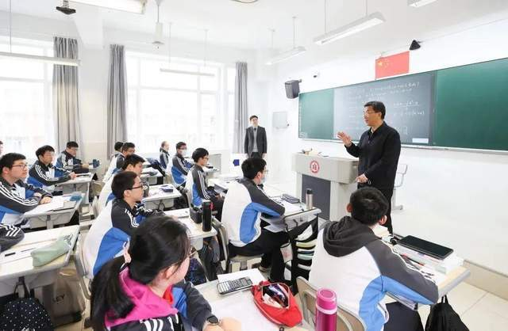
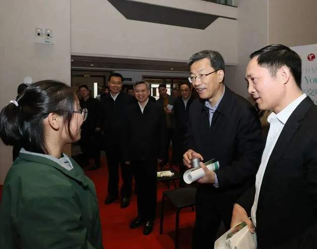

# 不打招呼，部长直奔现场调研，发现了问题……

走下河道、进入小区、走进课堂。

近日，生态环境部部长黄润秋赴天津市滨海新区、河北省秦皇岛市调研，住建部部长倪虹到苏州调研，教育部部长怀进鹏赴上海、浙江调研……多位部长出京前往各地实地调研，在关注哪些话题？

_生态环境部部长黄润秋在调研中。来源：中国环境报_

不打招呼、直奔现场

部长走下河道，察看污水收集设施

近年来，河北省推动近岸海域生态环境质量持续改善，但2021年以来，部分河流入海断面总氮浓度出现明显反弹。

3月21日，黄润秋一行前往秦皇岛市，不打招呼、直奔现场，以饮马河流域为样本调研入海河流总氮治理与管控情况。

黄润秋来到昌黎县城关东沙河和五里营村，调研河道周边生活污水收集和农业种植面源污染防治情况。他走下河道，察看污水收集设施，并深入大棚与种植户交流，详细询问种植规模、化肥使用种类和数量等。

_生态环境部部长黄润秋在调研中。来源：中国环境报_

黄润秋还来到卢龙县杨柳河村、王深港村，现场察看河道两岸垃圾清理情况，并到沿河居民家中察看生活污水和厕所粪污收集设施建设使用情况，深入规模以下养殖户，详细询问养殖规模、畜禽粪污收集处理情况，并现场察看排污管道和收集池。

在王深港拦河闸，黄润秋询问上下游水质指标数据，并通过无人机察看上游畜禽养殖分布情况。

调研发现，城关东沙河存在河道两侧生活污水收集不彻底、沿河餐馆污水直排入河、生活垃圾随意堆放等问题，五里营村存在葡萄种植大棚与河道之间缺乏缓冲带、局部岸段种植大棚侵占河道、农业废弃物堆积河道两侧等问题。

_生态环境部部长黄润秋在调研中。来源：中国环境报_

对此，黄润秋强调，要加快建设、有效使用污水收集设施，加强沿河商户监管，避免污水向河道直排漏排。针对农村生活污水收集率不高、垃圾清理不到位等问题，该补齐的基础设施要补齐到位，该清理的垃圾要清理到位，同时要动员群众广泛参与，引导村民养成良好生活习惯。

值得注意的是，一个月前，黄润秋就曾赴河南省平顶山市、许昌市，带领监督帮扶组先后对7家企业开展突击检查。

_住建部部长倪虹在调研中。来源：苏州日报_

青年人住房、高等教育综合改革

部长调研提及这些关键词

据苏州日报报道，3月22-3月23日，住建部部长倪虹率队来苏州调研。

在吴中区品汇左岸商务广场公寓项目、姑苏区32号街坊更新改造项目等小区，倪虹分别了解苏州市保障性租赁住房建设运营、历史文化街区保护、老旧小区改造等情况。

“在解决新市民、青年人住房问题方面采取了哪些举措”“企业在保障性租赁住房建设运营中还存在什么困难”“小区加装电梯有什么难点堵点”，每到一处，倪虹都与新市民、青年人和居民代表，相关建设单位、租赁运维企业和属地街道社区负责同志等互动交流，认真听取大家的意见和建议。

倪虹强调，要增加保障性租赁住房供给和长租房建设，重点解决好新市民、青年人的住房困难问题。要持续推进老旧小区改造，消除安全隐患，有条件加装电梯，完善配套设施，提升物业服务。要做好城市历史街区、历史建筑的保护与传承。

_教育部部长怀进鹏在调研中。来源：微言教育微信公众号_

此外，据教育部官网消息，3月19日至21日、3月21日至22日，教育部部长怀进鹏先后赴上海市、浙江省调研教育工作。

调研期间，怀进鹏进入复旦大学、上海大学、浙江工业职业技术学院、浙江大学等多所学校实地考察。

在调研时，怀进鹏强调，要全力推进高等教育综合改革，深入分析经济发展、产业转型、科技自立自强等对教育提出的需求，强化产教融合科教融汇和校企协同育人，着力完善基础学科人才特别是理工科人才和卓越工程师培养模式。

此外他强调，要在教育高水平对外开放中有更大作为，探索灵活多样的国际教育交流形式，主动参与和主导更多的国际教育合作项目，为全球教育发展贡献中国智慧。

_教育部部长怀进鹏在调研中。来源：微言教育微信公众号_

近期，还有多个部委的副部长出京实地开展调研。

例如，3月18日，交通运输部党组成员、副部长戴东昌一行到雄安新区考察调研。3月20日，水利部副部长朱程清来到山东滨州打渔张灌区调研春灌引水工作。3月21日，教育部党组成员、副部长翁铁慧一行到中国地质大学(武汉)调研毕业生就业工作。

来源：中国新闻网

