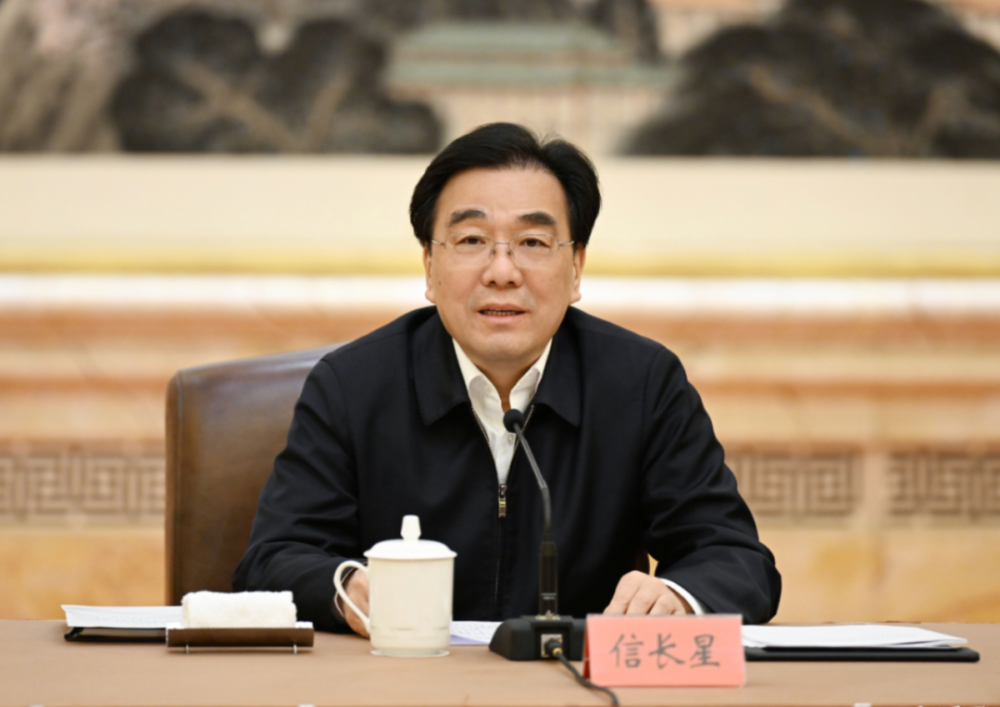
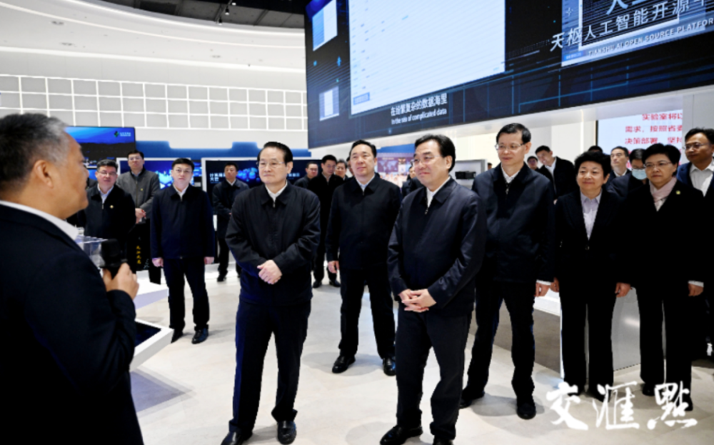
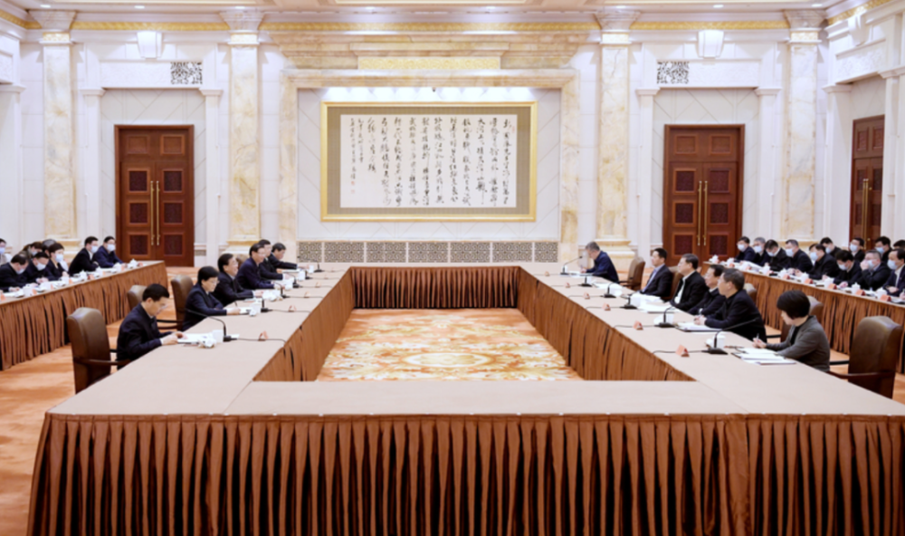
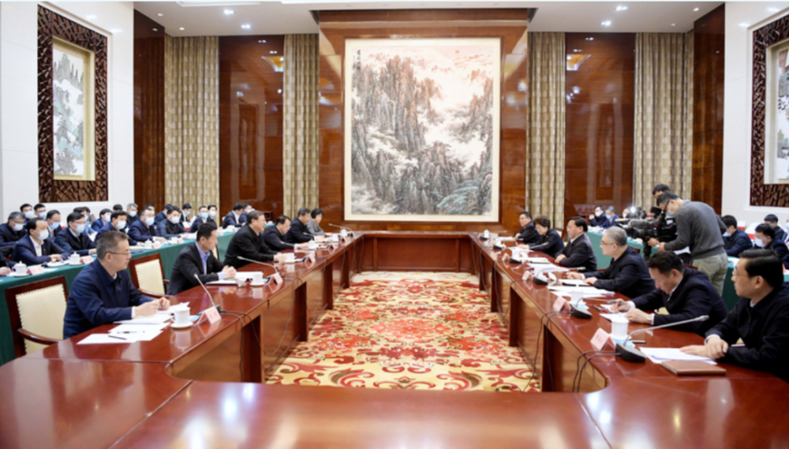
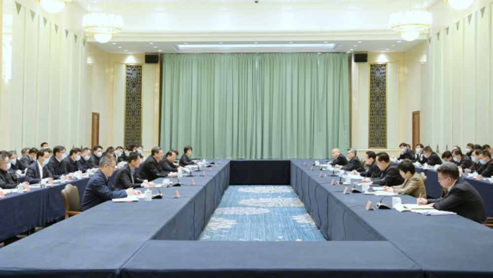
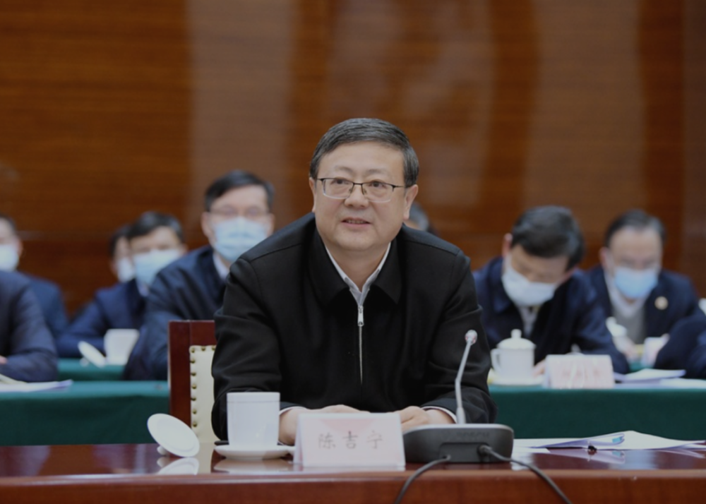

# 事关高层大布局！一周内，几位省级党政“一把手”密集“互访”

**撰文 | 高语阳**

在结束赴上海、浙江、安徽学习考察活动后，3月24日，江苏省党政代表团召开总结交流会。江苏省委书记信长星、省长许昆林出席并讲话。

3月20日至23日，信长星、许昆林带队的江苏省党政代表团外出学习考察。

政知君注意到，此前，3月16日至18日，上海市委书记陈吉宁、市长龚正率领上海市党政代表团先后赴江苏省、安徽省、浙江省学习考察。

这次短时间内密集“互访”的关键词是“推动长三角更高质量一体化发展”。《人民日报》曾撰文称，长三角一体化发展是习近平总书记亲自谋划、亲自部署、亲自推动的重大国家战略。

有“不看不知道“的震撼

在3月24日江苏省党政代表团总结交流会上，代表团部分成员作交流发言。

江苏省委书记信长星在听取发言后表示，学习先进、借鉴先进是一种应有的精神状态，有助于我们提高站位、拓展视野。同时，江苏只有走出家门学习先进，才能明位势而清醒、知不足而奋进。

“当前，沪浙皖发展日新月异，态势十分强劲，大家带着学习的态度和比较的视角，都有‘不看不知道’的震撼、‘还可以这样’的启发。”

信长星说，学习就要虚心学“真经”、求“真学问”，认真学习借鉴沪浙皖的好经验好做法，不断拓展完善推动江苏高质量发展的思路举措。

同时，学习的目的在于学以致用，各地各部门要以沪浙皖发展实践和宝贵经验为生动案例，大兴调查研究，坚持问题导向，既要借鉴实践做法更要学习理念精神，既要认真学人之优也要切实扬己之长，既要扎实补短补弱也要努力变弱为强，不断开创江苏发展新局面。

政知君注意到，3月20日至23日，信长星、许昆林带队的江苏省党政代表团赴上海市、浙江省、安徽省学习考察。

此行旨在“积极主动加强对接，共商合作发展大计，在新起点上携手推动长三角更高质量一体化发展”。

上海市、浙江省、安徽省3省市省级党政“一把手”与江苏代表团交流。

学习考察期间，江苏省党政代表团在3省市的行程为：

在上海市考察了大数据中心、徐汇滨江、鲲鹏生态创新中心、新虹桥国际医学中心；

在浙江杭州考察了西湖大学、之江实验室、申昊科技公司、紫光恒越公司、缤纷未来社区；

在安徽合肥考察了安徽创新馆、中科院合肥物质科学研究院、科大讯飞公司。

上海发挥龙头带动作用

政知君注意到，一段时间以来，上海、浙江、安徽、江苏互相“串门”、密集互访。

3月16日至18日，上海市委书记陈吉宁、市长龚正率领上海市党政代表团先后赴江苏省、安徽省、浙江省学习考察。

江苏省、安徽省、浙江省3省份省委书记、省长分别出席两地座谈会。

_上海市党政代表团在江苏出席座谈会_

_上海市党政代表团在安徽出席座谈会_

_上海市党政代表团在浙江出席座谈会_

此行考察的目的是什么？

陈吉宁在考察过程中说，此次来苏皖浙三地学习考察，就是要认真学习借鉴长三角兄弟省市的好经验好做法，深化合作对接、提升合作能级，共同谋划做好长三角更高质量一体化发展这篇大文章。

上海则要更好发挥龙头带动优势、改革开放优势、人才科技优势，与苏皖浙携手努力、优势互补。

两地座谈会上，上海市市长龚正、江苏省省长许昆林、安徽省省长王清宪、浙江省省长王浩分别介绍了沪苏皖浙经济社会发展情况。

学习考察期间，上海市党政代表团行程如下：

在江苏苏州和南京考察了长三角生态绿色一体化发展示范区鼋荡慢行桥、“曲水善湾”、联合河长制公园、吴江太湖新城和网络通信与安全紫金山实验室、南瑞继保电气有限公司等；

在安徽六安和合肥考察了九仙尊霍山石斛股份有限公司、安徽创新馆、中科院合肥物质科学研究院、科大讯飞股份有限公司；

在浙江杭州和嘉兴考察了新华三集团、浙江省市场监督管理局、一体化示范区嘉善片区、祥符荡科创绿谷研发总部、丁栅沉香共同富裕聚落等。

重大国家战略

互访的关键词是“推动长三角更高质量一体化发展”。

人民日报曾撰文称，长三角一体化发展是习近平总书记亲自谋划、亲自部署、亲自推动的重大国家战略。

2018年11月，习近平总书记在首届中国国际进口博览会上宣布，支持长江三角洲区域一体化发展并上升为国家战略。

2019年12月，中共中央、国务院印发了《长江三角洲区域一体化发展规划纲要》。规划范围包括上海市、江苏省、浙江省、安徽省全域（面积35.8万平方公里）。

《规划纲要》指出，要进一步发挥上海龙头带动作用，苏浙皖各扬所长。到2025年，长三角一体化发展取得实质性进展；到2035年，长三角一体化发展达到较高水平。

此外，要成立推动长三角一体化发展领导小组，领导小组办公室设在国家发展改革委，承担领导小组日常工作。

公开报道显示，首任推动长三角一体化发展领导小组组长是时任中央政治局常委、国务院副总理韩正。

2020年8月，习近平在扎实推进长三角一体化发展座谈会上强调，要深刻认识长三角区域在国家经济社会发展中的地位和作用，坚持目标导向、问题导向相统一，紧扣一体化和高质量两个关键词抓好重点工作，真抓实干、埋头苦干，推动长三角一体化发展不断取得成效。

2021年6月，《长三角一体化发展规划“十四五”实施方案》正式印发实施，部署了构建新发展格局、区域联动发展等9个方面的重点任务，并按照清单制、项目化工作推进要求，列出了3张清单，明确了“十四五”时期长三角一体化发展的任务书、时间表和路线图。

今年，在推动中国经济企稳回升的大背景下，长三角区域三省一市密集互访，共商合作发展大计，共同推动长三角更高质量一体化发展。

**资料｜中国政府网 新华日报 解放日报等**

**【版权声明】本文著作权归北京青年报独家所有，未经授权，不得转载。**

