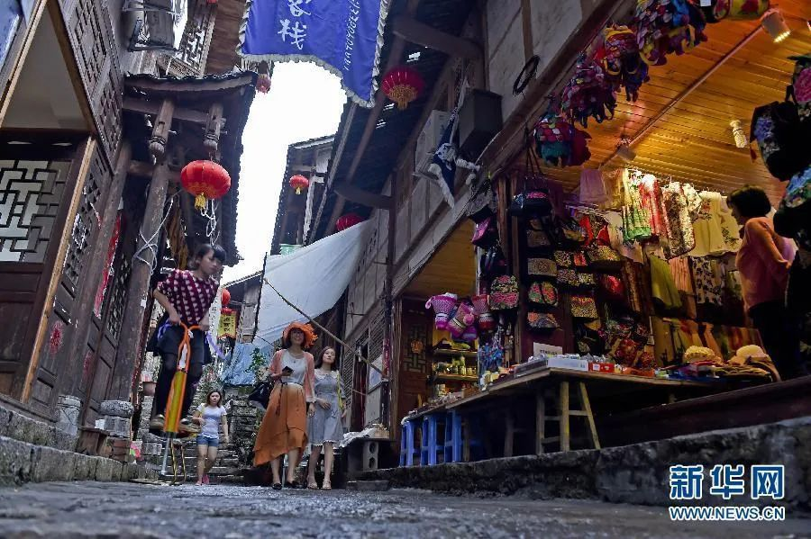
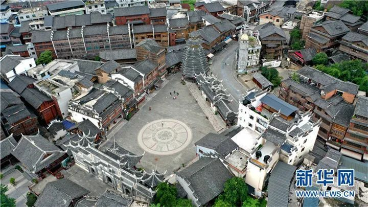

# 全国各地古镇相似度高达99%？连“特色小吃”都一模一样

文|张同

统一的小桥流水、青砖白墙绿瓦、红灯笼；无论哪个古镇都有卖丝绸的、卖钥匙扣的、卖手工首饰的；甚至连“特色小吃”都变得千篇一律，臭豆腐、烤肠、甑糕……不知何时起，古镇渐渐“长得”越来越像，古镇里的商铺和特色小吃也越来越像，相似性渐渐地取代了每个古镇的独特性，全国各地古镇的“查重率”甚至高达99%。

有网友调侃称：“古镇的商业化太严重了，基本上只要是条路，两边都是商铺，本地人不多，大多都是外来做生意的，就跟披着古镇外衣的小商品城一样。”与过度商业化的古镇对应的，则是“千篇一律”的古镇景观，甚至原住民在一些古镇里都是真空般地存在。

说到底，游客去古镇旅游，本质上和去迪士尼度假区旅游没什么区别，都是在追求一种“沉浸式体验”，只不过体验的内容不同罢了。去迪士尼度假区，“沉浸式体验”的是童话世界，而去古镇，“沉浸式体验”的则是当地历史人文特色，也就是古镇的“古”
**。** 只不过这个特色，除了看得见摸得着的“特色建筑”之外，还有看不见摸不着的“文化”。

而一些过度商业化的古镇，让地方特色正在“褪色”。古镇本应该是长期历史积淀形成的、具有地方民俗特色的建筑，但是现在作为旅游项目的古镇，鲜有旧时痕迹，而是根据现代化旅游和商业需求重新建的度假村，商业化气息重。

游客在古镇里，想看到原住民的生活状态，想感受的是古镇市井的鲜活，想尝试的是在地理环境和民俗影响下的特色小吃，以及体会漫长的历史是如何塑造当地文化的。可以说，古建筑、文化氛围、自然景观、本地美食……都是古镇旅游的精髓。但如果古镇的文化的展示只是为了获得更高的经济效益，并非是为了文化的保护和传承本身，文化也就成了旅游过程的符号，也难怪古镇旅游在渐渐失去魅力。

值得注意的是，随着中国旅游业发展得越来越成熟，以及人们生活水平的提高，此时人们的旅游追求，早已上升到了追求精神文化层面的享受。原先旅游产品少、需求大，现如今，信息获取更便利，游客的眼界也更为开阔，不会轻易买账，“披着古镇外衣的小商品城”，早已不满足游客的旅游需求。

要想改变这一现象，就需要开发者密切关注游客的需求，开发独特的旅游产品、提供个性化的旅游服务，将当地特色文化融入现代化的消费理念中。开发者不能仅仅满足于造造建筑，需要在对当地历史文化进行完整、详细梳理的基础上，充分理解地方特色，才能做好古镇开发，同时也要在商业化和地方文化保护中做好平衡。

文字：张同

图片：新华网

朗诵：王茜

责编：王远方

编辑：孙岱 邢妍妍

