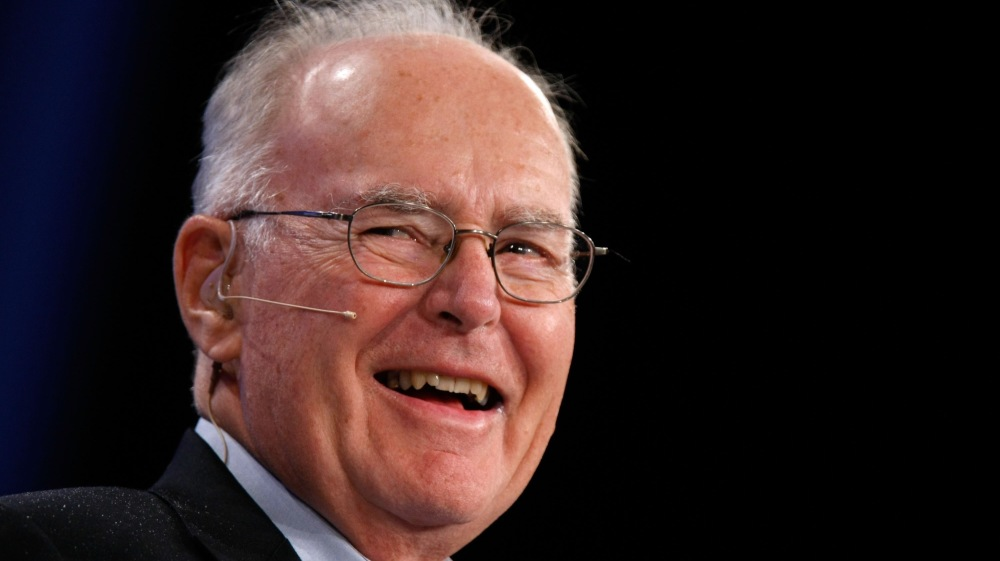

# 半导体产业传奇人物摩尔去世了，摩尔定律还活着吗？

出品｜虎嗅商业消费组

作者｜苗正卿

题图｜视觉中国

3月24日晚，半导体产业传奇人物、英特尔联合创始人戈登·摩尔在位于夏威夷的家中去世，享年94岁。在英特尔公司和贝蒂·摩尔基金会的声明中，94岁的戈登·摩尔“离开时”很平静。

戈登·摩尔是颇为典型的“知行合一”式企业家：在商业世界，他于1968年和罗伯特·诺伊斯共同创立了英特尔，并成为半导体世界的“超级巨人”；在理论界，戈登·摩尔的摩尔定律几乎成为半导体产业的“底层代码”，对产业走向有关键影响。

对今天正处于创投热的芯片世界而言，戈登·摩尔还有另一重身份：他是这个世界上因为半导体获得巨额财富的标志性人物之一。在2022年胡润研究院公布的全球富豪榜中，戈登·摩尔在所有半导体行业企业家中以630亿元人家名列第四。值得一提的是，在半导体富豪中，财富额排在第一名的是NVIDIA创始人兼CEO黄仁勋。

戈登·摩尔在“如何花钱”方面，也给今天和未来的半导体新贵们做出表率：戈登·摩尔和夫人贝蒂·摩尔于2000年创立了“戈登与贝蒂·摩尔基金会”，基于基金会他们完成了涉及23亿美元的终身捐赠，并对贫困地区广泛投资。在2022年《福布斯》的统计中，戈登·摩尔和他的夫人在“全球累计捐赠总额”排行中已经名列第十。

这可能是科技真正美好的一面：不仅便捷人类的生活，也能创造财富，还可以德行赋予财富更高的意义。

早年的戈登·摩尔其实走的是“穷小子逆袭”剧本。

1929年戈登·摩尔生于美国加州旧金山佩斯卡迪诺。在佩斯卡迪诺，摩尔家族是典型的穷人，在20世纪初，这个家族没有足够的钱送孩子去大学或打入当地上层社会。戈登·摩尔的父亲是摩尔家族转变的关键人物，他17岁就失学，为了照顾家人他不断打工赚钱。凭借勇气和人品，戈登的父亲在当地形成了好口碑，并成为了警察。也是凭借人品魅力，戈登的父亲结识了一位“美漂”女孩：在当时的旧金山，有很多从欧洲迁往美国的“美漂一代”，戈登·摩尔的母亲就是这样的人，她出生于意大利佛罗伦萨，只有中学学历。戈登·摩尔就是出生在这样的家庭里，他没有高管母亲，也没有设备齐全的车库。

影响这位半导体传奇人物的关键节点发生在其11岁。在一起去邻居家做客时，戈登·摩尔看到了一套化学实验设备，他颇为惊奇，并自此对科学产生强烈兴趣。他经常动手做实验、搞发明，并梦想成为化学大师。

戈登·摩尔的科学梦持续到了高中，随着其父在警界职位攀升，戈登·摩尔在雷德伍德城（又称红木城）完成了高中，并考上了加州伯克利分校化学专业。在1954年戈登·摩尔拿下了物理化学博士学位，这是旧金山摩尔家族走出的第一个博士。值得一提的是，正是在大学中，戈登·摩尔和日后的妻子贝蒂相识并相爱。在美国科技圈里，这对夫妻是极为罕见的从大学牵手直到人生终点的深情伉俪。

博士毕业后，戈登·摩尔选择了科研。他成为普林斯顿大学应用物理实验室的研究员。他有一份相当体面的收入：当时他论文的稿费是每个单词5美元。直到1970年，一个收入中上游的美国工人标准年薪也只是5.5万美元，戈登·摩尔一篇长论文已经可以让一个工人家庭过上几个月好日子。

但戈登·摩尔迷茫了。他觉得自己当时的研究方向“火焰分光光度分析”对社会的实际价值比较有限。

转机发生在1956年。当时，晶体管发明者、诺贝尔奖获得者威廉·肖克利创立了肖克利半导体公司，并邀请戈登·摩尔加盟。这次跳槽对戈登和半导体世界都意义重大。

这是一个“人挪活”的故事。在肖克利公司里，戈登认识了8个朋友：他们对公司暮气沉沉的规章制度不满，对肖克利科学家的“学术思维”意见很大。平时，这八个人经常聚会，讨论一些公司不想尝试的方案、思路。公司里其他人称呼这八个“狐朋狗友”为“叛逆的八人”。而在这八个人里，就有后来戈登·摩尔一生的伙伴诺伊斯。

诺伊斯是这八个人的带头大哥。他带头辞职，并带领八个兄弟创业。他们拜访了36个潜在投资者，在被拒绝35次后拿到了3600美元。而此时诺伊斯带领八人建立的公司就是日后闻名遐迩的仙童半导体。

1965年，身为仙童半导体研究开发实验室主任的戈登·摩尔应《电子学》杂志邀请，写一篇名为“让集成电路充满更多元件”的稿件，并预测未来十年产业发展。在这篇稿件中，戈登·摩尔对元件复杂性和时间的线性关系进行了推断，并表示：“最低元件价格的理杂性每年大约增加一倍，这一增长率在未来十年内几乎维持一个常数。集成电路上的元件密度大约每年翻一倍。”

这个描述被总结为“摩尔定律”：它揭示了集成电路性能、价格与时间的关系，对半导体产业的研发投产、发展规划形成巨大影响。

在摩尔定律提出后的三年，1968年诺伊斯和戈登·摩尔再次“跳槽”。为了摆脱复杂的仙童董事会和分公司、母公司之间的“宫斗”，诺伊斯带领戈登·摩尔创立了新的半导体公司，这正是日后闻名遐迩的英特尔。

在这次创业中，诺伊斯和戈登·摩尔准确地把握了“存储器芯片”“动态随机存储器”这两个机会，他们接连推出3010、1101两款存储器芯片，以及1103这款现象级动态随机存储器。这是一场颠覆式创新，在存储器市场上，当时主流产品是旧技术框架下的磁芯存储器，英特尔的动态随机存储器不仅拥有1KB的空间，更有远低于磁芯存储器的价格，于是英特尔的产品迅速抢占市场。

值得注意的是，戈登·摩尔的定律，正是他们在实战过程中的“真知”：当时在英特尔的研产模式中，它们基于摩尔定律的规模安排研产周期，并巧妙地把利润投入到最具性价比的产出之中。这成为英特尔最终成为产业龙头的核心逻辑。

随着技术进步，戈登·摩尔也在不断总结新的规律。距离摩尔定律提出十年后的1975年，戈登·摩尔对这一描述进行了修改。他在提交给国际电信联盟IEEE学术年会的论文中指出：“集成电路上的元件密度每年增长一倍，一描述的增长率应该修正为每两年（或24个月）增长一倍。”值得注意的是，从上世纪70年代开始，就有人把摩尔定律中的“时间”描述为18个月。在1997年，戈登·摩尔在与《科学美国人》沟通时特地辟谣，表示自己从未提过“18个月”这一说法。

1975年的这次修正，与戈登·摩尔身份变化也有关系：1974年戈登·摩尔正式成为英特尔总裁、CEO。站得更高，看的更准，戈登·摩尔更系统地梳理了公司研产计划，并将“规律”描述的时间进一步精准化。

一路颇为顺利的戈登·摩尔也打过败仗。

1981年英特尔公司的8087芯片与日本松下的3200芯片在市场上正面开战，谁料日本一更低价格迅速渗透市场。面对日本松下的价格大战，在一年的时间里英特尔8087的市场价从28美元暴跌至6美元。

但祸兮福所倚。这场惨败成为了英特尔转型的节点。正是从这一年开始，戈登·摩尔把微处理器（CPU）视作公司未来，开始大举投入。甚至在当时媒体描述中，英特尔被视作“豪赌”。回过头来看，戈登·摩尔给这家半导体巨头打下了“称霸基础”：正是由于20世纪80年代英特尔在CPU领域的投入，伴随个人电脑市场爆炸式的发展，英特尔成为绝对龙头。进入20世纪90年代后，英特尔和微软以“同盟”姿态迅速鲸吞市场，成为当时的财富神话。

不过戈登·摩尔此时已经“深藏功与名”，1989年戈登·摩尔从英特尔董事会主席位置上退休。此时距离他“放弃化学梦，投身半导体”已经过去了整整33年。

对今年风头正盛的芯片世界弄潮儿们来说，戈登·摩尔不只是一位偶像。终其一生，戈登·摩尔保持了科学家精神，虽然身居公司高位却一直没有放弃学术研究。他又是一个极具代表的管理者，在他掌舵英特尔之际，他力排众议砍掉了公司主产品，豪赌趋势型产品，他的眼光和判断力远超一般的企业经营者。

以及，他也是一个颇具幽默感的人。

在2008年的一次交流时，戈登·摩尔被问：“您的什么成就可以成为传承？”。

他略加思索后表示：“只要不是摩尔定律，其他都可以。”

对于摩尔定律的有效性，戈登·摩尔本人看得很开。他甚至公开表示，“没有摩尔定律，产业仍会像快速发展”、“继续向下推进新的制程节点正变得越来越困难，我不知道摩尔定律还能持续多久。”

在2016年比利时的全球科技论坛上，已经87岁的戈登·摩尔特意从夏威夷的家中飞到比利时参会。在这次会上，他对于自己的预测能力也做了总结：“你看看我过去的预测，就知道我的预测向来不靠谱。我错过了PC，错过了互联网，还有很多事情我都无法预测。预测未来的创新是个无比艰巨的任务，我会留给别人。不过，我希望看到一个更智能的社会。”

