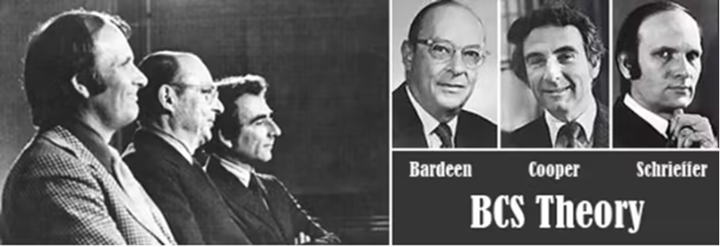
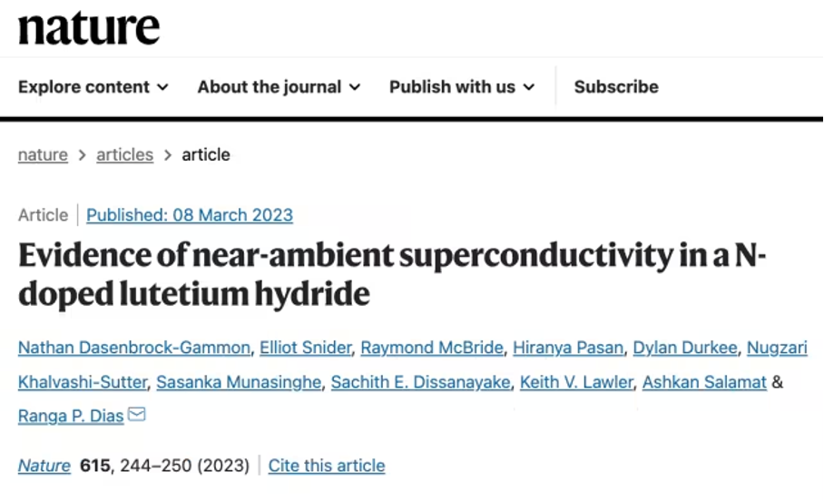

# 南京大学闻海虎回应证伪“室温超导”：超导不能通过数据处理模糊结果

核心要点

  * _1_ Ranga Dias团队的文章在认定超导时，在数据处理过程中有些不规范操作，尤其是在确认超导方面，这样做是不合适的，也不能被接受。
  * _2_ 实现室温超导相当于让电子系统的微观量子相干现象走进现实世界，十分重要。
  * _3_ 超导在电力、能源、国防、医疗及大科学装置等领域均有应用，实现室温超导可以大大降低能源损耗和运营成本，未来前景广阔。

北京时间3月8日，罗彻斯特大学的Ranga Dias教授在美国物理学会三月会议上宣布，在近环境压强下实现了室温超导。

一星期后，南京大学超导物理和材料研究中心主任闻海虎教授团队提交一篇新论文，直接推翻了Dias的研究结论。

全球热议的“室温超导”新突破或已被光速证伪，我们距离室温超导究竟还有多远？

**特约主持：**

子乾 中科院高能物理所博士

对话嘉宾：

闻海虎 南京大学物理学院教授，南京大学超导物理和材料研究中心主任

季燕江 前北京科技大学物理系教师

一、室温超导新发现引发巨大反响

子乾：为什么Ranga Dias所发布的论文会引发如此轰动？

**闻海虎：**
1911年发现超导体以来，超导已有112年学科发展历史，它是描述众多电子发生宏观量子相干性的重要现象。电阻在有限温度下瞬间变成0，为超导体带来很多电磁方面的奇妙特性，因此即使发现已过百年，仍有蓬勃的学科生命力，每次重要进展都能吸引很多关注，室温超导就是研究焦点之一。

超导态没有电阻，其他方面性能也很奇异，但实现超导需要降到一定的温度，有时候还需要加一定的压强。若能实现常压或低压下的室温超导，将推动科学技术的重大发展，相关材料使用成本将大大降低，极大方便我们的生活。Dias教授称在1GPa压强下实现了零上21℃（294K）的室温超导，这无疑是科学界的爆炸新闻。

**季燕江：** 上世纪80年代末，高温超导铜氧化物刚刚问世的时候也有过类似的盛况，甚至更厉害。最早，金属超导转变温度（编者注：某些物质在温度低于某一值
Tc
时电阻率突然变为0，这一温度叫超导体的转变温度）很低，并且一直没有显著地提升，此外根据超导的BCS理论（编者注：BCS理论即解释常规超导体的超导电性的微观理论，该理论以其发明者约翰·巴丁、利昂·库珀和约翰·施里弗的名字首字母命名），Tc不会超过40K（编者注：K，热力学温度，40K=-233.15°C）。高温超导铜氧化物的出现，打破了这一限制，Tc从低于40K发展到超过液氮温区，这让学界思考是否会有超越BCS机制的超导体存在。

_Bardeen、Cooper和Schrieffer（图源：网络）_

量子现象，比如隧道效应、量子纠缠等多存在于微观、低温的环境中。
**而近常压的室温超导，意味着我们能够在接近日常的条件下观察到一种量子现象，好比说“穿墙而过”这种本该仅出现于微观世界中的量子现象来到了我们的宏观日常世界，这是非常震撼的。**

子乾：论文被《Nature》接受意味着什么？论文从想法到被全球顶级杂志接受要经历哪些环节？

**闻海虎：**
研究者需要先有大致想法，接着设计实验，如果没有所需的材料和样品还需要合成材料后进行实验测量，发现超越现有知识或认识的新结果，需要更换样品后进行多次实验验证，确保实验可重复，之后写文章并投稿，杂志社都会请评审人审稿，有些直接拒稿，有些提出修改意见，让作者进行修改直至评审人满意后予以发表。

**通常情况下审稿发表还是很严格的，主要参考评审人意见，出版商也一定要遵循学术规范，不能在利益驱动下发表虚假或实验结果不可重复的文章。**

**季燕江：**
论文在杂志的发表大致涉及三方，即：作者、出版商和审稿人。科学出版在早期没有这么复杂，比如没有明确的审稿过程和审稿人制度，然后随着科学研究规模的扩大，在上世纪30年代逐渐演化为“不盲从于权威”的审稿制度。我也注意到在科学出版中有鼓励发表的趋势，即只要数据足够扎实、文章逻辑成立，具备一定创新性，总能找到适合出版的期刊，即科学出版机构还是倾向于把更多科学工作呈现给大家。

_Ranga
Dias团队在Nature发表论文（图源：Nature网站）_

子乾：如何评价Ranga Dias的科学工作？

**闻海虎：** Dias一直在做高温超导，主要工作有三件。

第一件是关于金属氢的工作，这件事情可以追溯到上个世纪60年代末的“金属氢”理论，预言在极高压下把氢压成金属的话，内部声子振动及电声耦合等相互作用可以很强，可能会导致室温超导。Dias及其合作者称压强到400万大气压左右时看到了金属氢态，测定光学性质后有少量峰达到标准，他们将该发现发表在《科学》杂志（Science）上。由于实验要求的压力太高，没有几个组能重复，Dias及其同事过了一段时间后声称金属态氢“消失了”，这项工作因此也就就不了了之了，因为重复起来也太困难。

第二件是他2020年发表的碳氢硫在高压下实现室温超导的进展，发表在《自然》杂志（Nature），但其他实验组一直没能重复这一实验，一些学者理论计算后也认为碳氢硫放在一起很难形成固态结构，因此Dias备受质疑，并因实验无法重复而被撤稿。

第三件工作就是最近的室温超导了。我们一般不会因为学术圈里流传的一些事情对他的最新发现有预设观点或态度，毕竟如果是真实的低压或常压的常温超导，那真的是很重要的发现。所以大家都很认真地对待这一发现，结果后来发现文章中还是有很多可疑之处。

**季燕江：**
据说Dias的博士论文里存在大段抄袭，这很难让人理解。他在哈佛期间做的金属氢的工作很难，加的压强基本上到了目前的极限，所以他说金刚石压爆、样品消失还是可以理解的，不过他讲样品的光学性质作为金属氢存在的证据还是挺主观的。卡尔·萨根说“非凡的断言，需要非凡的证据”，Dias给出的证据远远不能让人信服。

子乾：在看到Dias新发现的新闻和具体结果时，各位第一瞬间是什么感受？

**闻海虎：**
美国时间3月7日Dias在美国物理学会的春季会议上面做报告，迅即我们就看见了报告视频以及一些结果的图片，我第一眼看到Dias的结果时就非常震惊。在294K左右（室温附近）时电阻迅速下降到0，抗磁信号也很好，还给出了比热数据，我认为这个发现太重要了，立刻准备进行重复试验。

_Ranga
Dias在美国物理学会会议报告（图源：网络）_

**3月8日，Dias团队的文章出来后我们发现扩展数据部分和前面正文数据不太一样，做了些“处理”，后续也有学者陆续发现Dias团队的数据处理行为，而至少其中的部分处理在科学规范上讲，尤其是定义超导方面是不太合适的。**
文章的正文在物理逻辑下必须与原始数据对应，定义超导则更严格。比如说电阻，我们通常测超导体电阻采用标准的四电极引线法，他的也是，在低温下
**电阻只有“是0”或“不是0”两种可能，只有是零才能判断超导，否则不能判断超导态。**

从Dias的原始数据图可以看出来电阻在降温过程中缓变，但在拟合数据时他们从原始信号中减去背景信号，即将低温端拟合成一个函数，然后减去，那自然能处理出一个所谓“零电阻”状态，其实是无法判断超导态的，不然所有金属都能“变成超导体”了，我们绝对不能接受这种处理。包括磁信号，我们后来分析，有时候看见的一点所谓抗磁信号，可能是磁测量仪器的系统误差带来的，看起来像是超导态，但不到真正超导信号的1%。

**季燕江：**
根据Dias的文章，这个实验的条件并不苛刻：一万个大气压，意味着很多组都可以重复，也会很快有结果。Dias文章给出了超导存在的电阻、磁化率和比热的证据。今天的科学研究是以数据为核心的，拿到实验的原始数据意味着其他人可以基于数据进行分析，提出不同的解释，或得到不同的结论，科研数据的共享可以节约很多科学和社会资源。

二、“证伪”工作持续进行， Dias面临质疑

子乾：复刻Dias的实验具体过程怎样的？有什么难点吗？

**闻海虎：**
Dias在文章中说，把两个金刚石对顶形成的小空间内放有镥并充入氢气氮气，在1万大气压下，65℃时加热反应。做材料研究的学者都觉得很离奇，因为即便是在金刚石压的情况下，65℃时金属能发生吸气反应，简直不可思议。但我们用组里的高温高压炉，两三天做出初步样品，重复调整后做出了与Dias团队结构一样的“镥氢氮”样品，然后仔细测量电性质和磁性质。碰巧这些条件我们组里都有，原料也有储备。这次我们很快做出复验的工作，得益于老师和同学们的努力工作和前期积累。尽管实验所需压强也并不大，但是说重复工作容易，其实也不容易。

子乾：所以Dias的结论被完全推翻了吗？

**闻海虎：**
通过X光衍射谱测量，我们发现我们的衍射谱与他们样品的几乎一致，不同衍射峰的峰位和峰高都差不多，说明我们做出了与Dias团队结构几乎一样的样品，尽管氢元素对X光衍射的信号可能弱一点，但镥的主体结构定下来了；电磁信号测定后与Dias团队结果也比较像，如低温下有较大一个电阻。
**但由于不能做我上述说过的“数据处理”，所以我们根据实践和经验判断，这绝对不是超导态的样子。**
而两个样品结构非常接近，在相当宽的范围内调整压力的话，如果有超导我们这边的实验应该也出现超导现象的，但并没有，所以对于此类结构的LuNH材料的近常压室温超导基本是证伪了。

子乾：被光速证伪，Dias的论文会被撤稿吗？

**季燕江：凝聚态物理是所谓小科学，其中的物性测量可能只有有限的几个人操作实施，因此在做数据处理及呈现的时候，会有一定主观色彩。**
要想解决这个问题，需要依靠一些政策层面的东西，比如论文发表时需要强制共享论文的原始数据，并说明数据处理的过程。

这意味着，杂志社、管理机构、科学研究的赞助者，应当要求基础科研工作共享实验的最原始的数据，而不是处理后的数据，这样不同背景和不同理论偏好的学者在讨论这些工作的时候有个相对客观的起点。

凝聚态物理学界其实是比较“友善”的，学者们发现了制作某种材料的方法后会分享给同行，希望有更多组能重复自己的工作，大家秉持的是让“科学共同体”的利益最大化。Dias教授的一些做法，比如以商业利益为托词拒绝提供样品是很难让人理解的，并且有悖于基础科学工作者的惯常做法。

**闻海虎：**
凝聚态物理研究，虽然在重复实验中不可能把每个数据点都重复得出，但首先实验现象必须可重复。此外，对实验现象的解释不能模棱两可，除非是不重要的小现象，但是即便如此最好也要在文章中写清楚。在超导领域，则是完全不允许这种模棱两可的，超导只有“有”或“没有”两种结果，不能通过数据处理进行模糊。验证该近常压的室温超导有两种方法，要么是其他实验室陆续进行实验，估计很快就有结论；要么Dias自己把认为是超导体的样品拿到其他可信的实验室去测量，这样谣言不攻自破。如果大家陆续证伪或发现更多疑点，这篇文章多半是要被撤稿的。

三、室温超导何以成为新的能源革命？

子乾：如果有一天真的实现常温常压下的室温超导，我们的生活会有哪些变化？

**季燕江：**
目前看，所谓大数据、大模型都要费很多电，据说人工智能、物联网等相关的耗电将很快成为我们用电的最大头。假如未来的室温超导能够应用在这些领域的话，将可以在很大程度上解决我们的能源问题，并助推人工智能在未来的广泛应用。

**闻海虎：**
超导在电力、能源、国防、医疗及大科学装置等方面都有应用。如果室温超导实现，可以在室温或在冰箱制冷温度下使用，大规模集成电路中的电路用这种超导线的话就不发热，那计算容量就可以做得很高。也可以用于极弱磁场的探测。再比如电缆应用，结合我国的高电压等级，零电阻超导带来的无损耗输电就能非常高效，而且节省很大空间。上海电缆所下属的应用超导公司牵头，联合上海交通大学和上海大学的两家公司“上创”和“上超”，在液氮温度上制成了1.2公里长、35千伏，2200安培的输电高温超导电缆，一根超导电缆加上低温液体流动制冷等空间，直径也就15cm左右，代替了原来四个回路的常规电缆，可供4.5万户人家使用。

另外，超导在电力行业也有很多其他应用，比如电网运行不太稳定的时候，超导制成限流器可以消解掉电流突然的大脉冲，若还能用一个小的超导磁体作为存储，还能把这个突然的波峰能量暂时存起来，等电流出现波谷时再输出这部分能量。做成超导磁体还可以用在电机，人工受控核聚变，大科学装置，核磁成像，磁悬浮列车等方面。

_世界首条35千伏公里级超导电缆试拉试验现场（图源：国网上海电力）_

还有一个例子，是滤波器的应用，我国在液氮温度下的高温超导体方面已经做得很好，北京大钟寺信号塔基站以前就有一个高温超导滤波器的示范应用，效果很好。利用零电阻特性设计成微波线路，让想要的信号高品质通过，阻拦其他频率的波。如果我没有记错的话，但是使用通常滤波器的基站塔信号只能够覆盖3km，用了超导滤波器后信号扩大到9km范围。但由于液氮制冷成本太高，通信公司在最后推广4G的时候没有接受。如果实现室温超导，这些成本问题就解决了。

大家可以看到，室温超导实现以后，通过努力在实际应用上有非常大的潜力，这也是为何此次室温超导发现引发如此大的轰动。

**嘉宾信息：**

整理：王嘉欣

**版权声明：本文系腾讯新闻《一起来唠科》独家稿件，未经授权禁止媒体转载，但欢迎转发至个人朋友圈。**

