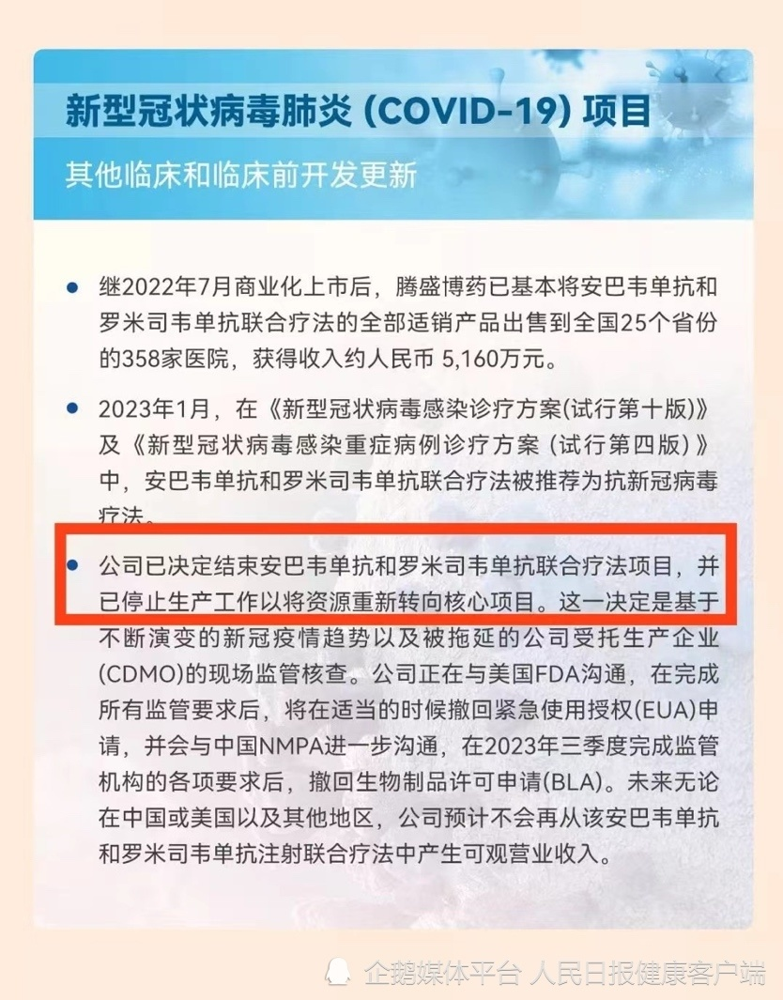

# 国内唯一新冠抗体药已停产，商业化8个月后企业主动叫停

3月24日，腾盛博药发布2022年财报，其中提及，公司决定结束安巴韦单抗/罗米司韦单抗联合疗法项目，并已停止生产工作。这也是我国首家也是目前唯一获批的自主知识产权新冠病毒中和抗体联合治疗药物。

_腾盛博药微信公号截图_

腾盛博药表示，继2022年7月商业化上市后，腾盛博药已基本将安巴韦单抗和罗米司韦单抗联合疗法的全部适销产品出售到全国25个省份的358家医院，获得收入约人民币5160万元。公司已决定结束安巴韦单抗和罗米司韦单抗联合疗法项目，并已停止生产工作以将资源重新转向核心项目：乙肝病毒（HBV）项目、产后抑郁症（PPD）和重度抑郁症（MDD）项目。

这一决定是基于不断演变的新冠疫情趋势以及被拖延的公司受托生产企业(CDMO)的现场监管核查。公司正在与美国FDA沟通，在完成所有监管要求后，将在适当的时候撤回紧急使用授权(EUA)电请，并会与中国NMPA进一步沟通，在2023年三季度完成监管机构的各项要求后，撤回生物制品许可申请(BLA)。未来无论在中国或美国以及其他地区，公司预计不会再从该安巴韦单抗和罗米司韦单抗注射联合疗法中产生可观营业收入。

据悉，2021年12月，安巴韦单抗/罗米司韦单抗联合治疗药物获国家药品监督管理局（NMPA）批准的注册申请；2022年3月，安巴韦单抗和罗米司韦单抗联合疗法又获国家卫生健康委员会批准，纳入《新型冠状病毒肺炎诊疗方案（试行第九版）》；2022年7月，腾盛博药官网宣布，长效新冠中和抗体安巴韦单抗和罗米司韦单抗联合疗法在中国商业化上市；2023年1月，在《新型冠状病毒感染诊疗方案（试行第十版）》及《新型冠状病毒感染重症病例诊疗方案（试行第四版）》中，安巴韦单抗和罗米司韦单抗联合疗法被推荐为抗新冠病毒疗法。

