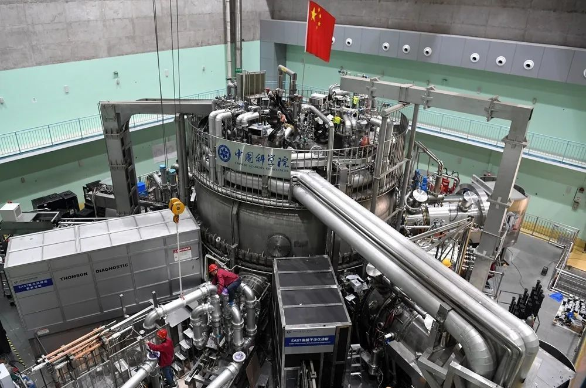
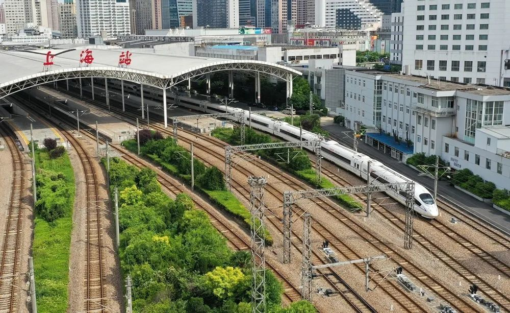
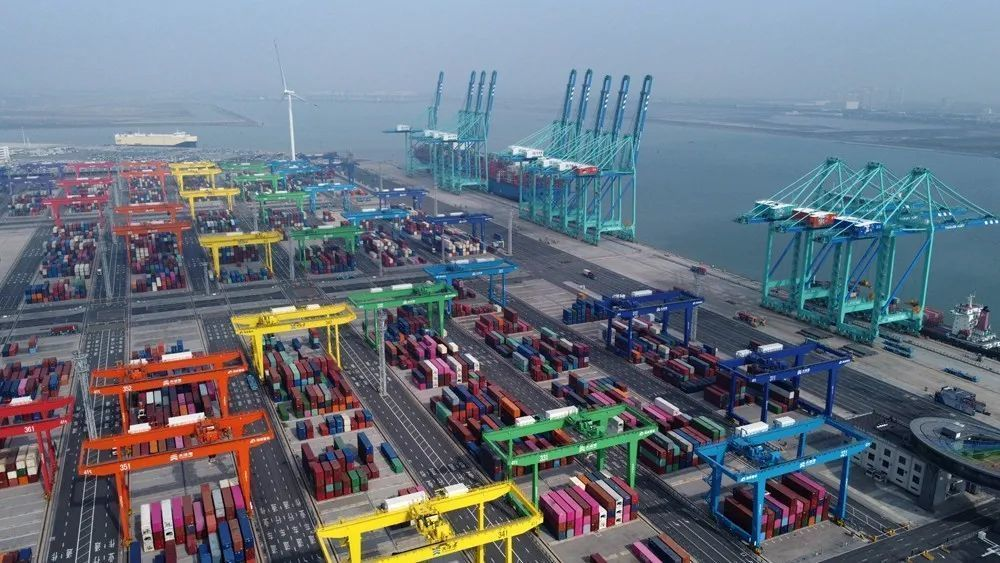
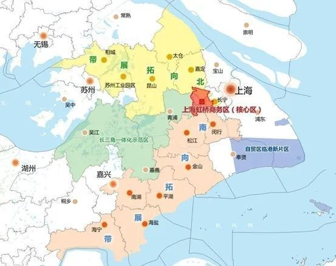
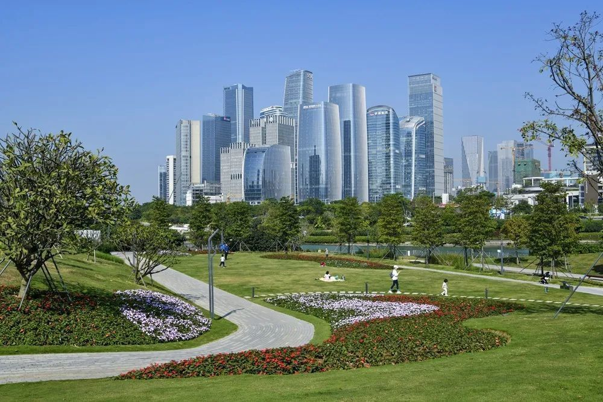

# 多地省委书记、省长带队“串门”，他们看了些什么？

每经记者：淡忠奎 余蕊均 每经编辑：王月龙,刘艳美

最近一段时间，书记省长带领的地方党政代表团频频“出动”，掀起了一股“考察热”。

先是3月16日至18日， **上海** 市党政代表团先后赴江苏、安徽、浙江学习考察；紧接着，3月17日至18日， **北京**
市党政代表团赴河北、天津学习考察；同期， **广西** 党政代表团赴广东学习考察；

本周，3月20日至23日， **江苏** 省党政代表团赴上海、浙江、安徽学习考察， **河北** 省党政代表团到天津考察；23日， **贵州**
启程赴广东、广西，开始为期五天的学习考察……

从时间上看，地方党政代表团这一轮学习考察集中在全国两会闭幕后；从范围看，又集中在京津冀、长三角和粤港澳大湾区，所以有观点称之为“邻居串门”；从议题看，大家很一致，重点考察科技创新、产业发展等领域。

近年来，地区间、城市间交流互访已愈发常态化，早在2019年，城叔就曾对“近300个城市，谁最爱‘学习’”作过分析。不过，多位受访专家均指出，
**近期如此密集的学习考察，不仅不是“惯例”，更是一个“新现象”。**

专家们普遍认为，学习考察与“大兴调查研究之风”有一定关系，但更多还是要从“畅通国内大循环”的层面去考虑。正如国家行政学院教授竹立家所言，调研不仅要求各地准确了解自己，还要知道整个区域的情况，通过更紧密的联系，实事求是地解决问题、打破“肠梗阻”，从而持续提高发展质量。

显然，作为中国经济发展的三大增长极，京津冀、长三角、大湾区保持内部“畅通”具有非常重要的全局意义。需要强调的是，广西、贵州作为西部省份，加强与广东的合作，“融入大湾区建设”，自然是不容错失的机会。

考察些什么？

从考察轨迹看，科技自立自强是一大重点。仅长三角，在沪苏、沪皖、沪浙，以及苏沪、苏浙、苏皖的交流过程中，共计考察7座城市20余个点位，其中高校及科研院所在10个以上，“实验室”成为高频词。

上海市党政代表团在江苏首站前往网络通信与安全紫金山实验室，在安徽考察安徽创新馆、中科院合肥物质科学研究院，在浙江考察祥符荡科创绿谷研发总部等；

江苏省党政代表团在上海考察了大数据中心、鲲鹏生态创新中心、新虹桥国际医学中心，在杭州考察了西湖大学、之江实验室，在合肥考察了安徽创新馆、中科院合肥物质科学研究院。

其中，网络通信与安全紫金山实验室，即著名的“紫金山实验室”，聚焦未来网络、新型通信和网络安全等研究方向；中科院合肥物质科学研究院是合肥综合性国家科学中心的核心建设单位，已建成并运行全超导托卡马克、稳态强磁场两个国家大科学装置。

_中科院合肥物质科学研究院，有“人造太阳”之称的全超导托卡马克核聚变实验装置（EAST）图片来源：新华社_

安徽省委书记韩俊表示，要在长三角一体化发展中，打破行政壁垒，让大科学装置更好服务安徽、面向沪苏浙，实现共建共享。

上海市委书记陈吉宁则强调，更好发挥龙头带动优势、改革开放优势、人才科技优势，与苏皖浙携手努力、优势互补，在制度改革创新上强化集成，在科技自立自强上锻长板补短板。

与此同时，国家超级计算天津中心、国家超级计算广州中心也成为地方党政代表团到访天津、广东的主要目的地之一。

值得注意的是，3月21日，粤港合作联席会议第二十三次会议在香港举行，会议由香港特区行政长官李家超、广东省省长王伟中共同主持。这是香港与内地全面恢复通关后的首次“实体”联席会，双方在会上签署了一系列合作文件，其中就包括《粤港科技创新交流合作协议》。

北京师范大学政府管理研究院副院长、产业经济研究中心主任宋向清向城叔谈到，
**经济发达地区一直有注重调研的传统，“能够通过调研去及时调整自己的政策和产业发展方向”。**

在他看来，三大城市群产业互补性强、互鉴性较大，能够通过调研增进了解，进而实现各自城市群内部的更大领域、更深层次的合作。

高新技术企业亦是焦点

科技创新之外，代表着产业未来发展方向的高新技术企业亦是各地关注的焦点。

上海市党政代表团在江苏考察了南瑞继保电气有限公司，在安徽考察了九仙尊霍山石斛股份有限公司、科大讯飞，在浙江考察了新华三集团；

江苏省党政代表团在浙江考察了申昊科技、紫光恒越，在安徽考察了科大讯飞。

其中，沪苏两地党政代表团均驻足的科大讯飞是合肥“中国声谷”的龙头企业，而杭州的申昊科技专注智能电网相关技术产品的研发，紫光恒越专注于建设自主可控实验室及数字化研发生产项目。

这些企业均是手握关键核心企业，对相关制造业产业链具有重要影响力。 **“要畅通国内大循环，首先‘小循环’要做起来。”**
复旦大学政党建设与国家发展研究中心主任郑长忠对城叔表示，就像上海和苏州之间，很多的企业、产业链乃至城市之间互动非常密集，几乎很多产业链相关要素属于当天就要流动起来的。

_图片来源：新华社_

“企业”背后连着“产业”，这一轮学习考察中，“产业协同”更是被频频提及。

在北京天津工作交流座谈会上，北京市委书记尹力指出，要以更大的担当更有力的举措推进京津冀协同发展。
**“围绕新能源和智能网联汽车、生物医药、氢能、工业互联网等领域，提升区域产业核心竞争力，推动产业链协作走深走实”。**

中国人民大学国家发展与战略研究院研究员、公共管理学院教授马亮认为，城市群内部的合作基础和条件扎实，合作机会和空间较多，所以各地政府往往优先考虑群内兄弟城市。

同时，他向城叔分析指出，围绕城市群也很容易形成互访关系网络。比如，京津冀地区和山东等地就互访紧密，
**“因为疏解非首都功能可以为山东带来招商引资契机”。**

就像广西、贵州，也的确从大湾区获得了不少“实惠”。以贵州为例，从2016年与华为签订战略合作协议起，华为云逐步成为贵州首家百亿级大数据企业，对贵州产业的数字化转型提供了重要支撑。

这一次，贵州也把到广东学习考察的第一站放到了深圳，走进腾讯、华为等知名企业。

“加速推进”

一直以来，天津港都是京津冀地区的“主力”港口，所以成为北京、河北学习考察的重点，自在情理之中。

一个背景是，北京作为世界银行评估中国营商环境的样本城市之一，自2017年起连续推出多项改革措施，这里面，海运通关效率恰恰看的是天津的表现。2020年，世行发布《中国优化营商环境的成功经验》，专门提到天津港推进“提货单无纸化改革”。

这一次，3月18日上午，北京市党政代表团专门到天津港察看了智慧港口建设和规划运营等情况。当地媒体称，
**“这座百年大港已建成全球首个‘智慧零碳’码头”。**

_天津港“智慧零碳”码头
图片来源：新华社_

而对后发的河北来说，去年重新整合了省域港口资源，新组建的河北渤海港口集团有限公司承载了“向海而兴”的重任，有分析认为，其有望跻身全国港口公司前三甲。

河北省委书记倪岳峰表示，要认真学习天津港产城融合发展宝贵经验，大力推动港口转型升级，积极推进通关便利化，加快建设临港产业强省，构建向海图强、向海发展新格局。

天津市委书记陈敏尔则谈到，要共下港口集群“一盘棋”，加强津冀港口高效协作，优化资源配置，完善功能分工，以港口带物流、以物流带经贸、以经贸带产业，实现错位发展、联动发展、融合发展，共同构建现代化的津冀港口群。

一边是世界级港口群加快推进，另一边，虹桥国际开放枢纽建设也在提速——上海在苏皖浙三地学习考察时明确表示，要围绕虹桥国际开放枢纽、长三角生态绿色一体化发展示范区等深入谋划新项目、打造新亮点。

_虹桥国际开放枢纽示意图
图片来源：上海发布_

早在2021年2月，国务院批复《虹桥国际开放枢纽建设总体方案》，
“大虹桥”由此成为推动长三角一体化发展战略的重大布局之一。数据显示，2022年虹桥国际开放枢纽全域地区生产总值达2.69万亿元，以占长三角不到2%的面积贡献了近10%的经济总量。

在郑长忠看来，近期地方党政代表团密集互动，除了从宏观层面上推动构建新发展格局外，也是在强调
**“对已经定下来的东西要加快（推进），进一步合作机制要尽快落实”。**

先内部激活，再区域激活到全国激活

从长远看，书记省长带队“串门”，可以在“小的”经济单元内打破“梗阻”，让“流动”变得更加充分高效，从而畅通国内大循环。

若从近处着眼，则可以看到一层“激活”之意。

_深圳前海深港现代服务业合作区
图片来源：新华社_

**“各地互访在疫情前很流行，疫情影响使互访减少，现在条件允许就恢复了。”**
在马亮看来，发展经济需要加强城市间合作，互学互鉴，这是各地积极互访考察的核心原因。

郑长忠则指出，地方经济社会发展现在需要激活，需要繁荣起来，“而很多东西实际上此前产生了一些地方性的‘屏障’”，在他看来，通过地方党政代表团的交流互访，可以很好地把这些“屏障”消除掉。

据他观察，二十大之后，长三角、京津冀、粤港澳等重点区域都围绕高质量发展举行了一系列活动，“先是本身内部先激活，接下来就拓展到区域，包括京津冀、长三角等。”郑长忠认为，
**接下来会有一个全国性的、进一步的激活。**

多位受访专家均提到，当前，地方经济的快速发展需要一种内在驱动力，而各地党政代表团的密集互访正在激活这种内驱力。既有政策用起来，新的政策、新的联络正在建立。

**记者|** 淡忠奎 余蕊均

**编辑|** 王月龙 刘艳美 杜恒峰

**校对|** 卢祥勇

｜每日经济新闻 nbdnews原创文章｜

未经许可禁止转载、摘编、复制及镜像等使用

