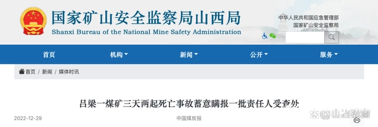

# 山西一煤矿三天瞒报两起矿难 当地官员曾授意“抓紧处理记者和事故”

日前，国家矿山安监局山西分局公布两起吕梁矿难事故的调查报告，2022年5月，山西省晋煤太钢能源有限公司三交煤矿在三天内发生两起亡人事故，且煤矿方均存在瞒报行为，调查披露地方应急管理局局长参与瞒报，该细节引发外界关注。

三天两起事故，而且是无一例外存在瞒报，瞒报是否导致事故频发，对此很难不产生疑问。道理很简单，既然可以瞒报，而且“上面有人”能为瞒报提供各种便利，企业安全生产的弦还怎么能够绷得紧？此番调查报告，以近乎原景重现的方式披露了地方官员参与、指挥瞒报的全过程，如此详细呈现瞒报细节并不多见，也让外界得以看到调查问责的决心。

调查报告显示，几乎就在事故发生的同一时间，时任吕梁市应急管理局局长高艳龙多次接到媒体关于三交煤矿“5·10”事故的举报，而作为监管部门的负责人，并没有第一时间启动应急响应，反倒是在第一时间、多次联络涉事煤矿负责人，催促、授意其“抓紧处理记者和事故”。

这是谁的应急管理？又到底是怎么个“抓紧处理”法？吕梁应急管理局负责人的这一通骚操作，哪怕是事后通报，还是让公众足够震惊。

本应担负法定职责，对地方事故灾难做分级应对的部门负责人，却在第一时间对接涉事煤矿，安排“灭火”、瞒报事宜，其与事发单位的娴熟对接，可以想象其平时与辖区内“潜在客户”的相处之道。2023年1月，此番通报所指的吕梁市应急管理局局长高艳龙就因违规接受旅游安排、违规收受礼品礼金被处分，彼时通报显示，高在当地煤炭安全领域深耕多年，存在接受私营企业主安排旅游、多次违规收受管理和服务对象礼品和礼金的情况。

值得注意的是，此番查明三天两瞒的煤矿企业并非前述通报涉及的私企，而是隶属于地方大型国企山西焦煤集团。监管部门与地方国企的关系同样需要深入调查，而不能仅满足于披露已落马的老虎，显然事故不能简单让一个局长背锅。

需要强调的是，参与瞒报的官员因非瞒报事由被留党察看、被政务撤职，而针对此次事故的责任追究可能要走另外一套程序。部门责任人如此胆大妄为，有必要深究其底气何在，监管部门负责人与瞒报企业之间如此丝滑的相处状态，是否有并不正常的地方官场生态在从中作梗？

事实上，2022年6月，吕梁矿难事发后一个月，山西省应急管理厅就曾通报相关情况，表示将对组织和参与瞒报事故的单位和人员，按有关规定“上限”严格追究责任，对涉嫌犯罪的，按照《安全生产法》《刑法修正案（十一）》及《生产安全事故报告和调查处理条例》等法律法规的规定，依法追究责任。

地方官员不惜铤而走险，也要协助企业瞒报，这背后有没有其他重大利益关联存在？还是说，对手握权力的公职人员而言，一个电话的投桃报李，在他看来不过是举手之劳的无风险操作而已？

无论是企业对官员的“运营”、围猎，还是官员对企业用心不纯的关照，都不是正常的政商关系。矿难瞒报可恶，“内鬼”官员参与瞒报更是罪不容恕，必须全面排查和改造地方权力运行环境，让政商关系真正清朗起来。

