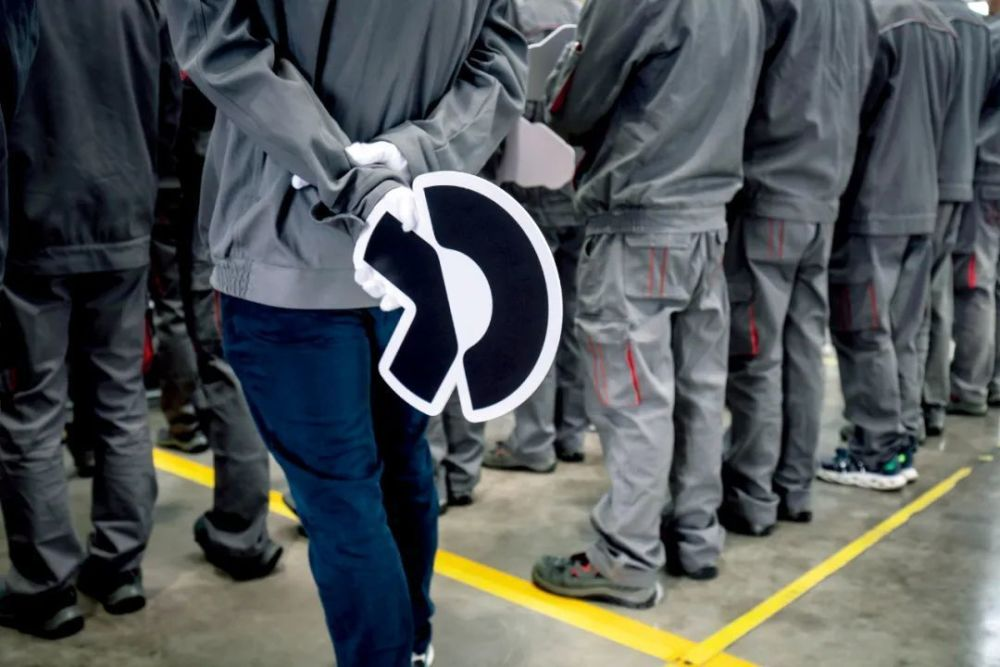
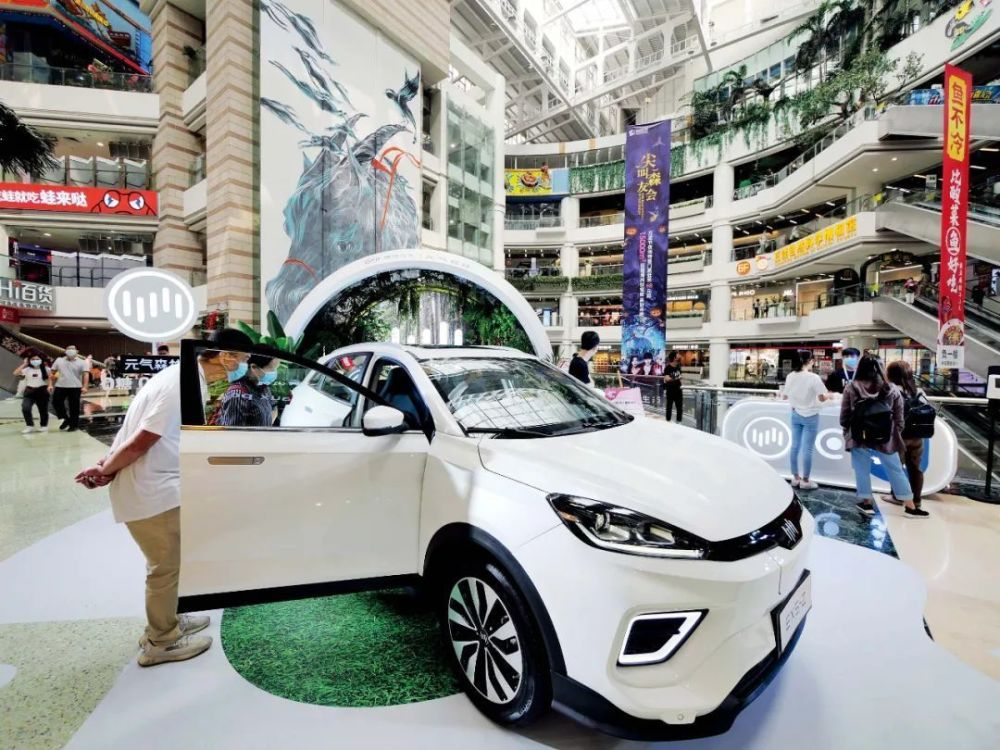
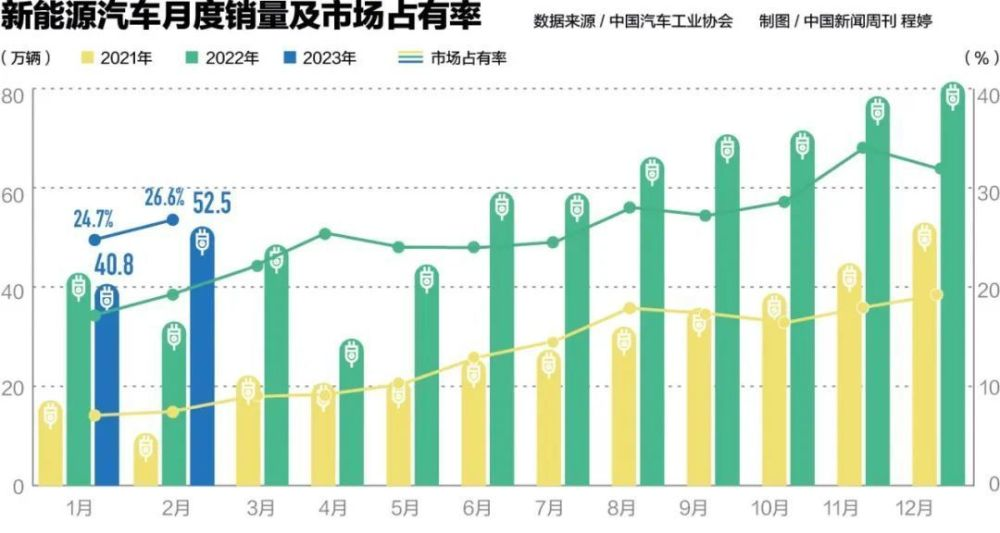
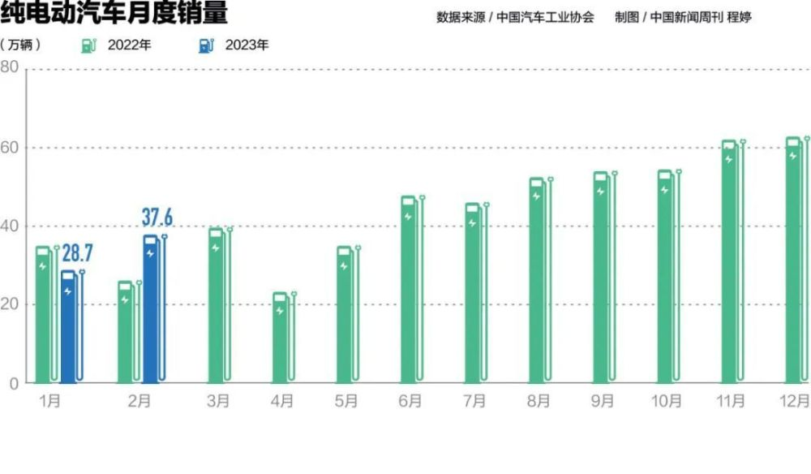
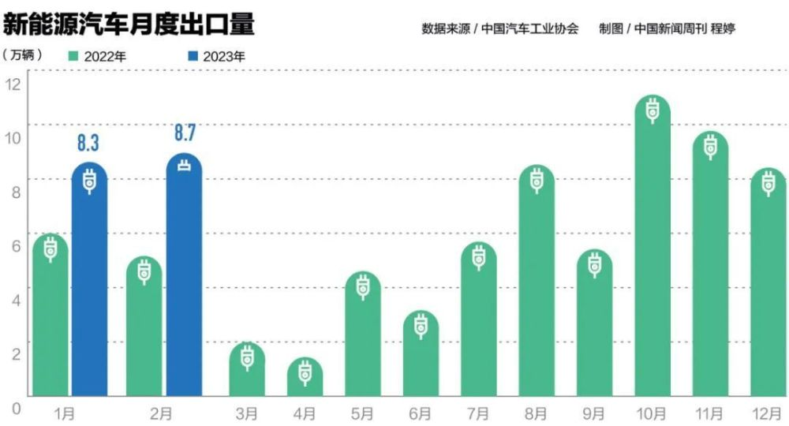
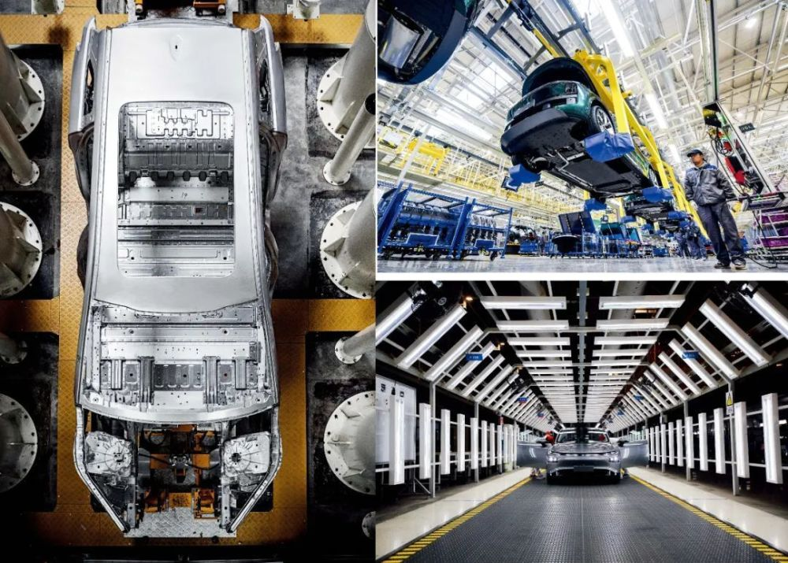

# 新能源汽车残酷淘汰赛，太卷了

144.37亿元、91.4亿元、20.32亿元——这是蔚来、小鹏、理想三家企业在2022年的净亏损额度。

全国乘用车市场信息联席会（下称“乘联会”）数据显示，过去的一年新能源乘用车批发649.8万辆，同比增长96.3％，市场渗透率达到27.6％，较2021年提升12.6个百分点。也就是说，过去一年每卖出4辆车就有1辆是新能源汽车。

但目前在新能源汽车领域，却仅有特斯拉与比亚迪实现了盈利。乘联会秘书长崔东树告诉《中国新闻周刊》：“特斯拉与比亚迪实现盈利，主要得益于规模和产业链的综合成本控制。”在“成本极佳”定律下，特斯拉实现了高效发展。而作为造车新势力中的佼佼者，“蔚小理”三家公司虽然在2022年卖掉了更多新车，获得了更多收入，但它们的亏损却在扩大。

_安徽合肥市江淮蔚来工厂的员工。图/视觉中国_

而2023年，伴随汽车市场竞争局面的复杂化，一场充满火药味的淘汰赛也将进入加速阶段。一场覆盖整个汽车行业的疯狂降价潮正重塑整个行业的竞争形态。与此同时，伴随越来越多“财大气粗”的传统车企大刀阔斧的“电动化”转型，也为未来新能源汽车市场的竞争带来更多不确定性。

在2月17日举行的中国电动汽车百人会专家媒体交流会中，全国政协经济委员会副主任、工业和信息化部原部长苗圩直言：“现在确实新能源汽车的厂家比较多，想法也比较多，真正成功走出来的不多，100多家新能源汽车企业在竞争当中一定会优胜劣汰，最后集中到几家头部企业。”

如今，即便处于造车新势力头部位置的蔚来、小鹏、理想都无法断言是否能最终胜出，那些销量规模小、品牌知名度低的品牌处境更加艰难。崔东树表示，今年复杂的市场情况，可能会在一定程度上加速一些销量规模小、资金链紧张的弱势品牌淘汰。

特斯拉吹响号角

2022年最后一天，中国国际贸易促进委员会汽车行业分会会长、中国国际商会汽车行业商会会长王侠在广州车展上作出判断：“第一轮热潮中处于弱势的‘新势力’，将面临更加严酷的生存压力。”

车企最先面对的是政策层面的改变。2023年，新能源汽车国家购置补贴政策正式退出。这项从2010年开始实施的补贴政策，在经历了数次取消和延长之后，终于在2022年12月31日画上了句号。

不过，由于国家补贴的退出是有计划、按照梯度逐年进行的，汽车企业早有心理准备，带来的冲击相对有限。苗圩谈及补贴退坡带来的影响时称：“政策的退出对于今年上半年相当一段时间内新能源汽车市场的销售会带来一些不利的影响，但影响可控。”

为了应对补贴政策退出后新能源汽车销售环节中成本的增加，不少车企曾在年初宣布了涨价信息。不过，这样的涨价趋势很快被打破了。随着拥有汽车行业最佳利润表现的特斯拉官宣史上最大规模降价，整个汽车行业掀起了少见的集体价格跳水的行情。

对于2023年以来特斯拉价格调整的原因，特斯拉北京区总经理陶琪向《中国新闻周刊》解释称，产品价格的调整基于企业对接下来一段时间成本变化的预测。“特斯拉基于成本定价，因为我们看重的是公平和透明。”

财报数据显示，2022年特斯拉净利润达到126亿美元，同比翻了一倍多。国内造车新势力中位居头部的“蔚小理”，2022年净亏损共计高达256亿元。从销售毛利率来看，蔚来的车辆销售毛利率从2021年的20.1％下降到2022年的13.7％；理想从20.6％降到19.1％；小鹏从11.5％降到9.4％。

车卖得更多了，但盈利空间更小了。上述车企在谈及原因时，表示一方面是受到过去一年动力电池、产业链上下游原材料价格上涨影响，另一方面是产品迭代、研发等费用影响。

特斯拉不断压低成本而带来的降价行为，使得新能源汽车企业在尚未实现盈利的情况下不得不参与全行业的价格重塑。在特斯拉官宣降价后，包括问界、小鹏、零跑、岚图等造车新势力相继下调售价。就连一直坚持不降价的蔚来也在短期内进行了价格让利，综合优惠最高达到了10万元。

不过，蔚来联合创始人、总裁秦力洪告诉《中国新闻周刊》，蔚来只是针对少量展车、库存车给予优惠政策，包括蔚来2022款ES8、ES6和EC6车型，此举是为第二代技术平台的蔚来新车换代做准备。在蔚来方面看来，“清库存”并不属于常规意义上的“降价”。

事实上，从2023年前两个月的销量来看，似乎只有特斯拉享受到了降价带来的销量红利。数据显示，特斯拉1月销量为66051辆，2月销量为74402辆，而目前特斯拉旗下主销车型仅有两款。

不少企业即便跟随降价但依旧出现销量下滑，未能逃过“降价陪跑”的命运。如零跑汽车1月仅交付新车1139辆，环比下降86.59％，同比下降85.9％；2月的交付量也仅为3198辆。问界1月销量为4885辆，环比下跌56％；2月销量继续下跌至3505辆，环比1月又下滑了21％。小鹏汽车1月销量为5218辆，环比下滑53.79％；2月份，小鹏汽车销量虽有小幅上涨但月销依旧不过万，交付了6010辆新车。

而这，只是一个开始。让行业人士没有料到的是，价格战很快由新能源汽车领域蔓延至整个汽车产业，众多燃油车企业为了争夺或稳住市场份额，纷纷参与到这一场疯狂的行动中。

_2020年11月1日，威马汽车在广东广州一商场的纯电SUV车型展示。图/IC_

面对席卷至全行业的价格战，何小鹏直言，燃油车面临巨大挑战一定会奋起反击，相信很多汽车公司会从更激进的、以市场规模为优先的角度来做出决策。“小鹏的战略则是把规模做好，其中成本是非常重要的一点。”

事实上，燃油车企业普遍拥有更好的盈利表现，加上部分地方补贴支持，一些车型在此轮价格战中给出的优惠力度历史少见，短期内也吸引了大批消费者。由于汽车是耐用品，消费者不可能在短期内反复购买。这也让市场中相对弱势的新能源汽车品牌一时间几乎失去了对市场的掌控力。

靠融资续命，越来越难

2023年开年，补贴的彻底退出与价格战的打响，成为汽车行业的大背景。对于尚未实现盈利的造车新势力们来说，这确实是一个不确定的开局。

在新能源汽车市场窗口期结束之前，造车新势力一方面需要提高销量、扩大规模，以实现成本的降低；另一方面，在尚不能实现规模运作的阶段，能够得到资本青睐也是其能否生存下去的关键。

“接下来两年是整个新能源车企竞争最激烈的两年，也是决定每一家车企成败的两年，对每一家车企都非常关键。”零跑汽车创始人朱江明表示，相比传统车企经历了很多年的磨炼，造车新势力的弱势就是整体大规模运作的能力，仍需要学习和进步的过程。

2023年以来，包括威马汽车、天际汽车等已经先后陷入停工停产风波。威马创始人沈晖曾表示，新能源汽车市场是长跑，现实是未必每个人都能跑到最后。谁料一语成谶，2023年年初，威马陷入困境。

威马曾经有多威风？从2017年2月至2022年3月，威马汽车历经12轮融资，在2020年完成号称造车新势力史上最大的单轮融资，为100亿元。作为造车新势力代表之一，威马至今仍极度依赖外部融资。招股书显示，截至2021年末其流动总负债已高达94.77亿元，公司所持有的现金及现金等价物却只有41.56亿元。过去一年，大环境下行、原材料涨价叠加疫情的影响，威马的现金流更加紧张。

按照沈晖此前的说法，威马长期“准上市状态”使其“既没吃饱，又要快跑”，在相当长的时间内，承担了许多非上市企业不该承担的压力，首当其冲的就是融资困难。由于科创板不能股权变动，威马无法通过股权来融资。而作为亏损企业，大部分债权银行也都不愿意对威马发债。“所以我们进入科创板上市通道后的一年半内，没有融到一分钱。”2023年3月初，上海市青浦区消费者权益保护委员会更是发布消费警示，“威马汽车经营异常，提醒消费者谨慎购买”。

与威马汽车工厂陷入停滞相似，天际汽车绍兴工厂同样也陷入停工状态。数据显示，2022年天际汽车总销量为5321辆，这一数字甚至不及造车新势力头部企业一个月的销量。另据天眼查数据，天际汽车在2022年6月完成B轮融资，累计融资金额超过100亿元。而按照在A轮融资后的计划，天际汽车已开启IPO准备工作，计划2021年上市。但这一目标并未能达成。

如今，陷入停工停产境遇的天际汽车同样急切渴望资本输血。3月16日，接近天际汽车的业内人士向《中国新闻周刊》透露，天际汽车近期正在推进新一轮融资。坊间传闻此次融资金额“超7.5亿元”，但上述人士并未透露具体金额。

造车新势力中的头部力量小鹏汽车同样正在经历挫折。2022年，小鹏汽车销量12.07万辆。2023年前两个月，小鹏汽车累计销量为1.12万辆，同比下滑41.4％。据接近小鹏汽车的人士透露，由于销量不佳，小鹏汽车不仅将传统汽车长城汽车的干将王凤英招至麾下，更在内部进行了营销变革。

此前业内普遍认为，造车新势力摆脱亏损的节点是年交付量10万辆。不过，这一预期数据或许被严重低估了。如今，实现十万年销量的蔚来、小鹏以及理想均未实现盈利。对此，何小鹏表示：“此前小鹏汽车也认同关于10万辆年产量是门槛的提法。但当我们做到10万辆的时候，才发现今天的智能电动汽车的基础门槛，似乎已经提高到了40万辆。”

而在造车领域，包括小米汽车在内的跨界造车甚至尚未实现量产。小米汽车计划在2024年上半年量产首款车型，目标为“争取15到20年进入世界前五”。不过，不同于多数造车新势力对于融资的渴望，得益于多年积累，小米造车似乎并不缺钱，小米汽车计划10年投资100亿美元，首期投资100亿元人民币。小米创始人雷军近日表示：“2023年小米汽车等新业务预计费用投入将达到75亿到80亿元。”雷军解释，“汽车是百年赛道，只要看好汽车赛道，任何时候都不晚。”

传统燃油车企，加速“电动化”

作为燃油车时代的既得利益者，高技术门槛的燃油车产品曾带给传统汽车巨头丰厚回报。这样的处境也使得传统燃油车企业最初并不愿意颠覆现有格局，电动化转型多是被逼无奈。这种心态直接导致传统车企生产出的第一批电动化产品多以“油改电”为主，只是将发动机换成了电池，在智能化、产品设计方面没有突破。而这些车型与同平台燃油车相比，售价往往高出许多。结果就是，此前传统车企推出的电动化产品，大多竞争力不足。

伴随燃油车与新能源汽车销量此消彼长的关系愈发明显，燃油车企业到了不得不转变的时刻。2022年，燃油车总销量为1486.9万辆，比2021年减少230.1万辆。而新能源汽车增势迅猛。根据中国汽车流通协会数据，这一年，有42.1％的经销商销售目标完成率在70％以下。

到了2023年1~2月，中国乘用车总共卖出了267.9万辆，其中燃油车190.9万辆，新能源汽车77万辆。而在去年1~2月份，中国卖出的334万辆乘用车里，272.3万辆是燃油车，新能源汽车为62.7万辆。不断萎缩的市场，让燃油车企业危机感倍增，也让“电动化”转型，从说说而已变为最迫切的现实。

最早掀起“价格战”的特斯拉，野心是成为新能源汽车产业中的“大众”。按照计划，特斯拉未来还计划推出一款成本仅为Model
3一半的小型车。特斯拉CEO埃隆·马斯克此前表示，到2030年，特斯拉年销量要达到2000万辆，几乎达到当前丰田和大众汽车的年销量总和。马斯克希望，更多人可以买得起特斯拉的汽车。

而燃油车领域的巨头大众，自然不希望地位被取代。如今，大众正进一步加速向电动出行转型。根据最新计划，大众或抢先于特斯拉推出低价车型。3月16日，大众汽车品牌旗下全新纯电动车——ID.2all概念车举办了全球首秀。官方公布海外售价将会低于2.5万欧元。

数据显示，2022年大众集团的纯电动ID.系列车型在中国市场的交付量实现翻番。这样的成绩在燃油车转型的案例中算得上可圈可点。按照计划，至2030年，大众汽车在欧纯电动汽车的交付量占比预计将达到约80％。为此，大众汽车计划在2026年前在全球推出10款新电动车型。

与财务状况捉襟见肘、融资续命的造车新势力不同，作为燃油车领域当之无愧的巨头，大众汽车虽在2022年整体交付量有所下滑，但却并不缺钱。大众汽车财报显示，2022年，经过优化的车型和价格策略仍使大众汽车的年销售额达到740亿欧元，2021年这一数字为680亿欧元；经营净现金流提高至19亿欧元，2021年这一数据为3亿欧元；税后利润增长2.6％至158亿欧元。

在宝马的规划中，到2030年将向全球客户交付超过1000万辆纯电动车型。过去一年，宝马在研发电动汽车方面投入资金66亿欧元，研发支出同比增长5.2％。同时，宝马集团2022年的净利润达到了185.82亿欧元，同比增长49.1％。面对电动化转型对资金的需求，“财大气粗”的宝马同样具有足够的底气。

在近日的财报发布会上，梅赛德斯-
奔驰集团更是明确表示，2023年将通过加速电动化转型等方面，促进纯电动车销量大致翻番。与之相对应，其预测乘用车年度销量将保持上年水平。

梅赛德斯-
奔驰同样具备优秀的盈利能力。2022财年，集团税前利润大幅增长28％，达到205亿欧元；营业额增长12％至1500亿欧元。传统燃油车巨头，普遍在不断优化盈利能力的同时，加快电动化的转型。

在多数人的认知中，发动机的轰鸣才是超级跑车的“灵魂”。但如今，就连超豪华汽车品牌保时捷都开始坚定推行其雄心勃勃的电气化战略。按照计划，纯电动Macan即将问世，718计划将于20年代中期推出纯电版，紧随其后的将是纯电版Cayenne。第四代SUV将深化保时捷的目标，即力争在2030年，纯电动车型将占其所售新车的80％以上。

“整个市场的电气化转型已势不可挡。”保时捷中国总裁及首席执行官柯时迈告诉《中国新闻周刊》，保时捷与中国汽车市场的整体转型速度和电气化车型占比预期是相似的。尽管目前国内一些品牌也发布了面向百万级别以上市场的宏图战略，但柯时迈认为，拥有更丰富品牌价值和品牌历史的保时捷，在新能源汽车市场依旧将拥有无可替代的位置。

而汽车产业电动化的转型远比看到的更为激烈。事实上，目前一些看似电动化转型相对迟缓的跨国公司也都在加快转型步伐。

“我们一直在和外方沟通近年来中国市场在新能源汽车领域发生的变化，希望公司转型快一些、更快一些。”一位跨国车企的中方负责人告诉《中国新闻周刊》，疫情阻断了公司的中外交流，而这三年，中国汽车市场的变化是外方难以想象的。“今年4月，外方高管将来中国进行再次考察，而这一次来访规模之大、级别之高，前所未有。”上述人士透露，此行主要的目的，就是关于公司电动化的进一步规划。

与此同时，国内传统汽车品牌也纷纷宣布了新能源汽车市场的布局计划。长城汽车总裁穆峰向《中国新闻周刊》透露，长城汽车2023年会推出10余款新能源产品，加速向新能源汽车市场的转型。

对于新能源汽车市场的竞争局势，穆峰认为：“我们的友商通过新能源开创了巨大的蓝海市场，根据市场的规律，蓝海是暂时的，红海是最终的。当市场非常具有诱惑力的时候，大家一定会用最短的时间进入这个市场参与竞争，我们认为这是好事，对我们的产业健康发展也是好事。”

穆峰表示，“大家进入想象当中的蓝海的时候，实际上不仅仅是新能源之争，也是整个产业整个市场之争，这就是我们2023年面临的竞争格局。”

根据传统汽车企业最新公布的电动化战略，可以感受到的是，无论车型投放、平台研发或是资金准备，这一轮来自传统车企的进攻，火力都有明显提升。尽管目前还无法判断传统车企能否顺利完成转型，但市场竞争愈发激烈是事实。如今，新能源汽车市场的产品布局几乎已经全面覆盖了从几万到几百万的价格区间，这与几年前市场中没有太多产品可供消费者选择的情况已经大不相同。

与此同时，与造车新势力“为钱焦虑”的处境不同，传统造车巨头依靠昔日在燃油车市场的强势表现，目前大多拥有良好的盈利能力和完善的供应链体系。如今，传统车企对于新能源汽车从“静观其变”改为“主动出击”，在多重夹击之下，无论是传统车企还是造车新势力中的弱势品牌，想活下来都变得越来越难。

谁能继续留在“牌桌”上？

进入2023年，造车竞争上升到前所未有的高度。

车企之间从卷产品、价格、配置，到卷战略、组织、文化。新能源汽车的竞争早已不局限于行业内部，燃油车与新能源汽车对市场的争夺愈演愈烈。对于很多品牌来说，能否继续留在牌桌上都是一个未知数。

宁德时代董事长曾毓群此前预测称，如果未来10年智能汽车、新能源汽车市场充分竞争，全球可能只剩下不超过10家车企，会有七成来自中国。

在2023长安汽车全球伙伴大会上，长安汽车党委书记、董事长朱华荣表示，2022年中国市场现存147个汽车品牌，新推出车型197款，其中新能源116款，占比58.9％；在售新能源372款，平均月销1163辆。

“这显然是不符合产业规律的，如果按当前市场容量、单车型月销过万进行测算，100款车型就将饱和。”朱华荣表示，“过去3年，已经倒下了75个品牌，预计3~5年后，或将还有60％~70％的品牌会面临关停并转。我们可以预料，未来的竞争，仍然将会非常激烈，但倒下的品牌会留出更多市场空间，让活着的品牌发展更有余地。”

何小鹏如今强调“降低成本”，同样源于对市场集中度的判断。“我们如果把时间追回到2017年，中国大概有接近300家的新势力，以及有接近70家乘用汽车品牌在中国销售。截至今年，我们可以看到，大概只有50家左右的乘用汽车品牌在中国有销量，我觉得，在5年以后可能只有25家，那么在10年以后可能只有数家到10家之间，这意味着什么？意味着今天不管是10万（辆）一年还是50万~70万（辆）一年的汽车公司，在5到15年之间都存活不了，在中国能够存活可能最低的数字会达到300万（辆）一年这样一个规模。”

在何小鹏看来，小鹏汽车距离他心目中能“活下来”的地位还有很远距离，因此目前进行的所有架构层面的调整，都是10年后小鹏汽车能“活下来”的基础。

在蔚来NIO DAY
2022媒体面对面上，蔚来创始人、董事长兼首席执行官李斌表示，对于高端市场，全球销量100万辆是一个坎，到了100万的规模，就可以实现稳健发展，保持竞争力，蔚来离这个坎还有很大的距离。“相信中国很多公司都能过这个坎，我也觉得小鹏过200万的坎没问题，但具体的时间无法预测。我们是过来人，是差点完蛋的公司，最终所有的公司都会倒闭，跟人最终都有生命终结的一天一样，这是客观的规律。哪个人不发点烧、不经历一些事。”

_蔚来汽车（左）、理想汽车（右上）、小鹏汽车（右下）的生产线。图/新华 视觉中国_

尽管蔚来汽车目前是“蔚小理”中亏损最多的一个，但李斌依旧为蔚来汽车定下要在2024年前实现季度盈亏平衡的目标。秦力洪对于2023年新能源汽车全年的发展走势也表达了乐观态度，“今年一季度是整个汽车行业也是整个电动车行业过去若干年以来最困难最有挑战的季度，我们都要做好充分的思想准备，但它和全年的大幅度增长并不矛盾。”

而目前身处新能源汽车拥挤赛道的企业，除了奋力争先，确实也没有太多其他选择。有造车新势力负责人向《中国新闻周刊》表示：“在二十年前，中国企业去赶超合资企业是没有胜算的。但是十几年过去了，自主品牌在市场占有率上已经实现了碾压。这一次，国内企业与特斯拉的对比，很像二十年前，但是中国在新能源智能汽车方面具有一定优势，追赶特斯拉不会再用那么长的时间了。”

在他看来，造车新势力首先要力争居于行业头部，而在未来，唯有头部企业不会被淘汰，并且有机会成为与特斯拉一较高下的力量。

中国科学院院士、清华大学教授、中国电动汽车百人会副理事长欧阳明高表示：“总体来看，新能源整车产业竞争在加剧，结构调整在加快，自由竞争的同时也伴随着淘汰，这是一个必经的市场化过程，总体上国内消费者对新能源汽车自主品牌的信赖度不断提高，信心也越来越足。”

无论是否对于市场拥有足够的信心，行业内能够达成的比较一致的观点是：在诸多新能源汽车制造企业中，如果不能居于头部地位，被淘汰几乎已成定局。

中国电动汽车百人会理事长陈清泰表示，投资者看到机会蜂拥而入，这个时候政府应该放开，让更多投资者参与试错，会缩短行业试错的过程。同时，它的另一面就是将来会出现大量的淘汰。

“大浪淘沙之后，市场集中度会慢慢上升，上升的过程还会再淘汰，最后若干企业脱颖而出，这是市场过程。”陈清泰如是说。

发于2023.3.27总第1085期《中国新闻周刊》杂志

杂志标题：新能源汽车决战“淘汰赛”

记者：刘珊珊

