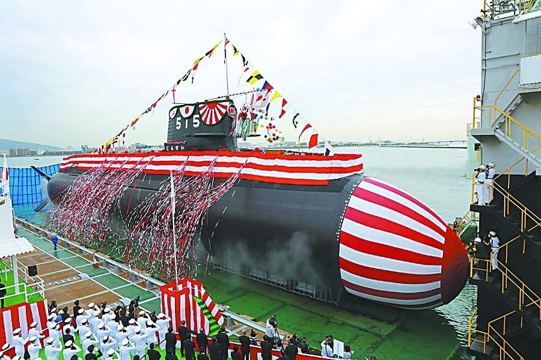
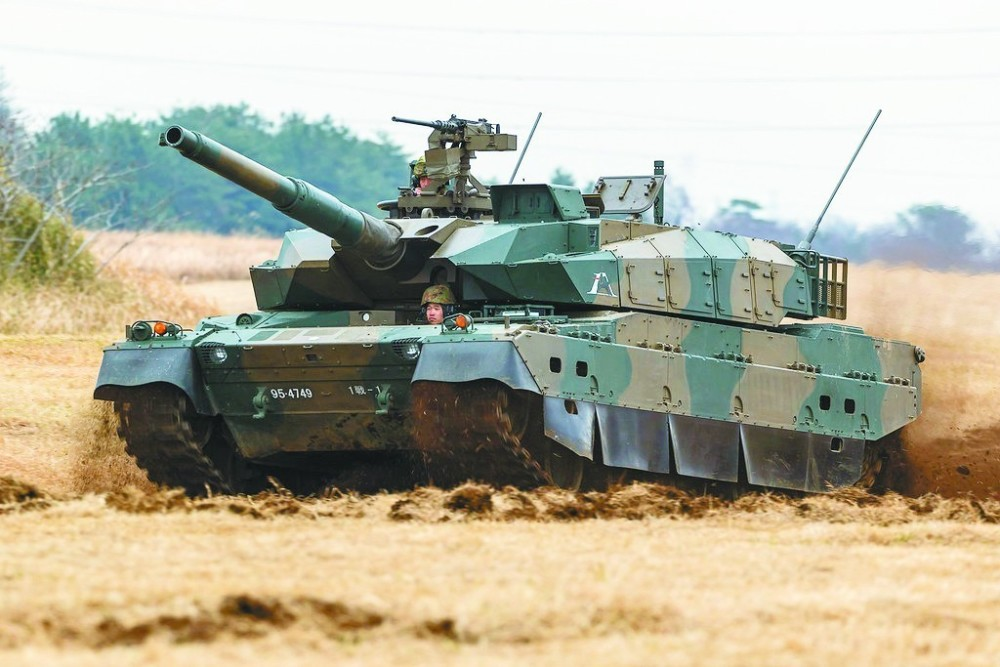
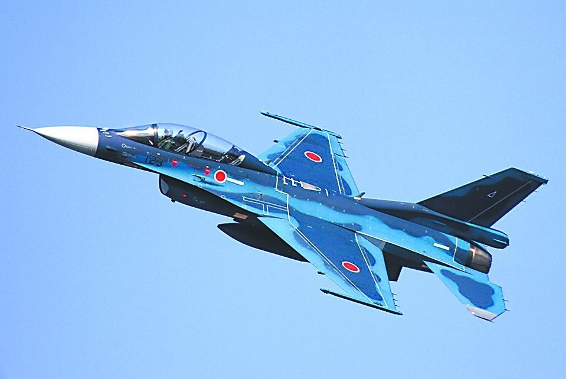

# 日本有多少战争潜力

**自卫队以装备精良而著称**

日本近年来持续强化军备，包括采购先进导弹、隐形战斗机、改装轻型航母……同时还通过修改“安保三文件”，突破战后至今日本长期坚守的防务政策，俨然一副跟随美国随时准备参战的模样。在世人印象里，日本不但拥有装备精良的自卫队，凭借发达的工业制造能力，还具备强大的战争动员能力。日本的战争潜力究竟怎么样？

在美国军事网站“全球火力”列出的军力排行榜中，日本仅次于美俄中印，列在第五位，超过众多西欧传统军事强国。如果仔细分析，就能看出日本军力排名如此之高并不奇怪。俄乌冲突暴露出欧洲各国常规军力现状不佳，就连向来被认为是欧洲陆军典范的德国也曾传出现役284辆“豹2”系列坦克中仅有95辆处于完好状态的丑闻。相比之下，日本陆上自卫队拥有10式主战坦克117辆、90式主战坦克341辆以及数十辆74式坦克，还有部分74式坦克处于封存状态。日本航空自卫队同样装备精良，包括正从美国引进的147架F-35系列（105架F-35A和42架F-35B）隐形战斗机，是亚洲装备F-35数量最多的国家；此外日本还拥有约20架E-2C/D和E-767空中预警机，这些“空中战力倍增器”的数量同样在亚洲位居前列。海上自卫队正在改装的两艘“出云”级轻型航母让日本在二战后首次获得正规航母，同时海上自卫队还有多艘先进的常规潜艇和宙斯盾驱逐舰，规模甚至超过了驻日美军第七舰队。

日本自卫队配套的导弹等精确制导武器也相当先进。无论是航空自卫队配备的ASM-3型超音速反舰导弹、红外制导AAM-5格斗导弹，还是陆上自卫队的12式反舰导弹以及日本与美国联合研制的“标准-3”反导拦截导弹，性能都位居全球前列。在太空领域，日本已经研制出多型通信和遥感卫星，并正在建造被称为“日本版GPS”的“准天顶”导航卫星星座。同时日本研制的H2和H3系列大型运载火箭，确保了日本的独立发射卫星能力。

值得注意的是，与依靠“买买买”获得军事现代化的一些国家不同，日本现役多型主战装备，例如F-2战斗机、C-2运输机、“摩耶”级宙斯盾驱逐舰、“大鲸”级常规潜艇、10式主战坦克等均已实现国产化。同时日本正在大力发展的高超音速武器，包括“岛屿防御用高速滑翔弹”等也都是由日本国内企业负责研制。

美国《防务新闻》统计的2022年度全球防务企业百强榜包括了两家日本企业——三菱重工和川崎重工。单看规模，日本防务企业与其他国家的同行相比并不起眼，但凭借发达的工业制造能力，日本有很强的战时军工转化能力。例如在造船领域，日本可以建造从散货船到集装箱船，从海洋工程船到豪华邮轮等所有民用船舶门类，保持着全球最高的造船业技术水平。日本造船企业曾多年占据全球交付吨位首位，最高年交付总量高达3000万吨，日本至今仍是全球造船业三强之一。再加上海上自卫队从轻型航母、驱逐舰到常规潜艇等先进作战舰艇基本都是由日本自行建造，这为日本在必要时大规模扩充舰队规模打下工业基础。不过受和平宪法约束，海上自卫队舰艇退役后大都拆解而不是像美国海军那样进行封存，使得海上自卫队快速补充舰艇的能力相对有限。

与造船业的情况类似，日本发达的汽车工业也为战时转化为大规模生产军工装备打好工业化基础。但值得注意的是，与二战时期拖拉机厂直接生产坦克不同，现代汽车装配线早已经实现自动化生产，想让它们转产坦克等武器需要对整条生产线进行大规模改装并修改自动化控制程序，费时又费力。同时现代主战坦克、火炮等武器越来越复杂，通常还需要特殊加工设备和庞大的配套体系才能完成。因此日本的汽车工业能力并不能完全与军事潜力画等号。

**全自主防卫产业链正在破碎**

日本防务预算不断创下“历史最高”纪录，其中2023年度的防务费用约为6.8万亿日元（约合人民币3450亿元）。但日本媒体发现，近年来日本防务产业却日渐萧条，日本数十年来努力打造维系的武器产业链甚至有断裂破碎的危险。

日本政府长期以来的观点是，军工研发能力一旦中断，再要恢复就非常困难；如果一直保持，就可以在需要的时候立即扩大生产，随时满足自己装备的需要。因此在拥有强大工业制造能力的同时，日本防卫省一直在维持独立的武器研发和生产能力，确保拥有完整的军工生产体系。但日本自卫队本身规模有限，对武器装备的需求数量不大，难以形成规模效应；日本防务企业多年来受制于“武器出口三原则”，难以像其他国家那样拓展国际市场，导致防卫省不得不以远超国际市场的价格采购国产武器。

但即便赔本赚吆喝，这种局面也开始维系不下去了。2020年日本媒体披露，在接受统计的4000余家日本防务相关企业中，有约四成出现亏损。新冠疫情暴发后，随着劳动力的缺乏和原材料的涨价，这个问题变得越来越严重。例如负责制造战斗机驾驶舱显示屏等设备的岛津制作所2022年宣布退出防卫业务；横滨橡胶和住友电工也不再参与战斗机生产相关业务；因“难以实现盈利”，日本第七大国防承包商、工程机械制造企业小松公司决定不再为陆上自卫队研制装甲车；向自卫队提供机枪的住友重机也放弃相关业务……由于大量日本企业放弃防务业务，使得日本政府在2022年紧急出台政策，对相关企业的武器零部件设计图等进行收购，无偿转让给具有技术实力的其他日本国内企业，以保证日本的武器研制能力能继续得到维系。

《日本经济新闻》网站称，现代武器装备越来越精密，动辄就由数十万个零部件构成，涉及的企业数量众多。报道称，如果把三菱重工等大型企业和承担分包业务的企业都包括进来，参与战机生产的企业数量超过1000家，护卫舰则超过7000家企业。然而产业链上的任何一环出现问题，都会影响全局。

美国《防务新闻》分析称，日本防卫产业链出现断裂危机，与日本国内外因素都有密切关系。由于现代武器装备的技术要求越来越高，传统日本企业想凭借有限投入就跟上世界潮流的难度日益增加。例如住友重机和小松之所以放弃为自卫队研制机枪和装甲车，都与它们生产的装备质量无法满足防卫省要求有关。

日本国产武器研制能力相对有限，再加上多年和平主义教育，导致日本科学家往往不愿从事有军事用途的技术研发工作，进一步加剧了日本防务公司的研发问题。3月7日，三菱重工主导的H3新型运载火箭发射失利后，日本日生基础研究所高级研究员井出真吾就警告说：“日本企业对研发及人才的投资与海外同行相比明显逊色，可以说其弊病导致（火箭发射）失败而凸显出来。”

很多日本国产装备的核心部件都是由美国提供的。例如日本“金刚”级驱逐舰的宙斯盾作战系统、“标准-2”防空导弹等主要装备就是从美国进口。美国不松口，日本也没有办法扩大这些武器的生产。

此外，近年来日本新增的防务预算大都用于采购先进而昂贵的美国武器，用于日本国产装备的研制费用反而下降。《防务新闻》称，日本于2015年成立了本国的防务装备采购、技术和后勤部门，试图为低迷的防务工业注入活力。但日本政府不但没有推动采购国内装备，反而在美国的压力下，大幅增加从美国进口的武器。在防卫省每年约2万亿日元（177亿美元）的装备采购中，很大部分且不断增长的份额被进口的美国武器占据。防卫省官员承认，对昂贵的美国武器的引进谈判，已减缓了日本本国防务企业的升级改造。日本商业联合会防务工业高级经理山田裕表示，原本60多家成员公司从事防务相关业务，近年来已减少了约10家。

报道警告说，如果这种趋势继续下去，日本自卫队将面临供应不足、成本升高和质量下降的螺旋式下降问题，而供应链是不可能在一到两年内就重建的。

**日本社会还没有做好战争准备**

前任日本自卫队统合幕僚长河野克俊近日接受美国媒体采访时表示，虽然日本正在大幅增加防务开支，但面临的最大障碍是自卫队还远远没有做好作战准备。他强调说，当前防卫省正将主要精力用于采购先进坦克、潜艇和战斗机，“东京没有足够的资金投资弹药和燃料”。根据俄乌冲突的经验，一旦爆发大规模冲突，弹药消耗非常惊人，依靠战时紧急生产根本来不及。2022年自卫队的评估报告显示，日本武器库里的弹药储备量仅达到“作战三个月”标准的六成，这也意味着一旦爆发大规模冲突，自卫队的弹药储备最多只能打两个月，且约70%的弹药都储存在北海道。为改变这种局面，日本防卫省今年1月公布了在冲绳增设弹药补给站的新规划。

《日本经济新闻》提到，自卫队的战争准备不足问题，还体现在地面目标缺少防护。例如静冈县滨松基地共驻有4架航空自卫队E-767预警机，但并没有为这些高价值目标配备飞机掩体，遭到攻击时非常容易受损。

同时，日本社会也远远没有做好战争准备。河野表示，日本防卫省面临“非常严重的招募问题”，可能会对自卫队雄心勃勃的计划极为不利。他认为，自卫队的“征兵”问题来自两个方面：潜在入伍人群正在快速减少，对加入自卫队感兴趣的人也越来越少。据称，自卫队现役总人数约25万，而全日本18-26岁的适龄人群已从1994年的1700万减少到现在的1050万。由此带来的结果就是自卫队长期不满编，例如海上自卫队比45307人的完整编制少了约2000人。

英国《金融时报》19日也注意到，自卫队正面临长期招募危机：随着日本全国人口统计数据持续减少，“该国适合入伍的人数变得越来越少”。而且在就业市场极度紧张的情况下，日本年轻人有一长串更具吸引力的选择，他们的父母也宁愿他们在其他行业工作。“2012年至2021年，自卫队的职位申请总人数下降了约26%。”

