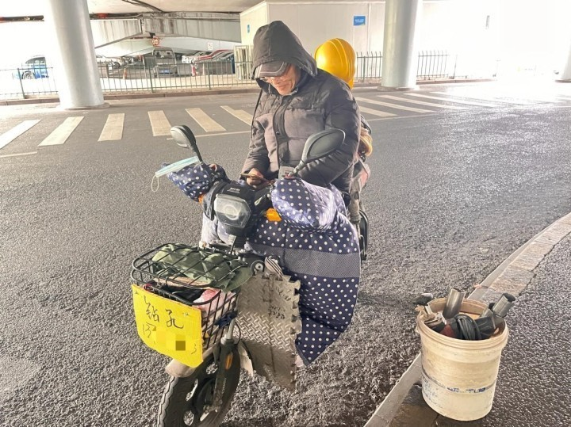
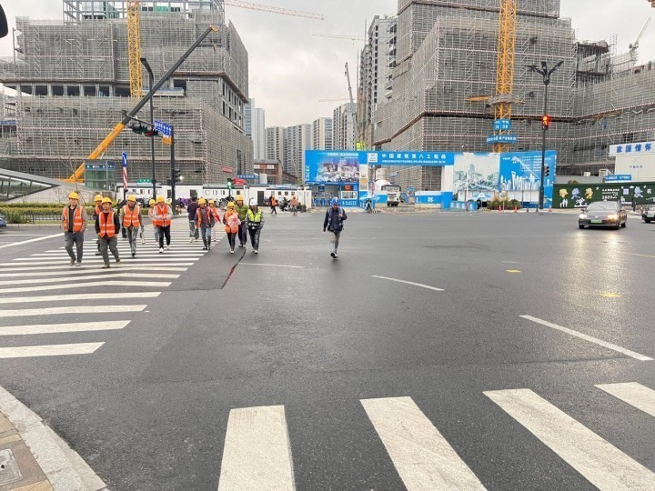
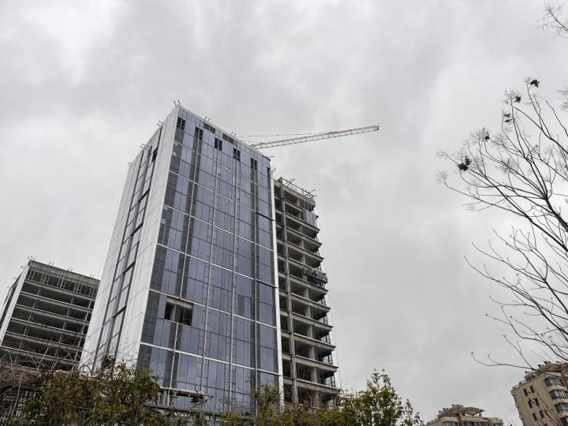
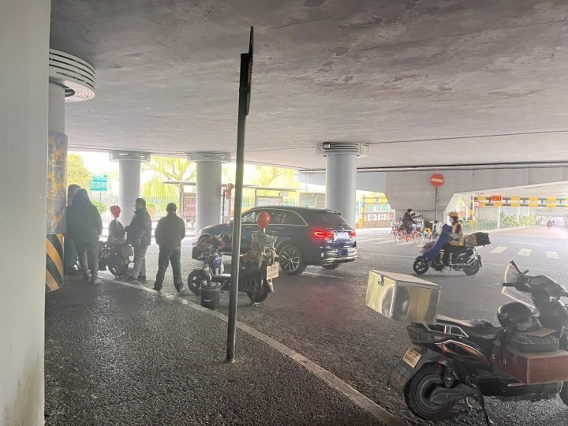

# 未来十年有近8000万农民工面临“超龄”，媒体：请给他们一条出路

_等待工作的老傅。潮新闻记者
朱高祥 摄_

太阳渐渐落山了，老傅仍没等到一个活，而这已经是他过去一周的常态。

杭州凤起路立交桥下，是老傅的“根据地”，这里聚集着许多前来寻找零工的人。装着各式工具的破旧电瓶车停在路边，挂着的纸牌上写着“木工、油漆、打孔”等，表明了他们的身份与目的。

老傅跟这些人都已经相互熟识，没事的时候，他们经常三五成群地围在立交桥下聊天，高高的嗓门超过了疾驰而过的车流声。他们时不时到处张望，眼睛紧盯着来往的行人，寻找可能的雇主。

这些人多是上了年纪，普遍在50岁甚至60岁以上，有的头发已经花白，用沾满灰尘的帽子遮着，在与记者的交流中表达着对于找工作难的无奈。

2019年起，全国多地发布建筑业“清退令”，60周岁以上男性、50周岁以上女性以及18周岁以下人士禁止进入施工现场从事建筑施工作业。

而今年2月13日，2023年的中央一号文件公布，其中，在拓宽农民增收致富渠道、促进农民就业增收方面明确提出，要“维护好超龄农民工就业权益”。

被“赶”出工地后，这些超龄农民工经历了什么，他们该向何处去？

遭遇“清退令”

离开工地开始打零工

3月17日，杭州下起了小雨，气温骤降。经过凤起路立交桥的行人，都明显加快了脚步。

老傅坐在自己的电瓶车上，无聊地刷着手机。电瓶车上满满当当，电钻、电线、安全帽、塑料……全是他干活的工具。

今年64岁的他，来自江西鹰潭，外表看上去干净儒雅，刷手机时总会掏出一副老花镜戴上，连衣的帽子让人看不出他的实际年龄。家里的孩子虽然都已成家立业，但他还是闲不住，想出来挣一点，免得向孩子伸手要钱。

“1978年的时候当过兵，退伍之后大部分时间都在老家。后来，孩子结婚买房，用钱的地方多了，我就出来打工，全国很多省市都去过，工地也干了好多年。60岁的时候，工地不让干了，只能出来打打零工。”老傅边刷手机边跟记者交流。

事实上，就算打零工老傅也已经没啥竞争力，万一遇到看身份证的雇主，大概率会被拒绝。“这段时间基本没啥活，天天就在这闲着。”老傅称。

像老傅这样，上了年纪仍在打零工的人不在少数。潮新闻记者在杭州走访时发现，不少路口都有一些等零工的人，多是干一些家庭装修、水电维修的工作。

据了解，此前，上海、广东深圳、江苏泰州、江西南昌、湖北荆州、天津、广东珠海横琴新区等地陆续出台政策清退超龄农民工，要求进一步规范建筑施工企业用工年龄管理。

比如天津市住建委就在政策中规定：施工单位与建筑工人签订劳动合同时，应当严格执行国家关于法定退休年龄的规定，对男性超过60周岁、女性超过50周岁的不得签订劳动合同。不得安排或使用男性55周岁以上、女性45周岁以上的建筑工人进入施工现场从事高空、特别繁重体力劳动等高危险性、高风险性工作。

但同时，一些地方的规定也留下了一些“弹性空间”。比如天津规定，因特殊情况确需安排或使用超龄建筑工人的，施工单位应当对超龄人员健康证明（健康证明有效期为1年）进行核验，并根据项目具体情况合理安排工作岗位。

河南周口的老张像老傅一样也有着回不去的家乡，在老乡的帮助下留在天津的工地奔波。

老张早年当货车司机跑长途，根据法律规定，60岁之后不能再驾驶大型货车。收入断了，但家里的开支并没有减少，儿子的房贷压力需要他分担，老张也只能扛起装满行李的蛇皮袋，走出家门。

建筑工地里高空作业一天四五百元，扛沙包水泥的工作一天二百多元，但这些高危重体力的工作不会找上他。他经熟人介绍，在工地里做一些清扫与绿化工作，每天100元的收入虽然不高，但相比闲在老家，已经让他非常满意。

武汉大学中国乡村治理研究中心副教授夏柱智告诉潮新闻记者，限制“超龄农民工”从事建筑施工作业，这一政策在全国多地已实行数年。但以安全为由的超龄农民工“清退令”，所带来的争议也是一直存在的。

“清退”老建筑工的包工头说

规定就在那里，自己也没有办法

“我干工地干了一辈子，现在说不要就不要了。我身体还健康，为什么就不能干了。”

去年底，家在安徽阜阳的老陈最终还是被公司辞退了，可他想不清楚，自己身体很好还能干，为什么就被“清退了”。

老陈在上海务工多年，一直在工地干外墙保温工作，在吊篮里上上下下，高空作业成为家常便饭。2021年，施工单位找到当时已经60岁的老陈，警告称不能再继续留在工地上干活。不干活就没有收入，老陈多次找熟识的领导求情，才最终被答应可以再干一年。

可今年以来，老陈所在的建筑单位管理更加严格，每个人都要进行身份证登记与人脸识别，老陈这样的“超龄”农民工都不再被允许进入工地。老陈告诉记者，他准备回老家了，种种地，看看家附近的工作机会。

_刚下班的工人。潮新闻记者
朱高祥 摄_

有观点认为，“清退令”的初衷是好的，即保护超龄农民工的生命安全。建筑行业具有繁重高危等特点，而超龄农民工在建筑工地这类高危工作环境下，可能因反应不灵活、体力不支等原因而出现安全事故；而在实际生活中，近些年建筑工地上的安全事故确实也多发生在大龄农民工身上。

2021年5月17日，上海市建设工程安全质量监督总站发文称，近期本市建筑工地连续发生多起人员疑似猝死事件，其中多数年龄均超过60周岁。

对于超龄农民工的人身安全的保护，也是很多地方发布此政策的初衷。比如，上海市“依据《中华人民共和国劳动法》《国务院关于工人退休、退职的暂行办法》等法律法规，结合建筑施工作业‘高空、高危、高风险、重体力、技术要求高’的岗位特征”，提出进一步规范建筑施工企业施工现场用工年龄管理有关要求。

潮新闻记者在与农民工交流中也了解到，确实时不时会有一些年纪大的人，从脚手架上摔落致伤或者从高空坠落致死。“年纪大了，不像年轻人反应快，老胳膊老腿的，一不注意就容易受伤，谁敢要咱们啊。”有工人告诉记者。

有包工头也向记者道出了自己的无奈，很多人跟着自己工作了几十年，有技术有体力，还能继续干，但是规定就在那里，自己也没有办法。“留着不仅要面对施工集团检查时的罚款，也要承担相关工伤风险。”该包工头称，最近5年，一批老的建筑工人陆续被清退了，大多是60后的工人。

_正在施工的工地。潮新闻记者
朱高祥 摄_

“上世纪50、60年代出生的农民工，是最早出去的一批，也是最受建筑行业“清退令”影响的人群。”夏柱智告诉记者，他们生长在集体时代、有农业劳动的经历，他们最先出去打工，做的也是最苦最累的活。他们对“超龄”实际上是不理解、不能接受的，他只有干得动干不动、愿不愿意干的概念，没有法律上“超龄”的概念。

夏柱智称，所谓的60岁“超龄”，是按照《劳动合同法实施条例》来界定的，其中规定“劳动者达到法定退休年龄的，劳动合同终止”。

据了解，对于退休年龄，《国务院关于工人退休、退职的暂行办法》规定，男年满六十周岁，女年满五十周岁，连续工龄满十年的，可申请退休；从事井下、高空、高温、特别繁重体力劳动或者其他有害身体健康的工作，男年满五十五周岁，女年满四十五周岁，连续工龄满十年的，可申请退休。

但夏柱智认为，这适用于正规的劳动力市场，但建筑业中存在农民工不签订劳动合同的非正规劳动力市场。此外，“超龄”实际上是一个管理术语，包含了一个价值判断——他们超龄了，应该退休了——忽略了农民工本身的身体状况、就业意愿和家庭收入状况，有点“一刀切”了。

采访中，一些超龄农民工向记者表示，自己如果在老家，收入来源是比较有限的。老傅称，自己能拿到的养老金，每年也就一千多元，养老保障不太够。

据了解，我国目前施行城乡居民养老保险制度，养老金待遇由基础养老金和个人账户养老金组成，基础养老金最低标准为每人每月98元。

近年来，许多省市的城乡居民基础养老金最低标准在不断上调，但不少地区相对还是较低，每月在100-200元之间。因此，一个人能拿到多少养老金，在基础养老金之外，更取决于其个人账户部分缴纳数额的多少。而在农村地区，很多农民缺乏缴纳养老保险的意识，导致到了退休年龄之后，能拿到的养老金比较有限，这也是很多超龄农民工不得不继续外出务工的原因之一。

往何处去？

给未来8000万农民工一个答案

在凤起路立交桥下，等零工的人还会每天来到这里。

“什么都能干”是他们最常说的话，小到通马桶、打扫卫生，大到装修房屋，他们都会接下来。在交谈中，一些人已经习惯了这样的生活，虽然挣得不多，但相对自由，但也有人希望重返工地。

_立交桥下等待工作的人。潮新闻记者
朱高祥 摄_

国家统计局发布的《2021年农民工监测调查报告》显示，2021年全国农民工总量29251万人，比上年增加691万人。从年龄上看，50岁以上农民工所占比重为27.3％，比上年提高0.9个百分点。这意味着未来十年间将有近8000万农民工面临超龄问题。

在社会对“超龄”农民工热议的同时，已有一些地方对“一刀切”的政策进行纠偏。去年6月15日，安徽省住房和城乡建设厅发布公告称，实行柔性用工管理，分岗位确定用工年龄，避免建筑行业农民工“超龄”一刀切。此外，江西、四川等多地陆续出台类似政策要求。

紧着着当年11月，人社部等五部门联合印发《关于进一步支持农民工就业创业的实施意见》明确，指导企业不得以年龄为由“一刀切”清退大龄农民工、为有就业需求的大龄农民工免费提供公共就业服务。

夏柱智告诉记者，农民工没有城镇正规劳动力市场的退休金，因此即使超过60岁，农民工本质上还是农民。农民工主观上也没有“退休”的概念，他们很多人经常脱口而出的一句话就是“干到不能动为止”，即使从事农业生产也是这样。

毫无疑问，农民工群体的生命安全是一个必须直面的现实问题，但部分地区的实践案例表明，目前完全可以在不清退大龄农民工的前提下，大幅改善和解决这一现实问题。

夏柱智曾调研湖北某县家政市政工程行业，该县大约有4-5万农民都在从事家政市政工程行业，其中空调安装维修经常需要墙外高空作业。夏柱智发现，一些大龄农民工会想办法自我调节劳动强度，几户人家凑钱买机械设备、智能设备，例如管道检测机器人，可以代替人工下地去查看管道。以往包工头组织作业时，也会依据个人的年龄状况、健康状况、技术状况和个人意愿来分配工作，避免工伤意外的发生。

对于“超龄”农民工的出路，夏柱智提出了一些建议，比如由施工单位和包工头、建筑工人签订作业合同，加强安全意识与安全作业技能培训，购买统一的工伤意外保险，可根据实际情况允许适当放宽购买工伤保险的年龄限制。在一些行业发展规模较大的地区，在政府支持下还可以成立行业协会，在专业技能培训、安全意识和安全作业培训等方面发挥重要作用。

北京潮阳律师事务所律师胡钢在接受潮新闻记者采访时表示，除了禁止“一刀切”政策之外，政府可以提供的帮助还有很多。

“我们都知道，与城镇居民相比，超龄农民工可以享受到的退休待遇很低，每月几百元的养老金并不能保证他们过上有尊严的老年生活。从长远来看，逐步提高城乡居民基础养老金水平是必要的。”胡钢称。

“转载请注明出处”

