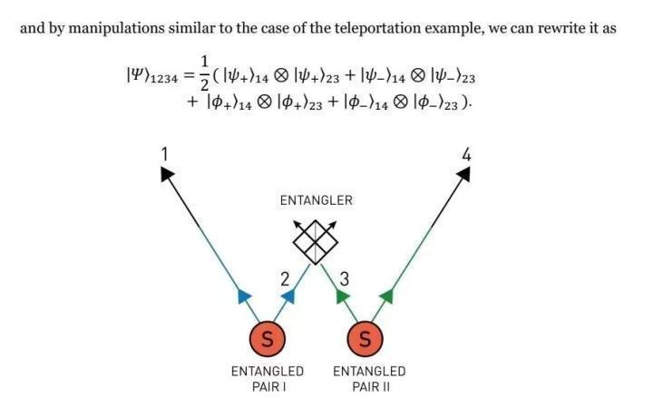

# 清华一本科生做作业时发现了诺奖背景报告笔误，获瑞典皇家科学院感谢

近日，一封来自瑞典的感谢信，抵达清华大学物理系教授王向斌的邮箱，感谢他和学生木清（化名）发现并指出2022年诺贝尔物理学奖科学背景报告中的一处笔误。

据清华大学介绍，量子纠缠是一种奇特的量子力学现象。此前三位科学家因开创性实验，展示了处于纠缠状态的粒子潜力，获得诺贝尔物理学奖，引发学界广泛关注。

而在2022年12月，在完成“大学物理”课程延伸学习时，电子系大二学生木清发现，2022年诺贝尔物理学奖科学背景报告的量子纠缠swapping推导中，第十一页最后一个公式|Psi>_似乎有些不对。

**“正确公式右边4项应该都取正号，然而它却是2正2负。”难道公式出现笔误了？**

面前是权威的诺贝尔物理学奖，自己是才入门的学科“小白”，加之公式符号虽然有错但并不影响前后文逻辑，木清犹豫再三，还是将自己发现的问题告知了老师王向斌。

王向斌从教多年，第一时间为学生答疑解惑已然成为他的习惯。两人的探讨一直持续到凌晨，一次次确认背景概念定义，一遍遍在稿纸上演算推导结果表明，报告中确实笔误了！

于是王向斌帮助木清把发现的问题，反馈给了瑞典皇家科学院。对方诚挚接受并按照建议更新了报告版本。

中国青年报记者得知此事试图与学生取得联系校方工作人员反馈称——木清此前就再三要求，报道中不要出现他的本名。 **“什么时候要是能做出真东西，再用真名。”**

王向斌说学生身上这种敢于质疑的精神，是他最珍视的。“即使是笔误，也要修改，不能含糊。通过这件事，同学们更加深刻地认识到科学面前人人平等，没有绝对的权威。谁都可以提出合理疑问，这正是学术的魅力，物理学的魅力。”

来源：清华大学

