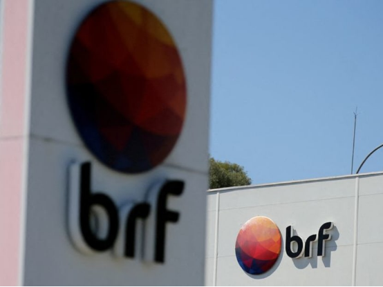

# 美媒：卢拉访华前，数百名巴西农业企业代表已“涌入北京”

【环球网报道 记者 张晓雅】彭博社25日报道称，在巴西总统卢拉访华前，数百名巴西农业企业代表本周“涌入北京”，寻求增加对华出口合作，并吸引投资。

彭博社称，巴西农业和畜牧业部部长卡洛斯·法瓦罗与规模异常庞大的商业代表团一起于22日抵京，为两国间的潜在合作铺路。报道说，虽然并没有给出双边贸易的明确目标，但洛斯·法瓦罗在24日的一次采访中说，他的任务是重建两国之间友好关系。

与此同时，除了卡洛斯·法瓦罗，路透社补充说，此次巴西赴华代表团成员还包括几位巴西联邦政府代表、农业领域代表和肉类加工业领域代表。

彭博社称，巴西是中国农产品的主要供应国，占中国大豆进口的60%，牛肉进口的40%。如今巴西希望进一步深化对华合作，同时与中方制定合作战略，防止农业扩张损害环境。

报道说，巴西总统卢拉将于下周一抵华，虽然卢拉的行程很紧凑，但至少在贸易和农业相关对话中，巴西牛肉产业可能会占据话题的核心；与此同时，巴西对华出口更多猪肉产品也在讨论之列，报道援引巴西动物蛋白协会（ABPA）负责人、此次访华代表团成员里卡多•桑廷的话称，增加部分猪肉产品对华出口可能每年为巴西的猪肉行业带来1亿美元的增长。

“尽管中国是巴西肉制品相当重要的市场，但仍有增长空间，因为巴西在中国市场的份额不是非常的大，”报道援引卡洛斯·法瓦罗的话称。

彭博社称，自中国去年从巴西进口豆粕后，大豆压榨商也看到深化合作的希望。此外，巴西棉花生产者协会（Abrapa）负责人亚历山大•申克尔表示，巴中加强合作可能会让美国农民失去一个关键市场，也可能推动巴西更接近取代美国、成为全球最大棉花出口国的目标。

不仅如此，报道说，巴西还希望中国企业在港口、航运、铁路和其他基础设施方面进行新的投资，以使产品更好地从巴西流向国际市场。

