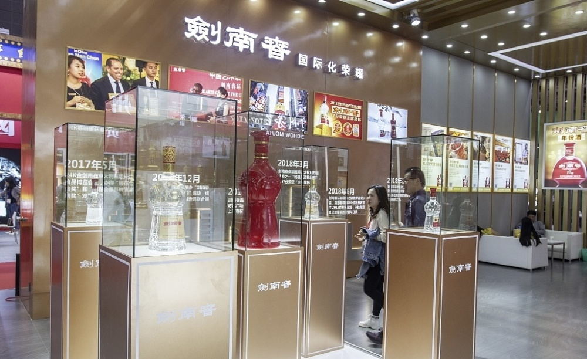
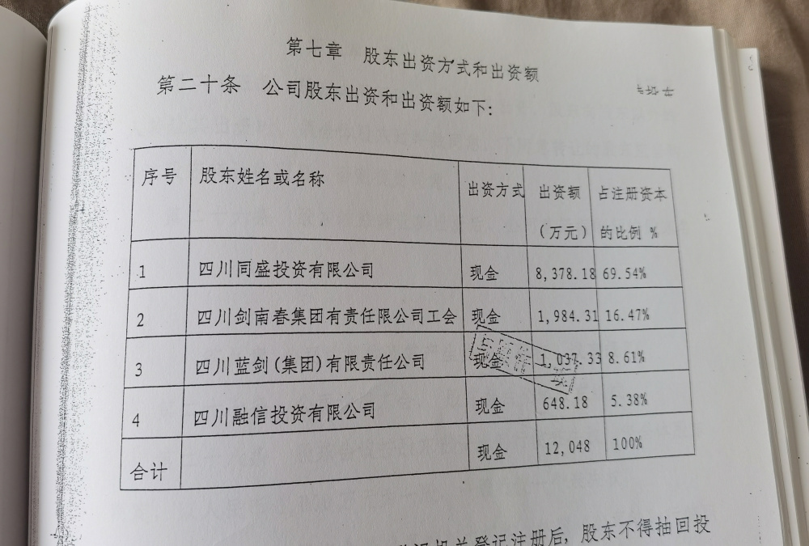

# 董事长乔天明一审判决，剑南春能否再圆上市梦？中粮、五粮液均曾觊觎

作者｜陈弗也

编辑｜杨布丁

出品｜棱镜·小满工作室

在被公开审理4年半后，剑南春集团董事长乔天明案终于一审宣判。

3月24日，乐山市中级人民法院发布公告，乔天明因行贿、私分国有资产被判处五年有期徒刑，并处罚4亿元。其中，以行贿罪被判处两年有期徒刑，以私分国有资产罪被判处有期徒刑四年，并处罚人民币4亿元。

一位长期关注该案的法律人士向作者表示，根据刑法、刑事诉讼法相关规定，法院判决执行前，司法机关依法采取拘留、逮捕和指定居所监居住限制或剥夺被告人身自由的，可以按照相关比例折抵一定的刑期。由于乔天明早在五年前便被羁押，宣判后他可能很快被释放，或者只需羁押不会太长的时间。

剑南春曾与茅台、五粮液并称为“茅五剑”，是久负盛名的白酒品牌，但在白酒股狂飙突进的今天，剑南春成为了少有的一家尚未上市的知名酒企。处于多事之秋的剑南春也一直被资本觊觎，外界曾经盛传五粮液、四川发展控股有限公司、中粮集团等企业有意对其收购。

如今，乔天明的案件终于告一段落，已经被茅台、五粮液远远甩开的剑南春，又将何去何从？

**2.6亿国有资产隐匿路径**

乔天明的大半辈子都在剑南春度过。他于1982年进入剑南春工作，此后逐步升迁，用了18年的时间，成为了这家酒企的掌门人——董事长兼总经理，并在2011年被中国轻工业联合会评定为“中国酿酒大师”。

根据乐山中院的公告，乔天明的私分国有资产罪源于20年前的改制，他伙同他人通过伪造财务资料等方式隐匿国有资产2.6亿元，并将这些资产归到改制后的新剑南春。

乐山中院认为，乔天明作为直接负责的主管人员，其行为构成私分国有资产罪，并且数据巨大，应当数罪并罚。

2018年9月，乔天明案公开审理后，《财新》在一篇文章中披露了检察机关指控的具体细节。

据报道称，2003年改制期间，剑南春有一笔9400万元“收入”被错误地记为“应付账款”，这笔钱本是剑南春为扩建厂房向经销商收取的集资款，按照合同约定，这笔集资款不返还，但剑南春会通过降低供货价的方式补偿给经销商，相关合同已经在1993年至1999年执行完毕。

在乔天明的指示下，这笔钱通过伪造新合同、删除相关集资不返还的条款将收入做成了负债，并把钱留给了改制后的剑南春公司。

此外，乔天明还指使相关负责人通过伪造广告合同，开具虚假发票，将约为1.01亿元的收入变为对广告商的负债；在改制过渡期间，在乔天明知晓的情况下，提前支付给广告公司6000余万元的广告费用，由原剑南春支付，收益方则为改制后的新剑南春。

在当时，对于剑南春来说，2.6亿是个不小的数字。根据作者获得的四川华衡评估有限公司出具的《资产评估报告书》，截止到2003年3月31日，剑南春的净资产仅12亿元。

根据作者获得的《四川剑南春集团有限公司国有资本有序退出、实施战略性改组的方案》，在这场改制中，剑南春的国资全部退出，由酒厂管理层进行收购，职工也可以出资持股，再引入战略投资方，最终将这家县属独资企业变成一家民企。

一位剑南春的老员工向作者表示，当年改制时，由于涉及到员工持股，如果资产被评估得低了，持股所需要的费用就会低，有员工就会配合隐匿资产。

改制后，由管理层成立的四川同盛投资有限公司出资6.4625亿元，占股69.54%。作为管理层的核心人物，乔天明则成为了剑南春的最大股东，他也是此次改制最大的受益人。据作者查阅的最新数据显示，乔天明通过直接或间接持有剑南春30.399%股权。

_2003年9月，改制完成后，剑南春发布新的公司章程，此为作者对章程的翻拍_

这样改制模式在当年一度颇为流行，有研究者甚至将2003年称为“中国的MBO年”。

所谓MBO，便是管理层收购模式，管理层出资将国有企业中的国有资产收购，从而成为大股东。但是，由于这种模式暴露出了收购主体自卖自买、资金来源不明、国有资产流失等问题，财政部一度将其紧急叫停。

**走过十年“多事之秋”**

在剑南春内部，2003年的那次改制被称为“二次创业”，此后，剑南春获得了长足的发展。

根据资产评估报告，改制时，剑南春的评估价值是12亿元，2012年，剑南春曾经公布一次“家产”，当年，他们的净资产评估值在183.9亿元-201.31亿元之间。而此时，五粮液的总资产为441.3亿元，茅台的总资产为554.5亿元。

2008年汶川地震，让剑南春遭受重创，剑南春所在绵竹市是重灾区，不少酒窖被震坏了。

一位曾在四川担任过处级干部的官员与乔天明认识多年，他曾向作者回忆，那个时候，整个绵竹市到处都能闻到酒香，乔天明压力很大，生怕酒厂毁在自己手里。为了缓解乔天明的压力，他专门教会了乔天明打麻将，在四川，不会打麻将的人并不多。

剑南春也从汶川地震的阴影中走出，后来快速发展，直到2012年那次公布资产后，这家酒厂也开始进入了漫长的“多事之秋”。

2012年8月，《剑南春员工持股信托计划实施办法》的发布，引爆了员工与公司的矛盾，2003年的那次改制，也再度被人提起。

多位剑南春员工曾向作者回忆，2003年改制时，根据职工持股计划，持股员工也是剑南春的股东，但是新的“信托计划”则剥夺了他们的股东身份，手中的股权也变成了“收益权”。

此事一度导致剑南春停工数月，直到当年11月才全面复工。第二年的6月，企业、职工、政府三方协调后，达成了一个“溢价回购”的方案，剑南春以均值14.06元/股的价格回购了职工手上所持有的股权，此事才暂时平息，但直至今日，依然有员工对这样的结果表达不满。

两年后，2015年5月，乔天明一度失联，接受纪委调查，2017年1月，乔天明曾因病被取保候审，但一直未能重获自由。

当时，乔天明被牵涉到四川省原副省长李成云的贪腐案中。2017年5月，李成云因受贿罪被判处有期徒刑10年，判决书称，李成云曾为乔天明等单位和个人谋取利益，直接或通过其妻收受这些单位和个人的财物。

1979年出生的乔愚是乔天明的儿子，他曾经长期担任公司副总经理，董事长、总经理则一直由失去自由的乔天明兼任。

一位剑南春的老员工向作者介绍，乔天明有意培养乔愚，但非常慎重。在乔天明失去自由的几年里，副总杨冬云、蔡发富都曾主持过一段时间的工作，他们二人都是乔愚的叔辈，是剑南春的老员工。

“很多人对乔愚接班的事情也不看好，剑南春的老人太多，并且都很有话语权，乔愚的资历太浅。”上述老员工说。

不过，去年4月，剑南春还是进入了“乔愚时代”，他被推选为公司副董事长、总经理，开始主持全面工作。

**被并购还是上市？**

在乔天明失去自由的那几年，剑南春开始被各路资本给盯上。

在白酒股狂飙突进的资本市场，年营收在200亿左右的剑南春，无疑是一家优质标的。由于剑南春非上市公司和发债公司，其财务数据一直都是个迷。不过，根据媒体报道，剑南春曾公开过数据，其在2021年总营收为216.37亿元。

而在2021年，汾酒的营收为199.7亿元，洋河的营收为253.5亿元，如今，这两家酒企的的市值分别为3338亿元、2466亿元。

2016年、2017年，中粮集团的高层曾多次赴剑南春进行考察，每次考察都会引发外界的猜想。2014年时，中粮集团曾入主了酒鬼酒，但与剑南春相比，当时的酒鬼酒规模并不算大。

2018年6月，五粮液收购剑南春的“绯闻”也开始在业内流传。根据当时的报道，在股东大会上，时任五粮液董事长李曙光在回答有关收购标的的问题时，曾讳莫如深地说：“肯定有标的，但这比较敏感，不便多说，但可以自己体会。”

他表示，五粮液会瞄准“白酒行业的优质标的”，并强调四川的“六朵金花”（五粮液、泸州老窖、剑南春、沱牌曲酒、全兴大曲和郎酒）资源丰富。

而在四川的“六朵金花”中，只有剑南春和郎酒没有上市。

此外，根据媒体报道，四川发展（控股）有限公司也对剑南春表达了浓厚的兴趣。

事实上，在2003年的那次改制中，“上市”二字就曾被多次提及。当年的改制方案曾经这样写道：“剑南春集团一定会一如既往，全力以赴，支持剑南春股份深入改革，加快发展，早日上市”，“坚定不移地继续推动剑南春股份的上市工作”。

但是，多年来，剑南春始终没有在资本市场迈出实质性的一步。

如今，乔天明的案件终于告一段落，但是，对于剑南春来说，上市依然充满未知，其中，无形资产的产权不明，就是一大难题，这也是2003年改制遗留下来的问题。

2012年，剑南春在对资产进行评估时，得出的估值在183.9亿元-201.31亿元之间，其中包含绵竹市政府享有的无形资产价值62.3亿元。

根据2003年的改制方案，绵竹市与剑南春曾有约定，在不改变注册地、结算地的前提下，已注册的剑南春商标等无形资产归新剑南春所有。如果新剑南春集团将注册地、结算地搬离绵竹地域，政府有权对其追索。

如今，摆在剑南春面前最大的问题，是如何追回失去的白酒股黄金十年。过去几年，剑南春一直没有新的爆款产品出现，在高端品牌上，也被茅台、五粮液远远地甩开。

“乔愚上任总经理后，聘任蔡发富为常务副总经理，主持公司日常工作，同时也聘任了赵君、田锋、邓晓春为副总经理，他们都是新生代。”上述剑南春老员工向作者介绍。

**腾讯新闻出品内容，未经授权，不得复制和转载，否则将追究法律责任。**

