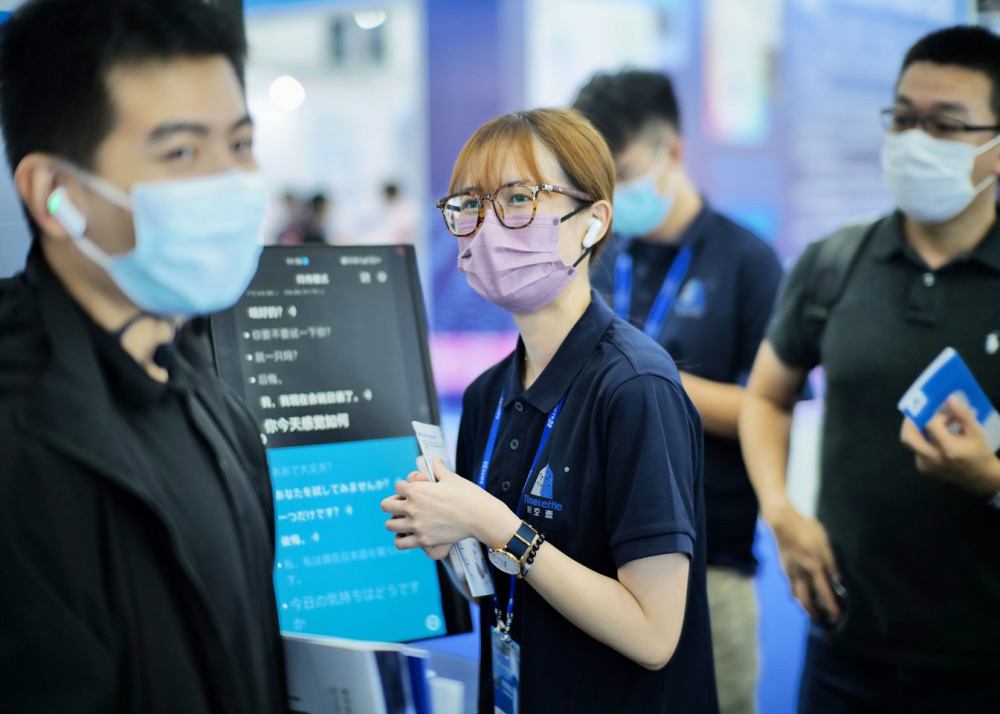

# 五年内95%的翻译都要失业？ChatGPT杀入，从业者加速转型

_（视觉中国/图）_

2022年11月，在深圳举行的第二十四届中国国际高新技术成果交易会上，有参展商演示人工智能翻译耳机。

“我在这里大胆预言一句，五年之内，95%的翻译从业者都要失业。”2023年2月5日，一则标题为“劝人翻译，天打雷劈”的B站视频中，一位自述曾做过译员的up主如此预言。

让他如此感慨的，不仅仅是翻译行业竞争激烈、大量从业者收入不高的现状，更有ChatGPT横空出世的抢饭碗危机。这个由AI技术驱动的自然语言处理工具并非专为翻译而设计，其翻译能力却让前述up主评价为“把你们英语系所有人加一块，教授都算上，都比不上ChatGPT一个指甲盖”。视频中，他提及，ChatGPT在两秒内就完成了一份将中文法律文本翻译为英文的工作。其不仅没有语法错误，还能根据人的指示，不断润色、修改风格。

这则视频在B站播放量达到五十余万，也引发了翻译从业者的讨论。几乎所有受访译员都认为，在一些领域，AI在短期内仍无法媲美人工翻译，一些译者能与AI共存。不过，他们大都确信，今天的AI令“机器翻译即将替代人工”的传言又向现实迈进了一步——那些主要从事低端、低价翻译工作的译者，或许真的会被AI代替。

比人类厉害吗

ChatGPT、谷歌翻译、DeepL、搜狗……7个机器分别完成云计算领域40个句子的英翻中后，译文呈现在了有7年中英笔译经验的自由译员Scar面前。她将要判定，这些译文孰优孰劣。

2023年3月13日，Scar接到了来自程序员客户的测评业务：对多个市面常见的机翻软件完成的中英互译文本进行测评。涉及云计算、儿童剧本、编程和企业宣传领域的四个母文本，每个都被不同的机器翻译为5-7份译文，送到Scar手里。客户希望听到来自翻译业界的建议，以期对机器翻译进行改进。

对于翻译行业而言，机器翻译像是个“幽灵”。大部分受访译员都告诉南方周末记者，机器取代人工的预言多年前就开始笼罩翻译业。Scar就记得，一位亲戚数年前曾问过她：“现在怎么还有翻译这个行业存在？”而自ChatGPT于2022年底发布以来，其强大的翻译能力令“狼来了吗”的疑问再次摆在了无数译员面前。

云计算翻译的测评时刻到来。经过一番对照后，Scar发现，7个机器在术语处理上是五花八门，也有句子翻译得十分拗口。至于近期火爆出圈的ChatGPT，竟然漏译了。

综合多份译文，Scar觉得，ChatGPT的发展“还不成熟”。“新兴技术它还是翻不来的，比如云计算这个领域，翻着翻着它就跳了。另外，要人脑介入的领域，机器基本上表现得都不怎么样，比如市场、产品宣传，机器是能把译文翻出来，让你大概了解这个意思，但是你想把这个文稿当宣传文案贴出去，那是肯定不行的。”

尔东萱翻译工作室创始人、中英翻译陈萱也有类似的观点，ChatGPT能够承担简单机械、重复部分较多的文本翻译工作，甚至可以翻译一些科幻小说。但一旦涉及文学性强的翻译，ChatGPT就捉襟见肘了。3月，她让ChatGPT将朋友写的一句旧体诗“人间倚灯火，举袂谢清辉”翻译为英文。ChatGPT最终翻译得“意思不太对”，甚至杜撰了一些内容——它加了一句注释：此为李白《静夜思》中的一句诗。

主业在互联网公司做产品工作的艾珂兼职中英翻译已有三年。自2023年2月开始，她逐渐在工作中接触到了ChatGPT。第一次使用后，她觉得ChatGPT的确比过去使用过的谷歌翻译效果更好，然而，它也存在明显的缺陷：中翻英的能力远不如英翻中。在尝试中翻英一篇新闻后，她发觉：“译文基本上每一句话都需要你再校对、审阅，然后重新编辑。”

不过，纵使ChatGPT存在诸多问题，一些译员还是向南方周末记者坦承，它的翻译能力仍有可圈可点之处。专注医学领域笔译已有四年的自由译员Ivy自觉并不擅长宣传文案的翻译。一次，她接到一个宠物产品宣传语中翻英的任务，在完成第一版的翻译后，她干脆把文案扔进ChatGPT中润色，不满意就让AI继续，直到拿出最满意的版本；面对商务领域笔译中专业性强的术语翻译时，从业八年的口笔译译员唐均甚至觉得ChatGPT“比人类更厉害，因为它的语料库非常强大，词汇量远强于人类”。

技术“魅影”

在几乎所有受访译员的记忆中，技术的“魅影”在入行之际就开始伴随着他们。

2010年，陈萱从保加利亚语专业本科毕业后，前往英国就读翻译硕士。在那里，她首次接触到了像Trados这样的计算机辅助翻译技术。她告诉南方周末记者，诸如Trados一类的软件能够帮助译者将此前翻译过的相同词语、句子自动翻译出来，从而提升效率，这也是业界都在使用的工具。

至于谷歌翻译这样的机器翻译，她则接触得更早——在大四时，她接了一单将英语说明书翻译为保加利亚语的工作。那时，她觉得“打字好累，有没有一个东西能够迅速地给我出个初稿”，于是，她将说明书放进了谷歌翻译中。很快，谷歌翻译给出了译文初稿，选词“竟然还挺准确”。她逐句修改后，便将译文交了上去，半天时间就赚了三百余元。陈萱觉得，这个活儿“做得还挺开心的，又挺轻松”。在后来的翻译工作中，她也渐渐地开始尝试使用机器翻译，遇上简单、重复、机械而故事性不强的文本翻译，她就会用谷歌翻译一份初稿。

相较于陈萱，Scar使用机器翻译则要晚得多。2014年，她从比较文学与世界文学专业硕士毕业，入职一家翻译公司。她记得，那时公司有使用Trados这样的工具，但谷歌翻译这样的机器翻译则是“风刮来了”，但“完全不能用”“根本没有人看得上”。

但显然，这股风在几年时间里越刮越烈，机器翻译也在不断升级。自2017年开始从事自由口笔译工作的译员高大玉就记得，她在大约六七年前开始使用谷歌翻译。最初，谷歌翻译只在翻译专业词汇上能力较强，一旦翻译大段文本，其效果就很难令高大玉满意。然而，随着时间推移，谷歌翻译逐渐进化，到后来，其翻译逻辑性强的说明类文章，水平已经超过了市面上大多数译员。

高大玉向南方周末记者回忆，她曾有一位法语专业的朋友，在了解到谷歌翻译的能力后，重新选择了学业方向，去法国读了商科，回国后便从事咨询工作，彻底离开了语言行业。

大风不止。到2018年左右，高大玉接触到了更新一代的机器翻译工具DeepL。她发觉，尽管依然是强在翻译说明性文字、弱在翻译文学性文本，但DeepL翻译篇章的能力已经胜过谷歌翻译。她开始逐渐在工作中使用DeepL作为辅助。

不仅是笔译，机器翻译也开始走入同传这样的口译行业，然而在陈萱与高大玉看来，其效果并不好。在2018年，还曾有知名智能语音和人工智能企业陷入同传造假风波。一位自述为同传译员的网络用户称，前述企业在北京某会场冒名使用他和搭档的翻译成果，即对外播出的实时同传是机器人声，朗读内容却是他和搭档的翻译被识别语音后转化成的文本。企业随后回应《南方都市报》称，其当时采取了人机协作模式，通过语音识别，转写同传翻译结果并上屏显示，方便没有耳机设备的嘉宾和观众实时观看字幕，译员与企业存在误会。

无论如何，Scar还是感受到了行业的急剧变化。2017年，她新入职一家翻译公司，在一次公司会议上，老板问出了这样的问题：现在天天在说机器翻译，我们的解决办法是什么？

对此，老板的回答是，机器翻译出来的东西，人工把它改到百分百的效果，“我们比它厉害，就不怕它”。

替代已在发生

机器翻译一路走来，至ChatGPT问世，似乎已然走到一个重要节点。对译员而言，洗牌时刻是否已经到来？

就口译而言，唐均觉得，市面上的一些翻译机已经能够在出国旅游、导游或是不涉及重要内容的陪同翻译方面发挥一定作用，但事涉重要场合，如会议细节磋商、合同条款商定、新闻发布会等，无论是同声传译还是交替传译，机器都很难代替人工。“这取决于你输入语的重要性，很重要的话，人们没办法完全相信机器。”唐均说。

但在笔译领域，变化正在发生。

译员赵瑢懿告诉南方周末记者，2019年，她从翻译公司离职。她记得，那几年公司开始大力推进开发机器翻译。这使得她大量的工作内容转变为译后编辑、润色，而相较于原先的纯人工翻译工作，译后编辑的收入下降了20%-30%，这意味着她要承担更大的工作量，方能达到开发机器前的收入水平。这是促成她转而从事自由翻译工作的原因之一。

ChatGPT或许正在加速这一进程。所有受访译员都声称，他们的业务需求及翻译收入暂时没有受到ChatGPT的影响，但唐均确信，ChatGPT已能够取代人工做低端的翻译，只要客户对翻译准确性要求不高，能看懂即可。他也坦承，在一些笔译工作中，他已经有些依赖ChatGPT。

高大玉预计，译员的翻译能力如在机器技术水平之下，确有被替代的风险，而市面上至少50%的笔译工作属于低端笔译工作。Ivy也认为，诸如某些要求不高的论文翻译、证件翻译、留学文书等工作完全可以交给机器，由此，80%的翻译工作者会被ChatGPT乃至后续更强的机器翻译取代，“（淘汰）50%的低端译员，然后30%不求上进的译员”。

焦虑也在传播之中。Scar告诉南方周末记者，尽管她认为目前机器在很多领域还不能取代人工，且不少客户会明确要求禁止使用机翻，但周围唱衰之声骤起，她难免受到波及。“你看2013年那会儿也在叫嚣机器翻译，那时候我们觉得它是个笑话，但是十多年过去了，机器翻译确实还是做出了一些成绩，有些东西还是可以用的。”她说，“你不知道再过10年它会发展成什么样。”

翻译工作之外，Scar还运营着一个有数百人的笔译社群。近来，有新人译员问她，自己总是接不到单，是不是受到了ChatGPT之类的AI影响？她知道，新人起用需要天时地利人和，项目匹配度、人手是否充足、是否有译员退出都是影响因素。另外，新人通过试译到稳定接稿之间也有一段距离，还需要磨合。但ChatGPT或许也造成了实在的影响——人们总是轻视翻译，觉得翻译简单，懂语言即可。如今有了强力的AI，外界觉得就更不必找人了，这给入门者造成了很大的困难。

但译员们仍看到了一种人与机器的共生之道。Ivy记得，2019年后，她主要接来自海外翻译公司的订单，从那时起，她业务中的80%都是译后润色的工作。不少公司开发了自己的机器，其功能颇为强大，发给她的一些机翻后译文甚至不怎么需要改动。而到了2020年后，Ivy发觉，国内的译后润色订单也越来越多。

赵瑢懿也认为，日后，翻译或将逐步转为人机结合模式，原先10个人做翻译，未来或许只需要2个人做机器的译后审校工作即可。

她甚至已经做好了彻底转型的准备。如果真到了不得不离开的那一天，赵瑢懿想，或许自己能去做个瑜伽教练。

（文中Scar、Ivy、高大玉为网名，艾珂、赵瑢懿、唐均为化名）

南方周末记者 姜博文 南方周末实习生 张蔚婷

