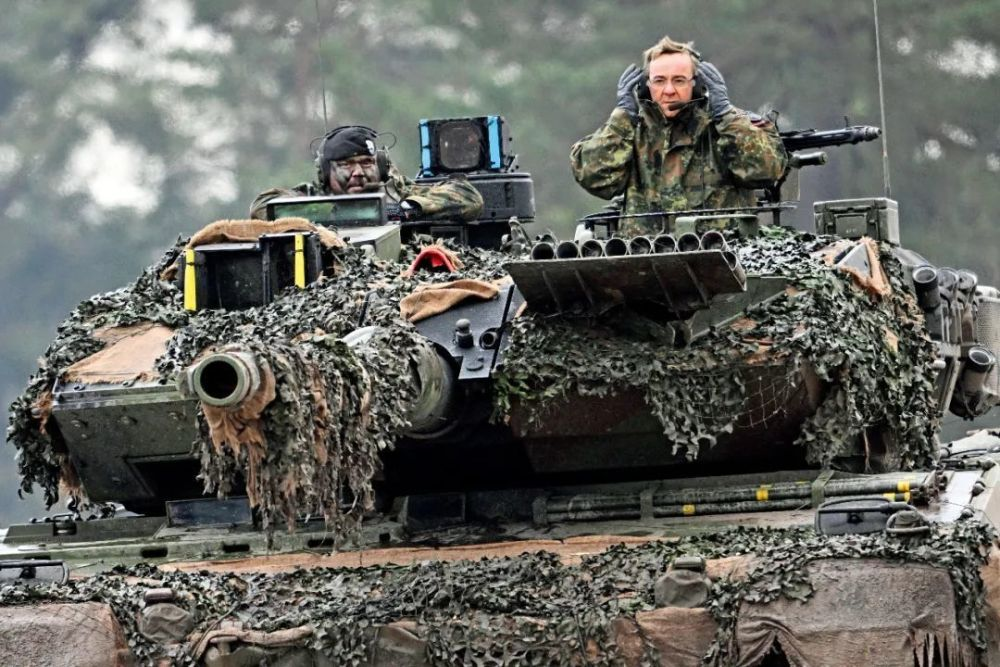

# 军援乌克兰，德国总理遭逼问“何时是个头”

自一年前乌克兰危机升级以来，德国武器援助问题始终是欧洲和全球舆论关注的一个焦点议题。3月初，德国总理朔尔茨进行了就任以来的第二次访美。破除德美因为乌克兰危机尤其是武器援助问题而产生的诸多龃龉，是这次短暂访问重要目标之一。

关于是否以及如何向乌克兰运送武器，德国一直备感压力。但是当德国总理朔尔茨1月末真的松口“放行”14辆豹2式主战坦克，西方国家却并没有如乌克兰所希望的那样一拥而上。

德国答应运送的这款主战坦克，尽管已经代表了世界顶尖的军工水平，却远远不足以对扭转战局起到决定性的作用——毕竟总数只有14辆。而泽连斯基随后提出的援助战斗机和军舰的要求，也遭到婉拒，朔尔茨称此事“眼下不在德国国会议程以内”。即便如此，德国援助豹2式主战坦克的举动也引发了俄罗斯的激烈反弹，他们称德方做出“极为危险的决定”。在2月2日反法西斯斯大林格勒保卫战纪念日上，普京更是在演讲中诉诸历史典故，用让德国陷入“话术两难”的二战来做比较，称“我们再次面临德国坦克的威胁”。

在乌克兰2022年11月收复赫尔松市后，俄罗斯进行了一轮大规模的军事动员。自进入寒冬以来，俄乌双方进入了消耗战。乌克兰不仅没有在领土上取得任何重大进展，甚至不得不在巴赫穆特等地面临围城。客观上而言，要继续捍卫领土主权，并在战局中持续赢得主动，乌克兰需要现代化武器。

在这种背景下，1月底，自乌克兰危机升级以来一直被西方阵营群嘲“骑墙”“怕事”的德国终于松口，同意向乌克兰运送豹2式主战坦克。与西方舆论整体上的一片沸腾不同，德国国内舆论审慎很多。有消息称，德国总理朔尔茨甚至因为这个决定受到党内逼问：“何时是个头？”

**“美国给我们就给”**

德国民众对于运送武器的保留态度，是朔尔茨顶着被西方国家群嘲的压力拖延至今的最大考量。摆在桌面上的政治难题有二：

其一，德国方面认为乌克兰有进攻克里米亚的意图。从军事方面而言，克里米亚半岛上的阵地是俄罗斯南下和维持陆地走廊的支柱。一旦获得西方装甲运兵车和主战坦克，乌克兰就可以朝这个方向反向推进。然而，对于乌克兰的支持是为了帮助其收复2022年2月24日后“失去的领土”，还是也包括克里米亚呢？

无论是德国，还是其他西方国家，在国际场合都尽量回避谈论这个问题。对克里米亚的袭击可能会刺激俄罗斯升级战事，这绝对不符合德国的预期。九年前的克里米亚危机引发了顿巴斯战争，最终在时任德国总理默克尔的斡旋下签署了《明斯克协议》。这个局面实属难得，被誉为促进地区和平的典范，俄乌双方当时也都还算满意。对于德国来说，克里米亚危机正是因为具有这样军事和政治上的双重意义，而变成“房间里的大象”。如何处理默克尔的政治遗产，也成了一个棘手的挑战。

这就与第二个政治难题紧密相关，也是一个持续时间更长、影响更深远的议题，即：如何处理和定义西方世界的团结？抛开西方价值观不论，北约作为一个共同军事组织在实际策略上也有一种默契：在乌克兰军援问题上基本一致对外，由美国牵头。因此，如果某一个北约成员国因为向乌克兰运送武器而被普京攻击，那么整个北约都将对攻击行为作出回应。但是，最近这一年却出现了一种情况，就是美国这个北约组织的“老大哥”与欧洲的绑定出现了松动。拜登希望欧洲国家提供主战坦克，却在美国交付M1“艾布拉姆斯”导弹和远程导弹的事情上吞吞吐吐。

对于朔尔茨而言，拜登的这种做法如鲠在喉，因此他才会以“美国给我们就给”这种看似赌气的话作为德国答应运送武器的条件。迄今为止，朔尔茨一直关心与华盛顿方面的协调。这不仅是出于价值观考量，也是一个务实选择，即德国依赖美国的“核保护伞”。

**“不对等”的强国**

成为西方世界的“良心”代言，是默克尔长达16年的稳定执政带给德国外交的最大一笔财富。对于外界而言，它代表了一种价值选择。对于德国而言，它也是顺势而为争取到的一种最好结果。

二战后固有的道德框架和国际秩序决定了德国的“非正常”地位。从形式和逻辑上，这个“非正常”状态可分为看得见和看不见的部分，两者相辅相成：看得见的部分是不能拥有大规模军队，尤其是杀伤力巨大、本身就自带象征意味的核武器；看不见的部分则是按照某种历史道德平衡的默契，遇到一些重大国际政治话题时，德国应该自觉“避嫌”。这个曾在二战中犯下滔天罪行、改写了现代人类集体记忆的国家，连同它的人民，在漫长的岁月里一直背负着沉重的道德枷锁，勤勤恳恳埋头苦干，向世界证明自己真的改过自新了。

_2022年6月16日，乌克兰基辅，乌克兰总统泽连斯基（左）
与到访的德国总理朔尔茨。图/视觉中国_

时间过去了一个甲子有余。到了默克尔任内，德国的实际影响力与军事实力、政治话语权间的严重不对等日益成为一个无法回避的问题。默克尔以静水流深的手法，在弥合裂痕的同时让这种风格成为了一种主义，德国也罕见地同时赢得了东西方世界的尊重。随之而来的就是更大的责任和更大的压力，对于更大国际政治话语权的诉求呼之欲出。

这种不对等在西方世界里是独一份的。具体到俄乌冲突里，因为豹式坦克的产地在德国，沿用德国技术和德式培训，其他西方盟友即使想要给乌克兰输送，也必须征得德国的同意。在乌克兰看来，德国的犹疑不决起到的是一种一夫当关、万夫莫开的阻挠效果。乌克兰在外交层面对德国进行的粗鲁攻击，在很长时间内也是西方国家独一份的。但乌克兰同时也清楚，德国有历史道德困境。

又比如，德国强大的工业和经济实力是欧盟繁荣的重要保证，自乌克兰危机升级以来却因为对俄气的能源依赖面临严重问题，甚至被一些西方伙伴视为“短板”。而当德国打算自掏腰包、补贴自家企业及民生之时，就连法国这样的“铁哥们”都要批评一句，称德国凭一己之力拉高欧盟社会保障门槛，影响欧盟团结。

欧洲其他国家则没有这样历史包袱。像英法两国，虽然它们的“拥核数量”与俄罗斯不在一个等级，但毕竟拥有现成的核威慑力；再如波兰和芬兰，它们直面“来自俄罗斯的更大威胁”，更有动力敦促北约阻止俄罗斯。这些国家的政治行为与利益、道德都处在一个清晰自洽的逻辑框架内。

也正是这种特有的不对等，让德国成了牵动俄乌、北约、欧盟以及国际秩序的矛盾集中点，从而也就成了上述议题无论将来如何演化都无法绕开的题眼。

俄乌间的这场“二战后首次爆发在欧洲本土的战争”急剧催化了这种不对等的态势。2022年2月底，朔尔茨发表了著名的“时代转折”议会演讲，称“世界自此不再是之前的那个世界”，获得了经久不息的掌声。抛开价值陈述不提，朔尔茨也当场宣布了几个政治决策上标志着德国进入拐点的重大调整：一、增加军费，扩充军备；二、增加能源安全；三、在谴责侵略、承诺给乌克兰提供支持的基础上呼吁外交解决方案。自此以后，“领导性角色”一词开始出现在德国的政治舆论里。

**“时代转折”里的定位**

这一年来，深陷于各种矛盾旋涡的德国，却保持着特有的冷静。即使面对北溪管道被炸这样直接威胁到国计民生的重大突发事件，作为苦主本身的德国政府依然惜字如金。外交上，对于西方盟友关于升级军援的一再催促，德国政府常常采取“拖字诀”来应对。而对于很多无法言说的想法和疑虑，很多德国民众也选择了沉默或者“消极怠工”。

不过，在宁静的表象背后，对于“时代转折”主动权的政治争斗逐渐浮出水面。最先展开的较量发生在两名汉堡大学校友之间，一方是总理朔尔茨，另一方是外长贝尔伯克。

尽管从程序上来讲，外长由总理任命，但是由于三党组阁的特殊性，加上赶上乌克兰危机升级这样一种“时运”，贝尔伯克一时间成了德国关注度数一数二的政治明星。关于外交，贝尔伯克的名言是“外交政策由外交部主导”。如今，总理府和外交部这两个原该紧密合作的部门之间，矛盾已经公开化。

最近的一次发生在1月24日，德国官宣援助乌克兰坦克的次日，贝尔伯克在欧洲理事会上发言：“我们正在进行一场针对俄罗斯的战争。”尽管贝尔伯克解释为自己是想帮总理挡掉来自于欧洲内部的攻击，随行人员则解释为言语上“不够注意”，但在接下来的几天里，朔尔茨不得不忙于平息事态。

在贝尔伯克嘴中，朔尔茨善变且寡决，而她自己则亲民而坚定。就连德国作出交付坦克的决定，也被认为是贝尔伯克倒逼出来的。在朔尔茨访问法国与马克龙一起庆祝爱丽舍协定60周年之际，贝尔伯克抢先公布了德国将交付坦克的承诺。贝尔伯克的惊人之语在近一个月后余波犹在：2月22日，基社盟领导人索德尔在一场政治会议上警告，语言上的升级可能会导致武力的升级，“贝尔伯克女士不能嘴皮子一碰就把我们国家说进了战争”。他同时喊话总理：“朔尔茨先生，您还不管管她吗，她这么口无遮拦，对我们国家不好。”曾在联邦大选中入围联盟党候选人最后一轮角逐的罗特根则指出：“从来没有一个德国政府在外交政策上像现在这样分裂。”

深谙年轻人心态的贝尔伯克，如“爱豆”一样经由社交媒体营销并推广着自己的人设。与此同时，以朔尔茨为首的社民党却面临着自“戈德斯堡纲领”以来最大的挑战，或者是机遇。

年轻时的朔尔茨是社民党青年团成员。在联邦德国早期，社民党带有极其浓厚的社会主义工人运动风格。随着经济奇迹的到来，这样的社民党很难适应腾飞中的德国社会，坐了十年“冷板凳”。1959年出台的“戈德斯堡纲领”以缓和的态度和自由化取向提出了一个全新方案，社民党的定位也从纯工人阶级的政党向代表更多德国民众利益的所谓“人民党”转型，时至今日发展成欧洲建制派政党的中流砥柱。

在该纲领的基础上，后来成为德国总理的勃兰特进一步阐发出“新东方主义”，并成为德国外交的明显印记。与包括苏联/俄罗斯在内的东欧各国交好，再加上社民党与生俱来的社会主义色彩中自带的与美国保持些许距离的角色定位，成为几十年后在默克尔手上发扬光大的欧洲独立自主路线不可或缺的一部分。迄今，社民党也并没有完全扬弃其早期风貌，比如党内依然以“同志”相称。默克尔最后一个任期内，外交部长马斯和劳工部长海尔分别提出了关于泛欧俄罗斯政策和关于制定欧盟成员国最低社会标准框架的提议，便是“戈德斯堡纲领”精神的延续。

作为第一执政党的社民党，党内的最大公约数如今依然是戈德斯堡纲领和新东方主义。前者从生存危机里拯救了社民党，并帮助社民党人问鼎总理宝座。后者不仅为德国恢复了国际声誉，也打开了德国外交联结东西的风格和纵横捭阖的局面。除了世界观上的路径依赖以外，这也是由社民党身兼老党和第一执政党的双重地位决定的：在野党想要的是从执政党的选民那里夺眼球，内阁中的其他党则要思考怎样使自己的存在感不至于被第一大党遮盖，而社民党需要的是最大限度地维护社会的团结和稳定。

现任社民党双党魁之一的克林拜尔就对媒体公开表示，他对于党内同志的要求是“先想国家再想党”，这恰好反映出社民党在“时代转折”里的定位。如果说默克尔用自己的长期执政攒够了德国在“强国”和“政治大国”之间再平衡的入场费，那么朔尔茨就正在试图以自己的理解带领德国跨过“时代转折”这个门槛。

**价值还是利益？**

与其说乌克兰危机升级给德国带来了“时代转折”的契机，不如说这场危机催化了本就暗潮汹涌的“时代转折”。而朔尔茨的“时代转折”演讲如同一声发令枪响：游戏正式开始了。

_2023年2月1日，德国北莱茵-
威斯特法伦州，德国国防部长皮斯托留斯(右)在豹2A6坦克上。图/视觉中国_

围绕着挑战和机遇，自乌克兰危机升级以来，德国联邦议会内的各大党派都经历了不少的高层人事变动。这样频繁的高层人事变动在近几年的德国都是很罕见的。与人事变动相伴相生的，还有政治主张和阵营的调整。在各种很难以传统政治光谱分析解释的行为背后，是各个党派面临“时代转折”，正在主动或被动地重新划分和定位其思想阵地。

以朔尔茨为首的社民党是欧洲历史最悠久的老党之一，有着丰富的执政经验。他们代表的是多年以来一直在积累实力和国际声望的德国，奉行并有志于发展从默克尔执政时期起逐渐成为“显学”的欧洲／德国独立自主路线。

相较而言，以外长贝尔伯克为代表的一派，当政层级和经验都无法与建制派相提并论。贝尔伯克本人并没有什么外交经验，但是为了与朔尔茨这样的建制派拉开距离，她所在的绿党必须提出不同的主张和思路，其中就包括了强调道德感和依靠“老大哥”美国支持——因为“独立自主的德国”这个思想主阵地已经成了建制派的旗帜。从实力的角度考虑，如果余威犹在的“老大哥”能给予支持与青睐，确实能有助于贝尔伯克在后续的选举进程中扳回一城。从策略上来讲，在政治正确和美国支持的双重加持下，这种另辟蹊径的“暗度陈仓”做法也的确给绿党带来了很大关注度。

值得一提的是：以两位汉堡大学校友之争为代表的“时代转折”争斗固然事关美国，但究其根本却是关于德国自身的道德和利益体系的建构。因此，任何用单纯的“亲美”或“反美”来解释德国政治行为的两极式思路，都会产生一种坐标错位。

自“时代转折”以来，贝尔伯克因其外长身份在国际舞台上非常活跃，朔尔茨的出访虽没有那么紧密，却也算马不停蹄。除了西方国家以外，亚洲、拉美都有他的身影。2022年11月，他甚至成为了自疫情以来第一个访华的西方领导人。2023年3月初，朔尔茨进行了就任以来的第二次访美。这次访问非常罕见地没有记者以及商务代表团随行，也没有举行新闻发布会。除了4分钟公开声明以外，访问期间的多数谈话也是关着门进行的。与不久前刚刚高调访美的法国总统马克龙相比，似乎朔尔茨只是想和拜登本人聊聊。与此同时，贝尔伯克也再次放出了她曾经使用过、自其就任以来却不再强调的“女性主义”标签。2021年大选时，这个标签曾经因为让人联想起默克尔而带给她不少支持。

在德国外交热闹了一整年的2022年年末，《明镜》周刊发表了一篇有关德国政府外交政策的文章，并提出了一个问题：“德国外交政策，到底谁说了算？总理府还是外交部？是利益驱动的朔尔茨还是价值导向的贝尔伯克？”

一种看似公正的对比被包装成了一个尖锐的提问，仿佛贝尔伯克是“永远年轻永远热泪盈眶”的理想主义者，而“利益驱动”的朔尔茨则是满身铜臭的油腻中年。这样一种提法的潜台词是贝尔伯克的价值观才是价值观，但真正的问题是：哪一种政治行为没有价值导向呢？

回到向乌克兰输送武器上所面对的政治难题。德国现在明确的态度是：可以武器援助，但是乌克兰只能把这些武器用于自己领土。这个政治难题并不是送与不送的二元定式争论，而是怎么送，送多少，以及随着不断变幻的战局而如何相应作出具体调整。这种调整涉及一种自身道德和利益的复杂的参照体系，而并非用单一的“站队”逻辑就可以解释的道德-
利益选择。一系列来自德国高层政治和民间的声音表示：亲自下场参战绝非德国的利益所在，战事升级不符合德国的价值观。杜甫的一句诗，或许可以用来概括此刻德国道德和舆论的最大公约数：“苟能制侵陵，岂在多杀伤。”但是，由前文所讨论过的不对等所产生的内政与外交方面的摩擦和角逐，也会在相当长的时间内持续产生影响。时代转折叠加烽火连天，德国仿佛在钢丝上进行百米冲刺。

其实，左右俄乌战事走势的，早已不是军事部署，而是变动中的国际政治。这也就决定了它的出路也不可能仅仅通过军事行动来达到，而是必须通过国际政治。这场二战以来最大规模的军事冲突何时能“由战转和”，不仅与战场上的胜负走势有关，还深受俄乌框架以外的新国际政治格局的影响。

发于2023.3.20总第1084期《中国新闻周刊》杂志

杂志标题：朔尔茨的“时代转折”难题

作者：周睿睿

