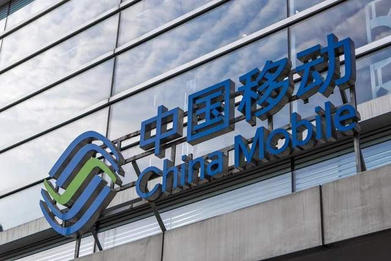
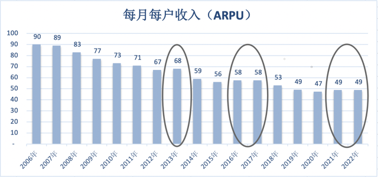
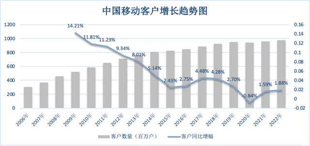
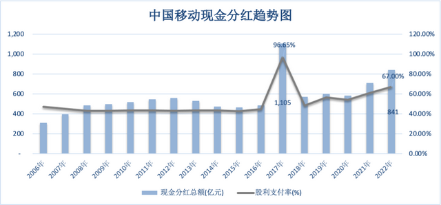
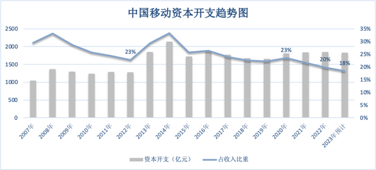
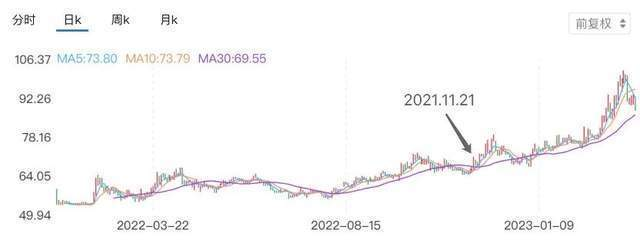

# 市值直逼茅台，中国移动靠什么日赚3.44亿？

这应该是中国移动的又一个巅峰时刻。

自2022年1月以“光速”过会、募集巨额560亿资金以来，2023年3月17日，中国移动又在A股创下了101.1元/股的新高，2.160万亿元的市值，和贵州茅台之间仅相差一个绝味鸭脖。

虽然经过一周时间二者的最新市值又拉开了一小段距离，但中国移动已然成功秀了一把“肌肉”，引起了无数关注，目前稳坐A股第二的宝座，仍有希望将霸占A股榜首三年之久的茅台挤下神坛。

3月23日晚，中国移动发布了最新财报，以此为契机，我们重新了解一下中国移动。

中国移动，靠什么日赚3.44亿？

市值直逼茅台的背后，中国移动最坚实的筹码无疑在于业绩。

最新财报数据显示，过去20年里，中国移动的收入从1611亿元增至9373亿元，翻了近6倍，年复合增长率9.2%，但2007年以来同比增幅跌宕下滑，近两年才重回10%。

_▲数据来源：wind_

净利润方面则是另一番景象——从2003年的356亿元增至2012年的1293亿元后，中国移动始终没能超越这个水平，进入了周期性的利润涨跌之中，但和收入趋势相同，近两年同比增幅回到了7%以上的较高水平。

在这背后，既有运营商阶段性投入对利润带来的影响，也有自2015年以来国家对于三大运营商“提速降费”的要求。总之可以简单理解为，中国移动虽然收入不断上涨，但净利润已经在原地打转了10年时间。

近两年业绩上扬的一部分原因在于，正在大力推广的5G套餐价格高于4G，而这也是中国移动拼命推广5G套餐的原因。

最新数据显示，中国移动5G套餐客户6.14亿户，还有37%的用户没完成“迁移”，而5G套餐下用户的月均使用流量达到24.7GB，高于所有用户14.1GB的均值，5G套餐的人均“话费”也达到81.5元，高于整体49元的水平。

具体来看中国移动的收入构成，会发现虽然大多数人还把每个月往手机里充钱的动作称为“充话费”，但准确来说应该改称“网费”了。

2022年中国移动9373亿元的收入中，有42%来自上网费用，是最重要的一个部分，其次是包括咪咕视频、家庭高清影视等业务在内的应用及信息服务业务。而2007年中国移动3570亿元收入中，有63%都是通话费，另外短信、彩铃、彩信和WAP等增值业务也贡献了26%的收入。

_▲数据来源：wind_

与这种反差相对应的，是人们越来越短的通话时间和越来越长的上网时间。

2011年或是人们打电话最多的一年，当年中国移动的通话分钟总数达到3.89万亿分钟，平均每个人每个月要打525分钟电话（日均18分钟）。相比之下2022年中国移动用户月均通话分钟数只剩下256分钟（日均8分钟）。

取而代之的是更多的上网时间——中国移动用户的月均上网流量从2012年的36MB，增至2022年的14.1GB，前者相当于不到两张RAW格式的高清照片，后者相当于14部高清电影。

_▲数据来源：wind_

虽然使用方式发生了更替，但许多人越来越依赖手机是一个共识，而人们交的“话费”其实是在不断降低的——中国移动ARPU从2006年的90元降至2020年最低时候的47.4元。

虽然近两年依托4G向5G迁移，ARPU有了小幅上扬，但参考3G红利期和4G红利期的ARPU变动，这种上扬大概率并不会持续。

_▲数据来源：wind_

在此背景下，中国移动只能依靠不断增长的用户数量，抵消部分由客单价下滑带来的业绩影响，其客户总数从2007年的3.69亿户增至2022年的9.75亿户。

但由于目前渗透率已经很高，客户规模的增长多年前就开始出现肉眼可见的放缓，尤其是2022年，中国人口出现首次下滑，后续能否保持增长还未可知。

_▲数据来源：wind_

放缓的客户增长结合大幅下滑的ARPU，这就导致一个超出许多人认知的事实，即中国移动个人业务板块的收入，从2011年开始就陷入停滞，近13年时间都徘徊在5358亿元至6260亿元之间，且在近两年依托5G有所增长前，一度以5358亿元创下十年新低。

那么开头提到中国移动近20年不断上涨的收入，是靠什么实现的？

事实上，中国移动虽然坐拥上亿用户，但已经埋头“多元化”多年，通过拓宽收入来源，延伸出家庭市场、政企市场和新兴市场三个业务板块，2022年对应收入分别为1166亿元、1682亿元和385亿元，合计3323亿元，占总收入比重达到39.8%，增速也都保持在16%以上。

具体来说，家庭市场方面主要指有线宽带业务，政企市场主要包括云业务、IDC（互联网数据中心）业务、ICT（包括系统集成、视频监控、专线等）业务，新兴市场则包括国际业务、股权投资、数字内容（咪咕视频）、金融科技等。

2022年末，其家庭市场客户数达到2.44亿户，对应ARPU达到42.1元，相比个人业务客单价的降低，家庭市场ARPU已经比2016年的28.3元/户/月提高了48.76%；政企市场客户数2320万户，其中云业务成为三大运营商争相抢食的一个赛道，中国移动已在公有云中进入前六，专属云中排位第三。

为什么还能大涨？

许多人关心的问题是，中国移动这一轮强势上涨，是为什么？这其实可以从近期一系列宏观环境变化和中国移动自身改变中找到部分答案。

在此之前，如果和贵州茅台相比，中国移动2022年的收入大概是其7倍，净利润大概是其2倍，但市值一直不如茅台，简单来说可以归结为两个重要原因。

一方面，茅台越卖越贵，但话费越交越少。中国移动作为央企，享受优势的同时，也承担“提速降费”的责任，自然不能无拘无束的涨价。而一瓶茅台能卖出2500元左右的高价，是市场化的结果。

另一方面，中国移动需要持续不断的投入通信基础设施，从2G到5G，其近十年资本开支合计1.82万亿元，主要用于通信网、传输网等基础建设，占近十年总收入的24.43%，已经超过同一时期其净利润总和1.14万亿元。

巨额资本开支会通过每年的折旧和摊销影响利润，这也是中国移动一直以来仅次于网络运营及支撑的第二大的成本支出——2022年其折旧摊销成本达到1908亿元，占总收入的20.4%。

相比之下，茅台看起来就是一门“躺赢”的生意，只靠老本也能实现千亿元的收入规模，没有沉重的资本开支，也没有不断追赶最新技术的焦虑。

价格高、支出少，这就导致茅台毛利率超90%，净利率超50%，而定价越来越低、支出却不能减少的中国移动，只有不到30%的毛利率，近十年净利率更是降低近6个百分点至13.4%。

但近期一系列的市场信号表明，中国移动可能迎来一些变化。

短期来看，中国移动2022年宣布拿出840.85亿元用于分红，派息率达到67%，并表示2023年分红比例还将超过70%，远高于过去大部分年份50%以下的分红比例，也仅次于2017年千亿元的大手笔分红，直接促进了股价上涨。

_▲数据来源：wind_

此外前文提到过，每年大笔的资本开支和随之而来的折旧，是影响中国移动利润的重要原因，但随着5G建设高峰期的结束，中国移动此前已表示，2022年是三年投资高峰的最后一年，2023年起资本开支不再增长。

最新财报数据证实了这一点——2022年其实际资本开支1852亿元，是5G建设以来的新高，但占总收入比重只有20%，已经是2007年以来最低占比。与此同时，中国移动预计2023年资本开支降至1832亿元，全年营收则可“突破1万亿元”，这意味着届时全年资本开支占收入比重将低于18%，创下2007年以来的新低。这又将通过减少折旧、摊销金额，提高后续的利润水平。

_▲数据来源：wind_

值得注意的是，这两个来自中国移动自身短期变化的利好，此前并不是没有发生过，2017年中国移动分红曾达千亿元，并未给当时港股市值带来明显波动；资本开支在3G、4G投资高峰期过后都有所回落，未来随着6G建设开启还将进入上涨周期。

相比之下外部环境变化或是更重要的因素。

2022年11月21日，中国证监会主席易会满在2022金融街论坛年会上提出了“中国特色估值体系”，市场逐步聚焦于此，估值性价比较高的“中字头”也得到相当程度的催化上涨，尤其是作为数字经济领域龙头的中国移动。

_▲注：中国移动股价截图_

与此同时，3月初国资委公布了2023年央企考核经营指标，其中一个重要变化是将原有的净利润考核指标替换成了净资产收益率（ROE），而这也是巴菲特最爱的指标，反映的是一家公司为股东赚钱的能力。

因为净资产收益率=税后利润/所有者权益，因此在收益率有限的同时，账面留存过多的现金会加大分母，对指标形成拖累。而在此之前中国移动的平均ROE也确实在不断下滑——从2008年的27.64%一路跌至2020年的9.57%，近两年才有所企稳。从这个角度来看，考核指标改变后持续大力度派息也会成为一种大概率事件，同时会给中国移动带来赚取更多利润的动力。

当前中国移动最新股价已经较最高点回落了10.13%，依托“央企价值重估”的预期继续上涨显然还需要更充分的业绩支撑。在此背景下，目前其家庭业务和包括云、DICT在内的政企业务，都是相比于个人业务而言，更具增长潜力的存在。

作者 | 林夏淅

编辑 | 董雨晴

