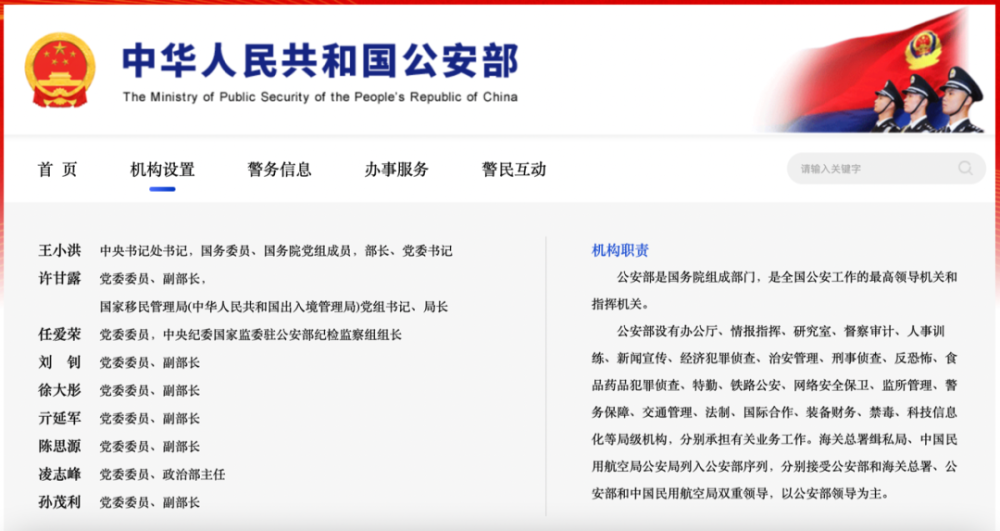
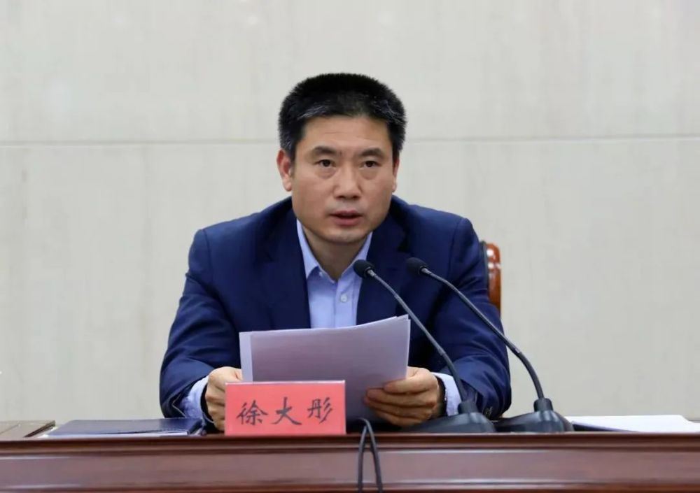
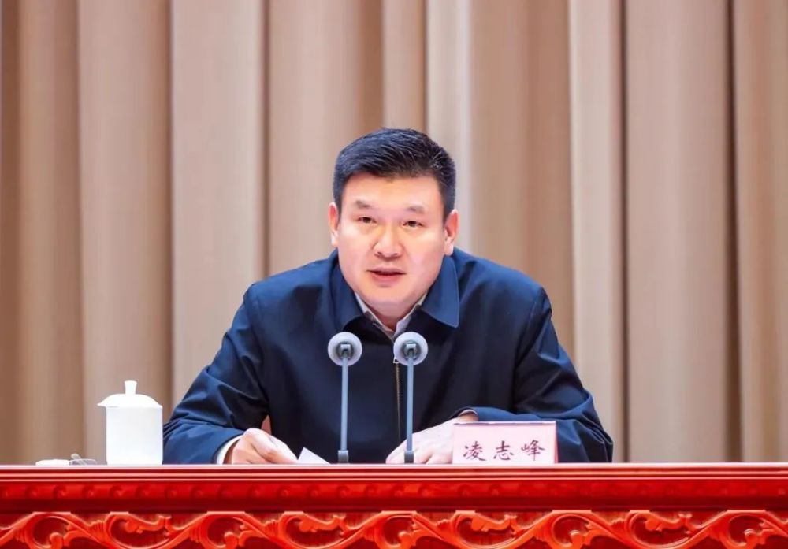

# 徐大彤、凌志峰，履新公安部

据公安部官网“机构设置”栏目显示，徐大彤已任公安部党委委员、副部长，凌志峰已任公安部党委委员、政治部主任。

_截图来源：公安部官网_

此前，徐大彤为陕西省政府副省长、党组成员，省公安厅厅长、党委书记；凌志峰为广西壮族自治区政府副主席、党组成员，自治区公安厅厅长、党委书记。

_徐大彤 资料图_

公安部官网显示，徐大彤，男，汉族，1970年2月生，大学学历，中共党员，现任公安部党委委员、副部长，副总警监警衔。

_凌志峰 资料图_

凌志峰，男，汉族，1968年11月生，大学学历，中共党员，现任公安部党委委员、政治部主任，副总警监警衔。

