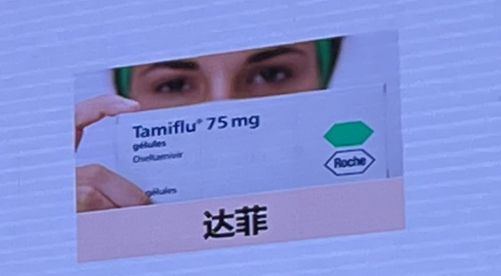

# 抗流感特效药“达菲”原料为八角茴香，原料到成药附加值跃升超千倍

3月26日，在2023云龙湖生命科技大会上，中国工程院院士、广州中医药大学中西医融合创新研究院院长刘良在一场关于“基于中医药开发原研药，助力中药产业高质量发展”的主题演讲中表示：“传统经验不可丢，先进科技不可少。”

刘良对第一财经记者表示，很多药物虽然最终可以通过合成而来，并且能够通过合成的方式降低成本，但其中不乏一些药物最初源自中医药原料。

他特别提到抗流感特效药“达菲”。刘良表示：“达菲的开发就是来自于中药的八角茴香提取物，从原料到生产出抗流感药，附加值跃升超过1000倍。”

“达菲”是瑞士罗氏制药研发生产的一款磷酸奥司他韦药物。第一财经记者查询在线药店平台显示，75mg的“达菲”胶囊10粒的售价约为300元人民币。

第一财经记者查询广西八角网最新价格，1公斤八角原料的价格为17元人民币，合成“达菲”的主要原料是单体化合物莽草酸.

刘良在演讲中表示，从八角茴香到提取莽草酸原料的价格增值倍数超过3倍，而莽草酸到制成“达菲”药品，附加值跃升超过1100倍。

刘良援引数据称，早在2009年甲型H1N1流感高发期，“达菲”的销售额就高达30亿美元，而中国是“达菲”原料最主要的产地，全球90%左右的八角茴香产自于中国，其中大部分产自广西。

不过他向第一财经记者强调，虽然“达菲”的主要成分是八角茴香提取，但也不能简单地把八角茴香的成本当作药品的成本，因为药物的开发和制作工艺也需要大量的成本投入。

据介绍，“达菲”的生产共有12道生产工序，从八角茴香中提取莽草酸的程序相当复杂，每30公斤八角茴香只能加工出1公斤莽草酸。莽草酸经过反应器、过滤器和干燥器这三道工序后，转变为一种中间化学物质环氧化物。随后，环氧化物的结构必须被打开，通过原子转换，变成另外一种中间化学物叠氮化物；叠氮化物被制成活性成分，再与其他添加成分混合加工，最后经过真空干燥制成“达菲”颗粒。

“达菲”已被证明可治疗甲型H1N1、H5N1等多种流感病毒，对于预防流感也有效。新华医院感染科行政副主任阮正上对第一财经记者表示：“磷酸奥司他韦用于与流感患者密切接触后的流感预防时，推荐口服剂量75毫克奥司他韦，每日一次，连续服用10天，应该在密切接触后2天内开始服药。”

尽管八角中含有“达菲”有效成分，但吃八角并不能直接预防流感。八角在一般的烹饪过程中产生莽草酸的几率不大。八角性味辛、温，归肝、肾、脾、胃经，温阳散寒、理气止痛，但八角茴香中含有黄樟醚，日常饮食中盲目过量食用八角可能会导致中毒。

