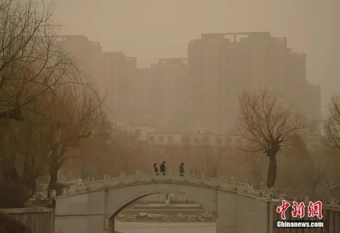

# 沙尘暴怎么这么严重，我种的树都不管用吗？

“沙尘暴怎么这么严重，是我在XX森林种的树没有管用吗？”我国北方近期出现的大范围沙尘天气引发网友的关注和热议。

据气象部门介绍，3月19-23日的沙尘过程为今年以来强度最强、影响范围最广，强度达强沙尘暴天气。我国北方植被大为增加，为何仍会出现强沙尘暴天气？接下来的几天还会有沙尘天气吗？防沙治沙还需要做哪些工作？

_3月22日，黑龙江哈尔滨，市民在沙尘天气出行。中新社记者
孙汉仑 摄_

**今年大范围沙尘天气因何而来？**

中央气象台环境气象室主任张碧辉表示，3月是沙尘天气高发期。今年3月以来蒙古国和我国北方地区降水偏少、气温偏高、多大风天气，加之植被尚未返青，配合裸露的沙源地地表条件，易出现大范围沙尘天气。

3月中上旬，蒙古国和我国西北沙源地气温较常年同期偏高5～8℃，基本无降水，地表无积雪覆盖，导致大范围地表裸露，加之今年蒙古气旋强度偏强和冷空气活动较多，在气旋及其后部冷空气东移过程中，强烈的大风卷起沙尘，通过高空输送，南下东移，在我国东北地区、华北、西北地区以及黄淮、江淮地区沉降形成沙尘暴、扬沙、浮尘等天气。

国家气候中心气候预测室研究员丁婷向中新网介绍，蒙古国南部的戈壁沙漠也是影响我国沙尘的重要源地，2022年植被生长季蒙古国降水较近20年同期偏少，沙源地植被覆盖较差，地表裸露缺乏植被保护。

此外，今年沙尘天气主要和近期大气环流异常有关。今年春季前期气温明显回暖，尤其是三月初出现了一次极为罕见的回温天气，导致前期的冻土层沙土出现快速融化。3-4月本就是北方大风高发季节。在一定的大风条件下，造成沙尘源地的沙尘多次输送至我国，这是今年多次出现严重沙尘天气最直接的原因。

**丁婷表示，近年来我国北方植被大为增加，生态环境明显改善，总体上有利于侵袭我国的沙尘次数逐步减少。**

_3月22日，吉林省长春市，市民在沙尘天气中出行。中新社记者
张瑶 摄_

**近期是否还会有沙尘天气？**

张碧辉介绍，预计春季(4-5月)，蒙古国南部至我国内蒙古中西部沙源地降水偏少，气温较常年同期偏高，且有蒙古气旋阶段性南下影响，利于形成沙尘天气。预计我国北方地区沙尘过程次数较近十年同期偏多，沙尘强度总体与近十年持平。

3月31日至4月2日，受新一轮冷空气影响，预计我国西北地区、华北、东北地区等地自西向东还将有一次沙尘天气过程。

对于近年来我国沙尘天气的发展趋势，丁婷介绍，从统计结果来看，2018-2022年期间我国北方平均的沙尘总次数和沙尘暴次数都比2013-2017年平均多，但这并不能认为是沙尘暴出现了明显变多的趋势。从更长时间尺度来看，21世纪前十年，沙尘总次数和沙尘暴次数均明显多于近十年。这表明现阶段仍处在影响我国沙尘减少的背景下。

此外，丁婷表示，沙尘频次还受到中高纬度大气环流的直接影响，因此会呈现出一定的年际变化特征，例如2017年和2022年春季沙尘暴次数均仅有一次。

_图为沙尘天气下的太原双塔公园。（无人机照片）
中新社记者 韦亮 摄_

**防沙治沙需加大科技攻关和部门合作**

针对我国防沙治沙，张碧辉提出两方面建议：

一是4-5月我国北方遭遇沙尘天气的风险较大，需密切关注天气预报，及时做好防护，降低沙尘天气对交通、农牧业、人体健康及城市运行的影响。

二是加大科技攻关和部门合作，加强对沙尘起源、沙尘输送动力等机理研究和沙尘天气数值模式预报技术的研究，提升预报预警服务水平。进一步加强沙源地生态治理、沙尘天气监测预报预警评估和沙尘灾害应急处置之间的联动和互动，为防灾减灾和科学精准治沙提供支撑。

来源：中国新闻网

