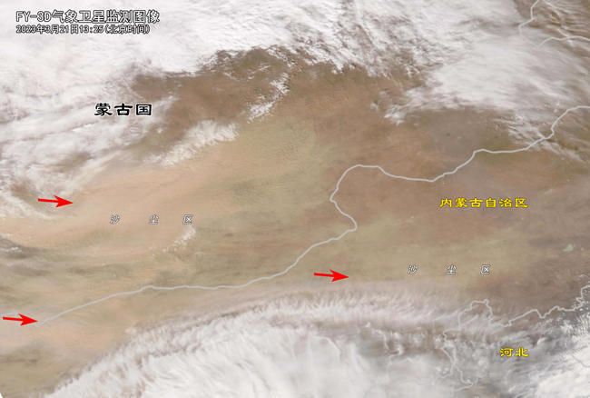

# 沙尘还会来！西北、华北、东北等多地或再现“黄沙漫天”

3月19日至23日，北方多地遭遇沙尘天气，影响面积超485万平方公里，约20个省份都不同程度陷入沙尘之中。

3月26日，中央气象台环境气象室主任张碧辉表示：“这是今年以来影响范围最广、强度最大（沙尘暴级别）的一次沙尘过程。”

按照推进过程复盘，张碧辉向红星新闻还原了本轮沙尘席卷我国的路径：3月19日，沙尘开始影响新疆；20日至21日，自西向东影响甘肃、青海北部、内蒙古中西部、宁夏、陕西中北部、山西；22日，沙尘主体影响内蒙古中东部、河北、北京、天津、黑龙江、吉林、辽宁、山东、河南等地；23日沙尘向南传输至湖北、安徽、江苏、上海、浙江北部。

从强度来看，张碧辉表示：“此次过程强度达到强沙尘暴等级，是2000年以来3月第3强。”在沙尘影响期间，诸如新疆南部、甘肃中部、内蒙古、河北北部、山西北部、北京等地部分地区出现沙尘暴；而新疆西南部、河北北部、北京、黑龙江西南部局地出现强沙尘暴，最低能见度不足100米—200米。

_↑风云三号气象卫星监测图像_

**沙尘从哪里来？**

**降水偏少+气温偏高+多大风天气**

张碧辉告诉红星新闻，在过去，3月同样是沙尘天气高发期。他解释称，今年3月以来，蒙古国和我国北方地区降水偏少、气温偏高、多大风天气，加之植被尚未返青，配合裸露的沙源地地表条件，易出现大范围沙尘天气。

对于本轮沙尘天气的成因，张碧辉表示，3月中上旬，蒙古国和我国西北沙源地气温较常年同期偏高5℃-8℃，基本无降水，地表无积雪覆盖，加之今年蒙古气旋强度偏强和冷空气活动较多，在气旋及其后部冷空气东移过程中，强烈的大风卷起沙尘，通过高空输送，南下东移，在我国东北地区、华北、西北地区以及黄淮、江淮地区沉降形成沙尘暴、扬沙、浮尘等天气。

从大风的数据也可看出，在3月19日至23日的沙尘过程中，内蒙古东部、黑龙江西南部、河北北部、北京西部阵风达9～10级，内蒙古锡林郭勒盟、赤峰市、兴安盟等地阵风达11～12级。因此，大风也为沙源区本地起沙和向下游远距离传输沙尘提供了有利的动力条件。

**北方沙尘过程次数较近10年同期偏多**

**预计沙尘还会来**

那么，本轮沙尘天气过后，今年是否还会有沙尘天气来袭？对此，张碧辉预计，3月31日至4月2日，受新一轮冷空气影响，我国西北地区、华北、东北地区等地自西向东还将有一次沙尘天气过程。

据张碧辉介绍，今年春季（4月至5月），蒙古国南部至内蒙古中西部沙源地降水偏少，气温较常年同期偏高，且有蒙古气旋阶段性南下影响，利于形成沙尘天气。他表示：“预计我国北方地区沙尘过程次数较近10年同期偏多，沙尘强度总体与近10年持平。”

对于今年沙尘多发的原因，国家气候中心气候预测室研究员丁婷认为，今年沙尘天气多发主要和近期大气环流异常有关。今年春季前期气温明显回暖，尤其是3月初出现了一次极为罕见的回温天气，导致前期的冻土层沙土出现快速融化。3月-4月本就是北方大风高发季节。在一定的大风条件下，造成沙源地的沙尘多次输送至我国，这也是今年多次出现严重沙尘天气最直接的原因。

在丁婷看来，沙尘频次同时还受到中高纬度大气环流的直接影响，因此会呈现出一定的年际变化特征，例如2017年和2022年春季沙尘暴次数均仅有一次。

不过，丁婷也分析认为，近年来，我国北方植被大为增加，生态环境明显改善，总体上有利于我国沙尘次数逐步减少。但蒙古南部的戈壁沙漠也是影响我国沙尘的重要源地，2022年植被生长季蒙古降水较近20年同期偏少，沙源地植被覆盖较差，地表裸露缺乏植被保护。

因此，丁婷建议，应当加大科技攻关和部门合作，加强对沙尘起源、沙尘输送动力等机理研究和沙尘天气数值模式预报技术的研究，提升预报预警服务水平。同时，进一步加强沙源地生态治理、沙尘天气监测预报预警评估和沙尘灾害应急处置之间的联动和互动，为防灾减灾和科学精准治沙提供支撑。

红星新闻记者 杨雨奇 吴阳 北京报道

责编 官莉 编辑 彭疆

