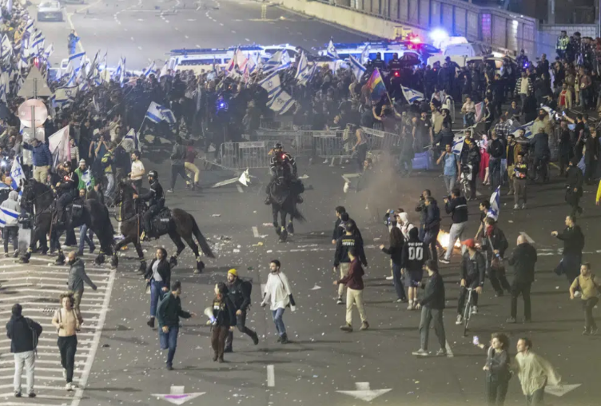

# 以色列“纳粹政府”改革遭军队抗议，激反全国，内塔尼亚胡“急刹车”

自内塔尼亚胡回归以来，以色列就从未消停过。在过去3个月数十万以色列人走上街头抗议内塔尼亚胡的改革方案，26日这场抗议浪潮达到顶峰，对此视而不见3个月的西方媒体也终于瞒不住，开始将镜头对准以色列。

据环球网报道，持续3个月的以色列抗议在26日达到顶峰，约63万民众聚集在内塔尼亚胡的住所外，抗议以色列防长约夫·加兰特被解雇，示威人群一度突破了警方封锁线。到了这个时候，西方媒体终于不装聋作哑了，开始集体报道以色列发生了什么。

这次以色列全国骚乱的导火索是内塔尼亚胡重新掌权后推行的司法改革，具体内容包括授予议会推翻最高法院裁决的权力、遏制最高法院的司法审查权等等……简而言之，这次司法改革通过后，内塔尼亚胡不仅能摆脱贪腐丑闻的指控和美国的影响，还能成为事实上的以色列“无冕之王”。

_内塔尼亚胡和司法部长莱文讨论投票结果_

因此自从2月初以来，内塔尼亚胡的改革就遭到了以色列各界一致反对。但更糟糕的是，在以色列这样一个全民服役的国家，抗议声会不可避免地向军队蔓延。

早在3月初以色列防长加兰特就预见到了这一后果，尽管当时他没有反对改革，但还是要求以色列国防军现役部队置于政治争端之外。

19日内塔尼亚胡要求以军采取行动，但遭到军方拒绝；眼看局势越来越乱，25日加兰特公开站队，他要求内塔尼亚胡暂缓改革，结果内塔尼亚认为这是公然违令，并将其解雇。

_以色列民众与警方爆发冲突_

**以色列国防军担忧失去司法庇护**

除了立场偏左翼以外，以色列国防军抗议司法改革的原因在于，改革后以军士兵很可能将失去法律庇护。

以色列军队实行全民强制服役，以色列人在完成三年服役后，不少人会选择转为预备役，一直在军队服役到40岁，他们构成了以色列国防军的中坚力量。

但多年来，以军因空袭加沙、杀害巴勒斯坦平民而面临战争罪指控，一些高级军官甚至在欧洲上了通缉令，以色列一直辩称其司法部门将追究责任，结果每次都是不了了之。

但这次改革削弱了以色列最高法院的地位，因此让以军预备役和飞行员担心的是，届时如果他们出国旅行，在某些国家可能会面临被追捕的风险，这些国家可以拿着“司法不独立”的借口，抓捕并审判以军士兵，这也是为什么参与游行的大多是预备役和飞行员，他们要求内塔尼亚胡承诺以色列退伍军人在他国不会面临追捕，否则就暂缓改革。

_以色列抗议民众_

**“哈瑞迪”VS以色列国防军**

以色列国防军对改革不满的另一个原因是，内塔尼亚胡将授予其盟友“极端正统派”政党的宗教学校完全免服兵役的权利。

以色列国内存在着一支被称为“哈瑞迪”的犹太人群体，他们不事生产、不交税、不服兵役，从小到大只读犹太经书和律法，生活完全依靠以色列财政供养，严重拖累了以色列财政负担。

所以在2002年至2012年间，以色列国防部一直和“哈瑞迪”团体领袖争论哈瑞迪犹太人的服役问题，越来越多的以色列民众也要求哈瑞迪犹太人服役，以平衡兵役负担。

但现在“哈瑞迪”要求内塔尼亚胡给予完全的兵役豁免权和一项可规避最高法院因违宪而撤销拟议的条款，这在世俗化的以色列人眼中自然是极不受欢迎的——因为他们和他们的孩子仍然需要服役。上周一些以军退伍军人就在“哈瑞迪”的城市——布内布雷克建立了“模拟征兵办公室”，并与当地居民爆发冲突。

美国《外交政策》杂志称，如果司法改革还只是政治问题，那么“哈瑞迪”和以色列世俗派的争执很可能将动摇以色列国本。

_哈瑞迪自诩为正统犹太人_

**内塔尼亚胡紧急“踩刹车”**

事到如今，内塔尼亚胡的改革方案不仅遭到国内反对，连德国、法国和英国也对此表示谴责，白宫对以色列的大规模抗议深表关切，敦促以色列尽快找到解决方案。

内塔尼亚胡原计划将于27日下午发表演讲，但由于国家安全部长本-格维尔威胁要解散执政联盟，演讲已被迫推迟。

内塔尼亚胡领导的执政联盟在以色列议会中占据64席位，理论上他只需要61席就能通过法案。但现如今，“利库德”集团已经有6名议员响应加兰特的号召，拒绝支持改革，内塔尼亚胡的盟友、“以色列是我们的家园”党领袖阿维格多·利伯曼呼吁“利库德”集团解除内塔尼亚胡的权力，并另行组建新的执政联盟。

由于反对声越来越大，27日内塔尼亚胡宣布暂缓改革，本-格维尔仍以辞职来威胁内塔尼亚胡，以色列乱局将走向何方，仍是一个未知数。

而对外，以色列国防军近乎罢工的状态也使以色列陷入风雨飘摇中，特别是最近一段时间，中东正上演“大和解”，以色列的内忧外患或许会让一些对手产生想法。

即便局势如此动荡，以色列右翼仍在火上浇油。20日以色列财长、右翼政客莫特里奇公开否认不存在所谓的“巴勒斯坦人”，这一表态不仅遭到阿拉伯国家谴责，也让外界质疑现在内塔尼亚胡是否还能控制住他的内阁。

