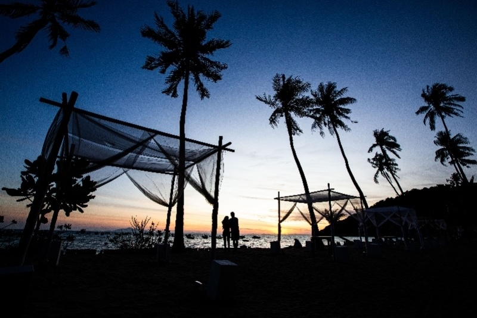
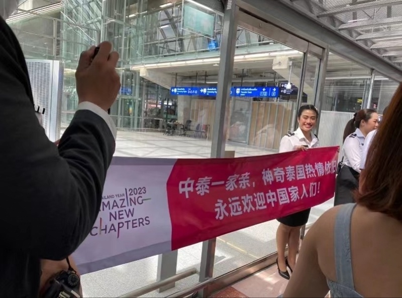
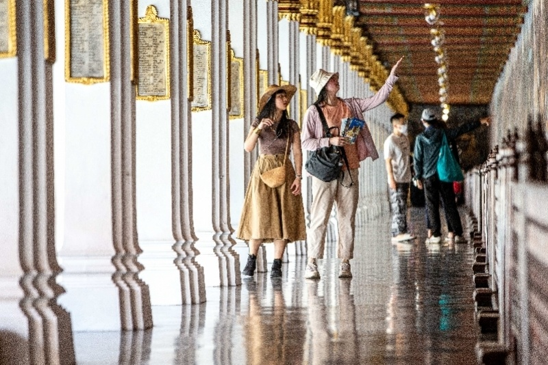

# 出境游遭遇“冰与火”考验：各国花式揽客 难阻安全风险质疑

阔别三年，东南亚多国为了吸引中国游客各出奇招。此前，泰国副总理亲自到机场迎接，菲律宾组织舞龙舞狮表演和当地特色民乐节目欢迎，柬埔寨政府允许全国旅游业者直接接受人民币……

近日，“绑架”“勒索”“嘎腰子”等字眼，让人们对于东南亚出境游的安全问题充满顾虑，“曾经的穷游目的地贵到去不起了”等话题也备受关注。舆论风口浪尖的泰国，近期密集表态称对中国游客的旅游质量与安全高度重视，并对相关误解进行澄清。

南都、N视频记者采访多位中国游客，以及相关从业者、研究者，了解东南亚国家旅游真实现状，探讨东南亚国家是否真的“去不起”“不能去”，以及曾经出境旅游热门目的地面临的“冰与火”考验。

_游客在泰国皮皮岛国家公园观赏日出。新华社发_

“花式”揽客

阔别三年，以泰国为代表的东南亚多国，对来自中国的游客表现出极大的欢迎热情，铆足了劲想方设法揽客。

1月9日下午，269名中国游客乘坐厦门航空MF833号航班抵达泰国曼谷素万那普国际机场。他们是对新型冠状病毒感染实施“乙类乙管”，放开出境游后，首批抵达泰国的中国游客。

为了欢迎这些客人，泰国副总理兼卫生部长阿努廷等泰国政府官员，备好鲜花和礼物，亲自到机场迎接。机场工作人员更是手举“中泰一家亲，神奇泰国热情依旧，永远欢迎中国家人们”的横幅。

_1月9日，我国放开出境游后首批赴泰旅游的中国游客抵达曼谷。_

据了解，航班抵达前，阿努廷要求素万那普国际机场为中国游客全力提供保障，完善入境护照检查站的服务、优化机场公共交通服务等。

吴先生就在这批游客当中。他告诉南都记者，从飞机廊桥出来后，就看到外面站满了泰国官员和媒体，官员和每个下飞机的人握手、戴花环、送礼物，“就像走红毯一样”。得知和自己握手的是泰国副总理后，他非常激动，“我没跟这么高级别的官员握过手，感觉值了！”

南都记者注意到，2月20日，泰国国家旅游局
“神奇泰国新篇章2023中国路演”活动在上海拉开帷幕，泰国旅游和体育部部长披帕·拉差吉帕干率泰国旅游行业代表团抵赴上海，这是三年来第一场落地中国的正式旅游推广活动。

披帕·拉差吉帕干表示，泰国及其人民已经做好准备，将以“中泰一家亲”的手足情谊热烈迎接中国游客。此外，为树立游客赴泰旅游的信心，泰国政府将优质服务标准与具备公共卫生潜力的安全措施整合起来，制定了游客接待指南和政策。

泰国国家旅游局官网显示，2022年中国到访泰国的游客人数为286511人次；仅2023年1月1日至2月2日，泰国就共接待了99429名中国游客。预计2023年第一季度，泰国将有30万中国游客到访，全年到访的中国游客将超500万。

除了泰国，1月24日，菲律宾旅游部也在马尼拉国际机场举行隆重仪式迎接中国游客。中国驻菲律宾大使黄溪连和菲律宾旅游部长弗拉斯科到场欢迎中国游客，给他们戴上花环，并赠送兔年玩偶以及印有“中菲友好”字样的文化衫等纪念品。现场还组织了热情洋溢的舞龙舞狮表演和富有菲律宾民族特色的民乐节目。

弗拉斯科表示，菲律宾今年的目标是吸引大约480万外国游客，中国游客市场是菲方优先发力方向之一。

印度尼西亚政府则设定了今年接待约25万中国游客的目标，并希望有所超越。印尼旅游和创意经济部部长桑迪亚加·乌诺近期表示，相信中国游客的到来将加快本地旅游业复苏，创造更多就业岗位。

柬埔寨也在吸引中国游客方面采取了相关措施。2月7日，柬埔寨旅游大臣童昆表示，为了吸引更多中国游客，柬政府允许全国旅游业者直接接受中国游客的人民币。当天，童昆在柬埔寨首都金边国际机场亲自迎接入境的首批大规模中国游客群。

据童昆回忆，在疫情前，柬埔寨能接待230万人次的中国游客，但受疫情影响，去年来柬旅游的中国游客只有近11万人次。随着中国优化出入境政策，柬埔寨期待今年将吸引80万至100万人次中国游客。

价格上涨

长期以来，东南亚旅游都以性价比高而受到中国游客青睐。不过，近期“曾经穷游的泰国贵到去不起了”等话题登上热搜，引发网友对泰国等东南亚国家“去不起”的讨论。

刚结束泰国曼谷和普吉岛旅程的蒋先生，对此深有体会。他告诉南都记者，在疫情前，泰国除了交通外，消费整体上比国内便宜，“现在泰国消费比较贵，可能跟在旅游旺季有关”。

令他印象深刻的是，住喜来登酒店一晚换算人民币600元，但泰国夜市分量不算多的生腌就要200多元人民币。他直言，当地夜市出售的商品非必要不尝试，“真的太贵了”。

今年1月曾去泰国旅游的亮亮则向南都记者表示，商品有贵的也有便宜的，“主要看去消费的地方”。

_中国游客在泰国曼谷大王宫景区游览。新华社发_

旅游成本上涨，让中国旅游集团旅行服务有限公司粤港澳区域公司总经理陈瑞东也有直观感受。他向南都记者举例介绍，酒店方面，如疫情前传统旅行社常用的曼谷都市酒店，每晚房费在人民币（下同）400元左右，现在每晚房费在650元左右，涨幅约60％。在餐饮上，疫情前团队餐价格人均40元左右，疫情三年间，很多团队餐厅因各种原因倒闭了，现在的人均餐费价格为80元左右。泰国旅游各环节都增加了不少成本，也导致疫情后的泰国游团费有一定幅度的上涨。

陈瑞东认为，旅游成本高了是正常的市场行为，当下航司出境游的运力和旅游目的地国家的地接资源尚未完全恢复，导致出境游成本比疫情前高。

_1月20日，游客在泰国北榄府举办的灯笼节上参观。新华社发_

中国旅游研究院院长戴斌告诉南都记者，泰国是中国传统出境旅游热门目的地，对于接待中国游客的设施、场景、项目及导游人员等，都有着比较完善的供应链。“境外游市场恢复后，由于短期内需求有所增长，而航线等供应链未完全跟上，市场的需求增长高于供给增长，过程中出现价格上涨是必然的。”

在陈瑞东看来，东南亚的地接资源正逐渐恢复常态、国际环境转好，相关价格恢复至疫情前应该是可以预期的，但需要一个过程。

安全压力

除了旅游消费的成本，东南亚旅游安全问题近期也备受热议。“绑架”“勒索”“嘎腰子”等字眼，让人们对于东南亚出境游的安全问题充满顾虑。

南都记者注意到，去年，中国驻菲律宾大使馆曾发布通知称，菲律宾近年来因网络博彩和电信诈骗引发的涉中国公民绑架勒索、非法拘禁等恶性案件频发，给当事人及其家庭造成严重伤害。使馆提醒公众，进一步提高安全防护意识，特别是在出行、就餐、求职时，保持高度警惕，切实防范绑架风险。

今年2月7日，一位网友发布视频称，在泰国普吉岛旅行被袭击，引发关注。该网友介绍，其在普吉岛因接送司机失约，与旅行社产生纠纷。2月1日上午，泰国警方与该网友一家一同前往旅行社协调此事。但已支付的5000泰铢，旅行社只肯退3000泰铢，甚至威胁称，“要么拿走这3000泰铢，要么拿刀杀了他们。”视频显示，旅行社的工作人员向视频拍摄者挥刀，并将拍摄者的胳膊划伤。

_有网友称在泰国遭袭击。_

2月9日，南都记者从中国泰国商会获悉，针对此事，根据泰国刑法规定，施害者将面临三个月的刑事处罚及不超过六万泰铢的罚款。此前，涉事旅行社已受到50万泰铢罚款和吊销执照六个月的处罚。

除了矛盾纠纷引发事故，旅游项目的安全性同样备受关注。3月23日，中国驻泰使馆发布公告称，近期，个别来泰旅游中国同胞在参与海岛浮潜项目时遇险，最终不幸遇难。

近日，还有多位博主“揭露泰国旅游陷阱”，以及多位网红博主去泰国旅游后“断更”，引发人们对泰国旅游安全的担忧。例如，3月12日，博主“Miss韩懿莹”在社交媒体平台上发布视频，称“找个人一起去旅行”，当时其IP属地在泰国，而后多天未再更新动态。另有一位此前去泰国旅游的博主“彭十六elf”，也因长期未更新，引发了网友对其人身安全的关注。不过，南都记者留意到，上述博主后来均已通过社交平台向网友报平安。

泰国旅游到底安不安全？南都记者采访了多位近期曾去泰国旅游的中国游客。

今年春节期间在泰国旅行的田爽表示，“挺安全的，很多蹭热度的媒体夸大了”。刚结束泰国旅行的蒋先生也认为，目前泰国的旅游环境比较安全，“外国人很多，游客只要按照正常的路线行走、不偏离主要路线，安全性还是可靠的”。向女士今年2月去过泰国，她表示，“很安全，不用担心”。近期刚去过泰国的小欧和潘先生也认为，泰国还是挺安全的。

“境外游的安全是很多人关注的问题。”戴斌关注到，近期网上出现有中国游客在泰国存在人身安全问题的言论，泰国方面也进行了一些辟谣工作。他认为，如果旅游目的地出现不安全因素，相关方面应该及时发布公开透明的安全提示。旅游经营者同样要做好游客的安全教育和安全保障工作。

前景如何

因近期泰国旅游的安全性受到关注，3月21日，泰国总理府发言人阿努查发言称，泰国总理巴育对近期在中国和泰国网络传播的不实言论表示担忧，泰国旅游与体育部需要立即介入此事。同日，泰国国家旅游局官方微博点赞了一篇文章，否认“嘎腰子”传闻。

23日，泰国驻华大使馆发文表示，其务必澄清有关旅游不安全的内容与评论的误解。泰国高度重视中国游客的旅游质量、安全以及对泰国的美好印象。自中国允许中国游客出国旅游以来，泰国已做好接待中国游客到来的充分准备，以及为中国游客增加了许多通信渠道，为游客在获取信息，并向旅游警察通报紧急情况提供便利与安全保障。

当天，中国驻泰国大使馆工作人员告诉南都记者，目前暂未接到中国公民在泰国遭受危险的求助电话。

25日，中国驻泰使馆发文表示，泰国是中国的友好邻邦，泰方对中国游客来泰旅游非常重视，从各个方面进行努力，为中国游客提供安全的环境和舒适良好的旅游体验。驻泰使馆与泰方旅游安全主管部门保持密切沟通和联系，将一如既往、不遗余力地维护中国公民在泰安全与合法权益。

也有人因为一些传闻打消了去东南亚旅游的念头。大学生小罗向南都记者表示，“以前很想去泰国旅游，看到短视频平台的传言后，我和身边的朋友们都不敢去了”。在陈瑞东看来，目前网上部分自媒体对于“泰国旅游的人身安全问题”进行炒作，散播耸人听闻的消息，已经对旅游行业造成了不良影响。

“保障游客的人身安全，永远都是旅行社必要之义务。”陈瑞东指出，其公司会一如既往地按照驻外使领馆和外国旅游部门的指引做好相应工作，切实为游客购置保险并进行相应提醒。公司接下来还将在泰国的泼水节等节日，推出更多满足消费者需求的产品，与业界一同提振游客对出境游的信心。

戴斌认为，中方和旅游目的地国家及地区的旅游部门应加强沟通。若出现安全问题、物价过高、中文导游不足、存在欺客宰客等负面情况，我方可将中国游客在海外旅游时的诉求反馈给对方，而旅游目的地也应重视中国游客的诉求，对于我方提出的关切也要给予及时回应。此外，各方还应畅通游客的投诉渠道。

近期东南亚出境游备受争议，但数据显示，中国游客的出行意愿仍然高涨。飞猪平台数据显示，近一个月，国际机票预订量同比增长46%。近期，签证搜索量同比增长886%
，签证办理量同比增长680%，泰国、马来西亚、新加坡、菲律宾等成为热门签证办理国家。飞猪相关负责人表示，商家将陆续释放更多库存，同时，一批针对“五一”打造的旅游新品也会和消费者见面。

携程平台数据显示，截至目前，今年五一假期国内整体旅游预订量同比增长150%。其中，内地出境机票预订量前十的目的地中就有曼谷、新加坡、普吉岛、吉隆坡、马尼拉等；内地出境游酒店预订量前十的目的地包括了普吉岛、曼谷、新加坡、苏梅岛、芭提雅、清迈、巴厘岛等。

“提前规划好去泰国旅游的预算，还是挺值的。”蒋先生说。

出品：南都即时

采写：南都记者 梁令菲 黄嘉丰 杨天智 实习生 谭楚筠

