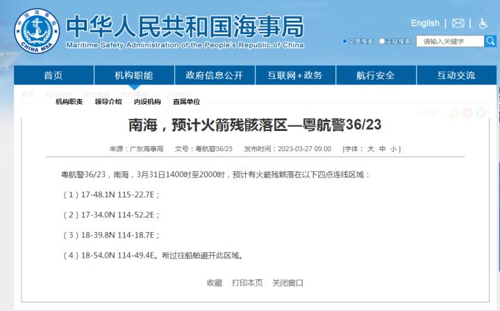

# 南海部分海域预计有火箭残骸坠落，过往船舶避开此区域

南海，预计火箭残骸落区—粤航警36/23

粤航警36/23，南海，3月31日1400时至2000时，预计有火箭残骸落在以下四点连线区域：

（1）17-48.1N115-22.7E；

（2）17-34.0N114-52.2E；

（3）18-39.8N114-18.7E；

（4）18-54.0N114-49.4E。希过往船舶避开此区域。

（来源：广东海事局）

