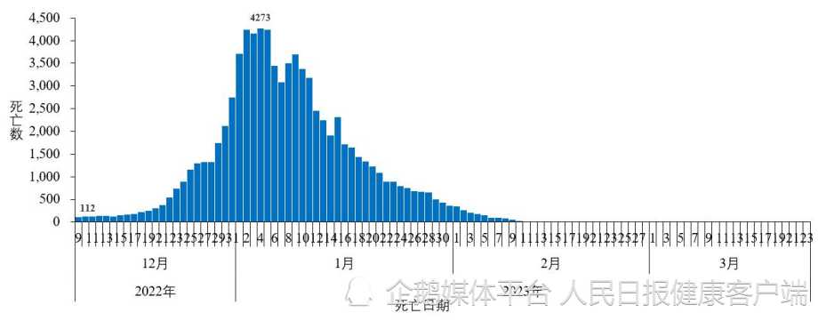

# 变异株不断、阳性率却近3周持续下降，距走出新冠还有多远？专家回应

**人民日报健康客户端 记者 孔天骄**

虽然社会已恢复正常的生产生活秩序，但新冠还像一个阴影一样，时不时挑动着神经。根据中国疾控中心3月25日公布的最新全国新冠疫情情况，虽然变异毒株仍在不断出现，但新冠病毒阳性率近3周依旧保持持续下降，在院新冠病毒感染相关死亡病例，从2月23日以来一直保持0例。

我们距离走出新冠还有多远？多位专家表示，我们正在逐渐走出新冠疫情，如果病毒不发生比较重大的变异，走出新冠已为期不远！

_3月14日，游客在东湖樱园拍照。新华社记者
伍志尊 摄_

**变异株的致病力和传染性并没有发生明显变化，依然有免疫屏障**

在变异毒株方面，根据中国疾控中心的通报，2022年12月1日至2023年3月23日，共发现120例本土重点关注变异株。较3月18日中疾控发布的通报数据比，新增34例本土重点关注变异株。

对此，北京佑安医院感染综合科主任医师李侗曾告诉人民日报健康客户端记者：“目前国内新的确诊病例存在多种奥密克戎变异株，但是其致病力和传染性并没有发生明显变异，当前的疫情防控影响比较小，考虑到当前大部分地区已经建立起免疫屏障，如果病毒不发生比较重大的变异，我们正在逐渐走出新冠疫情，疫情对人民健康和社会运行越来越小。”

国家卫生健康委员会全国新型冠状病毒肺炎专家组成员、北京大学公共卫生学院流行病学与卫生统计学系研究员刘珏也表示，目前并没有发现更具威胁的新变异株。世卫组织总干事谭德塞近期在例行疫情发布会上也指出今年新冠大流行将有望不再构成国际关注的突发公共卫生事件。

**全球死亡病例数呈持续下降态势，国内已无死亡病例**

在院新冠病毒感染死亡病例数方面，于1月4日达到每日峰值4273例，随后持续下降，3月23日为0例。3月17日至3月23日，31个省（自治区、直辖市）及新疆生产建设兵团医疗机构累计在院新冠病毒感染相关死亡病例0例。

_全国在院新冠病毒感染死亡病例变化情况，中疾控图_

“根据世卫组织官方报告数据，从全球流行情况看，3月20日全球新增新冠确诊病例8.8万，新增死亡仅454人。近一个月全球报告的死亡病例数呈持续下降态势，且已明显低于三年前新冠疫情刚发展为大流行病之时的水平，希望就在前方。”刘珏也告诉人民日报健康客户端记者。

根据中疾控发布的最新数据显示，2022年第49周（12月9日），新冠病毒阳性率开始逐渐增加，在第51和52周期间达峰值后持续下降，2023年第7周（2月13-19日）新冠病毒阳性率下降至3.4%后略有反弹，近3周持续下降，第11周（3月13日-19日）新冠病毒阳性率为1.9%。

**走出新冠已为期不远**

3月25日上午，国家传染病医学中心主任、复旦大学附属华山医院感染科主任张文宏在广州南沙举办的亚洲青年论坛上表示，三年多来，我们的卫生体系接受了一个巨大的挑战，而最终走了出来。人类已经全面建立了对新冠肺炎疫情的免疫屏障。“世卫组织也宣称如今死于新冠的病人数每天都是历史低点。我们离走出‘新冠’这起公共卫生突发事件的时间节点已为期不远。”

不过李侗曾提醒，“当前新冠病毒全球的一部分地区仍存在，不排除病毒继续变异，我们还是需要继续做好疫情和病毒变异的监测，做好疫苗和药物的储备，防范病毒卷土重来。”

