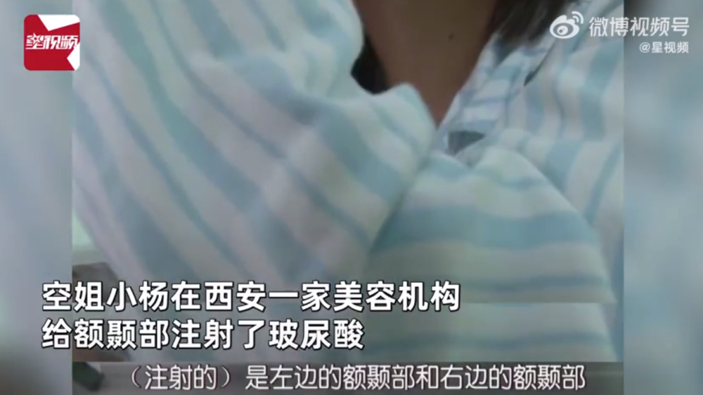
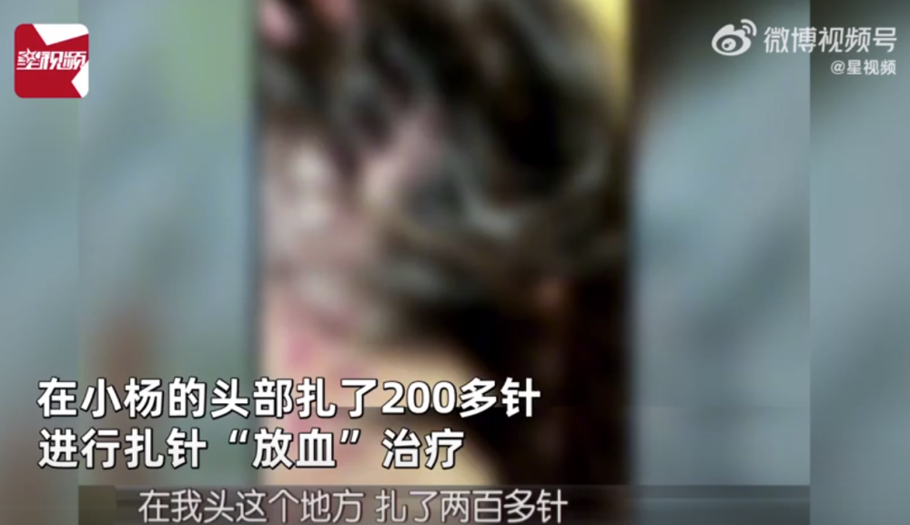
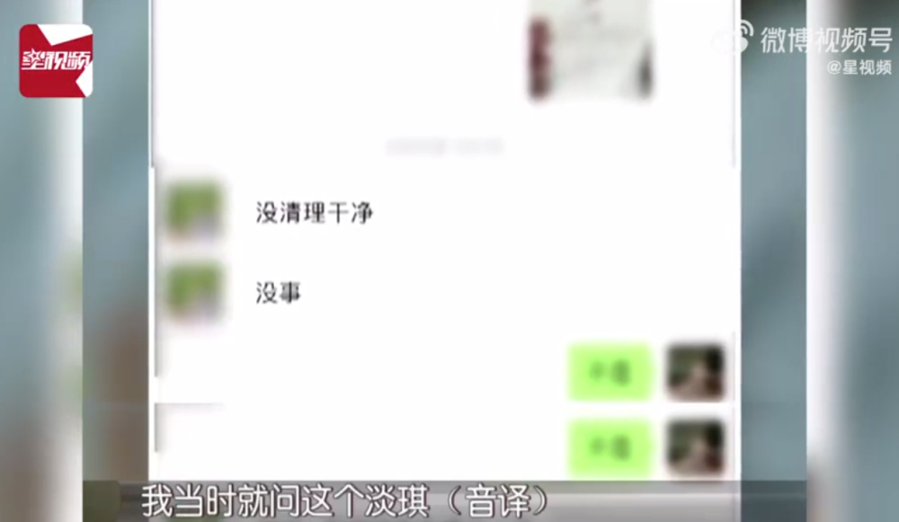
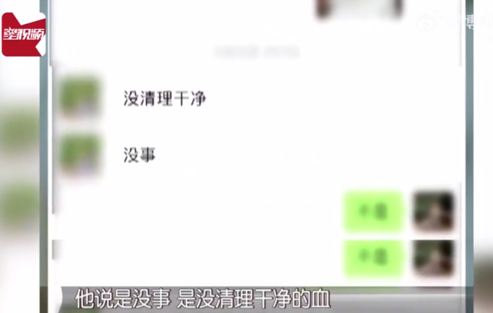
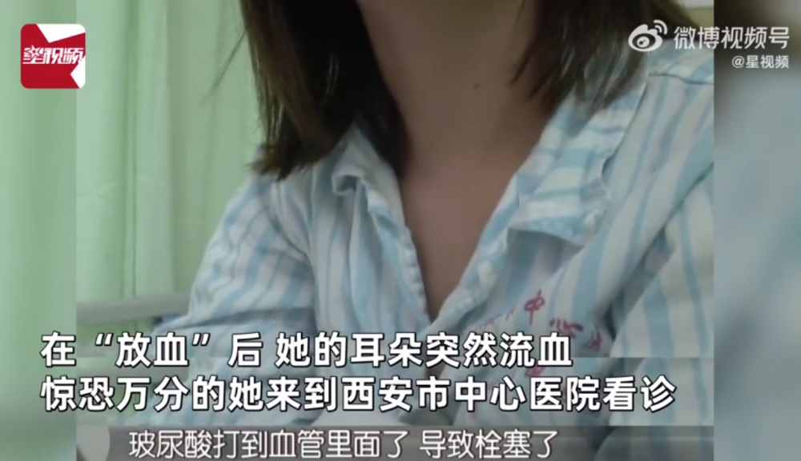
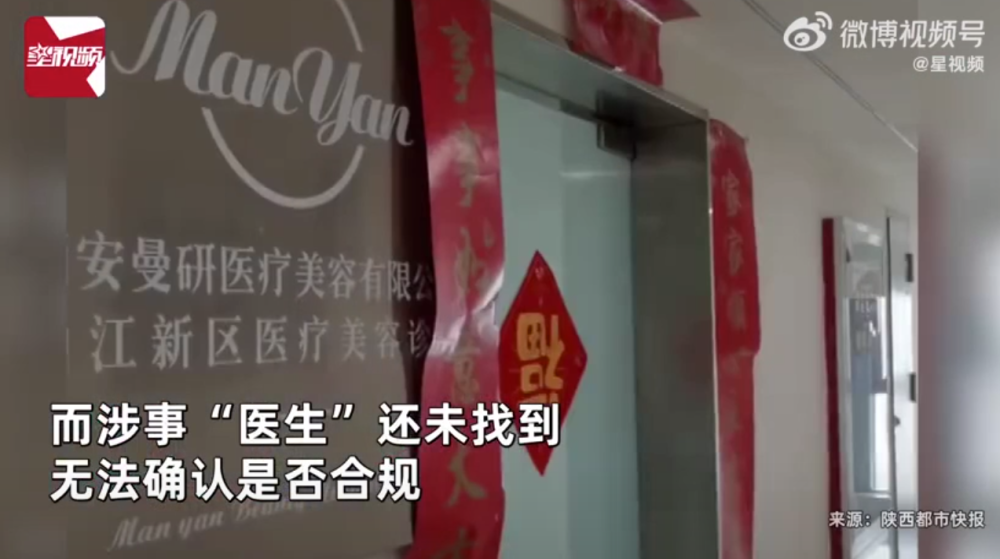
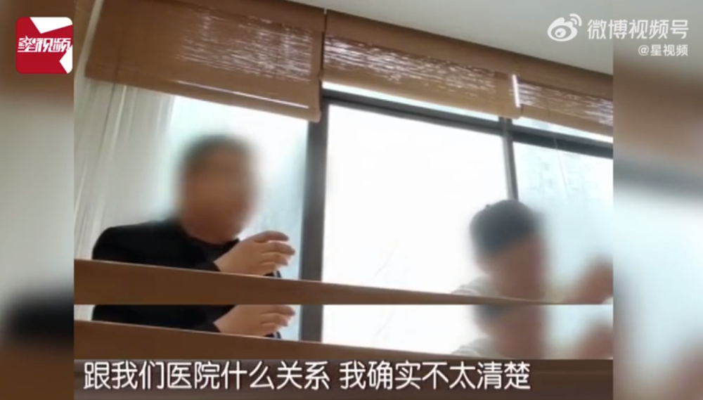

# 头扎200多针被“放血”，空姐注射玻尿酸差点丧命！涉事医生还没找到

每经编辑：李泽东

3月27日，#空姐注射玻尿酸打进血管险丧命#的话题登上热搜，啥情况？

据中国经济周刊，近日，陕西西安的空姐小杨在西安一家美容机构，给额颞部注射了玻尿酸，之后开始出现疼痛长红斑。事后她来到美容机构寻求帮助，对方称为其注射了溶解酶，
**在小杨的头部扎了200多针，进行扎针“放血”治疗** 。

然而就在“放血”后，她的耳朵突然流血。

小杨： **我当时就问这个淡琪（公司股东），他说没事，是没清理干净的血。**

随后，惊恐万分的小杨来到西安市中心医院看诊，经过医生诊断，
**由于注射的玻尿酸打进血管，造成小杨右侧颞部栓塞。而当初给小杨注射玻尿酸的“医生”，在交了1万的费用后也不见踪影。**

_图片来源：星视频截图_

美容机构的工作人员表示对“医生”的信息一概不知，只能代表机构谈和解条件。

工作人员： **我见过淡琪本人，但是他是不是我们医院的人，跟我们医院什么关系，我确实不太清楚。**

对此，西安市雁塔区卫生监督所的工作人员称美容机构是有资质的医疗机构，而涉事“医生”还未找到，无法确认是否合规。

据启信宝APP显示，涉事西安曼研医疗美容有限公司曲江新区医疗美容诊所成立于2022年3月，为西安曼研医疗美容有限公司的分公司，负责人为周雲霞。

西安曼研医疗美容有限公司也成立于2022年3月，法定代表人为周雲霞，注册资本200万人民币，经营范围包括健康咨询服务、医疗服务、医疗美容服务、生活美容服务等。

股东信息显示， **该公司由淡琪、刘晓彤和杨宇轩3人共同持股。**

值得注意的是， **小杨和工作人员口中提到的“淡琪”是西安曼研医疗美容有限公司的大股东、疑似实控人，持股比例达34%。**

每日经济新闻综合中国经济周刊、启信宝APP、星视频

