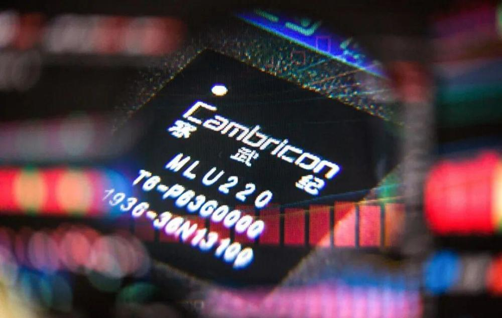
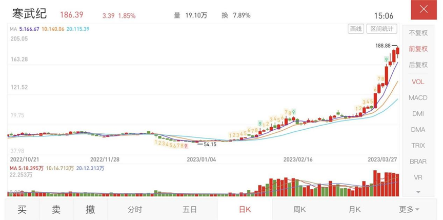
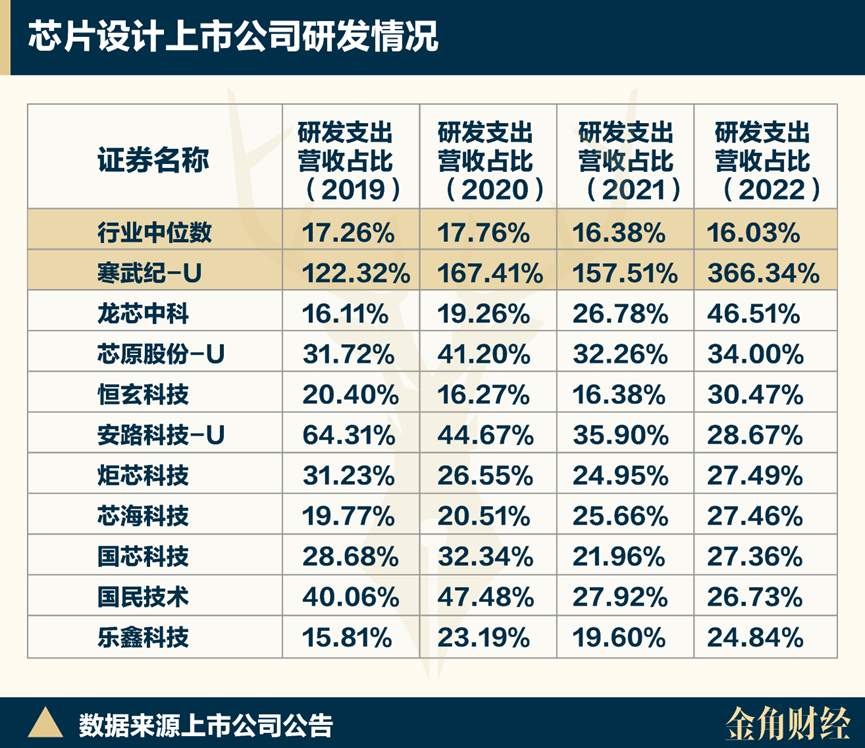
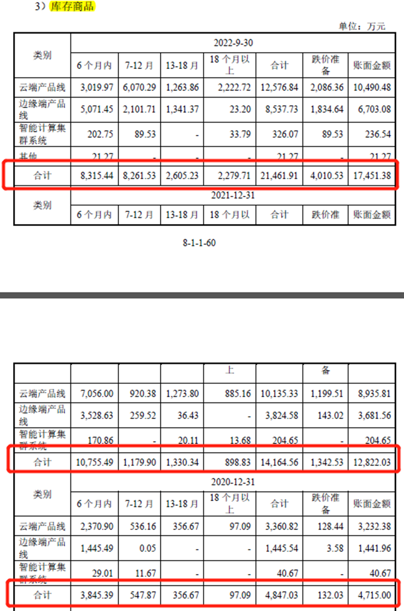
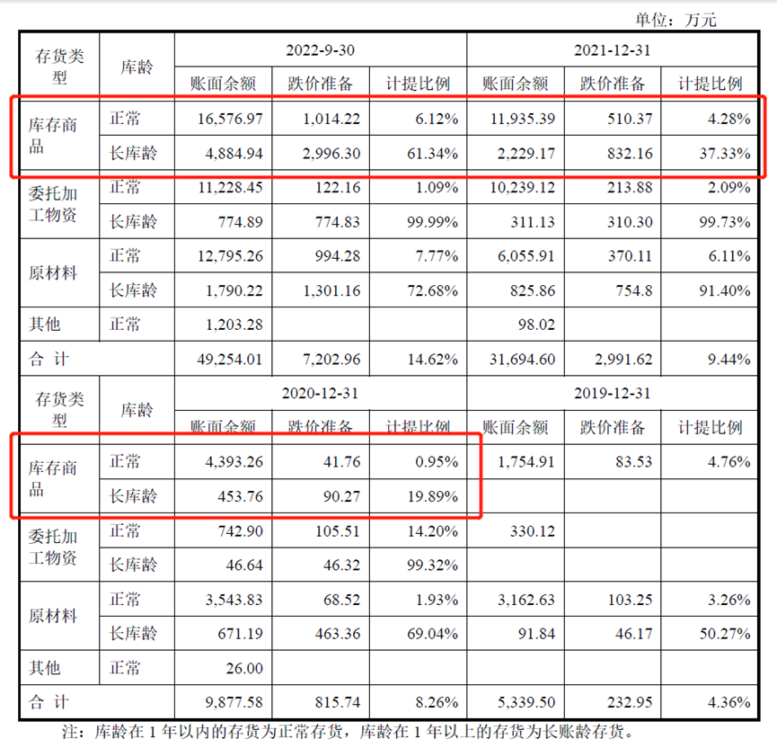
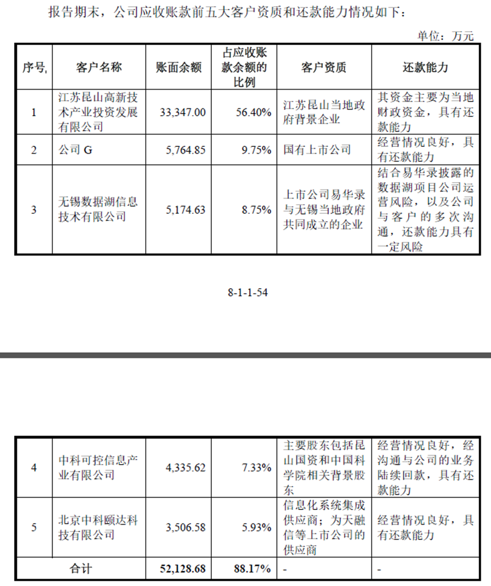
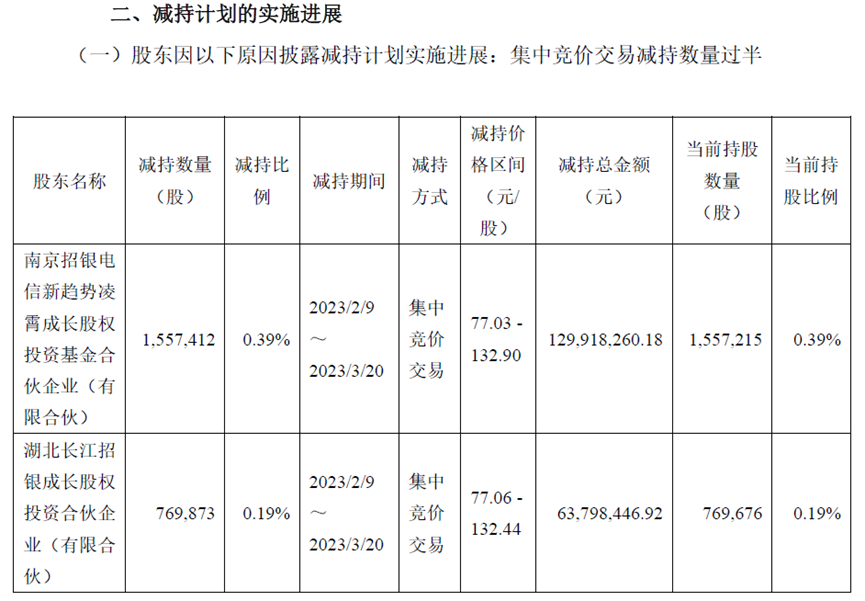
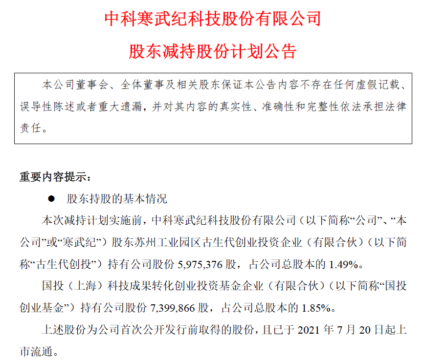

# 寒武纪股价“疯涨”背后： 研发烧钱速度惊人、产品积压难卖

**划重点：**

  * _1_ 被誉为“AI芯片第一股”的寒武纪，在ChatGPT概念加持下其股价不到三个月翻了两倍多。
  * _2_ 但从业绩来看，寒武纪却令人颇为失望，去年全年营收几乎接近0增长，归母净利润亏损继续扩大。
  * _3_ 巨额亏损背后通常是研发烧钱所致。而对于寒武纪来说，还面临库存品积压卖不出去、因地方财政问题难以回款等困难。
  * _4_ 更尴尬的是，自去年末寒武纪被美国纳入“实体清单”，一众投资机构借助这波暴涨正在清仓式减持。

作者 | 塞尔达

美国人工智能的一把火，烧得最旺的地方竟然是中国A股。

被誉为“AI芯片第一股”的寒武纪，在ChatGPT概念加持下，股价由去年末不足55元暴涨至今日收盘价186.39元，不到一个季度涨了241.6%。

_寒武纪股价走势_

投资市场把寒武纪看作是中国版英伟达，而英伟达年内涨幅也不过才83%；更有传闻称“医药公募一姐”葛兰跨界投资数亿元追高寒武纪。

不过， **与火爆的股价相比，寒武纪的业绩则令人颇为失望** 。

一个月前，寒武纪公告2022年业绩快报，营收接近0增长， **归母净利润亏损11.7亿，相比2021年的8.25亿亏损，又扩大了41.4%** 。

对于芯片企业来说，巨额亏损背后通常是 **研发烧钱所致** 。而对于寒武纪来说，还面临 **库存品积压卖不出去、因地方财政问题难以回款** 等困难。

更尴尬的是，自去年末 **寒武纪被美国纳入“实体清单”** ，一众投资机构借助这波暴涨正在清仓式减持。

一边是股价翻倍，一边是内外交困、机构减仓，不免让人怀疑，背后到底是市场坚信寒武纪“国产替代”，还是机构割韭菜的把戏？

**01 烧钱惊人**

寒武纪的烧钱，主要体现在研发支出上。

2019-2021年，寒武纪研发支出分别为5.43亿、7.68亿、11.36亿，复合增长率为44.6%；2022年上半年，研发支出为6.29亿，同比增加51.45%。

巨额研发支出，主要用于职工薪酬。

2019-2021年和2022年三季度末，寒武纪研发人员分别为680人、978人、1213人和1273人，硕士及以上占比都超过75%。

人数暴增之余，工资水平也大幅提高。2019-2021年，研发人员平均薪酬分别为41.65万元、45.27万元和60.88万元。

寒武纪表示，一方面由于行业对高端人才争夺较为激烈，为增强岗位吸引力，公司结合市场水平调整了研发人员薪酬；

另一方面公司近年来新招聘的研发人员多拥有高学历学位，其薪酬水平较高，带动研发人员整体平均薪酬的增长。

从研发支出的营收占比角度看，寒武纪还能持续烧多久钱，并不好说。

2019-2021年，寒武纪研发支出分别为营业收入的1.22倍、1.67倍、1.57倍，同期芯片设计上市公司的中位数仅17.26%、17.76%、16.38%；

2022年上半年， **寒武纪研发支出进一步提高至营收的3.66倍，该比例接近排名第二的龙芯中科8倍** ，同期行业中位数仅16.03%。

国际巨头方面，2021年财报显示，英特尔研发投入营收占比为19.22%，超威为17.31%，英伟达为19.57%。 **三巨头均远低于寒武纪** 。

当然，相比国际巨头，寒武纪属于技术追赶者，在研发支出上肯定需要更激进。但连年烧钱后，追赶情况如何？答案是 **依然存在不少差距** 。

寒武纪表示，与英伟达相比，竞争劣势体现在基础系统软件方面：

优秀的人工智能芯片产品需要有完善的软件生态进行支撑，英伟达GPU芯片产品在智能计算市场占据优势地位得益于CUDA软件平台及相关生态的完善；

公司目前自主研发了基础系统软件平台，但其生态完善程度与英伟达等国外巨头仍有一定差距。

同时，寒武纪称，华为海思依托华为整体的技术优势和商业渠道,在芯片设计行业具备全栈的技术能力和产品布局；与华为海思相比，公司仅从事人工智能芯片相关业务，不从事其他品类芯片业务。

_寒武纪评价国内外竞争对手_

不过，寒武纪认为，英伟达更多基于其原有的GPU技术储备和设计理念去适配人工智能的应用和算法，但GPU本身并非专门为人工智能相关运算进行开发的芯片产品，而寒武纪的芯片架构针对人工智能应用及各类算法进行了优化，有效提升了产品的能效和性价比；

与华为海思相比，公司专注于人工智能芯片进入该领域的时间更早，具备先发优势。

因此， **寒武纪强调，与英伟达和华为海思相比，该公司在人工智能芯片微架构、指令集等核心技术上有一定的特色和优势** 。

不过，对于寒武纪这种说法，市场上认同的人并不多。

名为“淘沙博士”的博主称，华为在PCB、EDA、CAD三大工具软件上均取得突破，其中EDA已完成14nm以上工艺的国产化，还有英伟达四款革命性的AI推理芯片，
**对国内GPU与AI芯片厂家而言，是毁灭性的打击** 。

“但这并不妨碍寒武纪、景嘉微、海光信息走主升浪。”

_知名博主对国内芯片业的观点_

半导体产业研究机构InSemi Research首席分析师徐可认为，“
**目前还没有看到寒武纪有实力做AIGC，虽然寒武纪的AI芯片与互联网厂商有一些合作，但合作规模也并不大。** ”

深度科技研究院院长张孝荣认为，“
**当前寒武纪所处AI芯片设计行业竞争压力很大，国内芯片设计企业有上千家，有芯片设计能力的巨头也与寒武纪也形成了竞争关系**
；寒武纪生存空间很有限，其能够生产很多类型的芯片，但很难找到应用场景。”

“理论上讲，芯片的国产替代浪潮下，寒武纪所在的市场确实会扩大。但同时也面临两个挑战，即
**AI芯片市场突破垄断难度较大，厂商要有技术、资金、人才方面的积累和自己的设计工具** 。另外，
**制造芯片的核心设备光刻机目前中高端都难以进入中国。** ”张孝荣称。

**02 地方赖账**

除了一直烧钱，寒武纪还要面对更现实的生存问题，即产品要卖出去，卖了要能收回钱。但目前情况来看，两方面的不确定性都很大。

2019-2021年和2022年三季度末，寒武纪存货分别为0.51亿、0.91亿、2.87亿、4.21亿， **不足三年增加超过7倍** 。

具体来看，首先是原材料中的“电子料”增幅较大。2021年末，电子料账面金额为4618万，仅三个季度过去变为1.15亿，增幅149%。

寒武纪表示，主要原因是近年全球芯片产能紧张、晶圆及部分电子料等主要原材料价格呈上涨趋势的背景下，公司需对新产品的生产进行提前备货。

_电子料大增_

**但更重要的其实是产品积压难卖，反映在库存商品账面金额和跌价准备的暴增。**

2022年三季度末，库存商品账面金额为1.75亿，相比2020-2021年末的0.47亿和1.28亿，增幅分别为272.34%和36.7%；

**跌价准备同样大幅上升，去年三季度末库存商品跌价准备为4010万，相比2020-2021年的132万和1342万，增幅接近30倍和2倍。**

_寒武纪库存商品的账面金额和跌价准备暴增_

同时， **长库龄库存商品占比也不断提高** ，2019-2021年和2022年三季度末分别为 0%、9.36%、15.74%、22.76%。

_长库龄库存商品占比提高_

寒武纪表示，在云端产品线不断升级迭代情况下，思元100、思元270产品进入生命周期末期，销量减少从而库龄变长；同时边缘智能芯片产品销售不及预期，导致边缘产品线思元220产品出现库龄变长。

**产品难卖，雪上加霜的是，之前做成的业务也可能收不回钱** 。

2019-2021年和2022年三季度末，寒武纪应收账款分别为0.65亿、2.08亿、4.78亿、5.32亿， **不足三年增加超过7倍** 。

横向对比看，2019-2021年，寒武纪应收账款营收占比分别为14.55%、45.25%、66.3%，同期芯片设计行业中位数仅14.55%、16.25%、12.21%；

2022年三季报显示， **寒武纪该比例进一步提高至200%以上，同期行业中位数仅20.34%，排名第二的龙芯中科也只是116%** 。

寒武纪表示，主要系智能计算集群系统业务对应的应收账款余额较大，且占总应收账款余额比例较高所致。

2019-2021年和2022年三季度末，智能计算集群系统业务应收账款余额分别为2310万、1.48亿、3.88亿、3.95亿，
**不足三年增加超过16倍** ；

同期，该业务的应收账款营收占比分别为5.2%、32.17%、53.85%、149.4%，同样大幅提高。

寒武纪表示， **智能计算集群系统业务主要为城市智能计算中心客户，其款项支付受当地财政计划影响，因相关地区疫情等因素，相关回款计划有所延期** 。

具体来看，寒武纪在江苏昆山高新技术产业投资发展有限公司（下称“昆山高新”）上的应收账款最大，
**账面余额高达3.33亿，占全部应收账款余额比例56.4%，该公司是江苏昆山当地政府背景企业，还款能力主要为当地财政资金** ；

排名第二、第三和第四的“公司G”、无锡数据湖信息技术有限公司（下称“无锡数据湖”）和中科可控信息产业有限公司，同样有国资背景。

_寒武纪应收账款前五大客户_

目前， **最大头的昆山高新3.33亿应收账款已发生逾期** 。

寒武纪称，昆山高新系当地政府背景企业，该客户回款受当地地方财政资金安排影响，受疫情等因素回款有所延迟；

公司已就逾期货款支付安排多次沟通，根据访谈结果，昆山高新由于疫情因素，相关工作受到影响，同时付款受财政预算和拨款计划影响，其需要收到财政拨款后进行支付。

_应收账款最大的昆山高新已逾期_

排第三位的无锡数据湖同样出现问题。

寒武纪称，经公司多次沟通，无锡数据湖在2022年共回款200万元，截至2022年9月末应收账款余额5174万元，回款仍具有一定风险；

公司评估其回款风险相对2021年末进一步加大，且账龄亦超过2年，故计提坏账金额3104万元。

_无锡数据湖应收账款坏账计提情况_

本来就在持续亏钱，没想到回款还这么难，更是加大了寒武纪经营的难度。

在回复交易所关于盈亏平衡的预测问题上，寒武纪分了三种情景，当分别达到 34.88亿元、35.92 亿元和36.28 亿元条件下，可能实现盈亏平衡。

_寒武纪对于盈亏平衡的预测_

**就最“保守”预测看，需要营收超36亿、增速20%才可能盈亏平衡。但实际情况是，2022年，寒武纪营收仅略高于7亿，增速也只有1%。**

此外，上述测算还没有考虑减值损失。正如上面提及，应收账款和存货的减值压力并不少。

寒武纪管理层心里大概也没有底，这种盈亏平衡的测算，更像是应付交易所的“交作业”。

**03 机构先跑了**

2022年12月15日，美国商务部下属的工业和安全局（BIS）发布公告，以国家安全为由，
**将36家中国芯片公司和研发机构纳入“实体清单”，寒武纪也在内。**

BIS指控，上述实体是主要的人工智能（AI）芯片研发、制造和销售实体，获取和试图获取美国生产的物品，以支持中国的军事现代化。BIS还指控，这些实体或与支持中国军队和国防工业的政府组织有密切联系。

BIS还对上述中国实体使用新的“外国直接产品准则”，与当年对华为的制裁如出一辙。这意味着， **寒武纪等上述公司基本将无法在海外流片** 。

2020年5月，美国商务部把华为纳入实体清单后，对华为增加“外国直接产品规则”：

如果该款芯片由华为及其旗下的海思设计，并使用了美国政府管控的软件，或在制造过程中使用了美国管控的设备，即使整个生产过程都发生在美国之外，也需经过美国政府许可。

在此约束下，华为无法使用台积电代工先进芯片，且与高通、微软等美国厂商也只能交易4G相关产品和服务，华为的5G手机业务线因此折戟。

值得注意的是，早在去年10月7日，BIS就发布一份长达139页的出口管制新规，用各项对芯片算力、带宽、制程工艺等的量化指标，限制美国相关企业对中国出口，直接冲击中国人工智能和超级计算机等相关行业发展。

美国彼时的出口限制对芯片制造设备和相关物项划出三条红线——

16纳米或14纳米或以下非平面晶体管架构（即FinFET或GAAFET）的逻辑芯片，半间距不超过18纳米的DRAM存储芯片，128层或以上的NAND存储芯片。

**三条红线恰好卡在中国大陆芯片制造厂商已量产的最先进工艺上** 。

同时，对于大算力芯片，美国直接划定了限制标准，即算力达到或超过4800TOPS、互联带宽为600GB/s的所有计算类芯片，这些芯片若想到台积电这样利用了美国技术和软件的代工厂流片，就受制于美国出口管制，需要获得许可证。

一个直观的结果是， **被美国纳入“实体清单”后，寒武纪的机构投资者纷纷“用脚投票”，加快减持步伐** 。

3月21日晚，寒武纪公告称，南京招银、湖北招银减持进展已过半。这两个机构均为寒武纪IPO前股东，本轮减持前分别持有311.46万股、153.95万股。

2月3日-3月21日，南京招银和湖北招银分别减持155.74万股、76.99万股，套现1.3亿元、6380万元。

_南京招银和湖北招银大幅减持_

此前3月16日，寒武纪公告称，第四、五大股东国投创业基金、古生代创投计划清仓式减持。

国投创业基金、古生代创投分别持股739.99万股、597.54万股，持股比例为1.85%、1.49%，均为IPO前取得。

_两机构清仓式减持_

原来，对于这帮机构来说， **烧钱、巨亏、库存积压、回款难都不是最可怕，美国“狼来了”才是最可怕** ，心理防线直接被击溃了。

在今天宽幅震荡后，虽然寒武纪的股价再度创出新高，但筹码松动见顶迹象愈发明显。

国产替代非一日之功，正视差距才能迎头赶上，而股价的疯狂炒作，只会让人担忧最终会不会又是一地鸡毛。

参考资料：

财新《长江存储、上海微电子、寒武纪等36家公司被美纳入“实体清单”》

