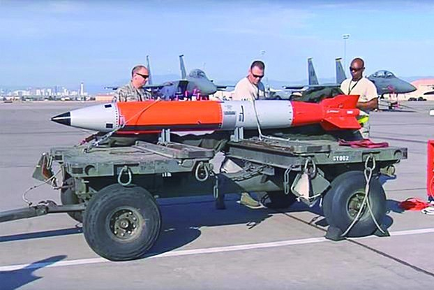

# 小到无后坐力炮，大到洲际导弹核弹头，美俄各有哪些战术核武器？

【环球时报特约记者
陈山】俄罗斯总统普京25日表示，应白俄罗斯总统卢卡申科的要求，俄罗斯与白俄罗斯已同意将在白俄罗斯领土上部署战术核武器。这个消息不但让外界对俄乌冲突走向深感担忧，更对未来世界核平衡态势充满忧虑。

**战术核武器有什么不同**

全球关于战术核武器与战略核武器的具体划分并没有明确规定。时任美国国防部长马蒂斯在2018年曾宣称：“我不认为存在‘战术核武器’这回事。任何时候使用任何核武器都会改变核战略游戏规则。”

美国“全球安全”网站称，美军将战略核武器定义为“旨在打击敌人的作战能力和发动战争的意愿，包括摧毁对手的工业能力、基础设施、运输和通信系统以及其他目标”。战术核武器也被称为“非战略核武器”，主要针对有限的、更直接的军事目标。通常而言，战术核武器在尺寸、打击范围和爆炸当量上都明显偏小。如今战略核武器主要配备在可以飞行数千公里、打击跨洋目标的大型洲际导弹上，而战术核武器包括近程导弹、空投炸弹甚至炮弹，“但上述许多平台也可以运载战略核武器”。

据介绍，战术核武器的爆炸当量可以在1000吨以下到约10万吨之间，而战略核武器的当量可达100万吨以上。但这并不意味着战术核武器的威力就能忽视——它们的爆炸当量可以比二战美国投放在日本的两颗原子弹更大。美国核历史学家亚历克斯·韦勒斯坦的评估称，即便使用美国生产的最小战术核武器——20吨当量的“大卫·克罗基特”战术核无后坐力炮攻击美国首都华盛顿特区的街区，也将导致3270人死亡、3620人受伤的惨重伤亡。

**战术核武器引多方争议**

美国“大众机械”网站称，战术核武器概念是美国率先推动的。在20世纪五六十年代，战术核武器是北约维持欧洲军事平衡的最有效方法。当时苏联在常规武器方面占据绝对优势，为阻挡苏联钢铁洪流，这些战术核武器被寄予厚望。“即便苏军坦克可以有效地抵御核爆炸产生的冲击波和辐射，但对于没有遮掩的其他车辆和人员，战术核武器的伤害仍非常惊人。”当时的美国军事理论直接提出，由于战术核武器对火炮、步兵和后勤车辆的杀伤效果非常好，因此北约战术核武器主要作战对象就是瞄准苏军二线的这类软目标，从而让冲在一线的苏联坦克集群失去后援。正是出于这样的考虑，美国在冷战期间研制和装备了数千枚战术核武器。美国科学家联合会的核专家汉斯·克里斯滕森表示，美国曾一度在欧洲部署7000枚战术核武器，但冷战结束后，美国在常规军力方面已经重新获得优势，因此相继退役了大部分战术核武器。相反的是，冷战后俄罗斯开始更加重视战术核武器，以抵消西方的常规军力优势。

但现代高精度制导武器的发展，让战术核武器投入实战变得更有可行性。以往想要摧毁特别加固目标时，由于命中精度不够，必须用战略核弹头的大当量爆炸威力作为弥补，很容易造成严重的附带平民伤亡；而现代导弹的命中精度很高，只需要相对较小的当量就足以摧毁目标，再加上新一代战术核武器更加“清洁”，对于平民的伤害相对较小，因此部分国际军事学者认为，有限使用战术核武器时，可能引发的政治后果相对较小，例如“使用低当量战术核武器打击远离平民的孤立军事目标”。但外界普遍认为，战术核武器大量列装的结果，本质上是降低了核武器的使用门槛，因为谁也不敢确认对手遭到战术核武器的打击后，会不会进行更大规模的核报复。

由于各种原因，战术核武器从未成为美国和俄罗斯之间主要的《削减战略武器条约》军备控制条约的一部分。其中的部分原因是战术核武器体积较小，可以用常规平台携带，很难进行长期监测和跟踪。

**俄战术核武器种类繁多**

不同于战略核武器受到核军控条约的严格限制，俄罗斯从未具体透露拥有多少战术核武器，西方情报部门也说法不一。2009年的美国政府报告称俄罗斯拥有“3000-5000枚战术核弹头”，2011年美国国防部副部长詹姆斯·米勒估计“俄罗斯可能拥有2000-4000枚战术核弹头”，但美国国防情报局2022年的评估认为，“俄罗斯可能拥有1000-2000枚战术核弹头”，而美国科学家联合会的评估认为，当前俄军战术核弹头不超过1900枚。

美国科学家联合会的相关评估认为，俄罗斯的战略核武器和战术核武器储存在全国约40个高度戒备的永久性储存仓库。俄海军是战术核武器的最大拥有者，总量约935枚。其中包括用于对陆攻击的巡航导弹、反舰巡航导弹、反潜火箭、防空导弹、鱼雷和深水炸弹。它们可由各种水面舰艇、潜艇和海军航空兵的飞机携带。最让西方关注的是最新“亚森M”级攻击核潜艇，它可以携带多种重型鱼雷和巡航导弹，这些武器均可以配备战术核弹头。另外俄海军大量水面舰艇与潜艇都具备发射核常兼备的“口径”远程巡航导弹的能力，意味着它们都可能发射战术核武器。俄罗斯空天军是俄军第二大战术核武器拥有者，总数约500枚，可以由图-22M3轰炸机、苏-24M和苏-34战斗轰炸机、米格-31K战斗机携带，预计新型苏-57隐形战斗机也将具备挂载战术核武器的能力。除了各种空射核巡航导弹和自由落体核炸弹外，西方最关注的是由米格-31K携带的“匕首”高超音速导弹。

该报告还认为，俄军拥有约70枚战术核弹头可用于陆基“伊斯坎德尔”系列战术导弹。此外，俄军A-135战略反导部队仍配备有战术核弹头，意在外太空用核爆炸摧毁来袭导弹。上世纪90年代初，俄防空军拥有约2500-3000枚执行反导任务的战术核弹头，但如今这一数量可能下降到约380枚。

**美军战术核武器在升级**

美国的战术核武器数量也同样没有公开。根据美国《核态势评估报告》，美国核武器储存在美国11个州和5个欧洲国家的24个保密地点。“美国的战术核武器完全由F-15E战斗机携带的B61系列重力核炸弹组成，总数约230枚。其中约150枚B61-3和B61-4重力核炸弹被部署在欧洲五国的6个基地，其余的部署在美国本土。”目前美国还在加紧制造新型B61-12核炸弹，它的当量在300吨到5万吨之间可调，可以用F-35隐形战斗机携带，未来将取代美军现役的其他重力核炸弹。

尽管明面上的美军战术核武器数量不多，但美国科学家联合会认为，随着美国新一代核弹头的研制，美军的战略核弹头与战术核弹头的差别正在缩小甚至消失。例如美国“俄亥俄”级战略核潜艇携带的“三叉戟II
D5LE”潜射洲际导弹已经开始配备W76-2低当量核弹头，它的当量仅有5000吨，远低于W76-1核弹头的10万吨。美国媒体也承认，美军研制这种低当量核弹头的目的就是“在威慑和实战时有更多选择性”。

同时美军46架B-52轰炸机配备了AGM-86B空射巡航导弹，未来还将配备新型AGM-181远程巡航导弹，它们也都可以配备战术核弹头。美国科学家联合会的分析称，把新型低当量核弹头计算在内，美国此类核武器规模庞大。

