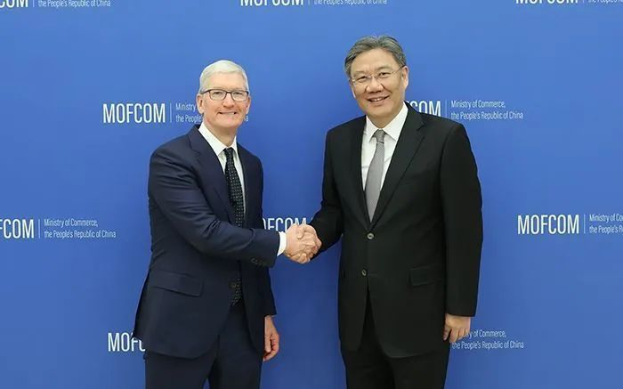
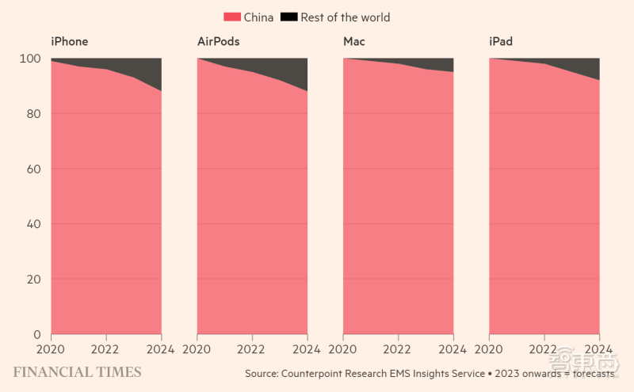
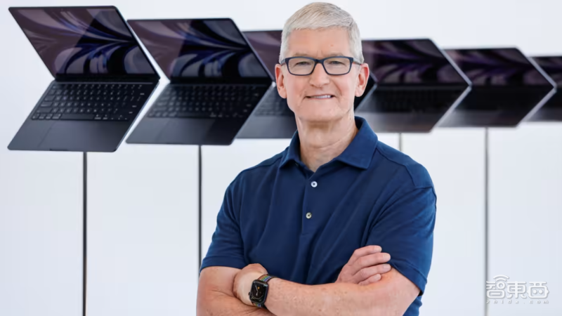
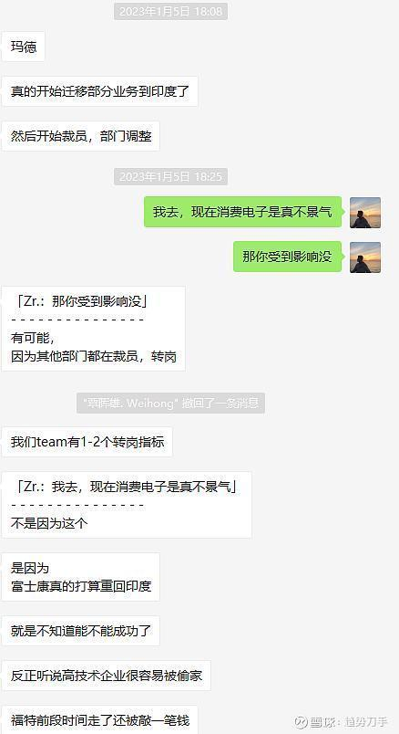
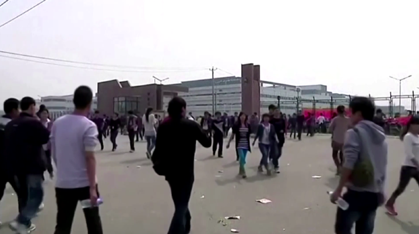
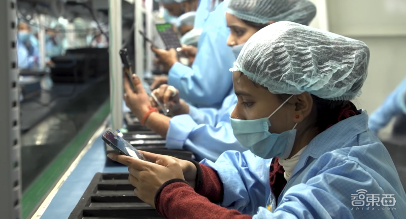
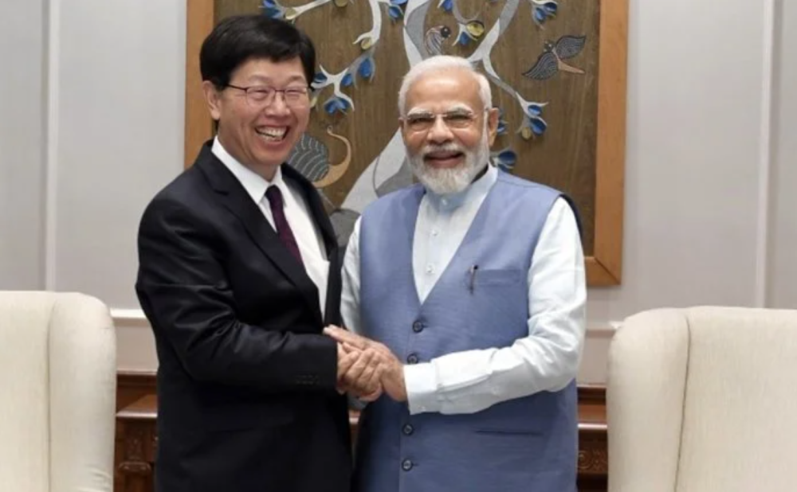
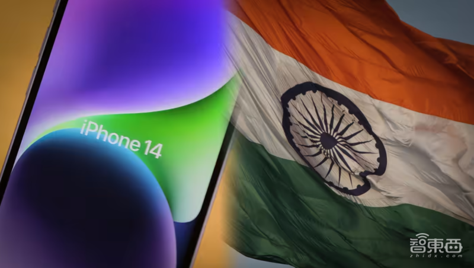
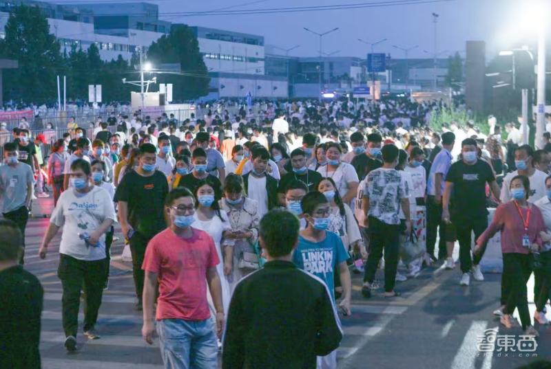

# 库克来京，苹果离华

作者 | 云鹏 编辑 | 心缘

这两天，库克没少在北京忙活。

上周五，苹果公司CEO蒂姆·库克在北京三里屯的苹果店逛了一圈，一时间大家与库克的合影刷爆了朋友圈。

这次库克到北京，主要是来参加中国发展高层论坛2023年年会。细数起来，这也是 **疫情之后，库克第一次来中国。**

库克在年会演讲中特别提到了30多年来苹果和中国的密切联系，称这是一种“彼此享受的共生关系（a symbiotic kind of relationship
that we have both enjoyed）”。

_2023年3月25日，苹果CEO库克在中国发展高层论坛2023年年会上发表演讲后离开会场，图片来源：路透社_

就在今天，商务部部长王文涛会见了库克，据商务部消息，双方就苹果在华发展、稳定产业链供应链等议题进行了交流。

_商务部部长王文涛会见苹果公司CEO库克，来源：商务部_

但提到苹果与中国的关系，近期产业内的“担忧”显然胜过“享受”。这主要是因为， **苹果产业链转移出中国的速度，正不断加快。**

在一系列鼓励供应商投资建厂、高层之间会晤的行动之下，苹果似乎有意将印度打造成“下一个中国”，这个“中国”既包含了中国现在所拥有的强大高端电子制造能力，又包括了中国市场强大的电子产品消费能力。

此前英国《金融时报》一篇文章深入分析了苹果与中国供应链之间的“爱恨纠葛”，
**在美国政客和投资人向库克施压、企图加速苹果与中国脱钩的大背景下，苹果供应链正迎来一场深层次结构性调整。**

目前不少国内外分析人士都持有一个相似的观点：以印度、越南为代表的制造业崛起国家短时间内不可能取代中国在苹果供应链中的地位。

事实的确如此，
**印度现在仍然只生产了5%的iPhone，而中国大陆生产了95%的iPhone、AirPods、Mac和iPad。现在苹果180多家供应商中大约有150家在中国有业务，这个数字在越南是26，在印度是11。**

_2020-2024年苹果iPhone、AirPods、Mac、iPad全球产能分布（预测），来源：英国《金融时报》_

但需要注意的是，苹果目前的操盘手、CEO库克，是一个非常有执行力的男人，他对于苹果供应链二十多年来的严格把控，造就了苹果在科技产业中零其他对手望尘莫及的供应链管理能力。

而 **库克这个人，目前十分看好印度，并且要做好印度市场。**

最近苹果已经亲自向印度提出建厂申请，帮14家中国供应链企业拿到了许可，其中就包括我们熟悉的立讯精密、舜宇光学这样的果链巨头企业，苹果向印度转移生产，走的十分坚定。

不论如何，苹果供应链的转移必将对中国制造业产生深远影响，而这些影响如今似乎已经初步展露，从订单减少、招工放缓到产线外移。
**中国果链企业要如何面对这场转移大潮，如何求存？或许已成为不少消费电子企业近几年面临的主要挑战之一。**

一、产线收缩订单大砍，招工不到原来十分之一，产业转移阵痛初显

按理说，年后本是招工的旺季，但今年的春天，对于 **大部分江浙沪地区以及深圳的电子制造业企业来说，显得格外萧瑟，** 而对于打工人来说，也显得同样寒冷。

当然，这一部分原因也是由于从去年延续至今的、消费电子市场全球性的疲软，终端厂商普遍面临清库存问题，因此对于新订单的计划就显得十分谨慎。没有订单，自然就没有了招工需求。

但另一方面，从郑州富士康“iPhone城”到江西吉安的立讯精密工厂，再到江浙、昆山一带的各类制造业工业园区，
**普遍有管理层人员反馈，客户在不断将生产重心转移到印度和东南亚。**

甚至有工厂内部人士直言， **不在东南亚建厂，就拿不到订单，只要是出口欧美日韩，客户非常看重你的产地。** 很多订单就是这样流失掉的。

_雪球平台上用户的真实反映_

虽然相比这些要求强制转移的客户，苹果还算留有余地，但以苹果在国内涉及的供应链公司数量、工人数量来看，苹果产能向印度、越南等地的转移，必然会刺痛国内制造业，牵动不少人的饭碗。

曾经在巅峰时期拥有近30万工人的富士康郑州“iPhone城”，今年开始招聘时，仅有八大街厂区招募正式工，而更加受打工者青睐的港区富士康却迟迟未开始招聘，就连往年常见的小时工、派遣工也未出现在招工信息内。

除了招工需求减少，工资待遇也有所下降。一位在港区富士康工作的工人告诉记者，他每个月到手的工资只有三四千元左右。

这位工人提到，目前订单减少，加班也就随之减少，没有加班就没有加班费， **没有加班费就只剩2200元的底薪了。**

_富士康厂区_

据另一位在深圳龙华富士康上班的工人反映，按理说年后工价都会上涨，但今年不增反降，一个小时二十多块钱。他提到，部门原来每天有六七条产线开工，但如今每天只有一两条产线生产。深圳富士康目前基本没有加机会，一天上班8小时，每小时拿16元，仅此而已。

这位工人还说，除了富士康，其实深圳的一些大工厂情况都差不多，往年的大量招工今年都不复存在了。在他看来，
**年年都说难，年年都说钱不好挣，但似乎没有一年像今年表现的这么明显。**

正如这位工人所说，不仅是富士康，其他消费电子制造巨头日子同样不好过。位于江西省吉安市的立讯智造是立讯精密生产苹果AirPods产品的工厂之一，有当地知情人士告诉记者，由于工厂大幅裁员，现在周围不少配套店铺都倒闭了。

一位负责接送果链企业长盈精密的员工上下班的司机称，现在上班的人少了很多，因为没什么订单， **据他了解，很多外国客户的订单都转移到了印度、越南等地。**

苏州和昆山遍布着很多工业园区，也常常是很多外来务工人员的首选打工地，但今年苏州和昆山许多工厂的招聘规模甚至缩减为原来的十分之一，不少工人在短视频平台上发布视频，吐槽自己面临的困境。

上海一家工厂的员工透露，今年公司销量跟去年比大概减少了三成以上，而且
**从去年下半年开始，富士康等大客户都开始将生产重心转移到印度和东南亚，所以配套产业链上的这些供应商就要跟着转移，否则就面临拿不到订单的问题。**

无独有偶，从去年下半年开始，广达、仁宝等老牌代工企业的订单也出现大幅缩减。订单缩减至下，产线开始收缩，招工自然也放缓了许多。

一位消费电子领域资深人士称，从去年下半年到今年，大批工厂都在往海外迁，从富士康到立讯精密。这些厂商没有办法，因为
**不在东南亚建厂，他们就拿不到订单，这就是现实情况。**

二、富士康立讯带头转移印度越南，苹果亲自下场帮忙“扫清障碍”

如果说国内电子制造业的“萧瑟”还能以市场整体需求不景气作为主要理由，那么
**富士康、立讯精密、歌尔股份等果链企业在海外积极的“扩产”实际动作，则是实打实的产业转移。**

实际上，今天我们看到的是产业收缩、订单外移的表象，背后这些苹果供应商们早已运筹多年。

果链转移早已不是新鲜事，只不过，不论是近期密集的海外建厂信息“轰炸”，还是实际的自身利益受损，都让更多中国电子制造领域的企业和从业者感受到了愈发明显的影响。

就在最近， **富士康宣布将投资2亿美元在印度建厂生产AirPods，**
继拿下iPhone之后，富士康在印度的苹果代工布局再次拓展，这座富士康印度AirPods工厂预计最早2024年年底投产。

就在前不久， **富士康还被报道将投资7亿美元在“印度硅谷”特伦甘纳邦建立新工厂，以提高iPhone的产能，并承诺在10年内为印度增加10万就业岗位。**

_富士康印度工厂_

2024年，富士康目标要年产2000万部iPhone，而现在年产量大约为600万部，也就是要在两年内翻三倍多。

为了与印度政府更好地达成合作，富士康董事长刘扬伟亲自去印度会见了印度总理莫迪，两个人亲切合影，刘扬伟在照片中笑得非常开心。

_左：刘扬伟，右：莫迪_

两个人见面后，刘扬伟很快发了推特，称富士康会继续在印度打造一个“生态系统”。莫迪随后转发了这条推特并说到，他和刘先生的会面很愉快，他们讨论了加强印度科技创新、打造制造业生态系统的一系列问题。

**除了果链企业自己的努力，苹果也在积极地帮助他们扫清一些“障碍”。**

比如前不久，苹果亲自代替中国供应链企业向印度政府提出建厂申请，其中14家都已经获得了建厂许可，其中就包括立讯精密、舜宇光学等企业。而这些拿到许可的中国果链企业，需要尽快在印度当地找到适合的合作伙伴。

**不仅帮忙申请建厂许可，苹果还在积极推动一些有利于苹果代工业务发展的政策的落地。**

比如最近在苹果和富士康等多家公司推动下，印度卡纳塔克邦就完成了劳动法自由化，通过新立法让“两班制生产”得以在印度实行。显然，这早已是在中国大陆行之有效的生产方式了，苹果只需要“让印度变得和中国越来越像”。

不仅是印度， **苹果供应链向越南转移的动作也十分迅速。**

去年8月，富士康宣布斥资3亿美元在越南江北省光州工业区建立新工厂，该工厂预计将容纳3万名工人，而最近富士康计划进一步扩大该厂区的规模。

目前越南主要承接了苹果AirPods的生产，而AirPods的主要生产商之一立讯精密正在将AirPods制造的重心转移到越南的工厂。

根据国内一些论坛上的员工讨论信息，
**立讯精密已经向一些经验丰富的老员工开出了“调任邀请”，该邀请要求员工在越南工作至少3个月，而接受要求则能够获得5000元以上的加薪福利。**

未来，苹果的Apple Watch、iPad以及iPhone都将会进一步在越南落地生产，这些订单必然还会创造出更多的用工需求。

_AirPods 3包装盒背面_

此外，和硕、仁宝等苹果代工厂均已在越南建厂，歌尔股份也在今年年初宣布将投资2.8亿美元在越南新建工厂。

除了这些老牌果链企业，一些新入局果链的中国厂商也已经开始了海外建厂布局。

比如京东方已宣布计划投资4亿美元在越南建设两座工厂，专门为苹果生产OLED屏幕。

可以说， **不论是印度还是越南，不论是富士康、立讯精密还是其他果链企业，苹果供应链的转移大潮已经势不可挡地影响了每一个参与者。**

三、苹果为何“急着”转出？政治经济双重因素均不容忽视

为什么苹果会将供应链从中国大陆转出？为什么苹果如此“着急”转出？

英国《金融时报》的报道从美国人的视角审视了苹果供应链面临的深层次危机，同时也清晰地向我们传达了一个信息，那就是
**美国的政客、苹果的股东们都在大力向苹果施压，向库克施压，要求其尽快与中国“脱钩”。**

或许一家企业与一个国家“脱钩”，听起来有些不对等，但以苹果供应链在全球科技产业链中的重要地位，苹果与中国制造业深度绑定的程度来看，这样的用词实则并不过分。

最近几年，中美关系一直维持紧张态势，美方“去中化”意图也十分明显，站在美国的立场，自己国家市值最高、技术创新实力最强的一家企业被中国牢牢把住生产的“命脉”，是一件很难接受的事情。

这种来自于政治层面的压力，是苹果供应链转移的深层次因素之一。

为了减轻对中国大陆产业链的依赖，近年来，苹果一直在催促果链企业去印度、越南以及东南亚等地布局建厂，转移产能。

_富士康郑州厂区_

从2018年中美贸易摩擦加剧开始，这种转移的趋势就在不断凸显，转移速度也不断加快。有分析人士称，
**中国1998年加入世贸协议，而世贸协议有20年的“保护期”，结束时间刚好是2018年。保护期结束，贸易战山雨欲来。**

客观来看，三年的疫情，起初提升了中国制造在全球经济贸易中的地位，很多国家都需要采购中国生产的商品，而印度、东南亚等地也因疫情停工，产业转移放缓。如今疫情基本结束，制造业转移的浪潮也开始愈发猛烈的卷土重来。

当然，除了政治因素的影响， **从苹果自身商业利益角度出发，押宝印度市场的好处也是显而易见的。**

作为世界人口第二大国家，印度消费市场在快速增长，印度消费者对于各类电子产品的消费需求也在不断增长，印度的GDP已经超过英国，与德国和日本的差距也在快速缩小。

虽然印度贫富差距大，但随着印度中产阶级的快速成长，印度未来的巨大增量消费市场空间绝对不容小觑。
**根据IDC数据，在全球消费电子市场遇冷大背景下，2022年印度智能手表出货量同比大涨151.3%，全年出货量超过3000万块。**

对于目前业绩增长乏力的苹果来说，印度市场无疑是一块潜在的“大蛋糕”，只不过 **这块蛋糕现在还是个“坯子”，需要进一步“加工、点缀、烤熟烤香”。**

中国市场为苹果贡献了五分之一的营收，如果印度市场能够发展到相近规模，必然会给苹果的财报带来实质性的漂亮数据。

再者，不论是土地成本还是人力成本，印度目前的优势都十分明显，印度工人的人均工资水平仅有国内的六分之一不到，并且印度建厂的土地成本也显著低于国内。越南、东南亚等国虽然不具备与印度相当的成长潜力，但在土地、人力成本方面也具备类似优势。

总体来看，
**苹果供应链的转移既有“不得已”的政治因素，也有实际利益的切实考量，产能转移印度、越南，大力押宝印度，对苹果来说是必须要做的，坦白来讲，苹果似乎也没有其他选择了。**

四、果链转移、中国制造“外溢”，产业升级加紧提上日程

既然果链的转移已经是必然大势，那么苹果的中国供应链企业要做的，或者说中国制造业企业要做的，就是在顺应大势的前提下，谋求更好的生存。

对于该如何看待产业链的转移，以及如何面对并做出调整，很多行业资深人士以及这些供应链企业的从业者都给出了自己的看法和认识。

**首先，从积极的一面来看，这种产业的转移是产业发展的必然规律。** 正如当年屏幕显示产业从日韩流向中国台湾，再从台湾转移至中国大陆。

一位电子产业分析师认为，国内制造业企业在发展过程遇到利润无法覆盖成本时，低毛利产业的转移将成为必然，今天国内很多消费电子企业都在印度、越南等地建厂，就是从现实角度出发实现降本增效。

《溢出：中国制造未来史》一书认为，中国的超大规模制造能力决定了中国在世界秩序中的特殊地位，推动着中国与世界秩序的共生演化，
**制造业向越南的所谓“转移”，实际上是中国供应链的“溢出”。**

据统计，富士康每组装一个售价万元的iPhone，产线工人只能拿不到10美元的利润。这种最末端、利润最低的制造环节，适度转出，也可以让更多的劳动力分配至价值更高的产业环节中。

就连人民日报都发文称： **“要减轻苹果依赖症。”**
随着产业升级、制造业的智能化加速，未来这种整机组装领域对工人的需求还会越来越少。供应链企业必然要在利润空间更大的高端制造业领域争取自己的一席之地。

**从另一方面来看，中国在苹果供应链中的优势地位短时间内仍然难以撼动，供应链企业还有充足的时间去调整、转型。**

虽然富士康等厂商已经在印度设厂，但生产所需要的关键部件仍然需要从中国进口，印度、越南等地在供应链体系建设方面仍然不完善。目前苹果新品导入环节（大规模量产前最重要的环节）仍然要在中国大陆进行。

此外，随着京东方、舜宇光学等厂商打入屏幕、镜头等关键零部件领域，中国供应商在苹果核心零部件供应中的比重会进一步提升。

彭博行业研究硬件分析师预计，
**到2030年，苹果只会将10%的iPhone生产转移到中国以外，如果苹果行动更积极的话，这一比例最多可能会达到20%。也就是说，短期内中国的“苹果工厂”地位仍然十分稳固。**

富士康劳工研究院预测，随着媒体关注度的下降，苹果后续很肯能还会悄悄增加在华投资。

当然， **除了看到积极的一面，供应链企业更要以审慎的态度来看待苹果供应链的“去中国化”。**

在一些果链厂商员工看来，其实组装本来就是劳动力密集型行业，对工人素质的要求并没有一些媒体报道中说的那么高，“技术含量并不高，吃的是熟练度”。

虽然现在印度、越南工人平均素质不及中国工人，但加以时日培训，也完全可以上岗。并且印度工人工资更低，工资差完全可以弥补富士康培训工人的成本。

_富士康印度手机工厂_

目前印度已经成功生产了iPhone
14，越南也在推进iPhone制造的落地，iPhone是苹果所有产品中组装要求最高的产品，能够生产iPhone的厂商，理论上来讲就可以承接全球任何一家手机厂商的代工订单。

据媒体报道，
**十几年前，富士康第一次来大陆设厂，台湾高管指着在阴凉地里偷偷睡觉的物流司机说，“都是这种人怎么能干好活？”，但十余年过去了，富士康生产了全世界70%的iPhone，而富士康的iPhone工厂几乎全部位于中国大陆，也为大陆培养了一批制造业熟练产业工人。**

一位长期关注苹果产业链人士认为，苹果产业链转移已是必然，果链企业能做的，就是“用时间换空间”，抓紧进行产业升级，只有做好苹果一定会离开的准备，才能在未来不陷入被动。

当然，如何解决好转型期的阵痛也是关键。正如那句话所说， **“时代一粒尘沙，便是压在每个人身上的一座大山。”**

除了郑州富士康工厂的三四十万名工人，放眼全球，苹果150多家供应商当中，中国企业有50多家，
**整个产业链涉及企业可能有数百甚至上千家，苹果供应链牵动的，可能是数百万人的饭碗。**

目前国内手机厂商都在“对标苹果”，从产品技术角度来看，国产手机与苹果iPhone的差距的确在不断缩小，未来中国手机厂商中是否会走出一家或多家“苹果”，对国内消费电子产业的发展意义十分重大。

中国改革开放四十多年来打造的“世界工厂”既不是一蹴而就的，也非可以轻易取代的，在产业转移和产业升级转型的双重浪潮下，不论是个人、企业还是政府，都要做好准备，一起度过这个阵痛期。

结语：果链转移势不可逆，全球科技产业格局面临重构挑战

苹果产业链的变动始终牵动着科技产业每一位从业者的心，也关系到数百万从业者的切实利益。今天，果链转移之势已不可逆，苹果也在积极推进着这一进程的加速，所有参与者都要面临产业格局重构的挑战。

库克用二十多年打造了苹果供应链日不落帝国，让供应链创新能力成为苹果的核心优势，二十多年过去，苹果成为了全球市值第一的科技巨头，中国果链企业也随之成长，带动着中国高端电子制造业的发展。

我们也能看到，国际局势瞬息万变，大国博弈对科技产业的影响不断加深，面对越来越复杂的生存环境，不论是苹果还是每一家果链企业，都要做好充分准备，面对任何意料之中和意料之外的挑战。

