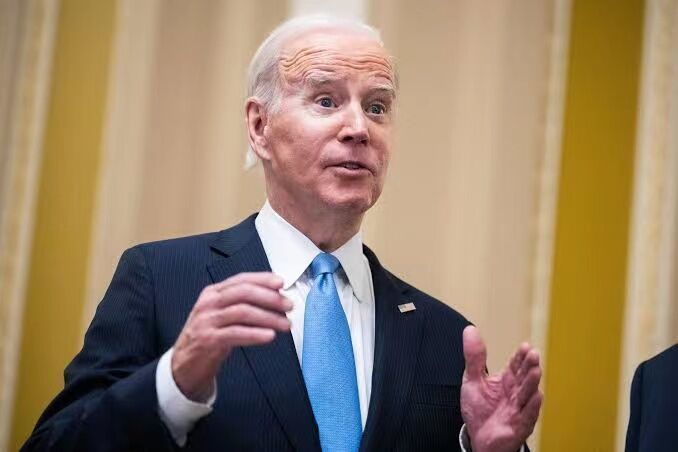

# 拜登结束对加拿大首访，美加宣称建“跨境半导体封装走廊”防中国

【环球时报驻美国特约记者 李准 环球时报特约记者
甄翔】美国总统拜登3月24日结束上任以来对加拿大的首访。正如媒体报道，此行“中国”成为重点关注话题，其间美加宣布要建立“跨境半导体封装走廊”和“北美关键矿产供应链”，会后发表的联合声明还提出，将在北极前沿作战地点投资73亿加元（约合365亿元人民币），“在未来几年与中国和俄罗斯竞争”。

香港《南华早报》25日报道称，加拿大总理特鲁多与拜登赴加议会出席活动时表示，面对更激烈的竞争，面对越来越强硬的中国，两国必须构建起“包容一切的北美市场”，这个市场既包括半导体，也包括太阳能电池等各种产品。据路透社报道，特鲁多表示，两国领导人与IBM公司签署了一项协议，以开放半导体产能，并在供应链问题上减轻对外国制造商的依赖。

路透社称，拜登在联合声明中宣布，将出资5000万美元鼓励美国和加拿大公司投资半导体封装，并表示加拿大将在近期为半导体项目提供至多2.5亿加元的资金。

声明说，两国还同意成立一个专注于清洁能源的能源转型工作组，并声称在“北美关键矿产供应链”上进行合作。多家媒体透露，特鲁多将于当地时间28日宣布新的政府预算，其中将包括扩展矿产和清洁科技产能的相关措施。特鲁多宣称，西方国家的商品和资源“长期依赖于一些在环境、人权和劳工标准方面表现很差的国家”，接着就自夸说，加拿大能为那些寻求减少对华关键原材料依赖的国家提供解决方案。加拿大投资官网也“高调”宣称，就电动汽车制造所需的关键矿产而言，加拿大的储量高居全球第一。

两国联合声明还写入了在北极前沿作战地点投资73亿加元，用于支持第五代战机等计划，“确保北美防空司令部有能力威慑和防御对美加领空和海域的新威胁，并在未来几年与中国和俄罗斯竞争”。

美国全国广播公司称，拜登此次访问加拿大聚焦中国、北美防空联合司令部、海地等议题。“面对来自中国日益增长的威胁”，两国希望展示团结和决心。但这两个北美邻国在很多问题上存在分歧。分析人士说，这次访问的一个根本特点似乎只在于时机和象征意义。

