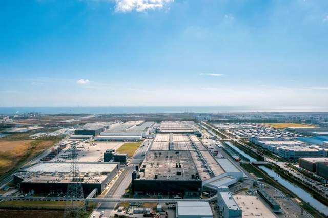
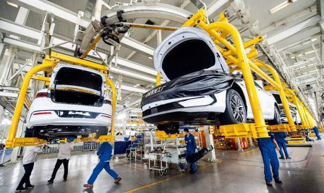
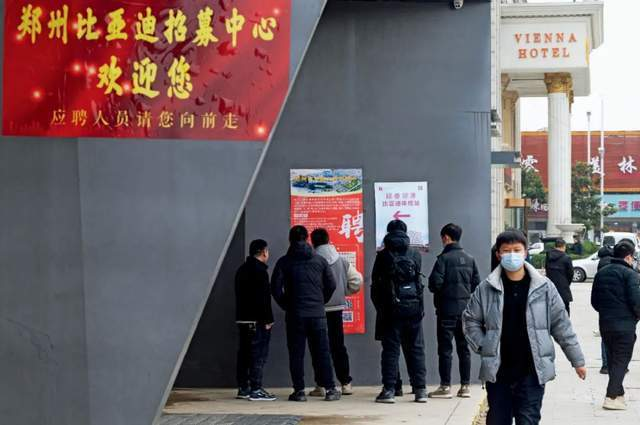
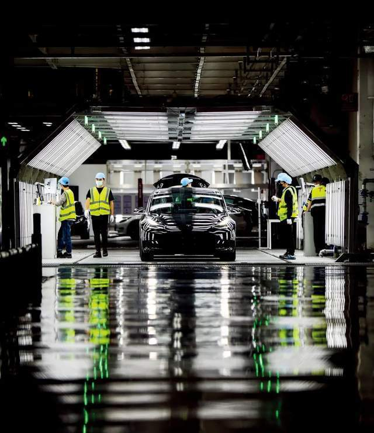

# 新能源车淘汰赛！哪些地方政府会为造车冲动买单？

_特斯拉上海超级工厂。图/视觉中国_

威马汽车或许会成为下一个倒下的新能源车企。

2017 年 9
月，威马汽车位于浙江温州的工厂竣工，被视为“圆了温州30年汽车梦”。5年之后，威马汽车已处在生死边缘。在已经看惯造车项目起落的中国市场，威马汽车这样的第一批造车新势力摇摇欲坠，还是激起了很大的波澜。

2023年，中国新能源汽车迎来两个标志性事件：一方面是补贴彻底退出，另一方面则是开年堪称惨烈的价格战，这都预示着新能源车企进入“淘汰赛”，未来会有更多知名或不知名的车企陷入困顿。

而因为前一阶段地方政府深度介入，一些车企陷入困顿后往往需要地方政府“买单”，如今不少地方政府正在为此前的冲动付出代价。

但是新能源汽车产业进入“淘汰赛”阶段，并不意味着机会的消逝，相反其可能预示更大的机遇，不少地方政府正在总结前一阶段经验教训，思考如何搭上这班快车。

**难以盘活的“僵尸产能”**

威马汽车位于浙江温州和湖北黄冈的两处工厂已经停工。3月7日，公司曾发出复产复工声明，称在政府相关单位支持下，已联系生产部门、经销部门和售后备件外包存储配送公司等，紧急调拨零配件，尽快满足用户需求。但是声明中并未给出时间表。

停工的负面影响已经向上下游传导：一方面，威马汽车此前拖欠供应商货款，零部件供应渠道中断，部分车辆因缺件成为库存车；另一方面，截至去年6月30日，威马汽车尚有784家各类合作门店，但因无车交付、配件短缺，不少经销商选择闭店，消费者售后无门。

威马汽车成立于2015年，曾位列造车新势力头部，尽管此后与“蔚小理”差距拉大，但仍是二线造车新势力的代表。

“目前陷入困境以及几度易主的几家造车新势力前景不明朗。”轩元资本创始人王荣进告诉《中国新闻周刊》，新能源汽车产业集中度必然提升，新势力只会越来越少，而非越来越多。

此前均瑶集团入主的云度汽车也曾属于第一批造车新势力企业，与威马汽车一样成立于2015年，大本营位于福建莆田，年销量一度仅次于蔚来，但是在2019年后因产品问题逐渐掉队，2022年还一度停产。

不过威马汽车、云度汽车与此前夭折的一批新能源造车项目有所不同。2019年以来，伴随资本对新能源造车项目态度趋冷，已有赛麟、拜腾等一批新能源车企倒下。典型如拜腾，曾被视为含着金汤匙出生：CEO毕福康是宝马“i8之父”，总裁戴雷曾担任英菲尼迪中国总经理。2018年年中落地南京时，拜腾已是估值接近20亿美元的“独角兽”。不过最终在“烧光”84亿元之后，却没有造出一台量产车，走上破产重整之路。

_比亚迪公司第十一事业部总装西安工厂最终装配区。图/视觉中国_

“此前被淘汰的多是‘PPT造车’项目，而这一次则是市场从产品与技术的角度进行淘汰。”王荣进说。

今年2月底，威马汽车创始人沈晖在接受采访时反思企业陷入危机的原因，第一是产品缺少特色，没能培育种子用户群体，第二是智能化方面存在短板。两点反思均与产品与技术相关。

造车项目夭折的原因各不相同，但是地方政府都急于找到接盘方，温州、黄冈两地政府正为此焦虑，威马汽车位于两地工厂的产能分别为10万辆、15万辆。

难以找到接盘方，一个重要原因是现有头部新能源车企远未来到产能扩张期。汽车分析师钟师告诉《中国新闻周刊》，“蔚小理”近年年产量尚在15万辆以下，现有产能尚未完全利用，无力接盘闲置产能，而且产能建设相对简单。“产能严重过剩，一些此前盲目上马项目的产能已经没有盘活的可能。”

“首先，接盘方需要考虑是否有能力消化产能。其次，需要考虑是否有能力化解债务问题。一方面需要注入流动资金盘活产能，另一方面也要处置原有债务。”王荣进如此评价接盘方应有的“资质”。

现实中的情况往往更加复杂。一家国资汽车集团此前曾接触一位资深投资人，希望他牵线为集团的僵尸产能寻找接盘方。这位投资人向《中国新闻周刊》坦言，“这些产能我认为已经没有盘活的可能，但对方执意希望找人接手，如今三四年过去，没有任何进展。作为国企，需要接盘方不遣散员工，保证现有员工生计有着落，员工安置问题便是很大障碍。”

即使找到“白衣骑士”，也不意味产能会被盘活。2020年7月，拜腾国内业务暂停运营后，曾几次尝试“重启”。2021年1月，拜腾与富士康科技集团、南京经济技术开发区签署战略合作框架协议，合力加速推进拜腾首款车型M-
Byte的量产制造工作，力争在2022年第一季度前实现M-Byte量产，但这场合作仅持续半年左右。

_2月13日，河南郑州市，比亚迪公司在航空港区举办的招聘会。图/IC_

“威马已属苟延残喘，资金输血可能为企业续命，但是经营状况能否好转存在不确定性。威马已经遣散大量员工，即使当下有资金注入，产品如何开发，以及是否来得及开发都是问题。产品开发应像接力赛一样，一棒接一棒，如果无法用新产品救市，又如何渡过眼下的难关？”钟师说，如今新能源汽车市场竞争激烈，企业如果稍有闪失跌倒，难有再爬起来的机会。

“很多企业已经悄无声息地被淘汰。一些企业从未推出产品，虚晃一枪，因此退场也悄无声息。威马属于第一批造车新势力，因此退场时引起较多关注。”钟师说，更多产能正在沉默地等待被盘活。

“中国很多车企的产能只是一个数字，早已沦为无效产能。”有业内人士向记者举例说，江西有几家车企的产能号称很大，但是工厂实际处于半停工状态，国内类似的“烂摊子”为数不少。

2019年年初，江西省曾因为在新能源汽车领域的过热投资，受到了国家发改委的批评。江西新能源汽车产业投资热度在全国居首，但产能利用率却大幅低于全国平均水平。江西省在2015~2017年6月之间密集引进的18项新能源汽车投资计划中，有7项在宣布签约后并没有任何开工信息，而在已开工的11个项目中，半数以上没有按期完工。

如此情况不只发生在江西。2021年，江苏省发改委曾发布公开文件称，2020年江苏省汽车产能利用率仅有33.03％，低于全国平均水平约20个百分点。并且从2016年至2020年，产能利用率呈现出逐年下降态势，已严重偏离产能利用合理区间。

中关村新型电池技术创新联盟秘书长、电池百人会理事长于清教告诉《中国新闻周刊》，目前新能源汽车企业产能利用率分化严重，总体利用率未作统计，但按照产能适度超前原则，产能利用率在80％左右相对合适。“部分政府‘重招商，轻监管’，以及前期部分车企被补贴红利吸引，盲目上马新能源项目，而未能推出有市场竞争力的产品是产能利用率低的重要原因。”

地方政府对于造车项目的深度介入，使得爬出“泥潭”更加困难。“对于一些地方政府前期投资已经被套住的项目，往往要求地方政府继续给予资金支持。这使得跌倒过的地方政府也会评估接盘方的实力，避免后续支持再度落空。”前述资深投资人说。

入主云度汽车后，均瑶集团董事长王均金曾表示，“除了均瑶集团自身的优势以外，当地政府也对云度汽车的项目给予了大力支持。”

**“特斯拉能有几个？”**

地方政府陷入“造车泥潭”，一定程度源于此前对新能源造车项目近乎狂热的追捧。

“首先便是资金扶持，区政府投资1.5亿元，5000万元是区政府平台公司股权投资，另外1亿元以‘明股实债’形式进入。因为国资有保值增值需求，需要有一定收益率保障，协议也约定了触发实控人回购国资股权的兜底条款。”一家位于二线城市的新能源汽车零部件企业负责人告诉《中国新闻周刊》，国资只是财务投资，从不参与日常经营，全力支持公司实控人，以保障公司决策效率。

“一些二线城市，甚至层级更低的城市原本不具备发展新能源汽车产业的条件，缺少人才与技术，‘无中生有’便只能靠资金‘硬砸’。如果没有资金配套，一家企业为什么会选择落地这些城市？”一家新能源整车厂负责人如此反问《中国新闻周刊》记者。

合肥引入蔚来成为众多地方政府希望仿效的对象。蔚来与合肥战投2020年签署协议，蔚来获得70亿元投资，总部需入驻合肥经济技术开发区，同时必须在收到投资后48个月内提交上市申请，并在60个月内完成上市。

除去资金，服务、市场也是地方政府吸引新能源汽车产业链的重要手段。前述新能源整车厂负责人告诉记者，企业原来的生产基地位于一座二线城市，面积有限，且接近市中心，产能扩张受限，有四线城市的工业园区直接代建厂房，邀请企业“拎包入住”。

_工作人员在特斯拉上海超级工厂内作业。图/新华_

如此规格的服务在地方政府引入整车项目时并不鲜见。“2016年底，我与南京市领导进行第一次会谈，只有18个月，试制样车已经下线，一切蓝图正有条不紊地变成现实。这样的速度，只有南京才能实现。”2018年4月，拜腾南京工厂试制车间正式启用时，毕福康在接受采访时如此表示。

不难看出地方政府对于新能源汽车产业，特别是其中整车制造环节的渴望，地方政府都希望在这一轮汽车工业洗牌过程中分得更大的蛋糕。

根据陕西汽车工业协会发布的数据，2022年，陕西汽车产量133.8万辆，增速66.9％，增速位列全国第一。其中主要的贡献者便是新能源汽车，去年102万辆的新能源汽车产量占全省汽车产量的76.2％，占全国新能源汽车产量的14.5％。新能源汽车产量又主要源自西安比亚迪工厂。2022年9月，比亚迪西安三期工厂投产，当年新能源汽车产量达到99.5万辆。比亚迪西安工厂已经开始第四期扩建工作，预计于今年6月建成，届时该工厂的规划产能将有望超过140万辆。用王传福的话说，目前，西安是比亚迪除总部深圳以外，布局最全、业务合作最广的城市。

相比之下，一些传统意义上的汽车产业高地却正在“失势”， 如重庆2016年曾以316万辆汽车产量夺得全国第一，但是2021年却不足200万辆。

同样有紧迫感的还有上海。从2020年起，上海浦东新区汽车产业超越电子信息产品制造业，成为第一大产业，其汽车产业占上海市的比重也逐年提高，从2015年的不足30％提升至2021年的接近50％。特斯拉上海超级工厂无疑扮演了重要角色。

除去特斯拉，上海也在积极布局其他新能源整车厂。与特斯拉上海超级工厂一墙之隔的便是上汽大众新能源汽车工厂，2020年10月首款量产车型国产ID.4正式投产。2020年11月，上汽集团、浦东新区、阿里巴巴合作打造智己汽车，上汽集团持股54％。“但是上汽集团的新能源车销量主要靠上汽通用五菱支撑，在上海本地没有培育出像样的新能源汽车品牌，此前依靠的荣威新能源汽车在国内市场表现很差。”有业内人士向《中国新闻周刊》直言。

“特斯拉能有几个？”有上海招商部门负责人向《中国新闻周刊》感慨引进优质整车项目之难。

“不过，热衷于整车项目的地方政府仍不在少数，甚至将新能源汽车产业视为房地产之后拉动经济的首选。”前述业内人士告诉记者，有地方政府希望他引荐靠谱的整车项目。当下，地方政府更倾向于抓住成熟车企扩张产能的机会，而非扶持初创项目。

“以比亚迪为例，落地产能其实只看中三点：给钱、给地、给市场。比如在与地方政府谈判时，提出将当地出租车更换为比亚迪产品。”

**产能过剩之辩**

一方面是大量产能有待盘活，另一方面则是地方政府仍然热衷于新能源整车项目。关于新能源汽车产能是否过剩的讨论再次被摆上桌面。

“我记得2021年曾有媒体报道，新能源汽车产能已经达到1000万辆，当年产量只有300多万辆，产能不是严重过剩吗？可是2022年新能源汽车产量达到700万辆，如果没有2021年年底1000万辆的产能，去年如何生产出700万辆新能源汽车？”面对产能是否过剩的问题，全国政协经济委员会副主任苗圩今年2月17日在中国电动汽车百人会论坛专家媒体交流会上表示，预计今年新能源汽车渗透率会达到30％，即900万辆，按照80％的产能利用率计算，需要1120万辆新能源汽车产能，产能现阶段不存在过剩问题。

“一个新兴产业崛起，需要充分竞争，其间可能发生各种乱象，优胜劣汰，留下的企业中一定会诞生世界级的车企，如果没有充分竞争，优秀的企业也难以脱颖而出。”钟师说，但是这个过程一定很惨烈。中国的新能源车产业正在经历这样“惨烈”的过程。

苗圩也指出，有些地区、企业的产能过剩。比如2016年以来新成立的苏州前途、淮安敏安等企业，产能利用率都低于5％，赛麟、拜腾、博郡、汉腾等项目基本上也已经烂尾。

产能是否过剩确实不能一概而论。新能源与智能网联汽车独立研究者曹广平认为，新能源汽车的落后产能在局部地区或部分企业中过剩。但是优质的新能源汽车产能相对于发展需求来说则并不过剩，比如好的总装产能、压铸产能还不足。再比如新能源汽车配套的供应链产能中，压铸所需的优质专用铝合金产能等目前也并不过剩。

对于产能结构性过剩的原因，曹广平认为，“此前造车的投资环境不理想，一些投资虽然投到了新行业、新产品，但是没有投准新技术、新方向，一些项目根本缺少为新能源汽车增加性能、降低成本的技术创新。”

其实相比于新能源汽车产能是否过剩的问题，包括苗圩在内的众多业内人士都表达了对于燃油汽车产能过剩的担忧。

于清教认为，传统燃油车市场已进入存量竞争阶段，市场销量增长乏力，产能利用率较低，不少传统车企都选择将旗下部分燃油车生产厂改造成新能源汽车生产线，或者燃油车与新能源车并线生产。这些产能有可能对优质产能形成有效补充，但也可能加剧对低端产能过剩的担忧。

他告诉《中国新闻周刊》，从目前的政策风向来看，全国多数省、市的规划中，新能源汽车已成为支柱产业之一，在燃油车产能过剩的背景下，各级政府包括企业自身都在推动将过剩燃油车产能平稳转化为新能源车产能。例如，理想汽车正在建设中的北京工厂就是利用北京现代第一工厂闲置厂房改造。“改造的困难主要是生产模式变革、设备与工艺切换、内部利益博弈、长期资金支持、专业人才培育与品控管理等多方面的问题。因此产能转换节奏不能太快，根据企业实际情况有序进行，政策方面也以引导为主，不能过度干预。”

_1月31日，江苏太仓市，双凤镇一家汽车零部件制造企业的生产车间。图/视觉中国_

曹广平则认为，简单地将产线“油改电”，只能实现部分总装产线转型，而且转型效果也受到较大限制。通过产线转型形成特斯拉等先进化程度高、节拍良好且能够巨大降本的产线基本不可行。“对标特斯拉，即使是新建产能，如果仅仅满足于‘跑通量产’也是不行的。”

特斯拉一直力求在制造工艺上降本增效，丰田在拆解Model
Y之后，称赞特斯拉制造工艺堪称杰作。此前举行的特斯拉投资者日上，马斯克宏图计划的第三篇章对外发布，在新一代汽车平台上，车辆将更多采用一体压铸技术，同时，在组装时也将一改普通的整车组装模式，采用分别对不同部分进行操作后再一次性组装的方式，可大大节约时间，减少占地面积，进而减少成本，同时提高效率。

**布局新能源车的新思路**

“新能源造车资质确实在收紧。”王荣进告诉记者，以前一些初创企业通过收购有资质的车企获得资质，相当于“借壳上市”，如今这条途径被卡得很死。

“无论是新能源汽车，还是燃油汽车，国内都面临车企过多、产能过剩的情况，几十个甚至上百个品牌没有意义。”王荣进认为，决策层希望通过收紧资质发放的方式提高产业集中度，更好地参与全球竞争。

为了规范产能扩张，2019年1月起施行的《汽车产业投资管理规定》要求，新建独立纯电动汽车企业投资项目的所在省份，上两个年度汽车产能利用率均高于同产品类别行业平均水平。现有新建独立同产品类别纯电动汽车企业投资项目均已建成且年产量达到建设规模。

对于想要上马新能源汽车项目的地方政府而言需要先清理新能源僵尸产能，已经有新能源汽车项目的，项目达产前不能再审批新项目。

但是对于如何设置门槛，于清教认为，新能源汽车属于终端消费品，产业长远的发展，还是看消费市场是否买账，市场优胜劣汰。所以未来的趋势是放宽行业准入，加强市场监管。“应该‘宽入严管’，塑造良好的营商环境与投资环境，加强监管，不应用产能利用率来控制新增项目。”

相比之下，更重要的可能是政府行为的“边界”。苗圩今年2月提醒说，地方政府不应代建、代投，特别是不能做第一大股东。

于清教则表示，新能源汽车产业已经进入市场化发展新阶段，政府更多扮演引导与监管角色，而在前期的市场培育期，不管是政策制定者还是企业，都有不少试错的经验教训。“目前不少大的项目落地，政府都会请专业机构做相关项目可行性论证与风险评估，在一定程度上可减低项目引入风险。政府支持新能源汽车项目的‘边界’，在于不能过度干预投资，甚至直接参与投资运营，需要保持企业的自主性与创新活力。”

“新能源造车初创项目的投资时点已经过去，未来的变量更多来自华为、小米这样重磅玩家。”王荣进认为，此前几年地方政府对于整车项目堪称“狂热”，如今已经冷静许多。地方政府也在不断提升对于产业的认知，以前可能看到PPT，或是认为创业团队比较优质便会积极引进。

除了像西安引进比亚迪那样更多关注成熟整车企业的产能，地方政府正在将视线从整车环节移开。有投资人告诉记者，“一些地方政府正将目标瞄准整车制造之外的零部件产业。整车项目一方面风险较大，另一方面优质项目可遇而不可求。比如苏州、宁波都在重点打造汽车零部件产业。”

“特斯拉对零部件的需求量很大。”有特斯拉电池滤波器、冷却器、轮胎平衡块等零部件供应商负责人告诉《中国新闻周刊》，如一部车需要4个平衡块，2021年刚刚成为特斯拉供应商时每天的出货量就达到5000余套，公司年销售额已经突破亿元。“长三角都在争夺特斯拉带来的机遇，但因为制造涉及压铸、喷涂、打磨等工艺，这类产能在苏州获批时间较长，注册于苏州的公司最终将产能落地在安徽省马鞍山市。”

但是苏州这样传统的汽车零部件产业聚集地也想抓住新能源汽车的机遇。2022年12月14日，苏州市委书记曹路宝主持召开全市汽车及汽车零部件企业座谈会时表态，“汽车产业是一座城市制造业软硬实力的重要标志”。苏州要确定目标，力争用五到八年的时间，加快打造万亿级汽车产业强市，“既抓整车、更抓零部件，既抓燃油车、更抓新能源车，既抓汽车机械、更抓汽车电子，既抓汽车制造、更抓智能网联”。

显然，相比于整车，零部件正成为重点。

有苏州基层招商部门人士告诉《中国新闻周刊》，其曾在去年引入一家德国零部件企业，但正式签约前仍到访了企业德国总部，目的之一是现场了解对方在新能源汽车领域的技术储备。“德国是传统意义上的汽车产业强国，汽车零部件企业更多专注于燃油汽车，这些企业如何面向新能源汽车转型，是招商引资时一个重要的关注点。在燃油汽车领域，这家企业是涡轮增压器头部厂商，但是如何面向新能源汽车转型，仍需在招商引资时认真论证。此前只在谈判桌上听闻其介绍产品如何应用于新能源汽车，并不能取代实地考察。只有眼见企业在新能源汽车领域的技术储备之后，才能更放心地予以企业支持。”

发于2023.3.27总第1085期《中国新闻周刊》杂志

杂志标题：造车冲动：机会还是陷阱

记者：陈惟杉

