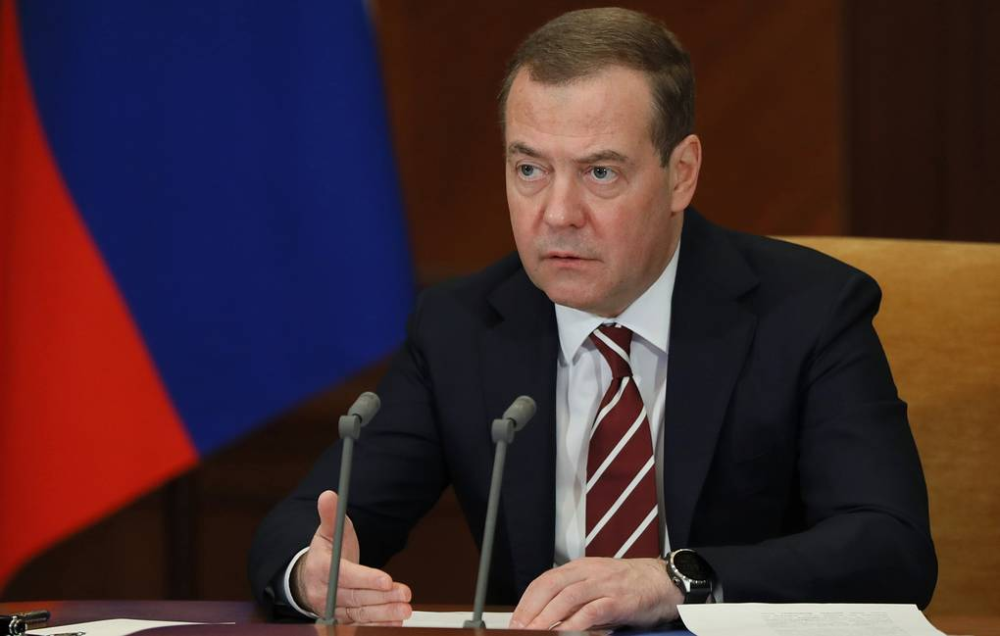

# 梅德韦杰夫：俄罗斯在经济上不会重蹈苏联覆辙

【环球网报道 记者
李律杉】据“今日俄罗斯”（RT）电视台网站报道，俄罗斯联邦安全会议副主席梅德韦杰夫当地时间26日对记者表示，尽管发生了俄乌冲突且正遭受来自西方的制裁，但俄罗斯经济不会仅局限于国防经济，俄罗斯不会允许存在经济失衡，也不太可能在经济上遭受与苏联同样的命运。

_俄罗斯联邦安全会议副主席梅德韦杰夫
资料图_

“目前不存在上世纪七八十年代（苏联时期）那种经济军事化的威胁。”梅德韦杰夫说，苏联过于重视国防工业，为避免经济失衡，俄罗斯需要正确设定优先事项，并监测主要宏观经济指标。

报道称，梅德韦杰夫认为，俄罗斯确实需要发展国防工业，即便在俄乌冲突结束后，也有必要“为未来奠定基础”。但他表示，这不会影响俄罗斯其他经济领域的发展。

对比苏联和俄罗斯，梅德韦杰夫说，苏联缺乏现代俄罗斯所拥有的市场体系和强大的消费品经济。他表示，如果当时西方对苏联实施制裁，“我们的生活将会很艰难”。

“（现在）尽管（俄罗斯）受到制裁，但市场并没有出现任何巨大的衰退”。梅德韦杰夫称，并赞扬了俄罗斯的农业经济。他认为，农业经济不仅使俄罗斯能够满足自己的粮食供应需求，而且使俄罗斯能够“养活其他人”。

报道提到，梅德韦杰夫表示，俄罗斯还努力将通胀率保持在低于许多欧洲国家的水平。“他们（西方国家）煽动了这场运动，开始与我们对抗，现在这些国家的通胀率在15%到20%之间。”同时他称，俄罗斯的通胀率有望在3月保持在6%，随后降至4%。

据俄罗斯卫星通讯社本月稍早前报道，俄联邦安全会议副主席梅德韦杰夫曾表示，美国崩溃的几率远高于俄罗斯。卫星通讯社称，在采访中，有记者请求梅德韦杰夫对大西洋理事会专家的言论置评。这些专家声称，受制裁、能源价格上涨和特别军事行动影响，俄罗斯预计可能会在2033年前解体。

报道称，梅德韦杰夫对此表示，“非常坦率地说，我认为，美利坚合众国崩溃的几率要高得多，特别是在他们目前正在发生的事件背景下”。他还补充说，“这些预测（俄罗斯在2033年前解体）很明显有特定的目标受众，基于美国、西方世界精英和特权阶层的假设，他们希望看到这个结果”。据卫星通讯社报道，梅德韦杰夫还称，“说实话，谁都没有预料到苏联会解体。为什么发生这样的事情？因为领导层满足于自己的成就，与现实脱节，没有能力管理政治和经济进程”。

