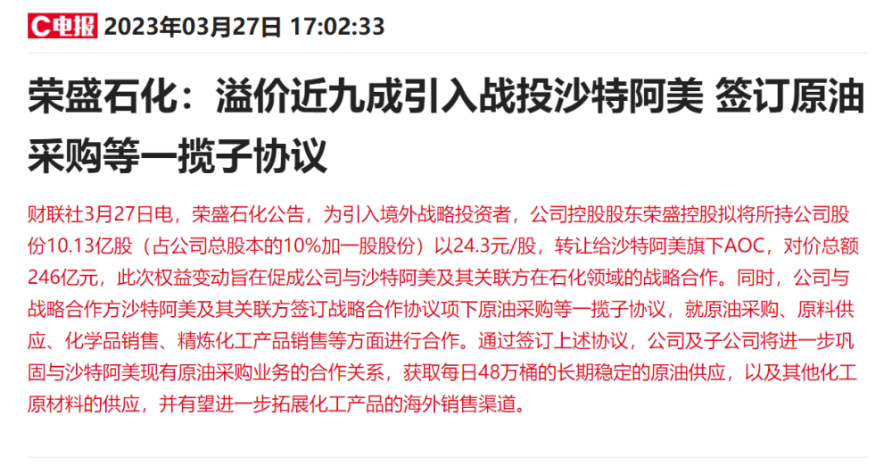
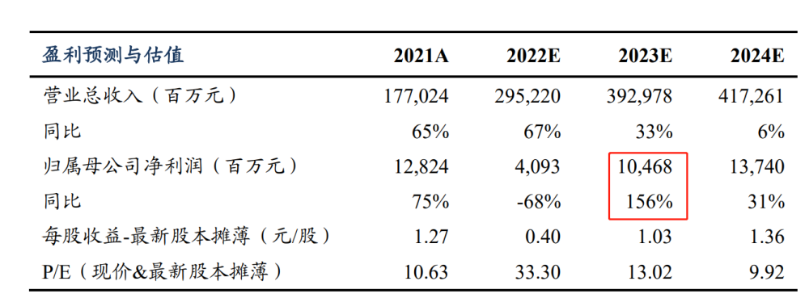

# 溢价近9成！A股民营石化巨头牵手中东“土豪”：签订原油采购等一揽子协议

**财联社3月27日讯（编辑 平方 实习编辑 刘星雨）** 总市值超1300亿元的荣盛石化盘后公告，为引入境外战略投资者，
**公司控股股东荣盛控股拟将所持10%公司股份以24.3元/股，转让给沙特阿美旗下AOC，对价总额246亿元。**

同时，公司与沙特阿美及其关联方签订原油采购等一揽子协议， **公司及子公司将获取每日48万桶的长期稳定的原油供应，**
以及其他化工原材料的供应，并有望进一步拓展化工产品的海外销售渠道。

据介绍，沙特阿美是 **世界最大的石油生产公司和世界第六大石油炼制商**
，拥有世界最大的陆上油田和海上油田。公司2019年在沙特证券交易所上市，截至3月23日的 **市值约为1.88万亿美元** 。沙特阿美
**2022年净利润1611亿美元，这是石油和天然气行业有史以来单个企业实现的最大年度利润** 。AOC是沙特阿美的全资子公司。

**荣盛石化则是中国综合实力领先的石化龙头之一，**
运营全球最大的单体炼厂浙江石油化工有限公司4000万吨炼化一体化项目，是中国以及亚洲重要的聚酯、新能源材料、工程塑料和高附加值聚烯烃的生产商，
**拥有全球最大的PTA、PX等化工品产能。** 公司拥有浙石化51%的股权，而 **浙石化的炼化一体化项目每天可加工80万桶原油** 。

荣盛石化业务的主要原材料是原油， **沙特阿美是荣盛石化近年来采购原油最重要的供应商。**
2022年，荣盛石化向沙特阿美及其关联方购买了约603亿元人民币的原油等原材料，占公司同类交易的比例为21%。2023年1-2月，公司向沙特阿美及其关联方购买了约90亿元的原油等原材料。

通过本次战略合作，荣盛石化及子公司将进一步巩固与沙特阿美现有原油采购业务的合作关系，
**获得长期稳定的原油以及其他化工原材料的供应，保障石油化工品产业链的稳定性。**

二级市场方面，荣盛石化收涨7.76%，报12.91元，以此计算沙特阿美方面的收购价 **较今日收盘价溢价88%。**
拉长时间来看，公司股价2021年创下历史高点后迄今累计最大跌幅67.7%。

此公告一出，便引起便立刻引起众多网友在财联社APP热议。有人表示，“要么你们买不到，要么买到就是坑”，也有人表示，“无敌了沙特阿美溢价这么多收购”。

半年报显示，荣盛石化上半年化工产品、炼油产品、PTA等石化行业产品收入占比超87%。

东吴证券分析师陈淑娴2月16日研报指出，公司浙石化项目二期项目中位于舟山绿色石化基地的年产40万吨ABS装置正在稳步推进，
**大规模产线近期投料成功，并已产出合格产品** 。待后续高性能树脂项目完成，公司又将新增年产120万吨ABS装置。

根据荣盛石化公示， **公司现有30万吨光伏EVA产能，未来还将建设70万吨EVA产能装置**
，总计EVA规模将会达到100万吨/年，将成为中国EVA行业龙头企业。国君石化团队研报指出，我国EVA进口依赖度较高，近5年进口依赖度在50%以上。

陈淑娴表示， **看好长丝终端需求回暖，同时荣盛石化布局的高端新材料将成为第二成长曲线**
，提升公司盈利能力。预计公司2023年归母净利润为104.68亿元，同比增速156%。

值得注意的是，荣盛石化2022年年度业绩预告显示，报告期内归属于上市公司股东的净利润33亿元-42亿元，比上年同期下降67.25%-74.27%。公司表示，报告期内，公司主要原材料原油价格波动较大，下游产品受疫情反复、需求等因素影响，未能完全传导原料波动带来的不利因素，致公司产品价差缩窄，毛利率下降。

（财联社 平方 刘星雨）

